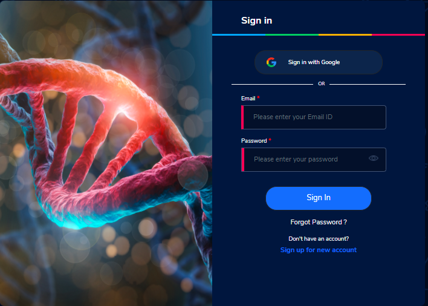
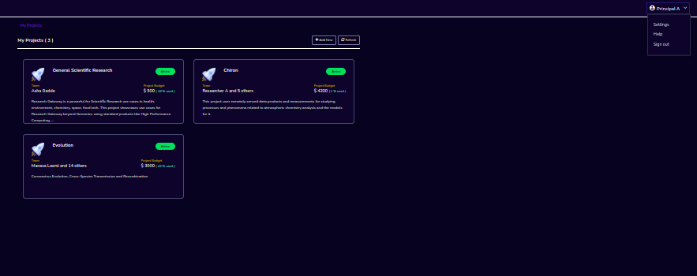
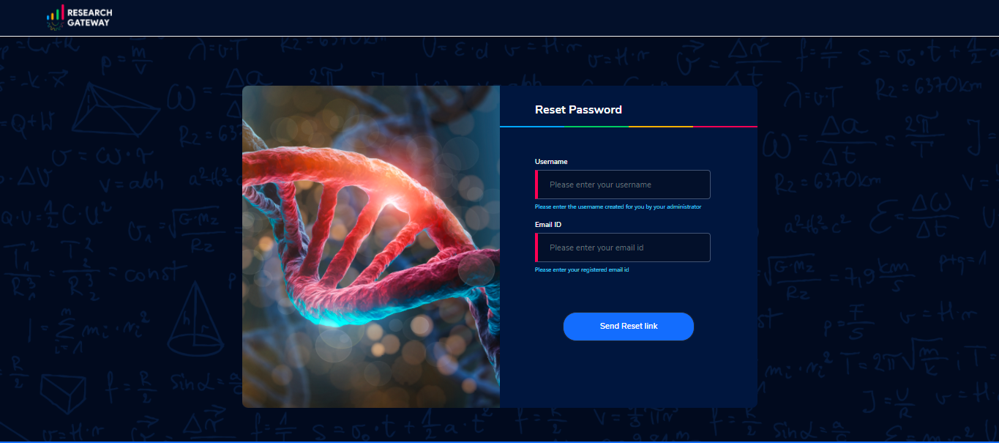

Accessing the RLCatalyst Research Gateway
=========================================

.. contents::

Sign In Process
---------------

Access the URL provided to you for your instance of RLCatalyst Research Gateway.

Fill the following details

.. list-table:: 
   :widths: 50, 50
   :header-rows: 1

   * - Field
     - Details
   * - Username
     - <Username that is used for login>
   * - Password
     - <Password for this user>

Click on the "Sign In" button. We can login successfully.

Sign Out Process
----------------

Login to the Research Gateway. Use details from :ref:`Appendix A<Appendix A>` for  User Name, Password as per password policy. Click on the dropdown bar which is at the top
Select “Sign out” option. Through this user logged out from the portal.

   
If sign out is successful you can navigate to the logout page. Through the "Click here to login" button you can navigate to the login page.

.. image:: images/logout.png

If sign out is unsuccessful you can see a message like "**Something went wrong while logging you out, we are working on this**".

.. image:: images/logout1.png

Forgot Password
---------------

In case a user would like to reset his password, the reset password screen can be accessed from the sign in page. Choose the "Forgot Password" link.

On clicking the link the user is navigated to the reset password screen.  

Fill the following details

.. list-table:: 
   :widths: 50, 50
   :header-rows: 1

   * - Field
     - Details
   * - Username
     - <Username that is used for login>
   * - E-mail address
     - <Registered Email ID>
   
Click on "Send Resend link" button. If the provided details are valid, he will get a verification link that has been sent to his email to reset the password. On clicking the link in the email, the user is prompted to change password screen.  

.. image:: images/verificationemail.png

The password change is either successful or unsuccessful (this will be like verification success and error screens).  The user is then redirected back to the login screen.

.. image:: images/password.png

.. image:: images/success.png

**Note:** If a user tries to reset password more than 10 times it will display the message like **“Attempt limit exceeded. Please try again”**
