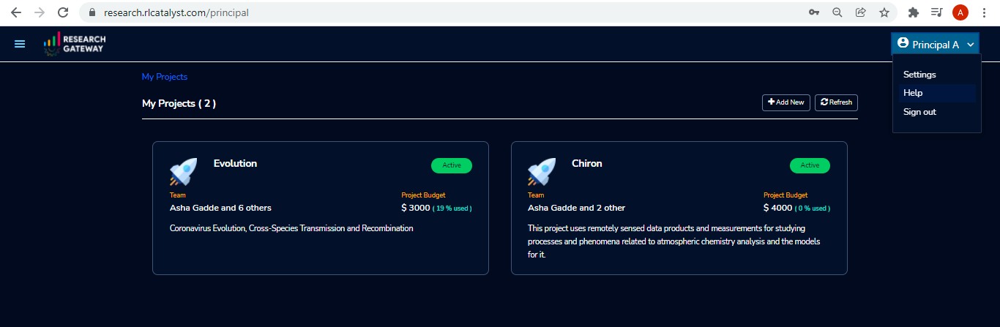

.. _`Add Account`:

Add Account
=================

These permissions can be used by Admin or principal investigator. 

Login into the Research Gateway. Click on dropdown bar which is above the header. Choose the  “Settings” option

.. image:: images/mainview.png 

Click on  the  “Settings” menu item. Provider settings page is opened.

.. image:: images/Provider2.png 
   :name: Provider Settings Page
   
**Note:**  When we add the settings please make sure the user credentials has the IAMFullAccess/AdministratorAccess Permissions. You can refer the list of policies that we are using create the role in Research Gateway.

Click on  the  “+Add New” button in the provider setting page. The Add Provider setting dialog-box is opened.

.. image:: images/AddAccount.png
   
Fill the following details

.. list-table:: 
   :widths: 50, 50
   :header-rows: 1

   * - Attribute
     - Details
   * - Account Name
     - <Account Name>
   * - Account Key
     - <Account Key> [It should be a minimum of 16 characters and a maximum of 128 characters]
   * - Secret Key
     - <Secret Key> [It should be a minimum of 40 characters and a maximum of 128 characters]
   * - Region
     - <Select region from the drop-down list> 
   * - Account Number
     - <Enter an AWS Account Number> [It should be a 12-digit number]
   * - Network Configuration
     -
   * - Use deafult VPC
     - <If you enable this option, Research Gateway will check if a default VPC exists and will create one if it does not exist. If you disable this option, provisioning resources from Standard Catalog may fail.>
   * - Use SSL with ALB
     - <If you enable this option, Research Gateway can set up secure connections to your resources by putting them behind an Application Load Balancer with SSL connections using certificates managed by AWS Certificate Manager. Check this box if you would like to create an ALB for this project. An ALB will incur costs irrespective of traffic passing through it.>	 
   * - Storage Configuration
     -
   * - Use Project Storage	 
     - <Research Gateway will setup a shared S3 bucket (project storage) where the team members can store data. This shared storage will be mounted into all supported workspaces. Storage costs will be accounted at the project level. Note: For now defaultly it will create the project storage.>
	 
Click on the "Verify" button, it will check the provided details are valid or not. If details are valid, it will show verified account message with green color tick mark below the header otherwise it will throw an error message accordingly.

Click on the “Add Account” button. An AWS account is added successfully. You can see all the account details in a table format.

**NOTE**: 

1. The "Add Account" button was disabled until the details are verified.
2. Please ensure that the IAM user whose credentials you entered has the IAMFullAccess/AdministratorAccess policy attached otherwise, it will through an error message accordingly.

On each line item there is a contextual menu. Through this we can delete and sync the account/repair the account.

.. image:: images/Project.png

Click on the 3-dotted icon which is available at the right side of the account details page and choose “Delete” option. A confirmation dialog box is opened and enable the check box and click on the "Delink" button, the account will be deleted. You can only delete provider settings that are not linked to any project or organization.

.. image:: images/delete.png

Research Gateway works in conjunction with AWS Service Catalog. To synchronize the Service Catalog to your project, select the Product Sync option.
Click on the “Sync Now” button. Once the synchronization is started you should see the “Sync Started” message.

.. image:: images/sync1.png

.. image:: images/sync2.png

**Note**: The "Sync Now" option can get the products from the shared, local, account and organization level portfolio.

Click on the contextual menu which is available at the right side of the account name and choose the "Repair" option. 

.. image:: images/repair1.png

Fill the access key and secret key values in the assigned boxes and click on the "Verify" button.

.. image:: images/repair.png

On successful completion of verify you can see the "repair" option, click on the button in the window, the account will be repaired.

Click on the contextual menu which is available at the right side of the account name and choose the "Assign O.U" option. One window is opened and all organizational units are listed there. Choose one organization from the list and click on the "Assign" button. On successful completion you can see the green color toaster message.

.. image:: images/Assign123.png

.. image:: images/Assign4.png

**Note** : When the account is not linked to any other organizations than only you can see the "Assign O.U" option.

Secure connections to resources using ALB 
^^^^^^^^^^^^^^^^^^^^^^^^^^^^^^^^^^^^^^^^^

1. Research Gateway can set up secure connections to your resources by putting them behind an Application Load Balancer with SSL connections using certificates managed by AWS Certificate Manager.
2. When creating an account if you select the “Use SSL with ALB” check box it will create ALB. An ALB will incur costs irrespective of traffic passing through it. 
   Note: Refer :ref:`Adding AWS Accounts <Adding AWS Accounts>` for account creation.
   
 .. image:: images/ssl-alb.png 
 
3. Once project creation is successful you can see the status about certificates and load balancer, target groups, listener, etc.. on the events page.
   Note: Refer :ref:`Project ordering` for project creation.
   Note - another document 
   :ref:`my-reference-label`.

`Secure connections to resources using ALB and Amazon certificates video <https://www.youtube.com/watch?v=3MkouV33XJw>`_

Navigation to help
------------------
Through the "Help" option, you can see the Research Gateway documentation. Click on the top-right menu which is available on the header. 

**Note:** There is Help option which is available on the footer, through this option also you can navigate to the  Research Gateway documentation.
