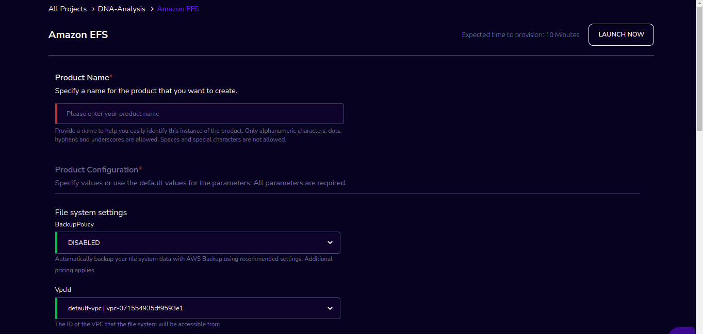
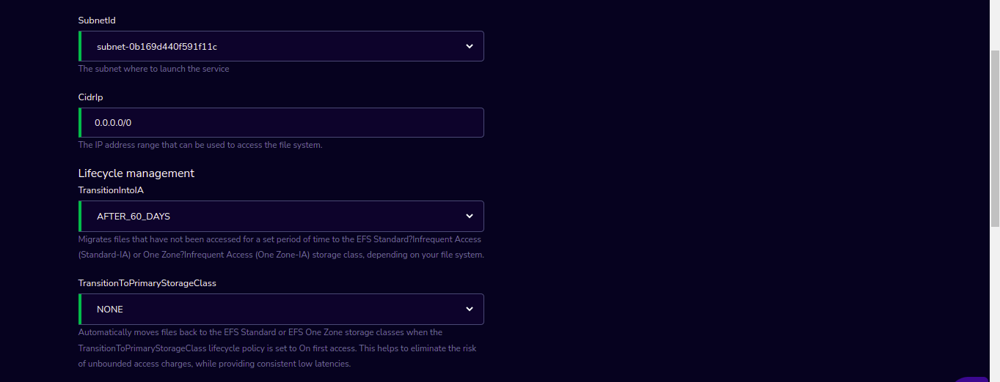
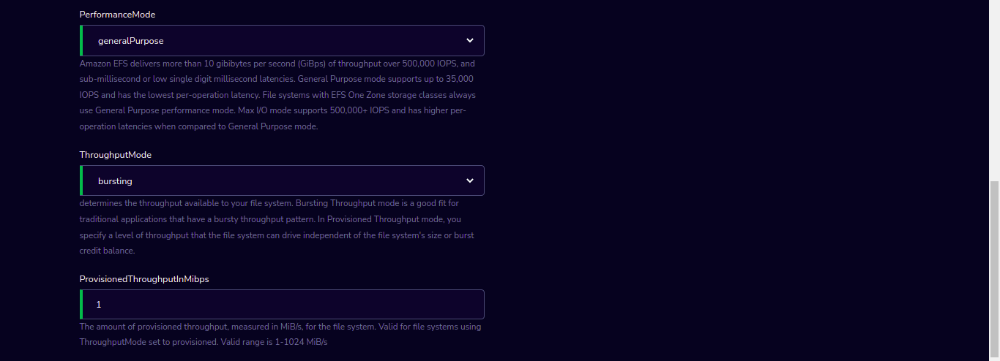
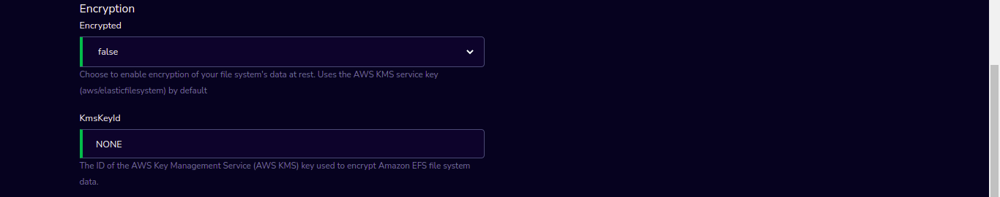
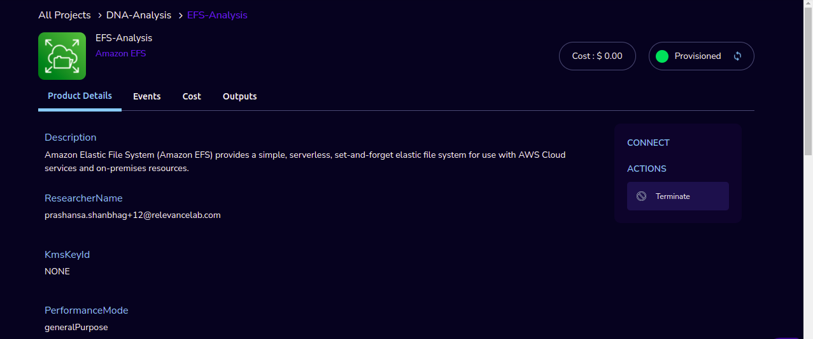

Amazon EFS
==========

Amazon Elastic File System (Amazon EFS) Product of Research Gateway is a high performance NFS based file-system (Amazon EFS) for computational needs that need high-performance shared storage.

Parameters
-----------

.. list-table:: 
   :widths: 50, 50
   :header-rows: 1

   * - Parameter
     - Details
   * - Product Name
     - Provide a name to help you easily identify this instance of the product. Only alphanumeric characters, dots, hyphens and underscores are allowed. Spaces and special characters are not allowed. Eg: MedicalResearch 
   * - BackupPolicy
     - Please select BackupPolicy in the drop-down. You can Automatically backup your file system data with AWS Backup using recommended settings. Additional pricing applies.
   * - VpcId
     - Please select the ID of the VPC that the file system will be accessible from in the dropdown
   * - SubnetId
     - Please select the subnet where to launch the service in the dropdown
   * - CidrIp
     - Enter the IP address range that can be used to access the file system.
   * - TransitionIntoIA
     - Please select the value in the dropdown. This Migrates files that have not been accessed for a set period of time to the EFS Standard?Infrequent Access (Standard-IA) or One Zone?Infrequent Access (One Zone-IA) storage class, depending on your file system.
   * - TransitionToPrimaryStorageClass
     - Please select the value in the dropdown. This  will Automatically move files back to the EFS Standard or EFS One Zone storage classes when the TransitionToPrimaryStorageClass lifecycle policy is set to On first access. This helps to eliminate the risk of unbounded access charges, while providing consistent low latencies.
   * - PerformanceMode
     - Please select the value in the dropdown. Amazon EFS delivers more than 10 gibibytes per second (GiBps) of throughput over 500,000 IOPS, and sub-millisecond or low single digit millisecond latencies. General Purpose mode supports up to 35,000 IOPS and has the lowest per-operation latency. File systems with EFS One Zone storage classes always use General Purpose performance mode. Max I/O mode supports 500,000+ IOPS and has higher per-operation latencies when compared to General Purpose mode.
   * - ThroughputMode
     - Please select the value in the dropdown. This determines the throughput available to your file system. Bursting Throughput mode is a good fit for traditional applications that have a bursty throughput pattern. In Provisioned Throughput mode, you specify a level of throughput that the file system can drive independent of the file system's size or burst credit balance.
   * - ProvisionedThroughputInMibps
     - Please enter The amount of provisioned throughput, measured in MiB/s, for the file system. Valid for file systems using ThroughputMode set to provisioned. Valid range is 1-1024 MiB/s
   * - Encrypted
     - Choose to enable encryption of your file system's data at rest. Uses the AWS KMS service key (aws/elasticfilesystem) by default
   * - KmsKeyId
     - Provide The ID of the AWS Key Management Service (AWS KMS) key used to encrypt Amazon EFS file system data.

Steps to launch
---------------

1. Click on the project on the “My Projects” page.
2. Navigate to the available products tab
3. Click the “Launch Now” button on the “Amazon EFS” product card. A product order form will open. Fill the details in the form and click the “Launch Now” button. You will see an Amazon EFS being created. In a few minutes, that product should appear in the “Active” state.

Estimated time to provision - 10 minutes

Steps to connect
----------------

1. Click on the project on the “My Projects” page.
2. Navigate to the “My Products” tab
3. Click on your instance in the My Products view.
4. You can de-provision the product through the “Terminate” option

`Refer this link to understand how to mount Amazon EFS to an EC2 instance`_

.. _Refer this link to understand how to mount Amazon EFS to an EC2 instance: https://aws.amazon.com/getting-started/hands-on/create-mount-amazon-efs-file-system-on-amazon-ec2-using-launch-wizard/

