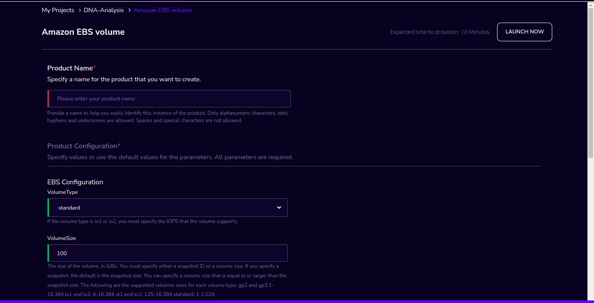
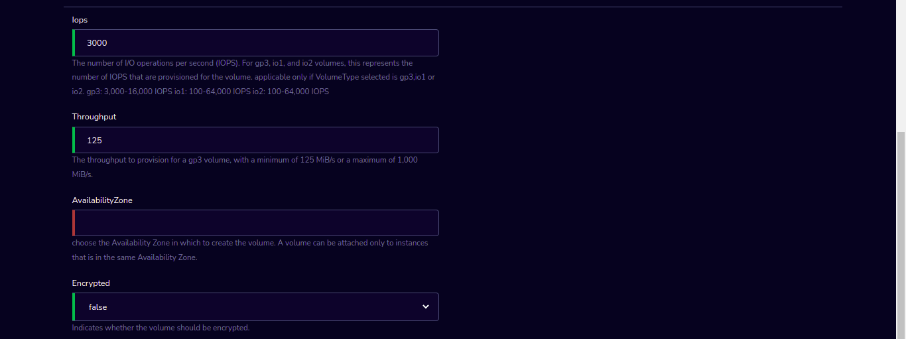
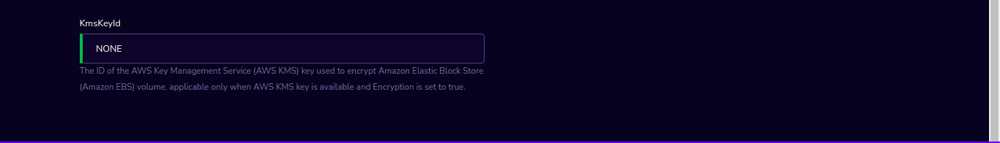
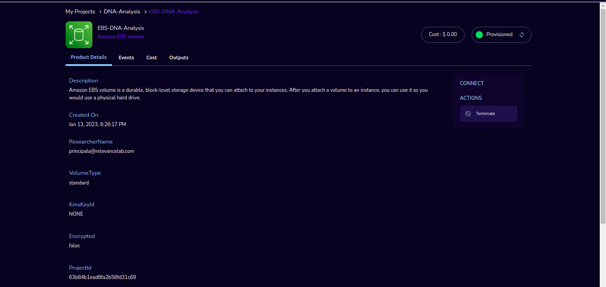

Amazon EBS volume
==================

Amazon EBS volume product of Research Gateway is a durable, block-level storage device that you can attach to your instances.The volume and instance must be in the same Availability Zone. 

Parameters
-----------

.. list-table:: 
   :widths: 50, 50
   :header-rows: 1

   * - Parameter
     - Details
   * - Product Name
     - Provide a name to help you easily identify this instance of the product. Only alphanumeric characters, dots, hyphens and underscores are allowed. Spaces and special characters are not allowed. Eg: MedicalResearch
   * - VolumeType
     - Choose Volume type in the drop-down list. If the volume type is io1 or io2, you must specify the IOPS that the volume supports.
   * - VolumeSize
     - Enter the size of the volume, in GiBs. You must specify either a snapshot ID or a volume size. If you specify a snapshot, the default is the snapshot size. You can specify a volume size that is equal to or larger than the snapshot size. The following are the supported volumes sizes for each volume type: gp2 and gp3:1-16,384 io1 and io2: 4-16,384 st1 and sc1: 125-16,384 standard: 1-1,024
   * - Iops
     - Enter the number of I/O operations per second (IOPS). For gp3, io1, and io2 volumes, this represents the number of IOPS that are provisioned for the volume. applicable only if VolumeType selected is gp3,io1 or io2. gp3: 3,000-16,000 IOPS io1: 100-64,000 IOPS io2: 100-64,000 IOPS
   * - Throughput
     - Enter the throughput to provision for a gp3 volume, with a minimum of 125 MiB/s or a maximum of 1,000 MiB/s.
   * - AvailabilityZone
     - Choose the Availability Zone in which you want to create the volume. A volume can be attached only to instances that is in the same Availability Zone.
   * - Encrypted
     - Choose the value in the drop-down list. This indicates whether the volume should be encrypted.
   * - KmsKeyId
     - Enter the ID of the AWS Key Management Service (AWS KMS) key used to encrypt Amazon Elastic Block Store (Amazon EBS) volume. applicable only when AWS KMS key is available and Encryption is set to true.

Steps to launch
----------------

1. Click on the project on the “My Projects” page.
2. Navigate to the available products tab
3. Click the “Launch Now” button on the  “Amazon EBS volume” product card. A product order form will open. Fill the details in the form and click the “Launch Now” button. You will see an Amazon EBS volume being created. Once the Product provisioning is completed, that product should appear in the “Active” state.

Estimated time to provision - 10 minutes

Steps to connect
----------------

1. Click on the project on the “My Projects” page.
2. Navigate to the “My Products” tab
3. Click on your instance in the My Products view.
4. You can de-provision the product through the “Terminate” option.

