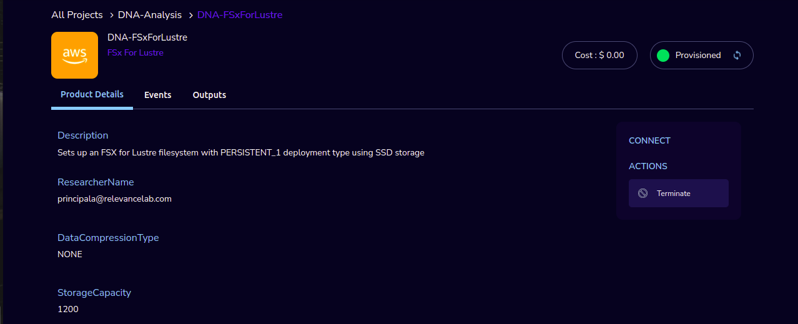
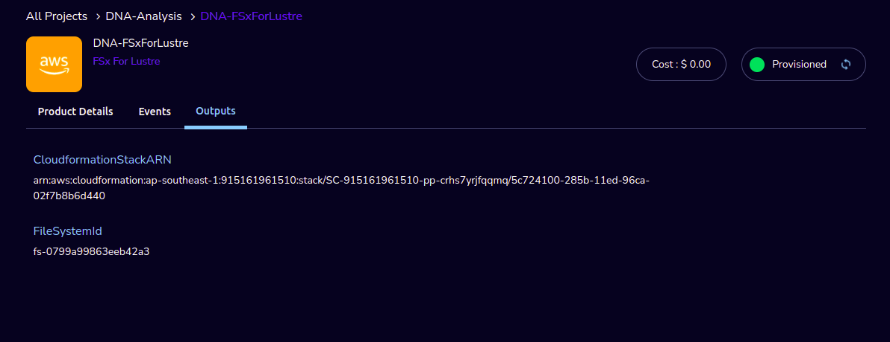

FSx For Lustre
==============

This Product Sets up an FSX for Lustre filesystem with PERSISTENT_1 deployment type using SSD storage.

FSx for Lustre is a fully managed shared storage built on top of a popular high-performance file system. It provides sub-millisecond latency and hundreds of GBs/s throughput for workloads with shared storage. Create an instance of this file-system and connect it to your HPC workloads (PCluster) for enhanced performance.

`Watch a video on how to provision an FSx for Lustre product. <https://www.youtube.com/embed/TIQANO-DOtg?start=85&end=163&autoplay=1>`_

Parameters 
----------

 .. list-table:: 
   :widths: 50, 50
   :header-rows: 1

   * - Parameter
     - Details
   * - Product Name
     - Provide a name to help you easily identify this instance of the product. Only alphanumeric characters, dots, hyphens and underscores are allowed. Spaces and special characters are not allowed. Eg: MedicalResearch
   * - DataCompressionType
     - Please select the Data Compression Type in the dropdown.
   * - StorageCapacity
     - Enter the Storage Capacity of the file system (valid values are 1200 GiB, 2400 GiB, and increments of 2400 GiB.)
   * - VpcId
     - Select The VPC to create security groups and deploy AWS Batch or slurm to from drop-down list.
   * - KmsKeyId
     - Enter The ID of the AWS Key Management Service (AWS KMS) key used to encrypt Amazon FSx file system data.
   * - ImportPath
     - Enter The path to the Amazon S3 bucket (including the optional prefix) that you're using as the data repository for your Amazon FSx for Lustre file system
   * - AutoImportPolicy
     - Choose how Amazon FSx keeps your file and directory listings up to date as you add or modify objects in your linked S3 bucket in the drop-down list
   * - SubnetId
     - Select The ID of the subnet that the file system will be accessible from in the drop-down list. Make sure the subnet is part of the VPC selected above.
   * - ExportPath
     - Enter The path in the Amazon S3 bucket where the root of your Amazon FSx file system is exported.
   * - PerUnitStorageThroughput
     - Select The amount of read and write throughput for each 1 tebibyte (TiB) of file system storage capacity in the drop-down list.

 .. image:: images/Product_FsxForLustre_Launchform1.png

.. 

 .. image:: images/Product_FSxForLustre_Launchform2.png

..

 .. image:: images/Product_FSxForLustre_Launchform3.png 

Steps to launch
----------------
1. Click on the project on the “My Projects” page.
2. Navigate to the available products tab
3. Click the “Launch Now” button on the “FSx For Lustre” product card. A product order form will open. Fill the details in the form and click the “Launch Now” button. You will see an FSx For Lustre being created. In a few minutes, that product should appear in the “Active” state.

Estimated time to provision - 20 minutes

Steps to connect
----------------

1. Click on the project on the “My Projects” page.
2. Navigate to the “My Products” tab
3. Click on your instance in the My Products view.
4. You can get the File System Id from the output “FileSystemId”
5. You can de-provision the product through the “Terminate” option

