Features
========

.. contents::

---------------------------------

Administrator Features
++++++++++++++++++++++

An Administrator user can perform the following actions.

  * :ref:`Add an Organizational Unit<Adding Organizational Units>`
  * :ref:`Add AWS Accounts for projects<Adding AWS Accounts>`
  * Monitor overall budget via Budget Management screen
  * Inspect Audit Trail records

Budget Management
-----------------
You have brought in a budget management screen for the Administrator  to view budget consumption across organizational units with drill-down to the project, researcher and product level.

Navigation to Budget management
^^^^^^^^^^^^^^^^^^^^^^^^^^^^^^^

Login as the Administrator user.
Click on “ ≣ “ option which is available on the top-left side. You can see the  following details:

  * a. **My Organizations** : Through this you can navigate to the **All Organizations** page
  * b. **Budget Management** : Through this you can navigate to the **Budget Details** page 

.. image:: images/Image1.png

Budget KPIs
^^^^^^^^^^^

At the top of this view you can see the summary of budgets across all organizational units in the KPI cards.
You can see the following KPI cards:

  * **Total Budget Allotted**: This is the sum total of budget allocated for all projects in the Organization.
  * **Total Budget Consumed**: This is the budget consumed by all Organizations.
  * **Total Budget Available**: This is the portion of the alloted budget which is not yet consumed.

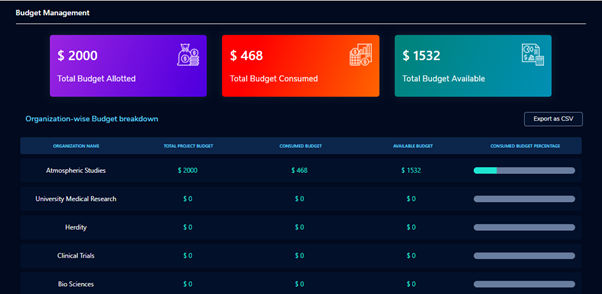

Organization-wise budget view
^^^^^^^^^^^^^^^^^^^^^^^^^^^^^

The Administrator user can view organization-specific budget details by clicking on one of the lines above. 
The following details are visible in a table format:

.. csv-table::
   :file: BudgetTable.CSV
   :widths: 70, 70, 70, 70, 70
   :header-rows: 1

The Administrator user can download the Budget details through the “Export CSV”  option. By clicking on a specific line item, the user can see project-wise budget details which are linked to a particular Organizational Unit.

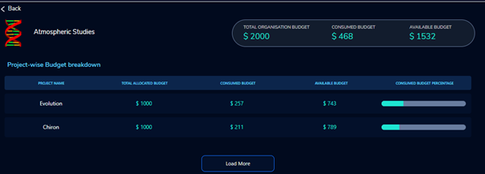

Researcher-wise budget view
^^^^^^^^^^^^^^^^^^^^^^^^^^^^^

You can  also see researcher-wise budget details which are linked to a particular project and  you can see configured product  details in product-wise budget details page.
 

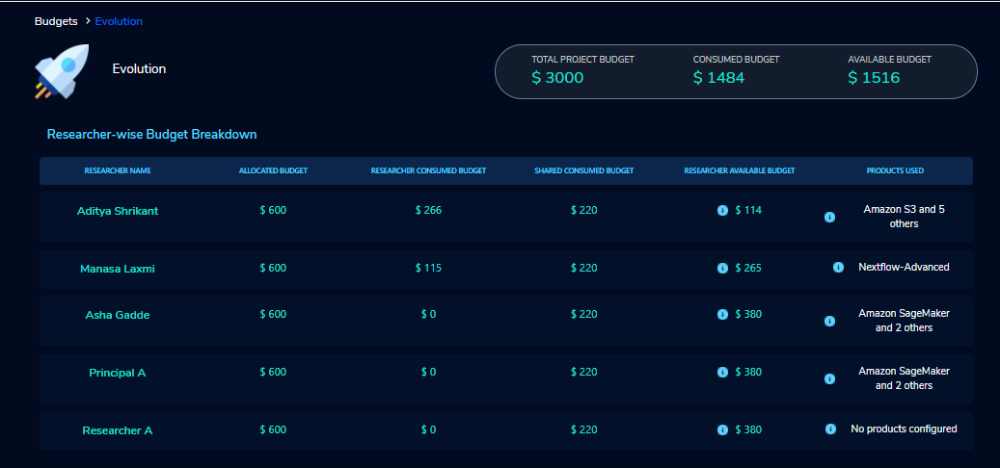

-----------------------------------

Principal Investigator Features
+++++++++++++++++++++++++++++++

As a Principal Investigator, I will be able to create Projects within my Organization. A project shall be associated with a Budget with an associated dollar amount that is funded from a specific Grant to the organization. A Project can use Resources only if there is an associated budget that can meet the forecasted needs.

My Projects page of the Research Gateway shall list all the existing projects created along with other details. Clicking on a specific project shall leads to a project details page.

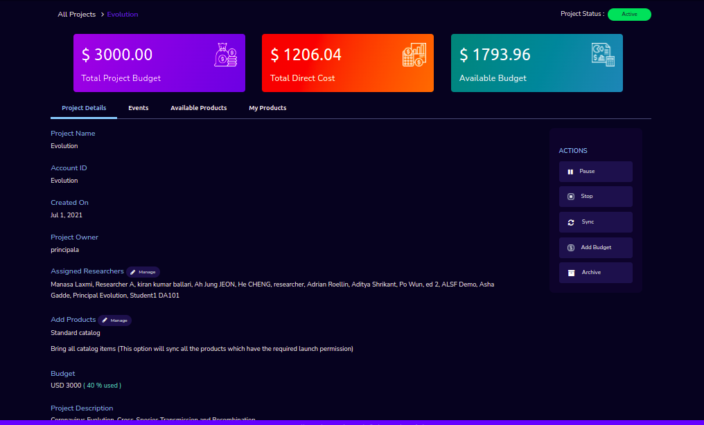

Image 1 - Project Details

Actions on Projects
-------------------
 Principal is able to  do  Pause/Resume/Stop actions on  a project.

.. image:: images/actionon.png

Paused: The project status changed to “Paused”. All the researchers under this project would be affected. In a Paused state new provisioning is not allowed. Users can continue to use already provisioned resources as before. All the available products would be visible  but “LaunchNow “ button would be hidden

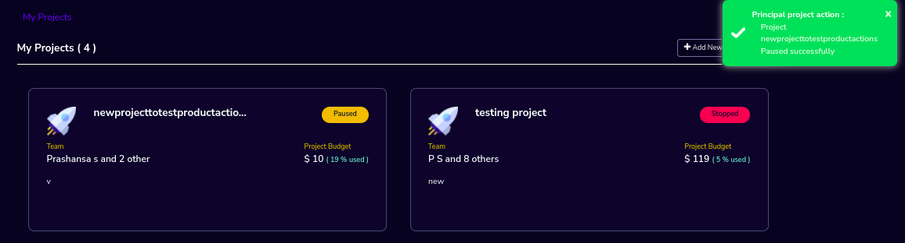

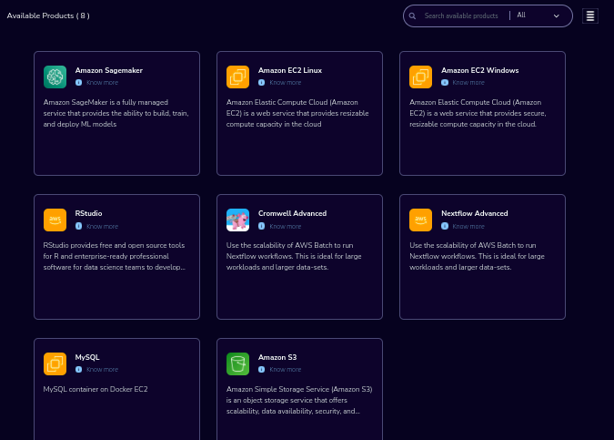

Resume :The project status changed  to “Active”. In the Active state, team-members can launch new products from the catalog of Available Products.

.. image:: images/resume.png

Stopped : The project status changed to “Stopped”. In a Stopped state all underlying resources will be stopped and the user will not be able to perform actions on them but you are able to terminate the product. You need to manually start the resources except the s3 product.

.. image:: images/stop.png

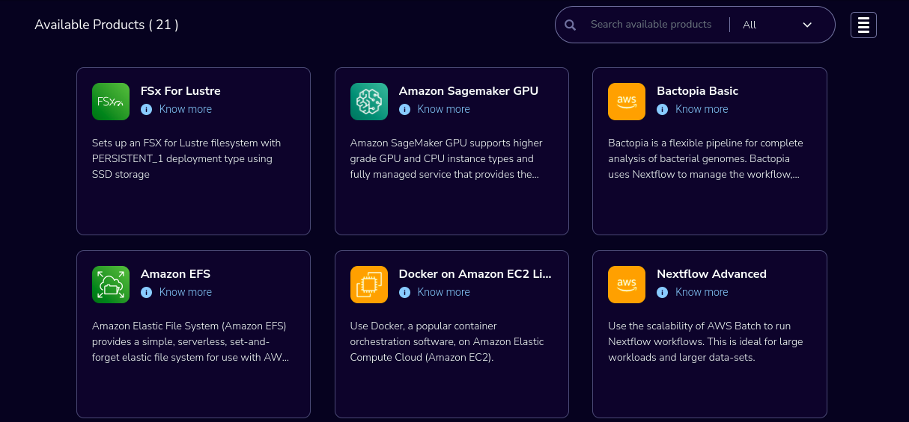

.. image:: images/stop3.png

**Note**: If there are any failed provisioned product in my products panel you cannot do actions on the project. You need to terminate that product.

Budget Management for PI
------------------------

You have brought in a budget management screen for the Principal Investigator to view budget consumption across projects.

Navigation to Budget screen

 Logged as Principal Account. Click on “☰” Symbol which is available  on left side header. You can see menu like 

**My projects** : Through this you can navigate to All Projects page

**Budget**  : Through this you can navigate to the Budget Details page 

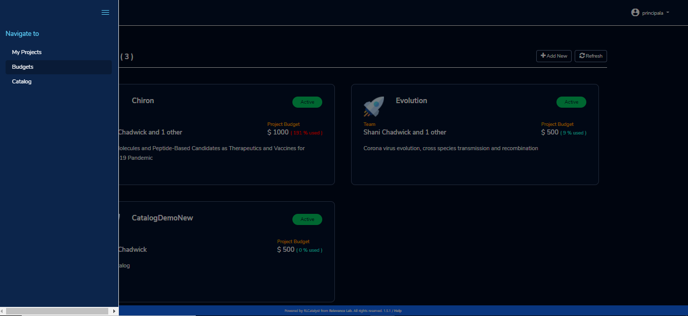

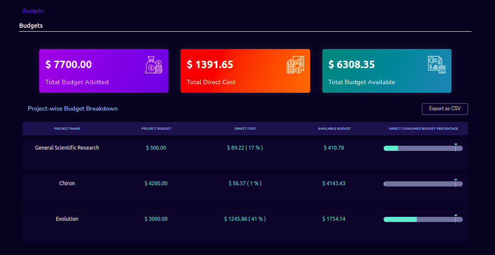

You can see budget details  with different KPI cards. You can see the following KPI cards:

  * **Total Budget Allotted:** This is the budget allocated for the project during the creation of the project.

  * **Total Budget Consumed:** This is the budget consumed by all the researchers in the project.

  * **Total Budget Available:** This is available budget for the project

You can see Project-wise Budget details in the table format:

+-------------+----------------------+---------------+----------------+---------------------------------+
|Project Name | Total Project Budget |Consumed Budget|Available Budget|Consumed Budget with Progress Bar|
+-------------+----------------------+---------------+----------------+---------------------------------+

You can download the budget details through the “Export CSV”  option 
You can see researcher budget details which are linked to particular products and you can see configured products information in Researcher-wise Budget details page

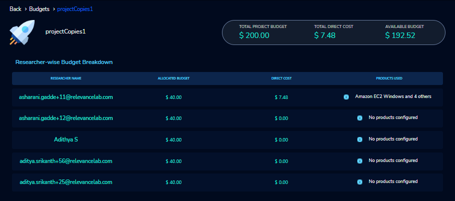

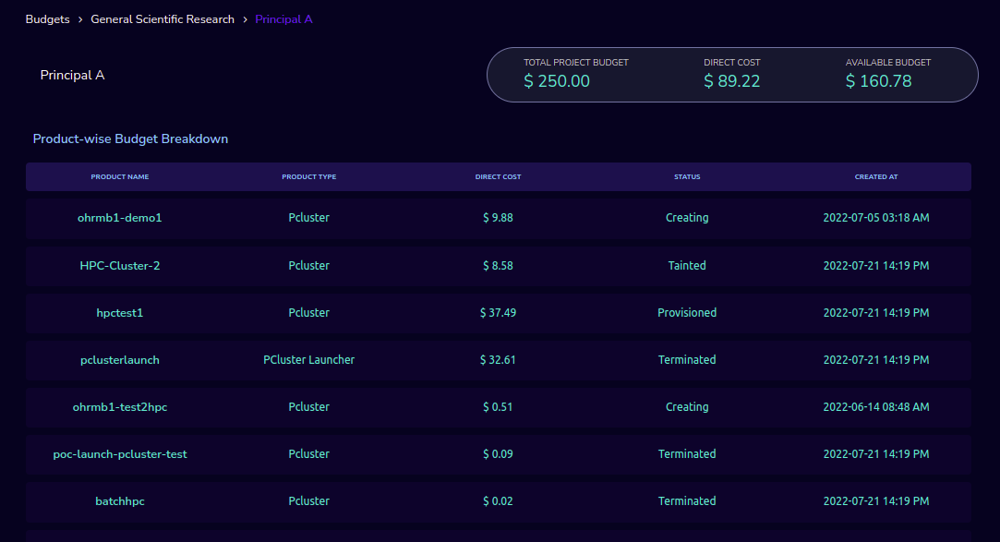

-----------------------------------------

Researcher Features
+++++++++++++++++++

Researchers  can view a Service Catalog of Products available for the project. These items shall be organized into Portfolios. Clicking on a portfolio shall display all the Products available in it. Selecting a Product shall show all the associated details of that product.
Log into the Research Gateway(As a Researcher)
Researcher can view the projects in the all projects panel.

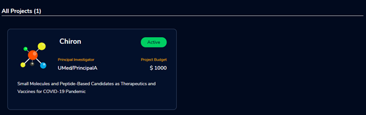

Image Researcher account 

Researcher can view service catalog products available for the project. Click on the project like “Chiron” . You can see KPI cards, available products and active products information in the project details page.

KPI Cards
---------

You can see the following KPI cards:
* Available Project Budget
* Consumed Project Budget
* My Consumed Budget

Available Project Budget
^^^^^^^^^^^^^^^^^^^^^^^^
This is the budget allocated for the project during the creation of the project.

Consumed Project Budget
^^^^^^^^^^^^^^^^^^^^^^^^
This is the budget consumed by all the researchers in the project.

My Consumed Budget
^^^^^^^^^^^^^^^^^^^^^^^^
This budget is consumed by the researcher who is logged in for that project.

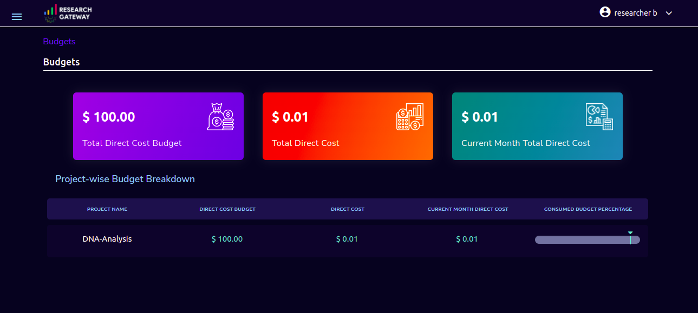

Image  - KPI cards

Available Products
------------------

You can view the service catalog of products available for the project. These items shall be organized into Portfolios. Clicking on a portfolio shall display all the Products available in it.

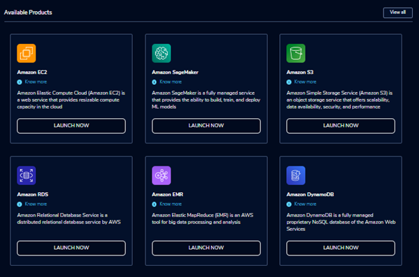

Image - available Products 

You can see product information in the card. You can know more information about  the product through the “Know More” link.

Through the “View Details” link you can see following 

Budget Details List view - You can see the budget details in list view

Budget Details grid view - You can see the budget details in grid view

Keyword search - You can search products based on product type

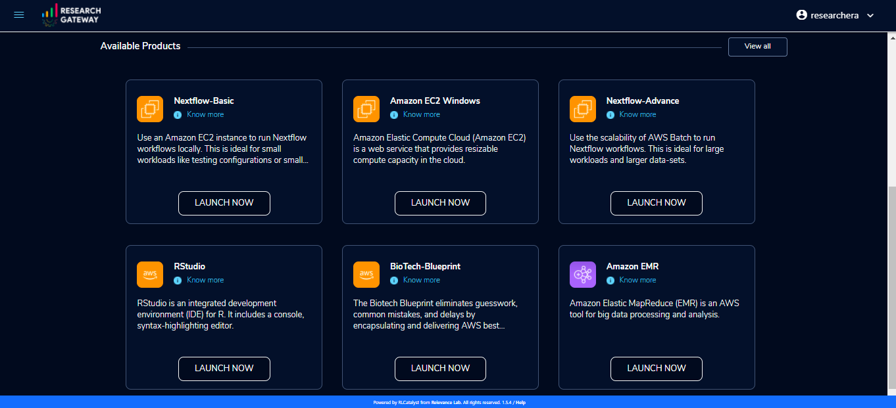

Image - Available Products 

Product Order
-------------

Log into the Research Gateway.

Researchers can see the projects in All projects page. Click on the Project.
Navigate to Available products panel. Choose the product in the list
Product order form is opened. Input parameters associated with the selected product shall be displayed as a form at this point. Once all parameters are filled the user shall be able to “Launch Now” the form and the item would then be added to the shopping cart.

.. image:: images/product.png 

Image  - Product Order Page

Note: You are displaying VPC,Subnets and security groups,Subnets and keypair names in the listbox. Through this user can easily select the keypair and while provisioning the product and use the compute resources.

.. image:: images/product2.png 

Each product conveyed the expected amount of time it takes to provision through this user knows how much time that provision will take.
You should display listed keypairs under Key name Field in the form.
If you ordered an EC2 product you can see the  Toaster message like “Amazon EC2 ordered Successfully” and it will display an information message.

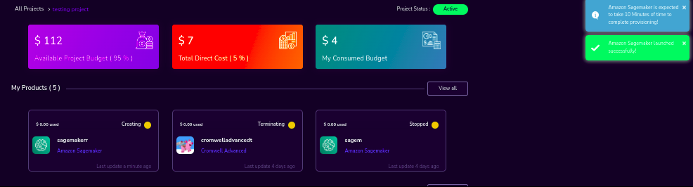

My products
-----------

You can see the provisioned products details in the My Products Panel.

You can view provisioned product details like product name, product type and state in the card.
You can see provisioned product details through “View All” option. You can  see
all product details

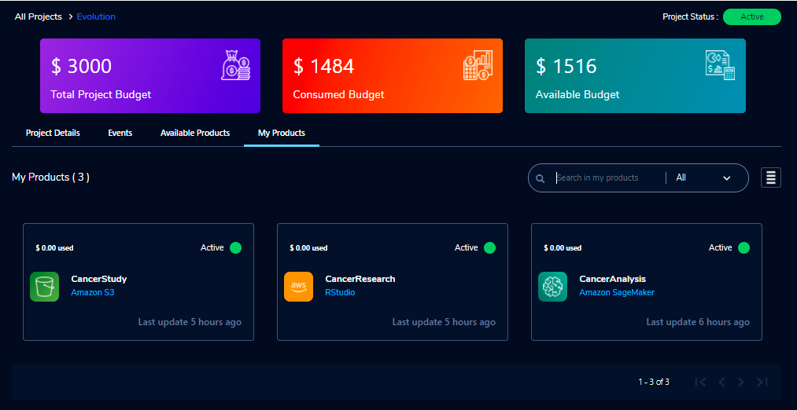

Through the “View Details” link you can see following 

   * Budget Details List view - You can see the budget details in list view

   * Budget Details grid view - You can see the budget details in grid view

   * Keyword search - You can search products based on product name,product type and description

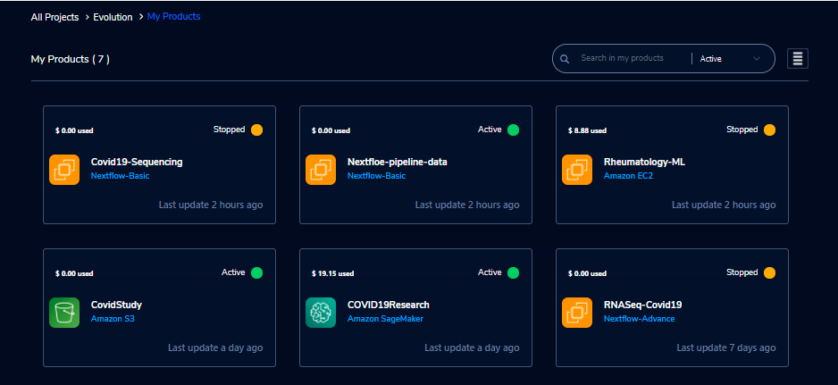

.. image:: images/myproducts3.png 

While product is in the *Creating* state we are displaying a time limit that provision will take through the “Live in 5/10/15 mins” tag.

When you click any action(start/stop/terminate) in a provisioned product , state should be changed automatically using server side events.

Actions available for products
------------------------------

EC2  Product
^^^^^^^^^^^^ 

Researchers can login to the portal and quickly order  EC2 products.
Find the Provisioned EC2 product i.e. Ayush Medicine in the Active Products panel. Or click on the “View All” button to get a list of all provisioned products.
You can see product related actions in the  Actions menu.

SSH/RDP action
______________

Choose options like “SSH/RDP”. Through this we can connect to the server.

Fill the following Details

.. list-table:: 
   :widths: 50, 50
   :header-rows: 1

   * - Attribute
     - Details
   * - Username
     - <Jump server user name>
   * - Authentication Type
     - <Choose password/Pem file>
   * - Upload Pem file
     - <Upload the pem file>

Click on the “Submit” button. Now you can connect to SSH Terminal 
in a new window

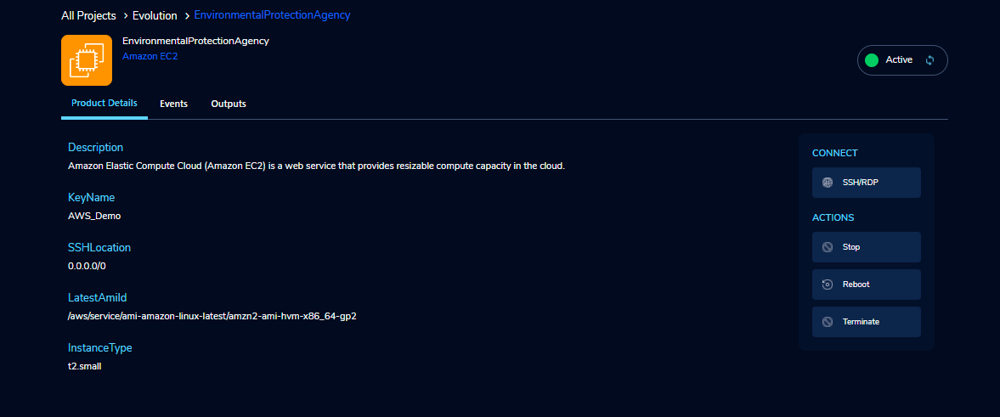

Image - SSH/RDP action

.. image:: images/E2E2.png

Image - SSH dialog box

Start/Stop action
_________________

You can start or stop the instance through “Start/Stop”.

Reboot action
_____________

You can reboot instances through  “Reboot”.

Terminate action
________________

You can terminate the product through “Terminate” action.

S3  Product
^^^^^^^^^^^

Researcher can login to the portal and quickly order S3 Product.
Find the S3 in the Active Products panel. Or click on the “View All” button to get a list of all provisioned products.
You can see product related actions in the  Actions menu.

Upload action
_____________

Choose an option like “Upload”. Upload file(File should not contain more than 10MB). Through this you can Upload a file in S3 bucket.

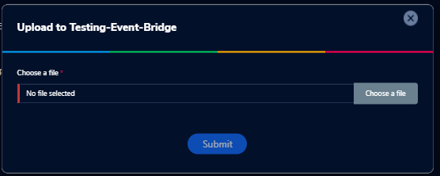

Image - Upload action

Share action
____________

Choose the option like “Share”. Through this you can  share the details to other team members.

**NOTE:** If there are no researchers in the list you will see a message like **“No researchers are available. Please add a new researcher to share the s3 bucket “**

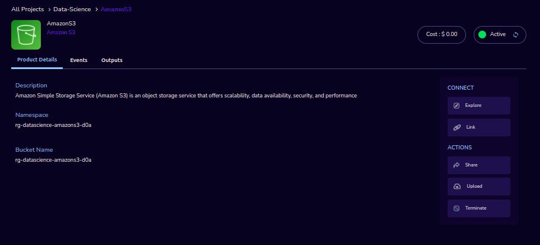

Image - Share action

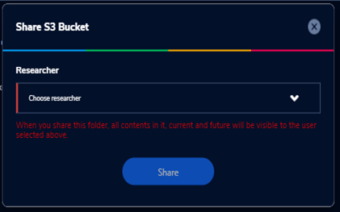

Image - Share dialog

.. image:: images/testingevent4.png

Image - Share error

Terminate action
________________

Choose an option like “Terminate”. Through this you can terminate the product
You implemented a check to find out if a file exists in the bucket or not . If exists it will throw an error message accordingly. i.e. ”The bucket is not empty. Please delete all contents from the bucket and try again.”

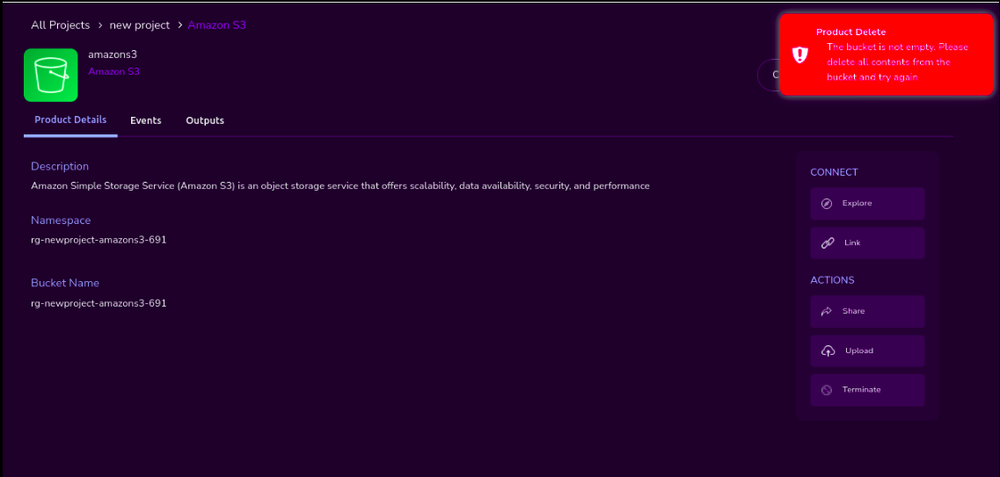

Image - Terminate action

Explore Action
______________

Through this action you can show all the files and folders in the S3 bucket with actions (download, delete) against each item.
For folders the user shall be able to double-click on the item and drill-down to a deeper level to see the files and folders in that level.
For any deeper level, the user shall be able to navigate back to an upper level.
You can upload the different files (File should not contain more than 10MB)

.. image:: images/exploreaction.png

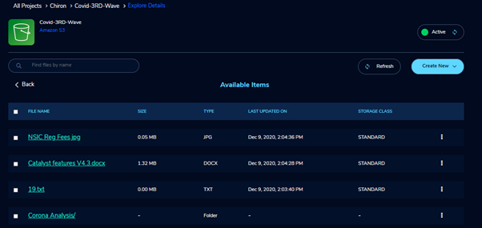

Linking S3 with Sagemaker 
_________________________

You have to link Sagemaker from the S3 product details page using the provisioned product ID.
For a S3 Provisioned Product, you should have a new action item called “Link”

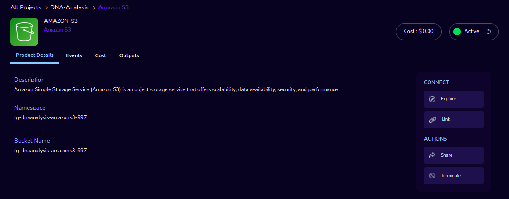

This action item should be a pop up which will have the list (dropdown) of active sagemakers for that user.

.. image:: images/linking2.png

You should have an icon similar to the shared icon for showing that this S3 bucket is linked with sagemaker.
You should also see an “Unlink action” to unlink sagemakers from s3 bucket side. You are providing “Copy bucket name” action from sagemaker product side.

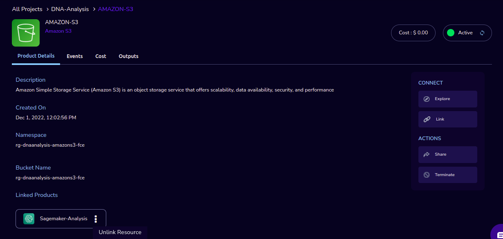

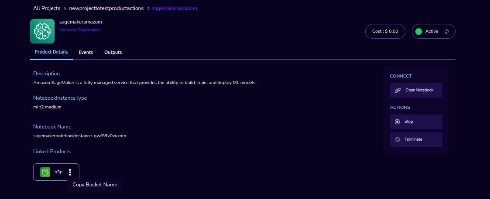

If there are no active sagemaker products we are showing the following message to the user “There is no provisioned Sagemaker product. Please Launch a sagemaker product from the available products page first,before linking to an s3 bucket”.

.. image:: images/computerresource.png 

SageMaker  Product
^^^^^^^^^^^^^^^^^^

Researcher can login to the portal and quickly order SageMaker products.
Find the Sagemaker product in the Active Products panel. Or click on the “View All” button to get a list of all provisioned products.
You can see product related actions in the  Actions menu.

Open Notebook
_____________

You can navigate to notebook through “Open Notebook“ action

Start/Stop action
_________________

You can stop the instance through “Start/Stop” action. Based on the instance state, you will see either the Start or the Stop action.

Terminate
_________

You can terminate the product through “Terminate” action.

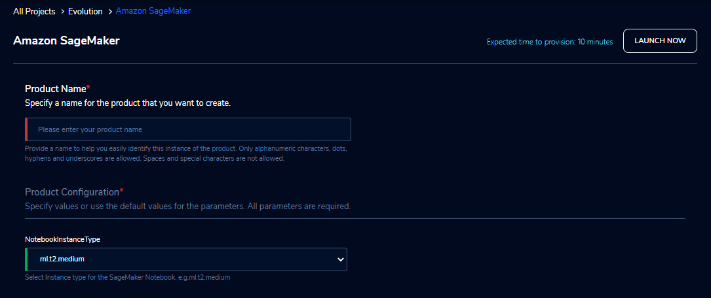

HPC Product
^^^^^^^^^^^

AWS provides the most elastic and scalable cloud infrastructure to run your HPC applications. AWS delivers an integrated suite of services that provides everything needed to quickly and easily build and manage HPC clusters in the cloud to run the most compute intensive workloads across various industry verticals. These workloads span the traditional HPC applications, weather prediction, and seismic imaging, as well as emerging applications, like machine learning, deep learning, and autonomous driving. This product has a master node and cluster nodes with a auto scaling group which will enable the cluster nodes required to be completed. It has many job schedulers like Slurm, AWS jobs. You have used a CFT to make this product provisioned.

.. image:: images/hpc.png

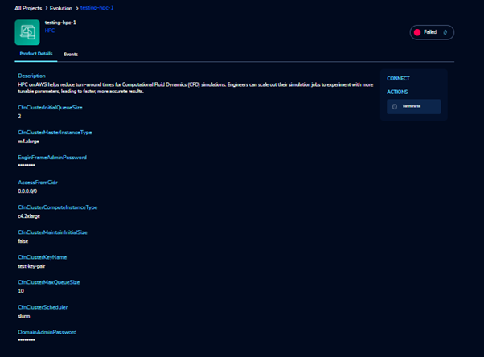

Instance-wide Features
----------------------

SAML 2.0
^^^^^^^^

SAML is an open standard for exchanging authentication and authorization data between parties, in particular, between an identity provider and a service provider. SAML is an XML-based markup language for security assertions

Security Assertion Markup Language (SAML) is a standard for logging users into applications based on their sessions in another context. This single sign-on (SSO) login standard has significant advantages over logging in using a username/password

.. image:: images/saml.png

RLCatalyst Research Gateway supports integration with Identity Providers that support SAML 2.0. If you need your instance of the gateway integrated with your IdP please contact us.
