Features
========

.. contents::

---------------------------------

Administrator Features
++++++++++++++++++++++

An Administrator user can perform the following actions.

  * :ref:`Add an Organizational Unit<Adding Organizational Units>`
  * :ref:`Add AWS Accounts for projects<Adding AWS Accounts>`
  * View `Budgets`_
  * View the `Audit Trail`_
  * Add or Assign `Users`_
  * Assign :ref:`Catalog` Items

If administrator logs as a first time, you can see the welcome screen. Click on the "Let's get Started" button it will navigate to the "Add Account" screen. Use details from :ref:`Appendix A<Appendix A>`  to create account. Once account creation is successful it will navigate to "Create Organization" screen.

.. _Budgets:

Budgets
^^^^^^^
As an Administrator, you can view the organization-wide budgets from the **Budgets** screen with drill-down to the project, researcher and product level.

**Navigation to the Budget**

Login as the Administrator user. Click on “☰” option which is available on the top-left side. Click on the **Budgets** menu item to navigate to the Budgets page.

 
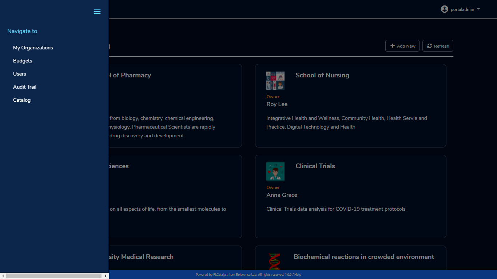

**Budget KPIs**

At the top of this view you can see the summary of budgets across all organizational units in the KPI cards.
You can see the following KPI cards:

  * **Total Budget Allotted**: This is the sum total of budget allocated for all projects in the Organization.
  * **Total Budget Consumed**: This is the budget consumed by all Organizations.
  * **Total Budget Available**: This is the portion of the alloted budget which is not yet consumed.

.. image:: images/Image2.png

**Organization-wise budget view**

The Administrator user can view organization-specific budget details by clicking on a specific organization in the available list. 

The following details are visible in a table format:

.. csv-table::
   :file: BudgetTable.csv
   :widths: 10, 15, 10, 10, 55
   :header-rows: 1

The Administrator user can download the Budget details through the “Export CSV”  option. By clicking on a specific line item, the user can see project-wise budget details which are linked to a particular Organizational Unit.

.. image:: images/Image3.png

When Consumed Budget exceeds a threshold (say 80%), the budget management screen should show an alert in the UI and the user will also get an email notification

.. image:: images/budget1.png

**Researcher-wise budget view**

You can  also see researcher-wise budget details which are linked to a particular project and  you can see configured product details in product-wise budget details page.
 

.. image:: images/Image4.png

Users
^^^^^
As an Administrator you can use the "Users" screen to view all users across Research Gateway. Click on the “☰” option which is available on the left side header.
   
Click on the **Users** menu item to navigate to the Users page.

.. image:: images/user.png

.. image:: images/user1.png

You can see the users in card view or table view. Click on the “≣”  button which is on the right side of the screen.
  
  
.. image:: images/user2.png

There is a search option which is beside the “+Add New” button. You can search based on users, username, and Email id. 

.. image:: images/search.png

If the results are not matched with the searched item it will show a message like “No matching users found”.

.. image:: images/search1.png

You can filter by O.U, Filter by role(Admin/Researcher/Principal Investigator), and sort by username(Asc/Desc), user-role(Asc/Desc), and creation date(Asc/Desc).

.. image:: images/filter.png
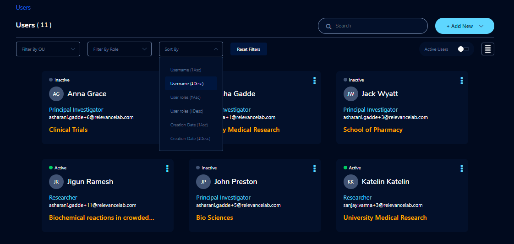

The user can see an active filter with enable and disable options. You can toggle the view between active or all users.

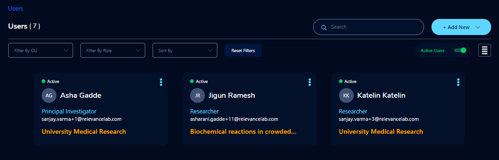

.. _`Adding Users`:

You can add a new user through the “+Add New” button which is on the right side of the screen. 

Fill the following details 

.. list-table:: 
   :widths: 90, 90 
   :header-rows: 1

   * - Field
     - Details
   * - Email 
     - <Enter an Email ID>
   * - Role
     - <Select a role in the drop-down list>
   * - First Name
     - <Please enter firstname of the user>
   * - Last Name
     - <Please enter last name of the user> 

Click on the “Add User” button. On successsful completion of user creation you can see the green color toaster message. We are not allowing duplication of Email id and username while new user creation.

.. image:: images/form.png

The verification email has been sent. Check the verification email delivered to the registered email address and click on the verification link to activate the account. 

.. image:: images/Verificationmail-1.png

**NOTE**: The verification email will be sent from **"no-reply@verificationemail.com"**. If you don't get the link please check the spam folder.

Users can choose a password and click on the “Submit” button. 

**Note**: The password policy should meet the following requirement :
   a. The minimum password length of 8 characters and a maximum of 16 characters.
   b. It should have atleast one lower case character(a-z).
   c. It should have atleast one upper case character(A-Z).
   d. It should have atleast one number(0-9).
   e. It should have atleast one special character(= + - ^ $ * . [ ] { } ( ) ? ! @ # % & / , > < ' : ; | _ ~ ` ).
   
On successful validation, users will be allowed to login to the Research Gateway.

.. image:: images/password1.png 

You can perform the following user actions 

**Assign O.U.**

There is a contextual menu which is at the right side of the card. Once clicked on that you can see the actions one by one. Choose the organizational unit in the drop-down list and click on the “Assign” button. You can see a successful toaster message also. Once assigned you can see O.U name under the Email id. 

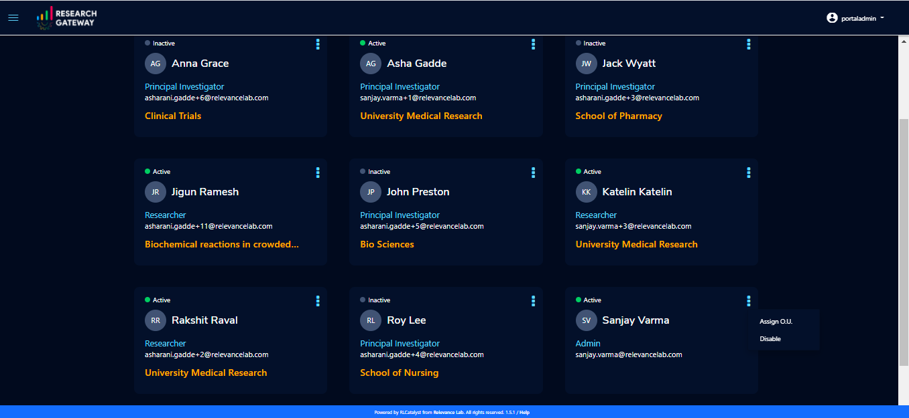

.. image:: images/assign1.png 

**Enable**

There is a contextual menu which is at the right side of the card. Once clicked on that you can see the actions one by one. When clicking on the enable action you can see the message like "A user, once enabled, will be able to log in to the system and carry out activities according to his role. Are you sure you want to proceed?"  in the pop- up with “Enable” button.

.. image:: images/enable.png 

**Disable**

There is a contextual menu which is at the right side of the card. Once clicked on that you can see the actions one by one. When clicking on the disable action you can see the message like "A user, once disabled, will no longer be able to login to the system. Are you sure you want to proceed? in the pop-up with the “Disable” button.

.. image:: images/disable.png 

**Resend verification mail**

There is a contextual menu which is at the right side of the card. Once clicked on that you can see the actions one by one. Through the "Resend verification mail" option you can get another verification email to the registered email address. On successful completion, you can see the green color toaster message. Check the verification email delivered to the registered email address and click on the verification link to activate the account.  

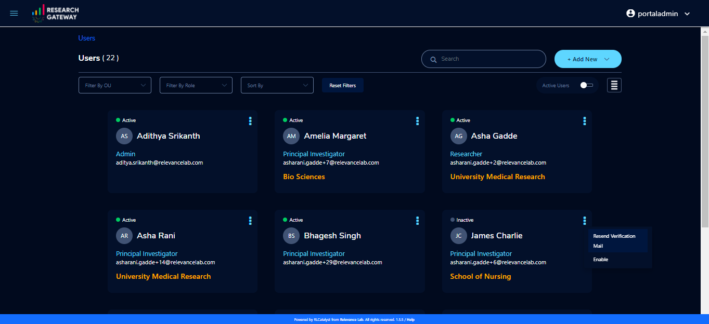

**NOTE**: The "Resend verification mail" option is available only if the user is inactive.

Audit Trail
^^^^^^^^^^^

As an Administrator you can use the **Audit Trail** screen to view security-related audits. Click on the “☰” option which is available on the left side header.
   
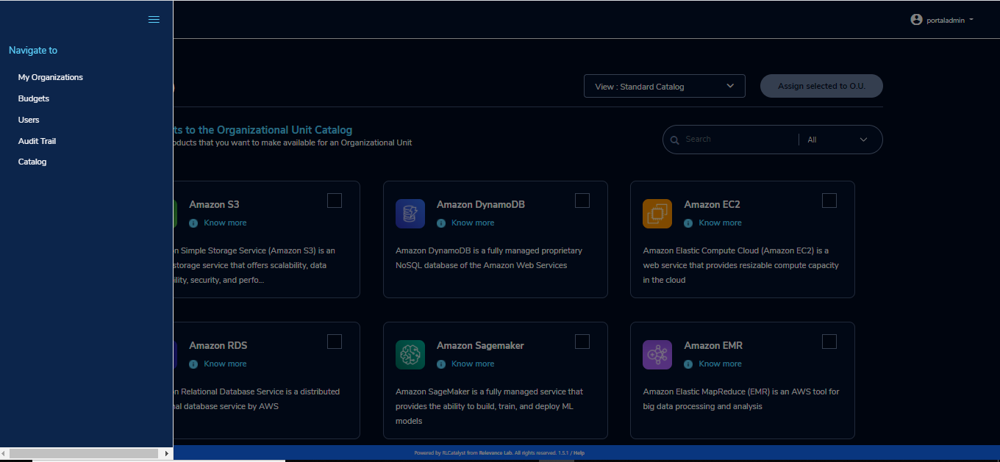

Click on the **Audit Trail** menu item. Through this, you can navigate to the Audit Trail page.

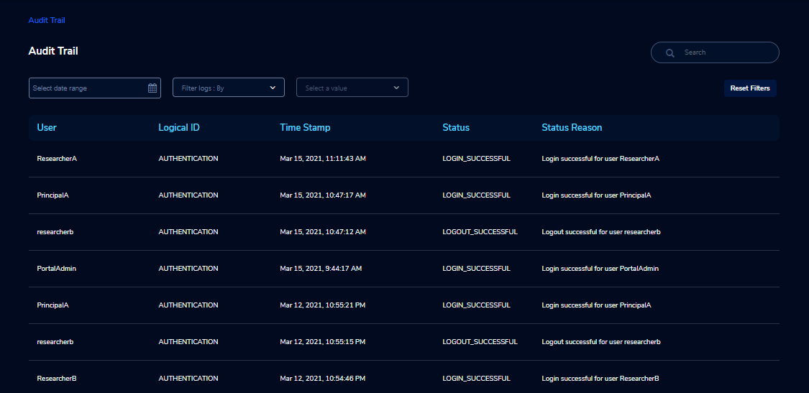

You can see the following audit event details in the table view : 

.. csv-table::
   :file: AuditTable.csv
   :widths: 20, 20, 20, 20, 20
   :header-rows: 1
   
If you try to search the non-existent word it will display a message like “No matching organizations found". You can see the login and logout and failed login audits. Here you can search based on user, status, and status reason. If audits are not found through the search you can see messages like “No matching audits found”.

.. image:: images/search2.png

.. image:: images/fail.png

You can filter the logs by admin, Principal Investigator, researcher, Organization, and Project. You can also filter the logs through the date. 

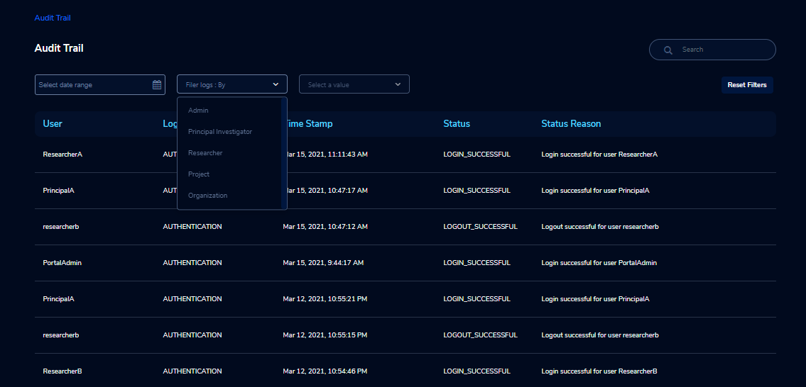

.. image:: images/Audit4.png

Catalog
^^^^^^^
Use details from :ref:`Catalog` 

**NOTE**: Use details from :ref:`Appendix B<Appendix B>` for Standard Catalog products.

Principal Investigator Features
+++++++++++++++++++++++++++++++

As a Principal Investigator, you can create an account and project also. A project will be associated with a Budget with an associated dollar amount that is funded from a specific Grant to the organization. A Project can use Resources only if there is an associated budget that can meet the forecasted needs.

If Principal Investigator logs as a first time, he can view the welcome screen. Click on the "Let's get Started" button it will navigate to the "Add Account" screen. 

.. image:: images/welcome.png

Use details from :ref:`Appendix A<Appendix A>`  to create account. Once account creation is successful it will navigate to "Create Project" screen.

.. image:: images/projectcreation.png 

My Projects page of the Research Gateway will list all the existing projects created along with other details.

.. image:: images/myprojects.png

Clicking on a specific project will leads to a project details page.

.. image:: images/projectdetails.png 

How to add a new Project 
^^^^^^^^^^^^^^^^^^^^^^^^
Use details from :ref:`Project ordering` to create projects.

 
Available Products Tab
-----------------------

1. 	You can view the Available Products information here and you can see products in a table view also.
2. 	You can search based on product name and description. You can filter the products. We have following filter options
      
	  a. **All** - You can see the all products here.
	  b. **Research** - You can see the products realted to compute and analytics here. Eg: Amazon EC2
	  c. **IT Applications** - You can see the products related to storage and database here. Eg: Amazon S3

.. image:: images/availableproducts.png	 

My Products Tab
---------------

1. You can view the provisioned products details here and You can see products in a table view also.
2. You can search the product name and description of the product.
3. You can filter the products. We have following filter options:
      
	  a. **All** - You can see the all(i.e., active,terminated,stopped and failed) products here.
	  b. **Active** - You can see all the active products here.
	  c. **Terminated** - You can see all terminated products here.

	 
.. image:: images/myproducts.png

**NOTE**: 

a. When adding a project we are passing collaborator information. Through this, we are linking researchers to the project. 
b. The project is independent of the researcher. We can create an empty project and add collaborators later. We can add collaborators through the "Manage" option which is at the project details screen.
c. **My Projects** page of the Research Gateway will list all the existing projects created along with other details. Clicking on a specific project will lead 
   to a project details page. Click on the specific project you can navigate to the project details page.

.. _Users_PI:

Users (for Principal Investigator)
^^^^^^^^^^^^^^^^^^^^^^^^^^^^^^^^^^
As a Principal Investigator  you can use the "Users" screen to view all users across all your projects in Research Gateway. Click on the “☰” option which is available on the left side header.

Click on the **Users** menu item to navigate to the Users page.

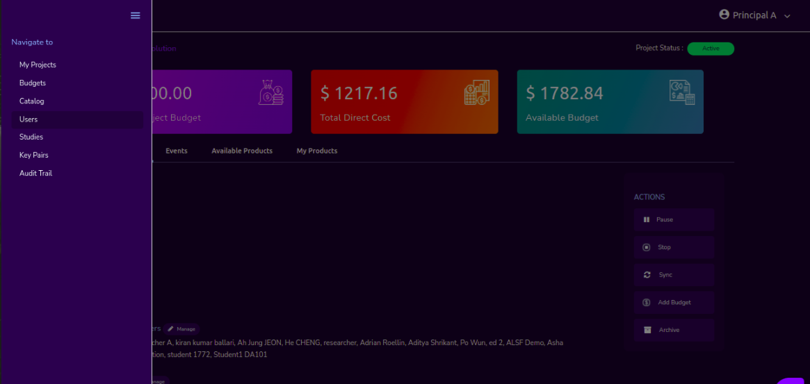

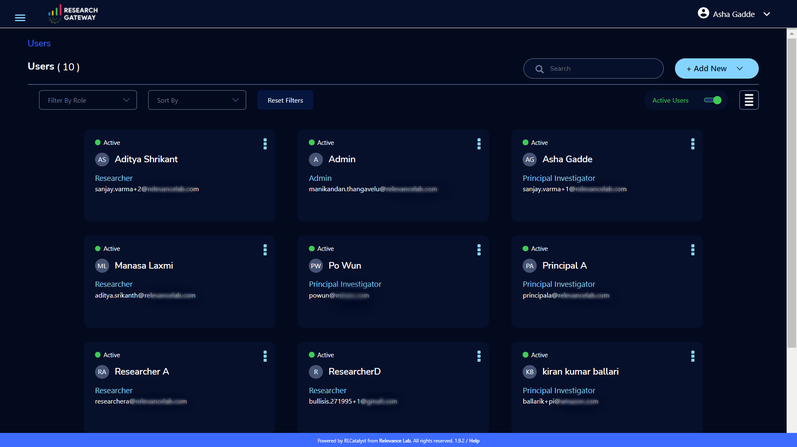

You can see the users in card view or table view. Click on the “≣”  button which is on the right side of the screen.
  
  
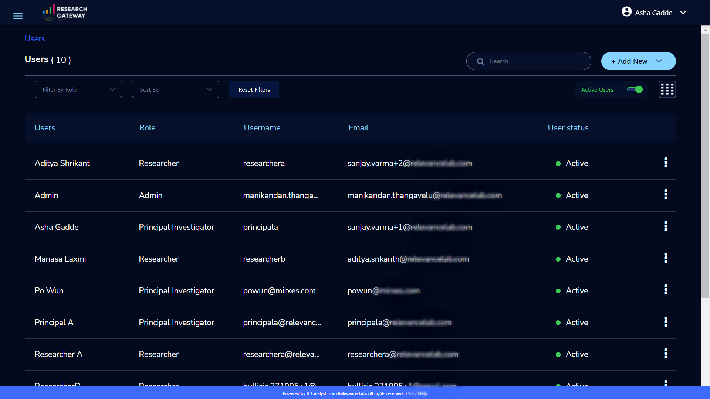

There is a search option which is beside the “+Add New” button. You can search based on users, username, and Email id. 

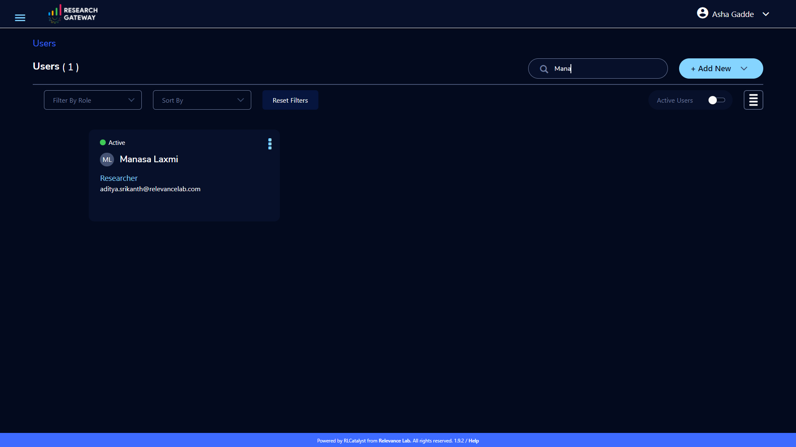

If the results are not matched with the searched item it will show a message like “No matching users found”.

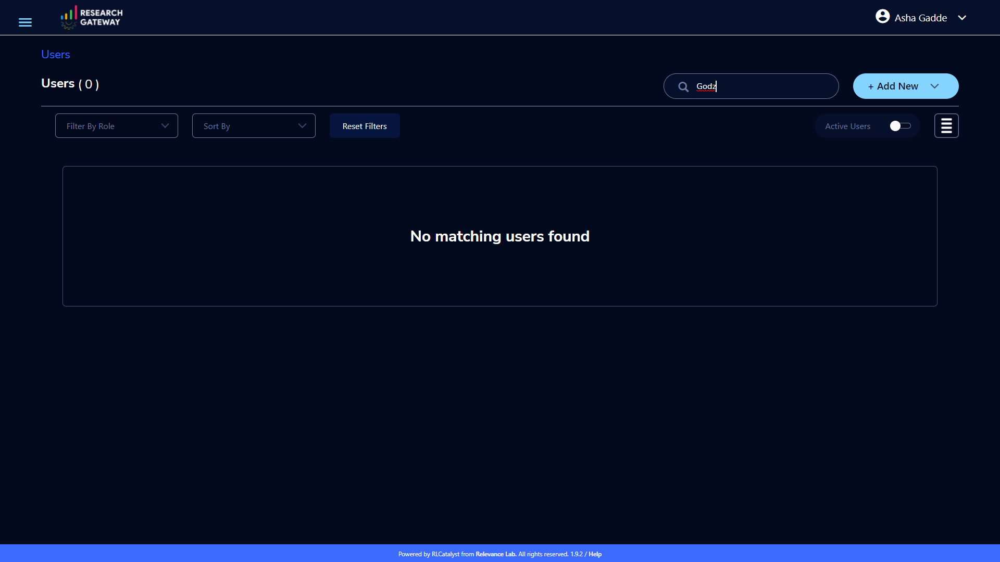

You can filter by role(Researcher/Principal Investigator), and sort by username(Asc/Desc), user-role(Asc/Desc), and creation date(Asc/Desc).

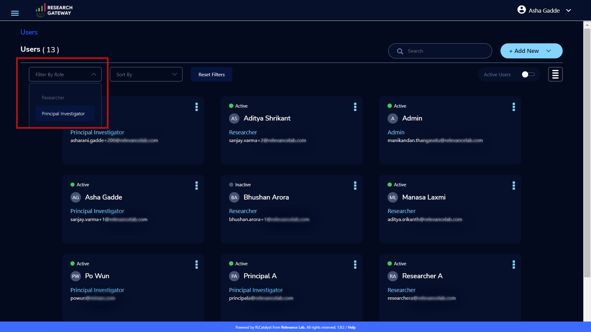
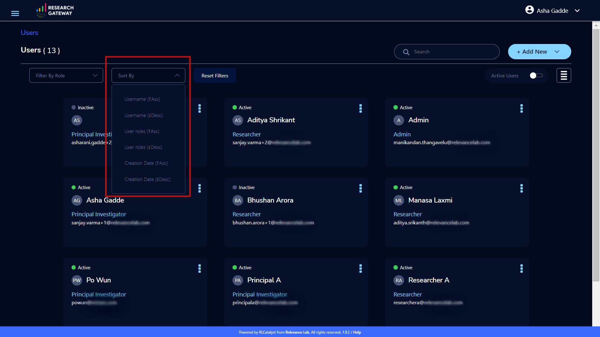

The user can see an active filter with enable and disable options. You can toggle the view between active or all users.

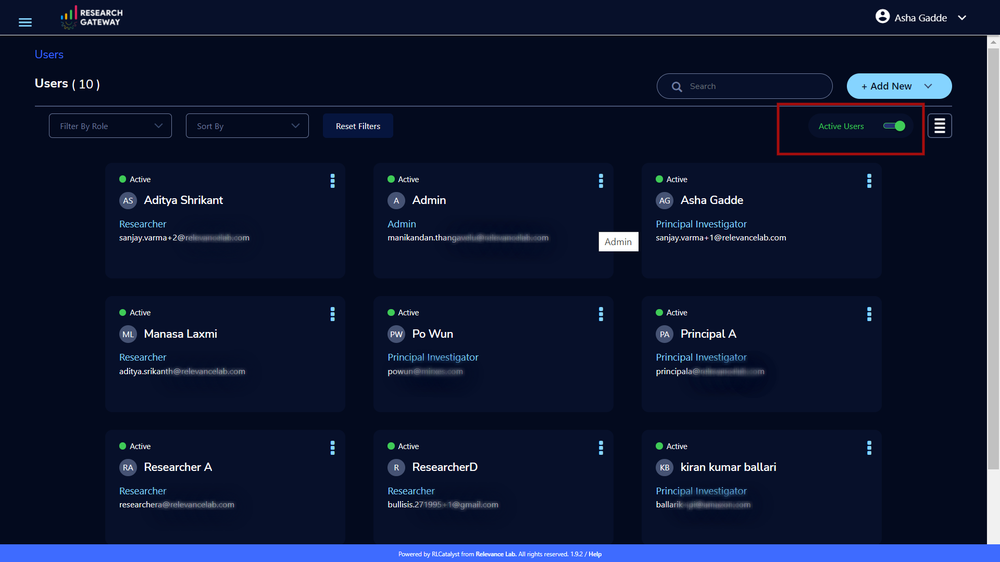

.. _`Adding Users_PI`:

You can add a new user through the “+Add New” button which is on the right side of the screen. 

Fill the following details 

.. list-table:: 
   :widths: 90, 90 
   :header-rows: 1

   * - Field
     - Details
   * - Email 
     - <Enter an Email ID>
   * - Role
     - <Select a role in the drop-down list>
   * - First Name
     - <Please enter firstname of the user>
   * - Last Name
     - <Please enter last name of the user> 

Click on the “Add User” button. On successsful completion of user creation you can see the green color toaster message. We are not allowing duplication of Email id and username while new user creation.

.. image:: images/form.png

The verification email has been sent. Check the verification email delivered to the registered email address and click on the verification link to activate the account. 

.. image:: images/Verificationmail-1.png

**NOTE**: The verification email will be sent from **"no-reply@verificationemail.com"**. If you don't get the link please check the spam folder.

Users can choose a password and click on the “Submit” button. 

**Note**: The password policy should meet the following requirement :
   a. The minimum password length of 8 characters and a maximum of 16 characters.
   b. It should have atleast one lower case character(a-z).
   c. It should have atleast one upper case character(A-Z).
   d. It should have atleast one number(0-9).
   e. It should have atleast one special character(= + - ^ $ * . [ ] { } ( ) ? ! @ # % & / , > < ' : ; | _ ~ ` ).
   
On successful validation, users will be allowed to login to the Research Gateway.

.. image:: images/password1.png 

You can perform the following user actions 

**Enable**

There is a contextual menu which is at the right side of the card. Once clicked on that you can see the actions one by one. When clicking on the enable action you can see the message like "A user, once enabled, will be able to log in to the system and carry out activities according to his role. Are you sure you want to proceed?"  in the pop- up with “Enable” button.

.. image:: images/enable.png 

**Disable**

There is a contextual menu which is at the right side of the card. Once clicked on that you can see the actions one by one. When clicking on the disable action you can see the message like "A user, once disabled, will no longer be able to login to the system. Are you sure you want to proceed? in the pop-up with the “Disable” button.

.. image:: images/disable.png 

**Resend verification mail**

There is a contextual menu which is at the right side of the card. Once clicked on that you can see the actions one by one. Through the "Resend verification mail" option you can get another verification email to the registered email address. On successful completion, you can see the green color toaster message. Check the verification email delivered to the registered email address and click on the verification link to activate the account.  

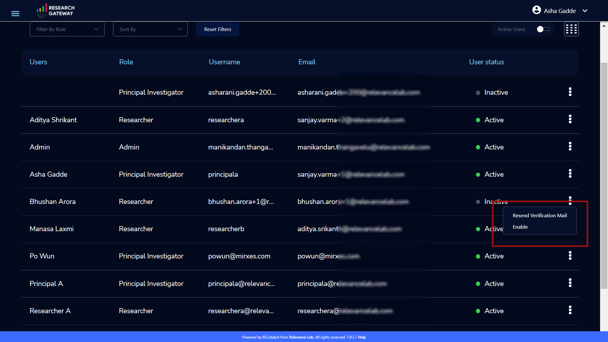

**NOTE**: The "Resend verification mail" option is available only if the user is inactive.

How to add researchers to existing project 
^^^^^^^^^^^^^^^^^^^^^^^^^^^^^^^^^^^^^^^^^^
There is an edit functionality for the project entity. The project is independent of the researcher. A user can create an empty project and add researchers later also. Click on “Manage (i.e., Pencil icon)” which is at the Assigned researchers field in the Project Details Page.

.. image:: images/projectdetails1.png 

Select the Researchers and click on the “Update List” button. You can see the “Updated Successfully” toaster message in the UI. You can't unselect the researchers who have associated products. 
 
.. image:: images/researchers.png 
 
.. image:: images/update.png
 
Actions on Projects
^^^^^^^^^^^^^^^^^^^

Once project is active, we can do Pause/Resume/Stop actions on  a project.

.. image:: images/projectdetails.png 

**Pause Action**

The project status changed to “Paused”. All the researchers under this project would be affected. In a Paused state new provisioning is not allowed. Users can continue to use already provisioned resources as before. All the available products would be visible  but “Launch Now “ button would be hidden.

.. image:: images/pause.png

.. image:: images/pause2.png

**Resume Action** 

The project status changed  to “Active”. In the Active state, team-members can launch new products from the catalog of Available Products.

.. image:: images/resume.png

**Stop Action** 

The project status changed to “Stopped”. In a Stopped state all underlying resources will be stopped and the user will not be able to perform actions on them but you are able to terminate the product. You need to manually start the resources except the s3 product.

.. image:: images/stop.png

.. image:: images/stop2.png

.. image:: images/stop3.png

**Note**: 

1. If there are any failed provisioned product in my products panel you cannot do actions on the project. You need to terminate that product.
2. Once project is failed, We can do repair on a project. Click on the "Repair" button which is at the project details page. We can see related events in events page.
3. Once project is failed we can do catalog sync on a project. Click on the "Sync" button which is at the project details page. We can see related events in events page.

Budgets (for Principal Investigator)
^^^^^^^^^^^^^^^^^^^^^^^^^^^^^^^^^^^^^

As a Principal Investigator, you can view the organization-wide budgets from the **Budgets** screen with drill-down to the project, researcher and product level.

**Navigation to Budget screen**

Sign in as the Principal Investigator. Click on the “☰” Symbol which is available on left side header. Click on the "Budgets" menu item through this, you can navigate to the Budget Details page.  

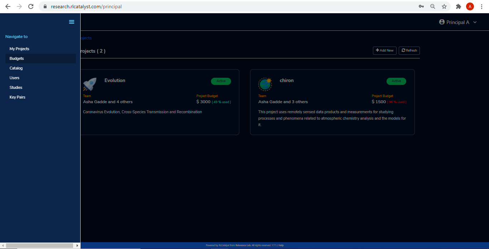

.. image:: images/budget2.png

You can see budget details  with different KPI cards. You can see the following KPI cards:

  a. **Project Budget** : This is the budget allocated for the project during the creation of the project.

  b. **Consumed Budget** : This is the budget consumed by all the researchers in the project.

  c. **Available Budget** : This is available budget for the project

You can see Project-wise Budget details in the table format:

.. csv-table::
   :file: BudgetTable2.csv
   :widths: 10, 15, 10, 10, 15
   :header-rows: 1
 
You can download the budget details through the “Export CSV”  option.

Note: When Consumed Budget exceeds a threshold (say 80%), the budget management screen should show an alert in the UI and the user will also get an email notification.

 .. image:: images/budget6.png
 
You can see researcher budget details which are linked to particular products and you can see configured products information in Researcher-wise Budget details page

.. image:: images/budget3.png

.. image:: images/budget4.png

Catalog (for Principal Investigator)
^^^^^^^^^^^^^^^^^^^^^^^^^^^^^^^^^^^^
Use details from :ref:`Catalog`

Key Pairs(for Principal Investigator)
^^^^^^^^^^^^^^^^^^^^^^^^^^^^^^^^^^^^^
Use details from :ref:`KeyPair` to look at Key pairs.

Studies(for Principal Investigator)
^^^^^^^^^^^^^^^^^^^^^^^^^^^^^^^^^^^^^
As a Principal Investigator, You can view the studies in the Research Gateway. Click on “☰” Symbol which is available on the left side header. By clicking on the "Studies" menu item, the user will be navigated to the studies details page.

The “Studies” landing page lists the datasets as cards. 

Each card shows the following data:

1. Name
2. Description
3. Tags
4. Bookmark this study.
5. View Details link(Clicking on the “View details” call-to-action on a study card will lead to a Study details page).

.. image:: images/studies1.png

The studies landing page should have a “Filter” feature that allows the user to filter the listing by predetermined criteria. You can see options like Public/Private/Bookmarked/All Studies.

.. image:: images/fil1.png

The studies landing page has a search bar that allows users to search the studies based on name and description.

.. image:: images/sea1.png

Please look at :ref:`Studies` for exact details.

Researcher Features
+++++++++++++++++++

As a Researcher you can view all your projects when you login to Research Gateway. 

.. image:: images/ResearcherLanding.png
 
Researcher can view service catalog products available for the project. Click on a project card to navigate to the Project Details page. You can see available cards, available products and active products information in the project details page.

Available Cards
^^^^^^^^^^^^^^^

You can see the following available cards:
a. Available Project Budget
b. Consumed Project Budget
c. My Consumed Budget

**Available Project Budget**

This is the budget allocated for the project during the creation of the project.

**Consumed Project Budget**

This is the budget consumed by all the researchers in the project.

**My Consumed Budget**

This budget is consumed by the researcher who is logged in for that project.

.. image:: images/kpi.png 

Available Products
^^^^^^^^^^^^^^^^^^

You can view the service catalog of products available for the project. These items will be organized into Portfolios. Clicking on a portfolio will display all the Products available in it.

.. image:: images/avaiableproduct.png

You can see the product information in the card. You can know more information about  the product through the “Know More” link. Through the “View Details” link you can see following :

a. **Available Products List view** - You can see the product details in list view.

b. **Available Products Card view** - You can see the product details in card view.

c. **Keyword search** - You can search products based on product type, product name and product description.

d. **Filter** - We have following filter options:
      
	  a. **All** - You can see the all products here.
	  b. **Research** - You can see the products realted to compute and analytics here. Eg: Amazon EC2
	  c. **IT Applications** - You can see the products related to storage and database here. Eg: Amazon S3

.. image:: images/available.png

**NOTE**: Use details from :ref:`Appendix B<Appendix B>` for Standard Catalog Products.

`Secure connections to resources using ALB and Amazon certificates video <https://www.youtube.com/watch?v=3MkouV33XJw>`_

Product Order
^^^^^^^^^^^^^

Log into the Research Gateway. Researchers can see the projects in All projects page. Click on a Project. Navigate to the **Available products** panel. Choose the product in the list by clicking the **Launch Now** button on the card.

Product order form is opened. Input parameters associated with the selected product will be displayed as a form at this point. Once all parameters are filled the user will be able to “Launch Now” the form and the item would then be added to the shopping cart.

.. image:: images/product.png 

Note: You can see VPC, subnets, security groups and keypair names are displaying in the listbox according to related field. Through this user can easily select the keypair and while provisioning the product and use the compute resources.

.. image:: images/product2.png 

Each product conveys the expected amount of time it takes to provision through this user knows how much time that provision will take. Listed keypairs are displayed under Key name Field in the form.
If you ordered an EC2 product you can see the toaster message like “Amazon EC2 ordered Successfully” and it will display an information message.

.. image:: images/allprojects.png

My Products
^^^^^^^^^^^

You can see the provisioned products details in the My Products Panel.

You can view provisioned product details like product name, product type, consumed budget and product status in the card. Choose one product in the panel and click on the card.

.. image:: images/myproducts.png

The Product details page will show a tabbed area with the following tabs:
   1. Product Details
   2. Events
   3. Outputs

The “Product details” tab will show all the details of the product available in the collection. The actions associated with the product will be shown in an actions bar on the right side of the page. The “Events” tab will show the event details of the associated product while creation. The "Outputs" tab will show the CFT output details.

.. image:: images/E2E.png

You can see provisioned product details through “View All” option. You can  see all product details.

.. image:: images/myproducts.png

Through the “View All” button in the panel header, you can see following:

   * My Products List view - You can see the details of your provisioned products in list view

   * My Products Card view - You can see the details of your provisioned products in card view

   * Keyword search - You can search provisioned products based on product name, product type and description.
   
   * Filter - We have following filter options:
      
	  a. **All** - You can see the all(i.e., active,terminated,stopped and failed) products here.
	  b. **Active** - You can see all the active products here.
	  c. **Terminated** - You can see all terminated products here.

.. image:: images/myproduct2.png

**NOTE** : When you on click on "View All" option you can see active products defaultly. 

While product is in the *Creating* state the details page displays a time limit that provision will take through the “Live in 5/10/15 mins” tag.

When you click any action(Start/Stop/Terminate) in a provisioned product, state should be changed automatically using server side events.

**NOTE**: On successful provision of a product when you click on any action immediately, if instances not created you can see a message "**The instance-id of the product is not available. Please try after some time**".

.. image:: images/instance.png

**Navigation to the screens**

Click on the “☰”  Symbol which is available on the left side header. You can see a menu like :

1. **My Projects** : Through this, you can navigate to My Projects page
2. **Budgets** : Through this, you can navigate to the Budget Details page 
3. **Studies** : Through this, you can navigate to the Studies Details page.
4. **Key Pairs** : Through this, you can navigate to the Key Pairs Details page.

Budgets (for Researcher)
^^^^^^^^^^^^^^^^^^^^^^^^
As a researcher you can use the **Budgets** screen to view your individual budget consumption across projects. You can see budget details with different KPI cards. You can see the following KPI cards:

**Navigation to Budget screen**

Login as the Researcher. Click on “☰” Symbol which is available on the left side header. By clicking on the "Budgets" menu item, the user will be navigated to the Budget details page.

 .. image:: images/bud1.png 
  
You can see budget details with different KPI cards. You can see the following KPI cards :

1. **Total Budget Allotted** : This is the budget allocated for the project during the creation of the project.
2. **Consumed Budget** : This is the budget consumed by all the researchers in the project.
3. **Available Budget** : This is the available budget for the project.

 
 .. image:: images/bud2.png 
 
You can see Project-wise Budget details in the table format:

.. csv-table::
   :file: BudgetTable2.csv
   :widths: 20, 20, 20, 20, 20
   :header-rows: 1

You can see configured product-wise budget details which are linked to a particular project.

 .. image:: images/Researcherbudget.png

Studies (For Researcher)
^^^^^^^^^^^^^^^^^^^^^^^^
In the research field, the ability to use data stores or "Studies" is key. A researcher may have his own data ("My Study"), or a Principal may create a data-store that is shared across researchers in the same project (Project Studies) or the researcher may connect to Open Data like the AWS registry of open data.

.. image:: images/studies.png

A researcher persona will have a menu item that leads to the “Studies” landing page. The “Studies” landing page lists the datasets as cards. 

Each card shows the following data:

1. Name
2. Description
3. Tags
4. Bookmark this study.
5. View Details link(Clicking on the “View details” call-to-action on a study card will lead to a Study details page).

.. image:: images/studies1.png

The studies landing page should have a “Filter” feature that allows the user to filter the listing by predetermined criteria. You can see options like Public/Private/Bookmarked/All Studies.

.. image:: images/fil1.png

The studies landing page has a search bar that allows users to search the collection. (search will be dynamic).

.. image:: images/sea1.png

Please look at :ref:`Studies` for exact details.
 

Key Pairs (For Researcher)
^^^^^^^^^^^^^^^^^^^^^^^^^^
Plese use :ref:`KeyPair` 

Instance-wide Features
++++++++++++++++++++++

SAML Integration using OKTA as an example
^^^^^^^^^^^^^^^^^^^^^^^^^^^^^^^^^^^^^^^^^^
SAML stands for Security Assertion Markup Language, an open standard that passes authorization credentials from identity providers (IdPs) to service providers (SPs). SAML is the link between the authentication of a user’s identity and the authorization to use a service. It’s the language that helps IdPs and SPs communicate. 

Within the SAML workflow, OKTA can act as both the IdP and SP. When a user requests access to a third-party application registered with OKTA, they are redirected to the OKTA dashboard. SAML is most frequently used to enable single sign-on (SSO), which authenticates accredited users between an identity provider and a service provider.

As an example, We can do it with OKTA. You can follow the below SAML integration steps with OKTA.

Configuration steps for Research Gateway application in OKTA
------------------------------------------------------------

1. Sign in to your OKTA tenant as an administrator.
2. In the Admin Console, navigate to **Applications-->Applications**.
3. Click on the “**Add Application**” button.
4. Click on the “**Create New App**”  button.
5. In the Create a New Application dialog
	a. Select platform as “Web”.
	b. Select SAML 2.0 in the Sign-on method section.
	c. Click on the “**Create**” button.
6. On the General Settings tab, enter an application name for your integration and upload a logo and click on the “**Next**” button. 
7. On the Configure SAML tab, configure the following things.
    a. In the Single Sign-on URL, enter the Assertion Consumer Service (ACS) URL
	b. Enter the Audience URI into the Audience URI (SP Entity ID) field.
	c. Choose the Name ID format and application username that must be sent to your application in the SAML response.
	d. In the **Attribute Statements** section, enter the SAML attributes to be shared with your application. 
	
       .. image:: images/statement1.png	

   e. For Group Attribute Statement follow the below things. 
   
       .. image:: images/statement2.png

8. Click the “**Next**” button.
9. Fill the Feedback form and click on the “**Finish**” button.

Research Gateway supports integration with Identity Providers that support SAML 2.0. If you need your instance of the gateway integrated with your IdP please contact us.	

Research Gateway as SaaS solution on AWS Marketplace
^^^^^^^^^^^^^^^^^^^^^^^^^^^^^^^^^^^^^^^^^^^^^^^^^^^^
Research Gateway is available as a software as a service (SaaS) solution on AWS Marketplace as a SaaS Contract on Monthly or Annual basis. Customers can choose to auto-renew their contacts on expiry.

SaaS Subscription Steps
-----------------------
The below steps that will be done for publishing our product as Saas in the AWS marketplace.

**a. User Subscription**

When our product has been listed for consumption in the AWS marketplace, customers can subscribe to our product.

1. Log in to AWS account with valid credentials. Navigate to AWS Marketplace.
2. Type “RLCatalyst” in the search bar. You can see the result as **RLCatalyst Research Gateway(Saas)**. 

    a. Show the pricing information(Small/Medium/Large). 
	b. Show option of Monthly or Annual. 
	c. Show option of Auto-renewal (Yes/No).
	
 Click on the **Continue on Subscribe** button which is available at the top right side of the page. Fill the required parameters like contract options and renewal settings. Now click on the “Create contract” button. Click on “Pay Now” button. After completion of payment options, the user will be redirected to the RG registration website.
 
**b. Registration page**

After subscribing to the product, the customer is directed to a website we create and manage as a part of our SaaS product to register their account and configure the product. When creating our product, we provide a URL to our registration landing page. AWS Marketplace 
uses that URL to redirect customers to our registration landing page after they subscribe. On our software's registration URL, we collect whatever information is required to create an account for the customer. After successful registration, we will be notifying the customer 
when the product is available for them to consume with a login URL and admin credentials.

**c. Create a new instance of the portal**

When a new customer signs up for our product, we will be creating a new instance of our product and host it in a different environment for 
the customer. An URL will be created for the new environment which they will be shared with the customer. Once a new environment 
is created, we will seed admin credentials to the database and the same will be shared with the customer along with the URL created in the previous step.

1. Login to the Research Gateway  with the new password. Navigate to the Provider settings and click on the “+Add New” button ---Fill the required parameters and click on the “Add” button.
2. Navigate to the “Users” through the left navigation menu.
3. Click on the “+Add New” button in the users listing page. A new user form opened. Fill the required parameters and click on the “Add User” button. A new user with PI role was created.
4. Navigate to “Users” through the left navigation menu. Click on the “+Add New” button in the users listing page. A new user form opened. Fill the required parameters and click on the “Add User” button. A new user with a researcher role was created.
   **Note**: Assign the researcher to the organization while .
5. Navigate to “My Organization” through the left navigation menu . Users can create a new organization with the “+Add New” button on the landing page.
6. Navigate to catalog through the left navigation menu . In the filter select the “View -Standard catalog “  option and enable the checkboxes which are available at the right side of the products and click on the “Assign to selected O.U” button. Select the organization in the list box and click on the “Assign” button.
7. Login to PI account<<Create a new project with the “+Add New” button on the landing page.
   **Note**: You need to select the researcher from the list.
8. Navigate to the catalog through the left navigation menu and choose the  “View-O.U catalog” in the filter and enable the checkboxes which are at the right side of the products and click on “Assign to a project” button and on Successful completion of assign you can see green color toaster message.
9. Login as Researcher <<Navigate to the project details page--you can see the assigned catalog products in the available products panel. 
   Choose the product and click on the **Launch Now** button. Fill the required parameters in the form and launch it. 
   **Note**: While creating the EC2 we need to enter the key pair name.  Navigate to the keypairs through the left navigation menu. Click on the “+Create New” button. Fill the required parameters and click on the “Create key pair” button. New key pair was created. Now navigate to the available products panel. Choose EC2 product and fill the params and click on the “Launch Now” button. The product was launched successfully.

**d. Tracking usage**

When the product is live for the customer to use, we have to track the usage of the customer based on the pricing model they chose while subscribing to our product and the dimension they are consuming. For software as a service (SaaS) subscriptions, we meter for all usage, and then customers are billed by AWS based on the metering records that we provide. For SaaS contracts, we only make sure that the customer is not using the product beyond the contract’s entitlements.

Securely managing multiple AWS accounts with Cross-Account IAM-Roles
^^^^^^^^^^^^^^^^^^^^^^^^^^^^^^^^^^^^^^^^^^^^^^^^^^^^^^^^^^^^^^^^^^^^

You can use AWS Identity and Access Management (IAM) roles to grant access to resources in your AWS account, another AWS account you own, or a third-party account. We are taking your credentials and creating the roles that’s why we want your IAMFull access/Administrator Access. 

Role Creation Process in Research Gateway
-----------------------------------------

1. While adding the settings once you provide the credentials, we will verify the credentials and give the required access.
2. Later we created the role and attached the required policy and this was created by Research Gateway.
3. We shouldn’t use your credentials in any other place.

Role usage
----------
Whenever the call is made to your AWS account we assume the created role and get the temporary credentials and proceed with the action.

