Features
========

.. contents::

---------------------------------

Administrator Features
++++++++++++++++++++++

An Administrator user can perform the following actions.

  * :ref:`Add an Organizational Unit<Adding Organizational Units>`
  * :ref:`Add AWS Accounts for projects<Adding AWS Accounts>`
  * View `Budgets`_
  * View the `Audit Trail`_
  * Add or Assign `Users`_
  * Assign `Catalog`_ Items

If administrator logs as a first time, you can see the welcome screen. Click on the "Let's get Started" button it will navigate to the "Add Account" screen. Use details from :ref:`Appendix A<Appendix A>`  to create account. Once account creation is successful it will navigate to "Create Organization" screen.

.. _Budgets:

Budgets
^^^^^^^
As an Administrator, you can view the organization-wide budgets from the **Budgets** screen with drill-down to the project, researcher and product level.

**Navigation to the Budget**

Login as the Administrator user. Click on “☰” option which is available on the top-left side. Click on the **Budgets** menu item to navigate to the Budgets page.

 
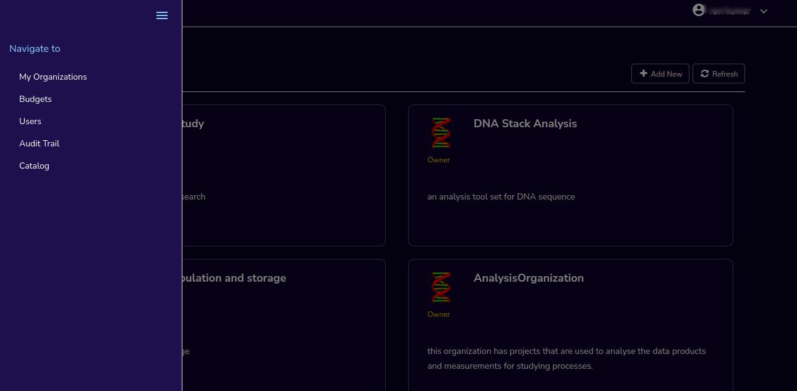

**Budget KPIs**

At the top of this view you can see the summary of budgets across all organizational units in the KPI cards.
You can see the following KPI cards:

  * **Total Budget Allotted**: This is the sum total of budget allocated for all projects in the Organization.
  * **Total Direct Cost**: This is the budget consumed by all Organizations.
  * **Total Budget Available**: This is the portion of the alloted budget which is not yet consumed.

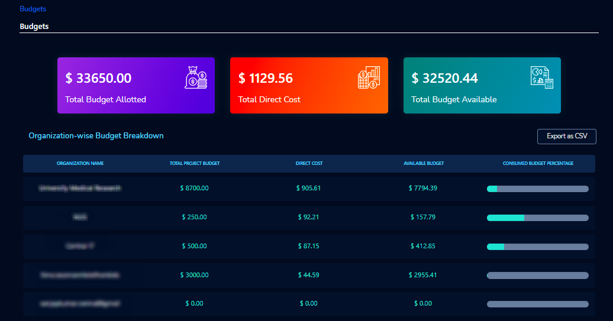

**Organization-wise budget view**

The Administrator user can view organization-specific budget details by clicking on a specific organization in the available list. 

The following details are visible in a table format:

.. csv-table::
   :file: BudgetTable.csv
   :widths: 10, 15, 10, 10, 55
   :header-rows: 1

The Administrator user can download the Budget details through the “Export as CSV” option. 

When Consumed Budget exceeds a threshold (say 80%), the budget management screen should show an alert in the UI and the user will also get an email notification.

.. image:: images/budget1.png

**Project-wise budget view**

The Administrator user can view project-specific budget details by clicking on a specific project in the available list. 

The following details are visible in a table format:

.. csv-table::
   :file: BudgetTable2.csv
   :widths: 10, 15, 10, 10, 15
   :header-rows: 1
   
   
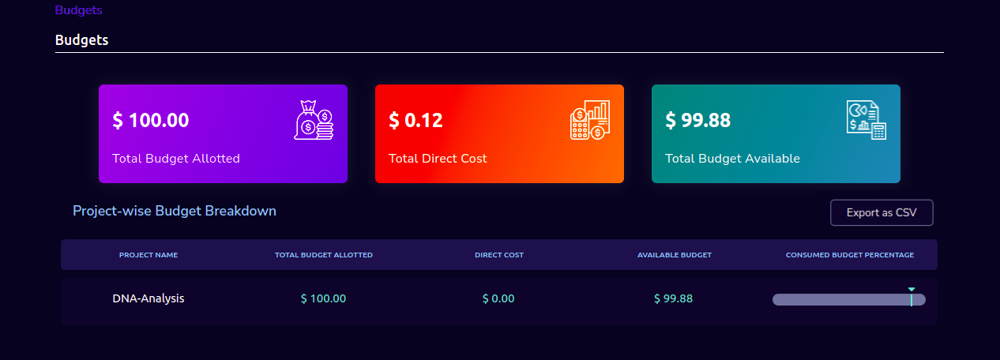

**Researcher-wise budget view**

You can  also see researcher-wise budget details which are linked to a particular project and  you can see configured product details in product-wise budget details page.
 
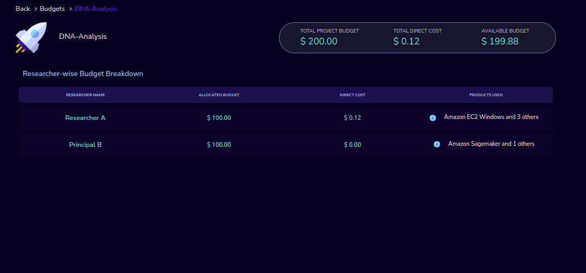

.. _`Cost_allocation`:

Cost allocation tags activation
-------------------------------

1. Login to your AWS account.
2. Note that if your account is a child account under a master account, these actions will have to be done in the Master account.
3. In the services search bar at the top, type "Billing", then click on the search result which says "Billing".
4. In the Billing screen, click on "Cost Allocation tags" in the left-hand panel.

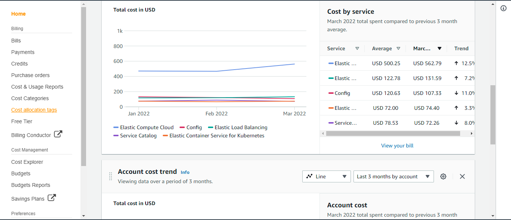

5. Approve the following tags: project_name, researcher_name and cost_resource. Once completion of this step the tags are activated.

Users
^^^^^
As an Administrator you can use the "Users" screen to view all users across Research Gateway. Click on the “☰” option which is available on the left side header.
   
Click on the **Users** menu item to navigate to the Users page.

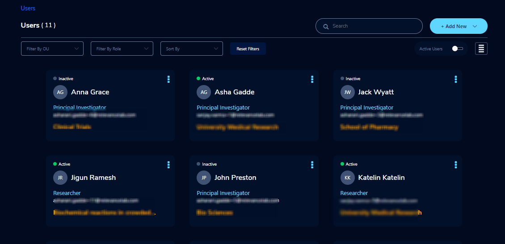

You can see the users in card view or table view. Click on the “≣”  button which is on the right side of the screen.
  
  
.. image:: images/Admin_Users_DefaultPage_TableView.png

There is a search option which is beside the “+Add New” button. You can search based on users, username, and Email id. 

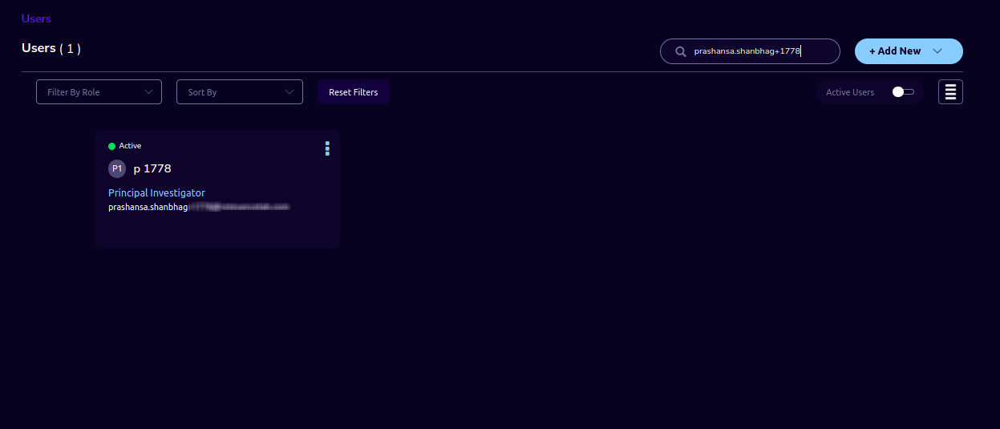

If the results are not matched with the searched item it will show a message like “No matching users found”.

.. image:: images/search1.png

You can filter by O.U, Filter by role(Admin/Researcher/Principal Investigator), and sort by username(Asc/Desc), user-role(Asc/Desc), and creation date(Asc/Desc).

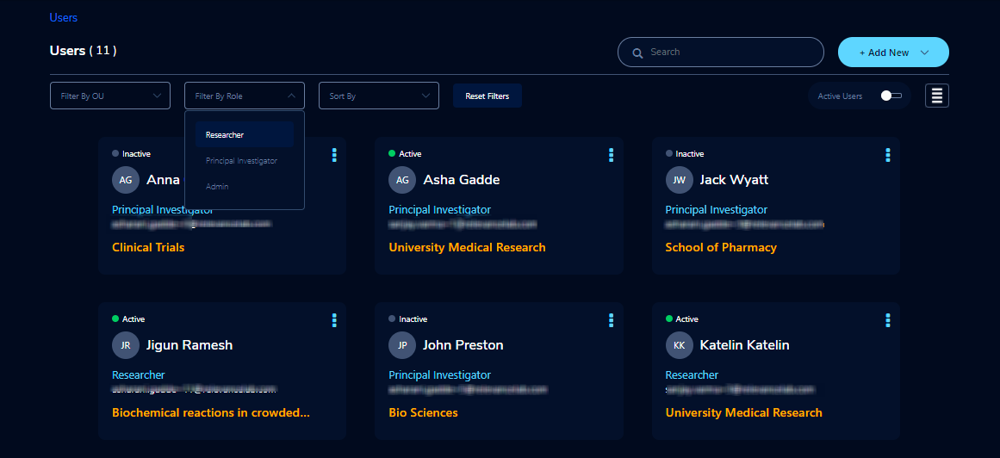
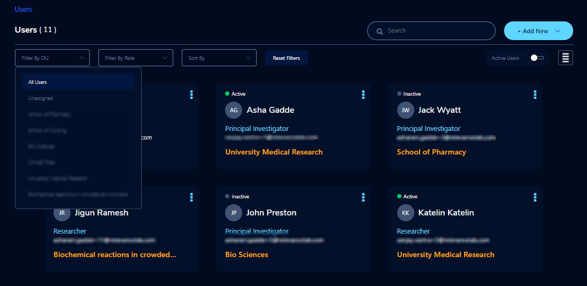
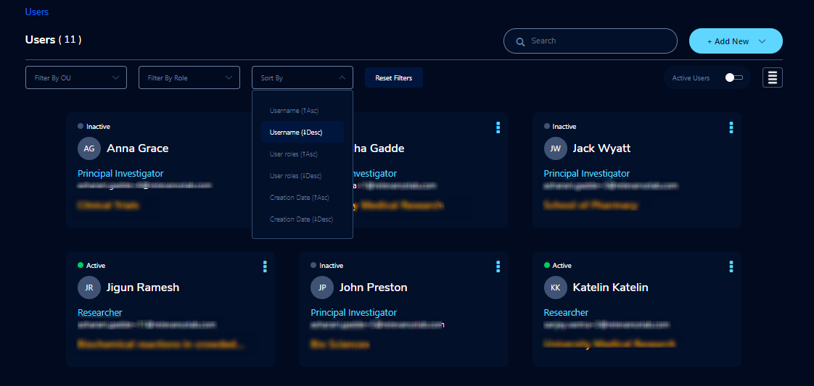

The user can see an active filter with enable and disable options. You can toggle the view between active or all users.

.. _`Adding Users`:

You can add a new user through the “+Add New” button which is on the right side of the screen. 

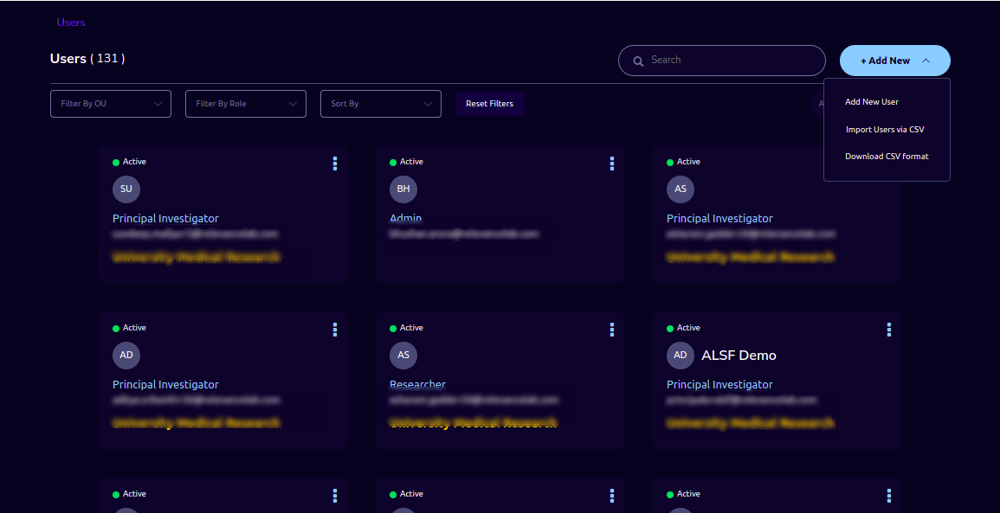

1. Click on "Add New User" button to add a single user via the “Add User” form.

Fill the following details 

.. list-table:: 
   :widths: 90, 90 
   :header-rows: 1

   * - Field
     - Details
   * - Email 
     - <Enter an Email ID>
   * - Role
     - <Select a role in the drop-down list>
   * - First Name
     - <Please enter firstname of the user>
   * - Last Name
     - <Please enter last name of the user> 
   * - Organizational Unit
     - <Select a organizational unit in the drop-down list>
   * - Tags
     - <Add tags to associate with the user>

.. note:: 

 Users can add the tags based on following  
  a. Users can add a maximum of 5 tags. Or A user may add up to five tags.
  b. Each tag should have a minimum of 3 characters and a maximum of 32.
  c. Users cannot duplicate tags for one user.
  d. Each tag can include :
    a. Alphabetic characters(a-z , A-Z)
    b. Numerical characters(0-9)
    c. Special characters( @ - + . -)

Click on the “Add User” button. On successsful completion of user creation you can see the green color toaster message. We are not allowing duplication of Email id and username while new user creation.

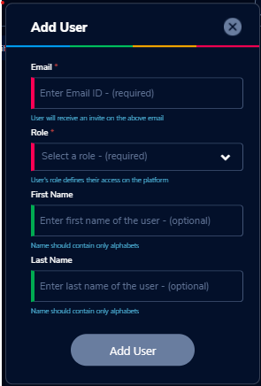

The verification email has been sent. Check the verification email delivered to the registered email address and click on the verification link to activate the account. 

.. image:: images/Verificationmail-1.png

.. note:: The verification email will be sent from **"no-reply@verificationemail.com"**. If you don't get the link please check the spam folder.

Users can choose a password and click on the “Submit” button. 

.. note::

 The password policy should meet the following requirement :
   a. The minimum password length of 8 characters and a maximum of 16 characters.
   b. It should have atleast one lower case character(a-z).
   c. It should have atleast one upper case character(A-Z).
   d. It should have atleast one number(0-9).
   e. It should have atleast one special character(= + - ^ $ * . [ ] { } ( ) ? ! @ # % & / , > < ' : ; | _ ~ ` ).
   
On successful validation, users will be allowed to login to the Research Gateway.

.. image:: images/password1.png 

2. Click on "Download CSV format" to download sample csv file which provides all the appropriate columns.

3. Click on "Import Users via CSV" to add multiple users via csv file.

.. image:: images/bulkuserimport.png

CSV file should contain following details

.. list-table:: 
   :widths: 90, 90 
   :header-rows: 1

   * - Field
     - Details
   * - email 
     - <Enter an Email ID>
   * - first_name
     - <Please enter firstname of the user>
   * - last_name
     - <Please enter last name of the user>
   * - role
     - <Add role for the user>
   * - userTags
     - <Add tags for the user>

.. note:: 

 a. If the user role is other than valid values (0 = Researcher, 1 = Principal Investigator, 2 = Administrator ), it will be automatically reset  to 0  (researcher) and the user will be created with the role as researcher.

 b. Users will see a red-colored toaster with failure message if they have added invalid headers, more than permitted number of user records in a single csv file, or not even one user record.

The new user creation process will begin when the user clicks the "Open" button and a green toaster message will appear. When importing users in bulk, the user creation may take some time. The green toaster message does not imply successful creation of all users. Please check the audit trail to see if any user creation failed.

The verification email has been sent. Check the verification email delivered to the registered email address and click on the verification link to activate the account. 

.. image:: images/Verificationmail-1.png

.. note:: The verification email will be sent from **"no-reply@verificationemail.com"**. If you don't get the link please check the spam folder.

Users can choose a password and click on the “Submit” button. 

.. note::

 The password policy should meet the following requirement :
   a. The minimum password length of 8 characters and a maximum of 16 characters.
   b. It should have atleast one lower case character(a-z).
   c. It should have atleast one upper case character(A-Z).
   d. It should have atleast one number(0-9).
   e. It should have atleast one special character(= + - ^ $ * . [ ] { } ( ) ? ! @ # % & / , > < ' : ; | _ ~ ` ).
   
On successful validation, users will be allowed to login to the Research Gateway.

.. image:: images/password1.png 

You can perform the following user actions 

**Assign O.U.**

There is a contextual menu which is at the right side of the card. Once clicked on that you can see the actions one by one. Choose the organizational unit in the drop-down list and click on the “Assign” button. You can see a successful toaster message also. Once assigned you can see O.U name under the Email id. 

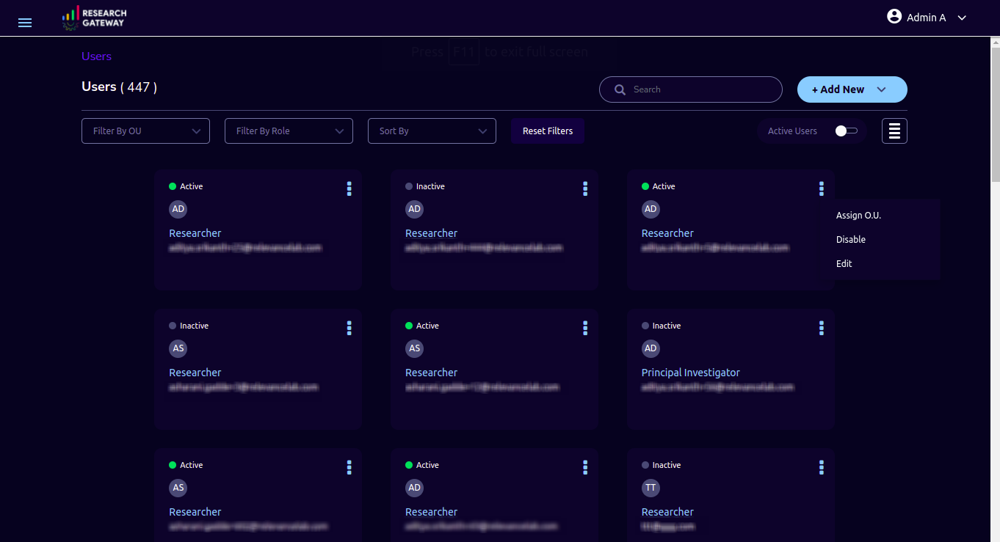

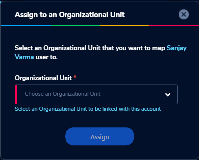

**Enable**

There is a contextual menu which is at the right side of the card. Once clicked on that you can see the actions one by one. When clicking on the enable action you can see the message like "A user, once enabled, will be able to log in to the system and carry out activities according to his role. Are you sure you want to proceed?"  in the pop- up with “Enable” button.

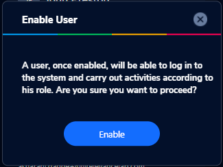

**Disable**

There is a contextual menu which is at the right side of the card. Once clicked on that you can see the actions one by one. When clicking on the disable action you can see the message like "A user, once disabled, will no longer be able to login to the system. Are you sure you want to proceed? in the pop-up with the “Disable” button.

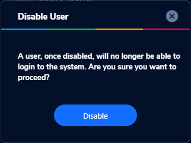

**Resend verification mail**

There is a contextual menu which is at the right side of the card. Once clicked on that you can see the actions one by one. Through the "Resend verification mail" option you can get another verification email to the registered email address. On successful completion, you can see the green color toaster message. Check the verification email delivered to the registered email address and click on the verification link to activate the account.  

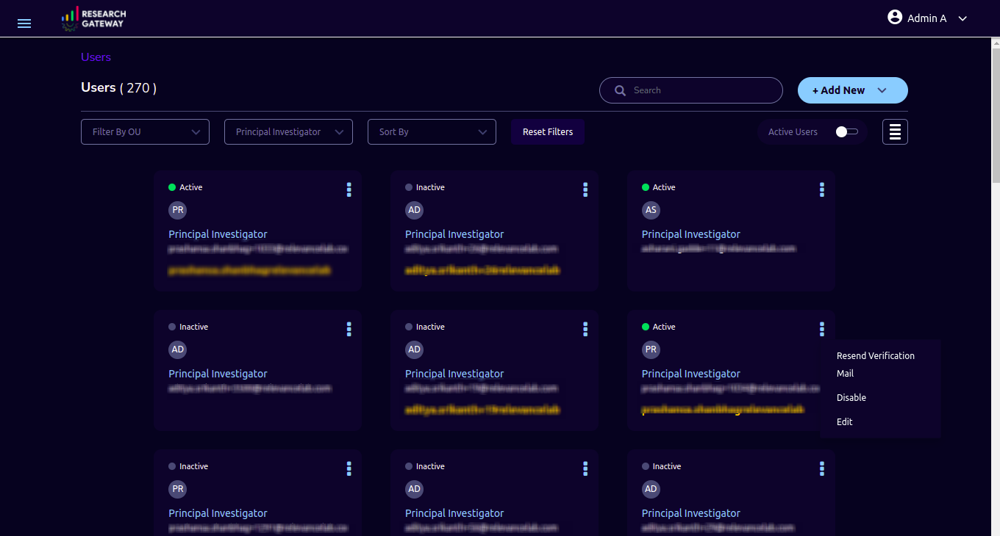

.. note:: The "Resend verification mail" option is available only if the user is inactive.

Audit Trail
^^^^^^^^^^^

As an Administrator you can use the **Audit Trail** screen to view security-related audits. Click on the “☰” option which is available on the left side header.
   
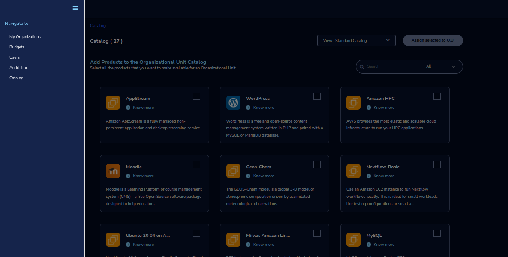

Click on the **Audit Trail** menu item. Through this, you can navigate to the Audit Trail page.

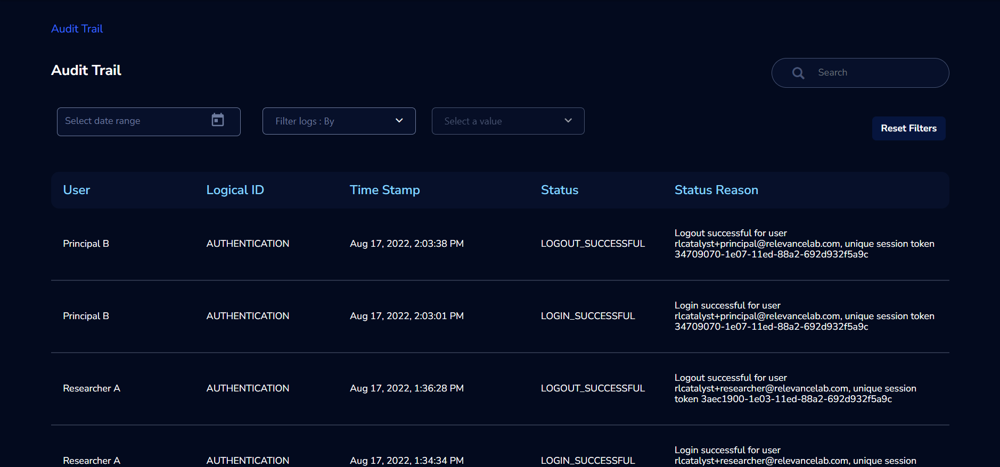

You can see the audit event details in the :ref:`Appendix D<Appendix D>` 
   
If you try to search the non-existent word it will display a message like “No matching organizations found". You can see the login and logout and failed login audits. Here you can search based on user, status, and status reason. If audits are not found through the search you can see messages like “No matching audits found”.

.. image:: images/search2.png

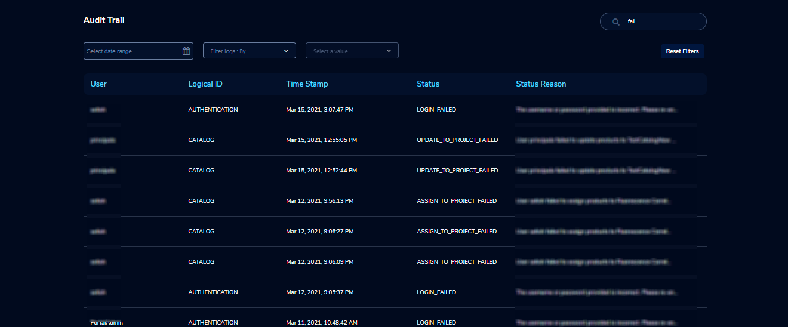

You can filter the logs by admin, Principal Investigator, researcher, Organization, and Project. You can also filter the logs through the date. 

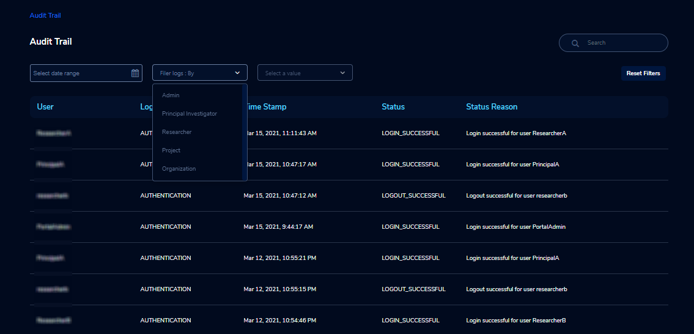

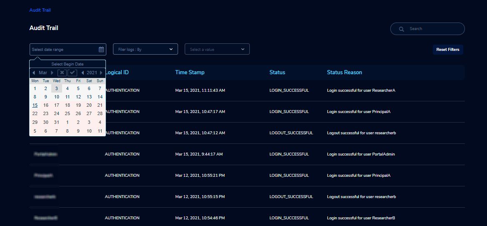

.. _Catalog:

Catalog
^^^^^^^
As an Administrator you can use the “Catalog” screen to view all catalog products across Research Gateway. Click on the “☰” option which is available on the left side header. 
   
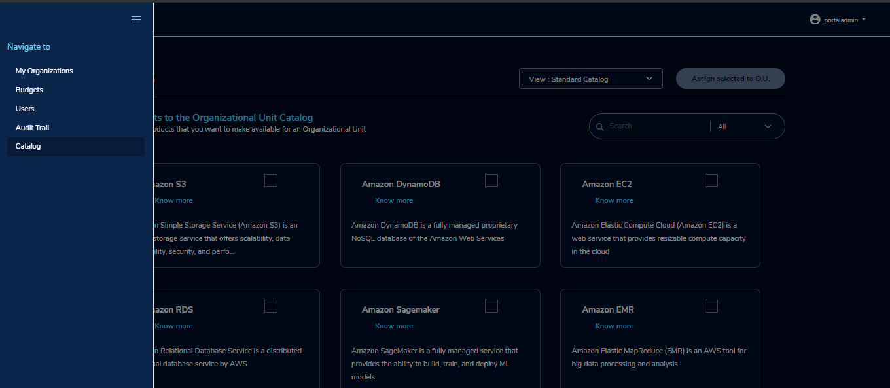

Click on the "Catalog" menu item. Through this, you can navigate to the Catalog details page.

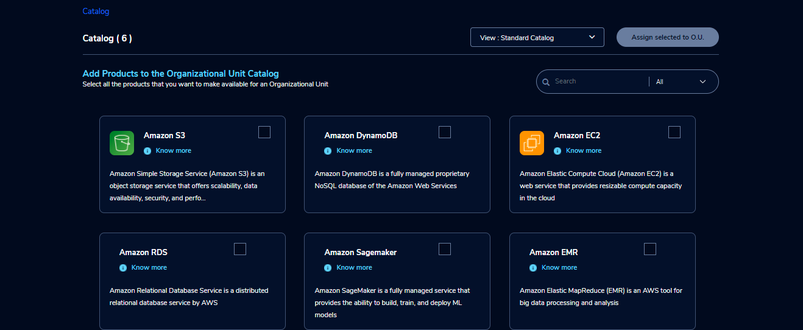

You can see the standard catalog products on the listing page and you can enable the checkbox which is at the right side of the product and assign to a particular  O.U through the “Assign selected to O.U” button.

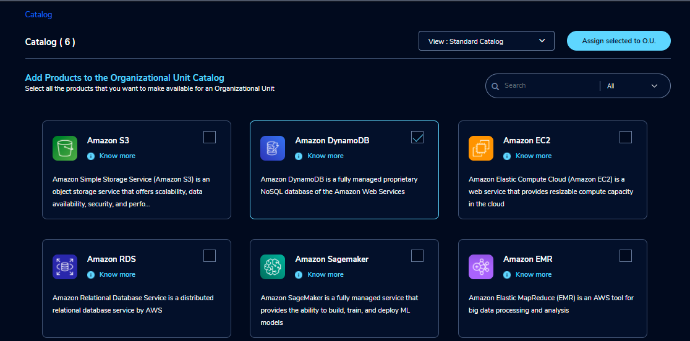

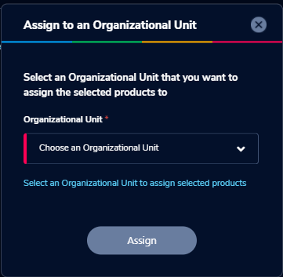

You can view and update the products for the particular organization. Enable the checkbox which is at the right side of the product and click on “Update selected to  O.U '' button . After completion of updation you can see the successful toaster message.

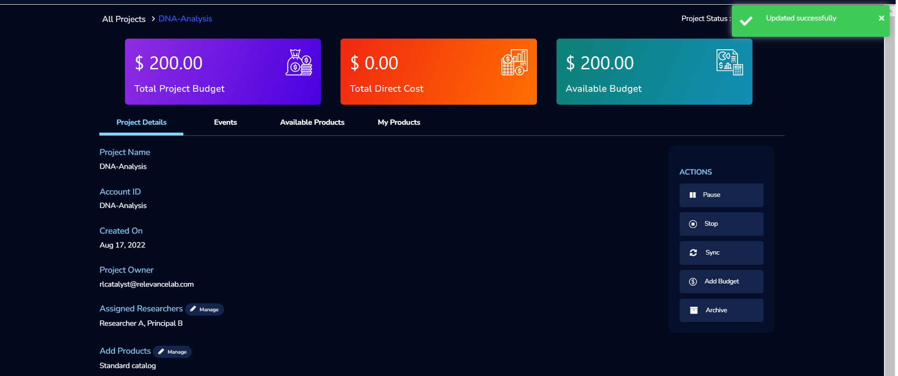

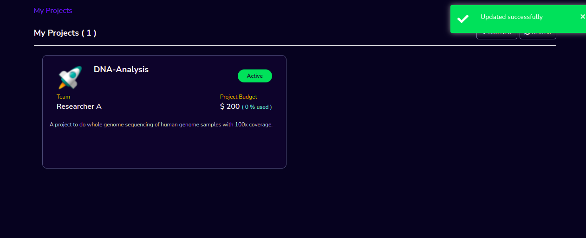

You can search  product name and description of the product. We have following filter options:
 
  a. **All** : You can see all products here.

  .. image:: images/filter1.png

  b. **Research** : You can see the products realted to compute and analytics here. Eg: Amazon EC2.

   .. image:: images/Research1.png

  c. **IT Applications** : IT Application : You can see application related products here.

 .. image:: images/ITApplications1.png

If we could not find any products related to the filter you can see the message like “We could not find any products that matched your search”.

.. image:: images/search3.png

.. note:: Use details from :ref:`Appendix B<Appendix B>` for Standard Catalog products.

Principal Investigator Features
+++++++++++++++++++++++++++++++

As a Principal Investigator, you can create an account and project also. A project will be associated with a Budget with an associated dollar amount that is funded from a specific Grant to the organization. A Project can use Resources only if there is an associated budget that can meet the forecasted needs.

If Principal Investigator logs as a first time, he can view the welcome screen. Click on the "Let's get Started" button it will navigate to the "Add Account" screen. 

.. image:: images/welcome.png

Use details from :ref:`Appendix A<Appendix A>`  to create account. Once account creation is successful it will navigate to "Create Project" screen.

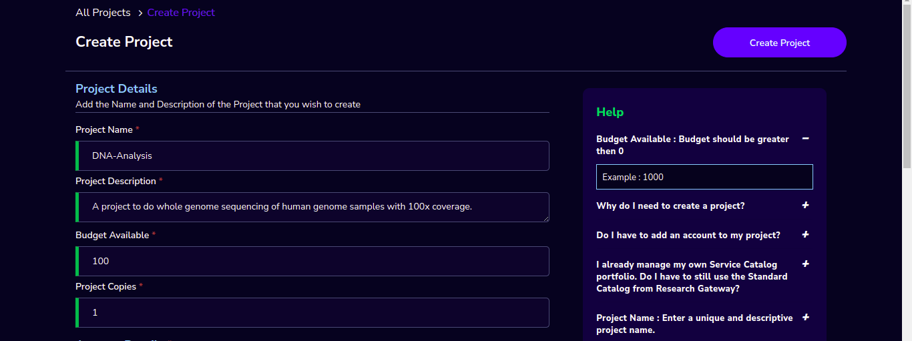

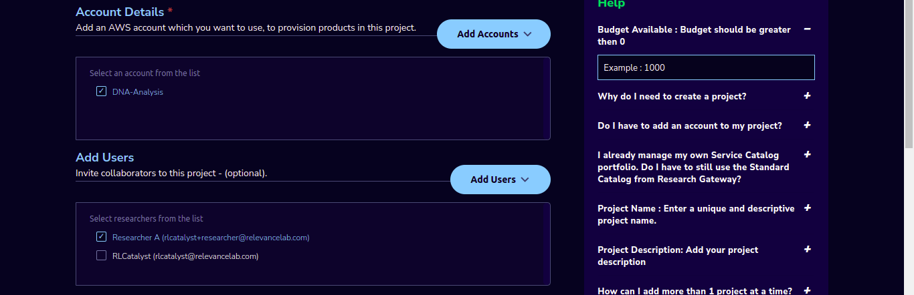

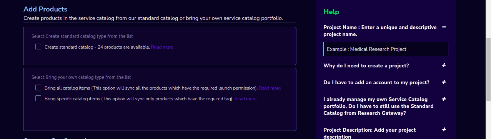

My Projects page of the Research Gateway will list all the existing projects created along with other details.

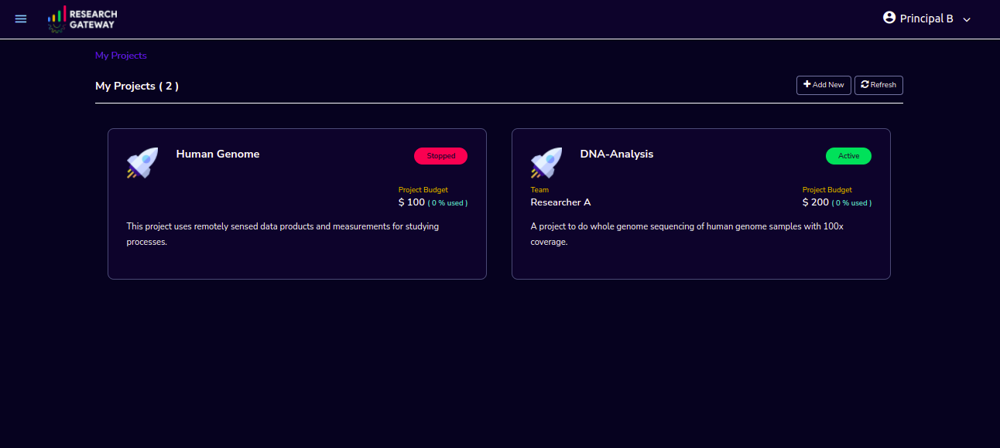

Clicking on a specific project will leads to a project details page.

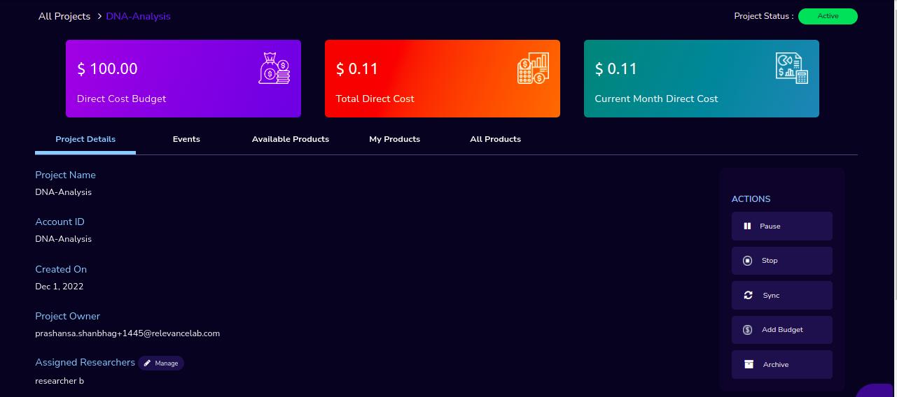

How to add a new Project 
^^^^^^^^^^^^^^^^^^^^^^^^
Login to the Research Gateway. Click on the  “+Add New” button in the My Project page or use details from :ref:`Appendix A<Appendix A>`  to create account. Once account creation is successful it will navigate to "Create Project" screen. The project application form is opened. 

Fill in the following details

.. list-table:: 
   :widths: 90, 90
   :header-rows: 1

   * - Attribute
     - Details
   * - Project Name
     - <Project Name>
   * - Project Description
     - <Description about the project> 
   * - Budget Available
     - <Budget to allocate to this project (cumulative)>
   * - Project Copies
     - <Please enter number of projects you want to create -(between 1 and 10)>
   * - Account Details 
     - <Select an Account ID in the list or create a new account form the **"Add Accounts"** button>
   * - Add Users
     - <Select collaborators from the list or create a new user from the **"Add Users"** button> [optional]
   * - Add products
     - <Create products in the service catalog from our standard catalog or bring your own service catalog portfolio> [optional] 
   * - Cost Control
     - <Research Gateway can automatically create budget consumption alerts and take actions like pausing the project (at 12%) or stopping the project (at 18%). Check this box to enable these actions.>
   
Click on the “Create Project” button. Added a new project successfully.

.. note::
 
 a. While creating the project, if you select the "Standard Catalog" option it will create 7 products(Amazon Sagemaker, Amazon S3, Amazon EC2-Linux, Amazon EC2-Windows, RStudio, Cromwell Advanced and Nextflow Advanced). 
 b. If you select the "Bring all catalog items" option it will sync all the products which have the required launch permission in the portfolio of the AWS account.
 c. If you select the "Bring specific catalog items" option it will sync only the products which have the tag in the portfolio of the AWS account.

Project Storage
---------------

Research Gateway will set up a shared S3 bucket(Project Storage) where the team members can store data. This shared storage will be mounted into all supported workspaces. Storage costs will be accounted for at the project level. For a lot of scientific research, data is stored in file format (e.g. fasta, fastq files for Genomics research). The natural choice for storage of this data could be S3 (inexpensive, highly elastic) or Elastic Block Storage (access is extremely fast). As part of project creation we are creating project storage(i.e., S3 Bucket) and sharing with users. At the same time, we would also like individual users to be able to access personal storage from their computing resources. 

1. The Project level storage will be listed as a product in the My Products tab inside the project as an S3 bucket. There is explore action inside the S3 bucket<<There is a folder called “Shared”.
   Note: It is a common folder(only accessible by user unless shared)  and it  is available to all users.

.. image:: images/Principal_Project_ProjectStorage.png   

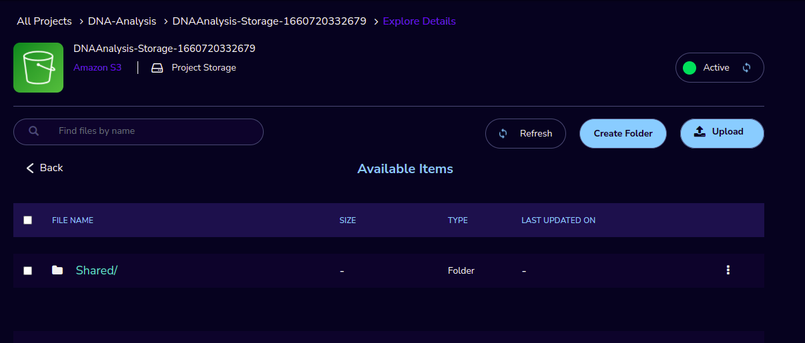

2. You can able to view, upload and delete objects in the storage.
3. While launching any EC2 based product, the user will be prompted whether to mount the Project and User level storage.
4. The Storage will be mounted as a specific folder inside the EC2 machine which the user can use to perform any tasks on. Any data written to the folder will be synced back to the storage and will be accessible to the user on exploring.

Cost Control
------------

1. Research Gateway can automatically create budget consumption alerts and take actions like pausing the project (at 80%) or stopping the project (at 90%).
2. When creating a project if you select the “Automatically respond to budget alerts” checkbox and it will open a pop up box which contains message, Once you confirm that it  will control the costs by taking automatic actions when budget thresholds are breached. By turning this feature off, you will lose the benefits of this cost control feature.

3. You can manually Stop/Pause/Resume/Archive/Add Budget the project through the actions which are available on the project details page.

4. You can see the events related to cost control in the events page

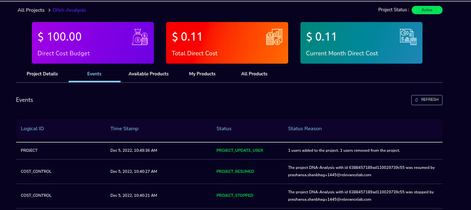

Once you click on the project, you can see the budget in the cards and remaining details will show a tabbed area with the following tabs:

   1. Project Details
   2. Events
   3. Available Products
   4. My Products

Project Details Tab
-------------------

1. You can view the project details here. 
2. If the project was a failed state, you can repair the project through the “Repair” option.
3. Click on the “Pause” action which is available on the right side. When you click on "Pause" action,  all the researchers under this project would be affected. In a Paused state new provisioning is not allowed. Users can continue to use already provisioned resources as before. All the available products would be visible but the “Launch Now “ button would be hidden.
4. Click on the “Resume” button which is available on the right side. The project status changed to “Active”. In the Active state, team members can launch new products from the catalog of Available Products.
5. Click on the “Stop” button which is available on the right side. In a Stopped state, all underlying resources will be stopped and the user will not be able to perform actions on them but you are able to terminate the product. You need to manually start the resources except for the s3 product.
6. Click on the “Sync” button which is available on the right side. It should sync the catalog. You can see related events in the events tab.
7. Click on the "Archive" button which is available on the right side, it was routed to my projects page and showed the message “Archiving project started” and later the project card got removed.

8. Click on the “Manage” option under the **Assigned Researchers** field. Once clicked on that, enable the checkbox beside the researcher Emails and click on the “Update list” button. It will add collaborators to the project. You can search the researchers, through the search option.

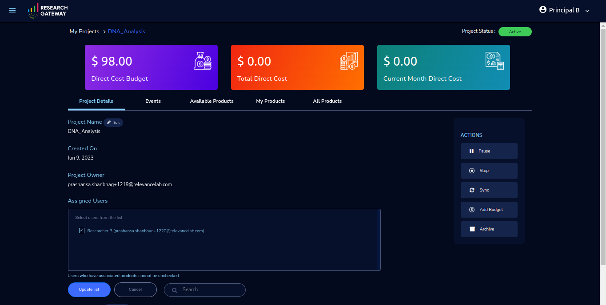

9. Click on the "Manage" option under the **Add products** field. Once clicked on that, it will display the list. Select the option from the list and click on the "Update list" button.

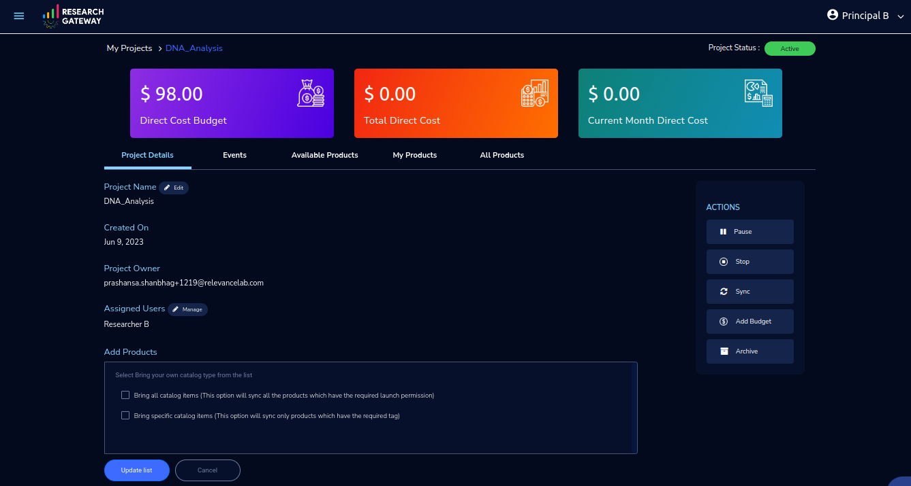

.. note:: Whenever you clicked on the budget it will navigated to researcher-wise budget details page.

Events Tab
----------

You can see the project-related events in the :ref:`Appendix E<Appendix E>`.

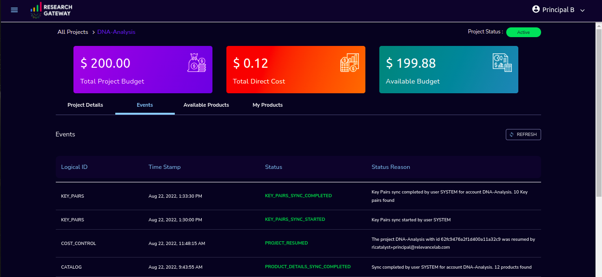
   
Available Products Tab
-----------------------

1. 	You can view the Available Products information here and you can see products in a table view also.
2. 	You can search based on product name and description. You can filter the products. We have following filter options
      
	  a. **All** - You can see the all products here.
	  b. **Research** - You can see the products realted to compute and analytics here. Eg: Amazon EC2
	  c. **IT Applications** - You can see the products related to storage and database here. Eg: Amazon RDS

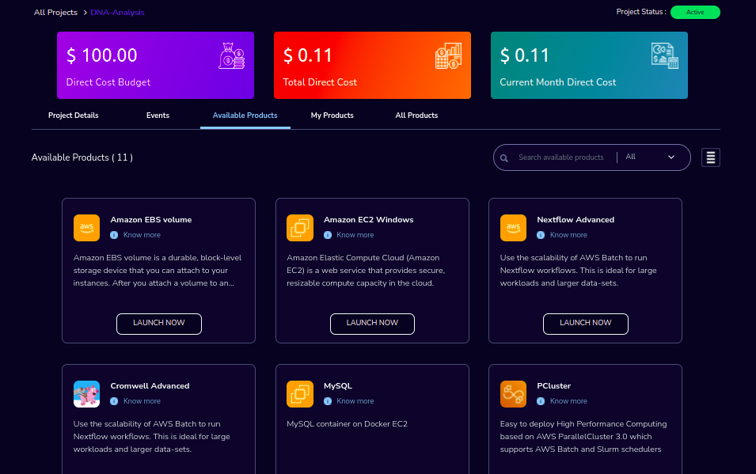

My Products Tab
---------------

1. You can view the provisioned products details here and You can see products in a table view also.
2. You can search the product name and description of the product.
3. You can filter the products. We have following filter options:
      
	  a. **All** - You can see the all(i.e., active,terminated,stopped and failed) products here.
	  b. **Active** - You can see all the active products here.
	  c. **Terminated** - You can see all terminated products here.
	 
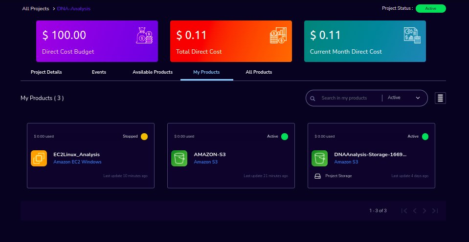

.. note:: 

 a. When adding a project we are passing collaborator information. Through this, we are linking researchers to the project. 
 b. The project is independent of the researcher. We can create an empty project and add collaborators later. We can add collaborators through the "Manage" option which is at the project details screen.
 c. **My Projects** page of the Research Gateway will list all the existing projects created along with other details. Clicking on a specific project will lead to a project details page. Click on the specific project you can navigate to the project details page.
 d. The products which are updated in the last 30 minutes will be visible under the active filter.
 e. When the Principal Investigator logs-in, the user will be able to see the Active filter by default. And if the user selects a filter, the last chosen filter will be stored for the current session. Once the user logs-out and logs-in again the filter value will be reset to  Active.

Auto-Stop Resources on Idle
^^^^^^^^^^^^^^^^^^^^^^^^^^^

If there is no action happening in the provisioned RStudio product by default it will auto stop the product after 15 minutes. if you want to use product you can manually start the product again.

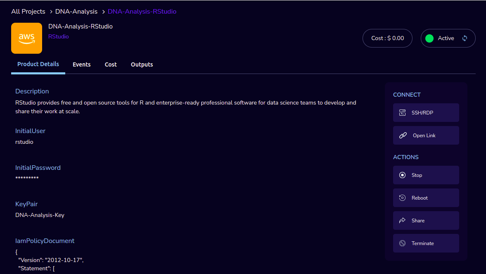
 
.. _Users_PI:

Users (for Principal Investigator)
^^^^^^^^^^^^^^^^^^^^^^^^^^^^^^^^^^
As a Principal Investigator  you can use the "Users" screen to view all users across all your projects in Research Gateway. Click on the “☰” option which is available on the left side header.

Click on the **Users** menu item to navigate to the Users page.

.. image:: images/Principal_Users_Navigation.png

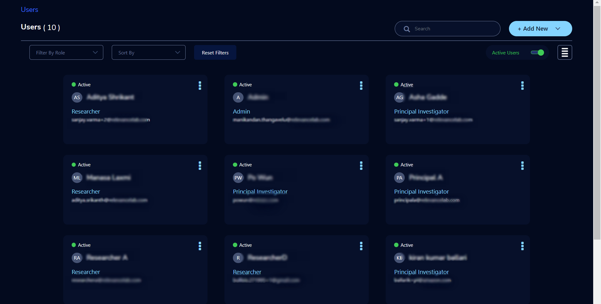

You can see the users in card view or table view. Click on the “≣”  button which is on the right side of the screen.
  
  
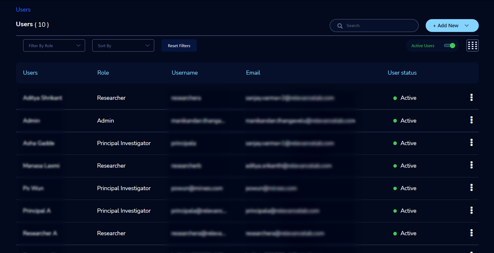

There is a search option which is beside the “+Add New” button. You can search based on users, username, and Email id. 

If the results are not matched with the searched item it will show a message like “No matching users found”.

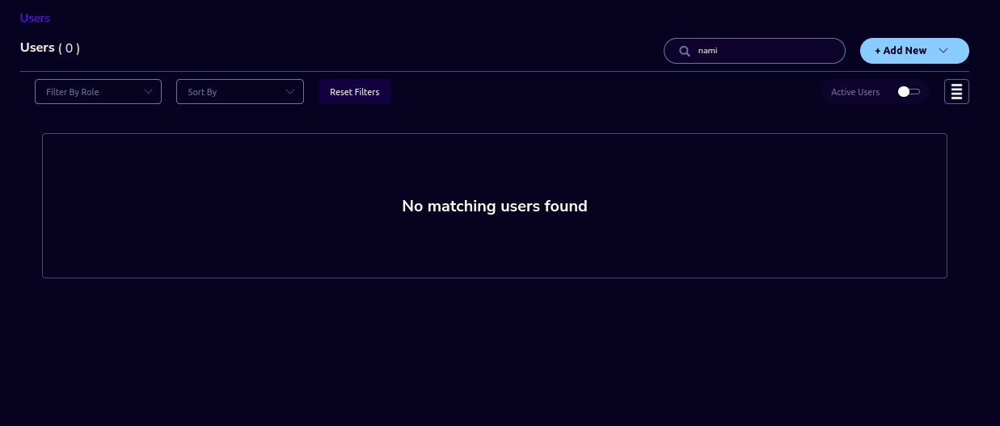

You can filter by role(Researcher/Principal Investigator), and sort by username(Asc/Desc), user-role(Asc/Desc), and creation date(Asc/Desc).

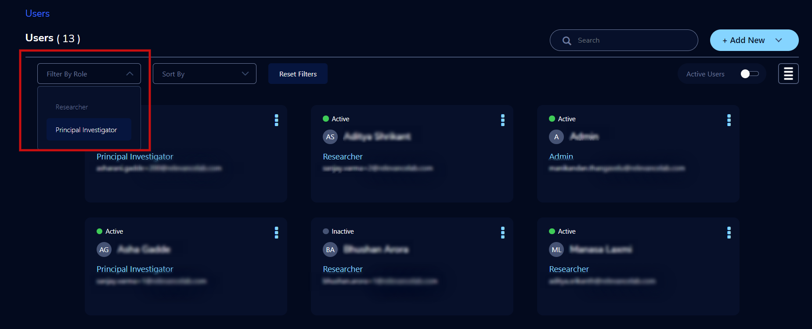
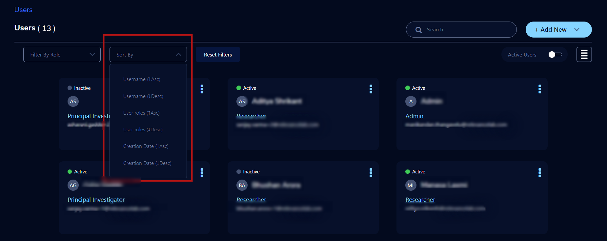

The user can see an active filter with enable and disable options. You can toggle the view between active or all users.

.. _`Adding Users_PI`:

You can add a new user through the “+Add New” button which is on the right side of the screen. 

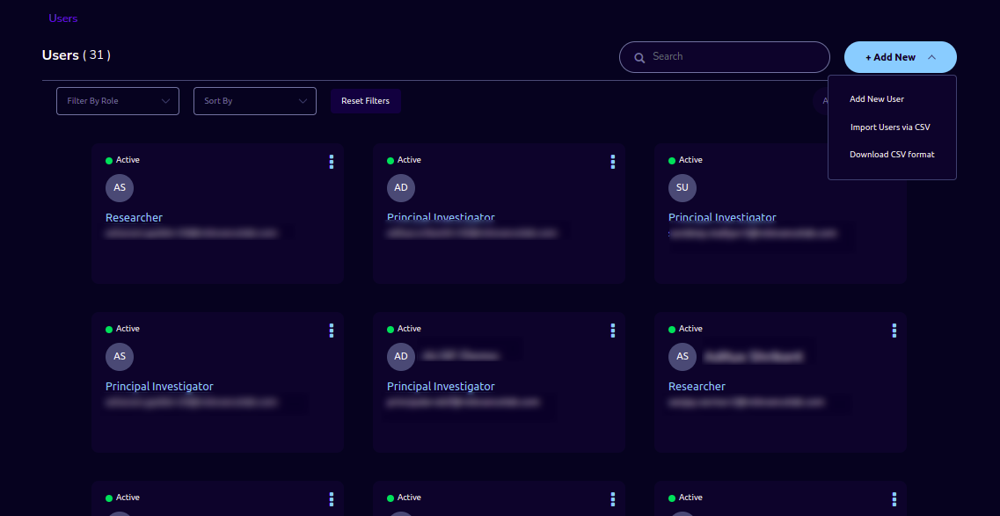

1. Click on “Add New User” button to add a single user via the “Add User” form.

Fill the following details 

.. list-table:: 
   :widths: 90, 90 
   :header-rows: 1

   * - Field
     - Details
   * - Email 
     - <Enter an Email ID>
   * - Role
     - <Select a role in the drop-down list>
   * - First Name
     - <Please enter firstname of the user>
   * - Last Name
     - <Please enter last name of the user>
   * - Tags
     - <Add tags to associate with the user>

.. note:: 
  
  Users can add the tags based on following 
   a. Users can add a maximum of 5 tags. Or A user may add up to five tags.
   b. Each tag should have a minimum of 3 characters and a maximum of 32.
   c. Users cannot duplicate tags for one user.
   d. Each tag can include :
       a. Alphabetic characters(a-z , A-Z)
       b. Numerical characters(0-9)
       c. Special characters( @ - + . -)

Click on the “Add User” button. On successsful completion of user creation you can see the green color toaster message. We are not allowing duplication of Email id and username while new user creation.

.. image:: images/form1.png

The verification email has been sent. Check the verification email delivered to the registered email address and click on the verification link to activate the account. 

.. image:: images/Verificationmail-1.png

.. note:: The verification email will be sent from **"no-reply@verificationemail.com"**. If you don't get the link please check the spam folder.

Users can choose a password and click on the “Submit” button. 

.. note:: 
  
  The password policy should meet the following requirement :
   a. The minimum password length of 8 characters and a maximum of 16 characters.
   b. It should have atleast one lower case character(a-z).
   c. It should have atleast one upper case character(A-Z).
   d. It should have atleast one number(0-9).
   e. It should have atleast one special character(= + - ^ $ * . [ ] { } ( ) ? ! @ # % & / , > < ' : ; | _ ~ ` ).
   
On successful validation, users will be allowed to login to the Research Gateway.

.. image:: images/password1.png 

2. Click on "Download CSV format" to download sample csv file which provides all the appropriate columns.

3. Click on “Import Users via CSV” to add multiple users via csv file.

.. image:: images/bulkuserimport.png

CSV file should contain following details

.. list-table:: 
   :widths: 90, 90 
   :header-rows: 1

   * - Field
     - Details
   * - email 
     - <Enter an Email ID>
   * - first_name
     - <Please enter firstname of the user>
   * - last_name
     - <Please enter last name of the user>
   * - role
     - <Add role for the user>
   * - userTags
     - <Add tags for the user>

.. note::

 a. If the user role is other than valid values (0 = Researcher, 1 = Principal Investigator), it will be automatically reset  to 0  (researcher) and the user will be created with the role as researcher.

 b. Users will see a red-colored toaster with failure message if they have added invalid headers, more than permitted number of user records in a single csv file, or not even one user record.

The new user creation process will begin when the user clicks the "Open" button and a green toaster message will appear. When importing users in bulk, the user creation may take some time. The green toaster message does not imply successful creation of all users. Please check the audit trail to see if any user creation failed.

The verification email has been sent. Check the verification email delivered to the registered email address and click on the verification link to activate the account. 

.. image:: images/Verificationmail-1.png

.. note:: The verification email will be sent from **"no-reply@verificationemail.com"**. If you don't get the link please check the spam folder.

Users can choose a password and click on the “Submit” button. 

.. note::

 The password policy should meet the following requirement :
   a. The minimum password length of 8 characters and a maximum of 16 characters.
   b. It should have atleast one lower case character(a-z).
   c. It should have atleast one upper case character(A-Z).
   d. It should have atleast one number(0-9).
   e. It should have atleast one special character(= + - ^ $ * . [ ] { } ( ) ? ! @ # % & / , > < ' : ; | _ ~ ` ).
   
On successful validation, users will be allowed to login to the Research Gateway.

.. image:: images/password1.png 

You can perform the following user actions 

**Enable**

There is a contextual menu which is at the right side of the card. Once clicked on that you can see the actions one by one. When clicking on the enable action you can see the message like "A user, once enabled, will be able to log in to the system and carry out activities according to his role. Are you sure you want to proceed?"  in the pop- up with “Enable” button.

**Disable**

There is a contextual menu which is at the right side of the card. Once clicked on that you can see the actions one by one. When clicking on the disable action you can see the message like "A user, once disabled, will no longer be able to login to the system. Are you sure you want to proceed? in the pop-up with the “Disable” button.

**Resend verification mail**

There is a contextual menu which is at the right side of the card. Once clicked on that you can see the actions one by one. Through the "Resend verification mail" option you can get another verification email to the registered email address. On successful completion, you can see the green color toaster message. Check the verification email delivered to the registered email address and click on the verification link to activate the account.  

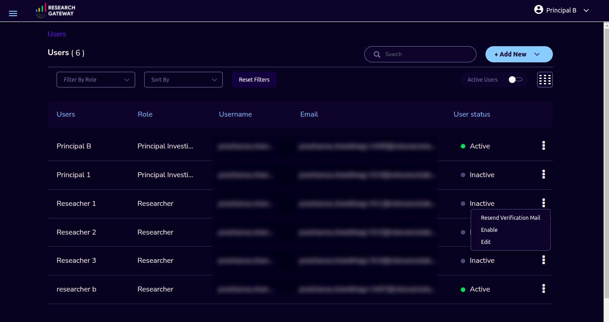

.. note:: The "Resend verification mail" option is available only if the user is inactive.

How to add researchers to existing project 
^^^^^^^^^^^^^^^^^^^^^^^^^^^^^^^^^^^^^^^^^^
There is an edit functionality for the project entity. The project is independent of the researcher. A user can create an empty project and add researchers later also. Click on “Manage (i.e., Pencil icon)” which is at the "Assigned researchers" field in the Project Details tab.

Select the Researchers and click on the “Update List” button. You can see the “Updated Successfully” toaster message in the UI and see events regarding update action in “Events ” tab  . You can’t unselect the researchers who have associated products.

 
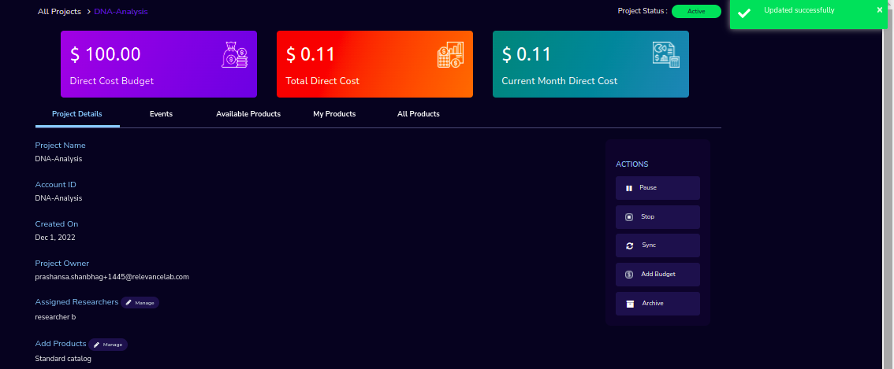

How to edit the catalog type 
^^^^^^^^^^^^^^^^^^^^^^^^^^^^

There is an edit functionality for the catalog type. You can create a project without selection of catalog type, once project is active you can see message "There are no Bring your own catalog type configured for this project" under "Add Products" field.

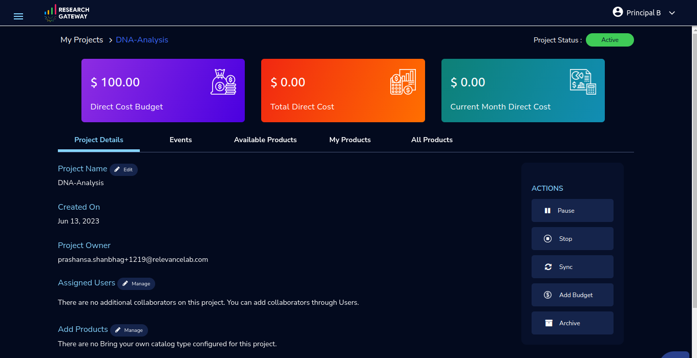

Once project is active, navigate to the project details tab and click on the “Manage (i.e., Pencil icon)” option which is at the **Add products** field in the Project Details tab. Once clicked on that, it will display the list. Select the option from the list and click on the "Update list" button.

.. note::

 a. While creating the project, if you select the "Standard Catalog" option it will create 7 products(Amazon Sagemaker, Amazon S3, Amazon EC2-Linux, Amazon EC2-Windows, RStudio, Cromwell Advanced and Nextflow Advanced). 
 b. If you select the "Bring all catalog items" option it will sync all the products which have the required launch permission in the portfolio of the AWS account.
 c. If you select the "Bring specific catalog items" option it will sync only the products which have the tag in the portfolio of the AWS account.

End of Day - Email report on  the running instances
^^^^^^^^^^^^^^^^^^^^^^^^^^^^^^^^^^^^^^^^^^^^^^^^^^^^

End of day shall be deemed to be 8PM based on the time-zone for each account. This should preferably be configurable at least at the instance level. 

Since Research Gateway supports multiple regions (and hence multiple time-zones), there is a need to only process those accounts which are currently at the end of day. RG currently supports seven regions only but could support more in the future. So the mechanism to determine EOD should be independent of which regions are supported. Based on this, the best option is to have a scheduled task that runs hourly in the scheduler component. This task can then determine if any of the supported regions are at  the end of the day.

You will receive a consolidated end of day - Email report(8PM IST) for all your projects with details. You will see the report for active products only.

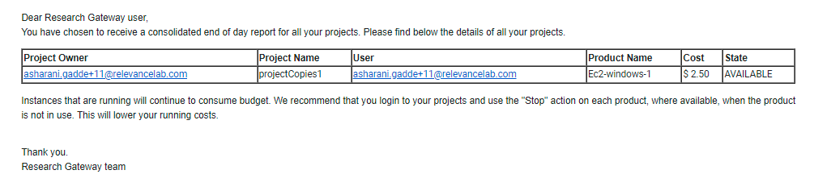

.. note::

 a. The active users(Principal Investigator and Researchers) will receive the EOD report if at least one instance is in running state.
 b. The Emails shall be sent only to verified users of Research Gateway.
 c. In the project events tab, you can see the EOD report generated information.

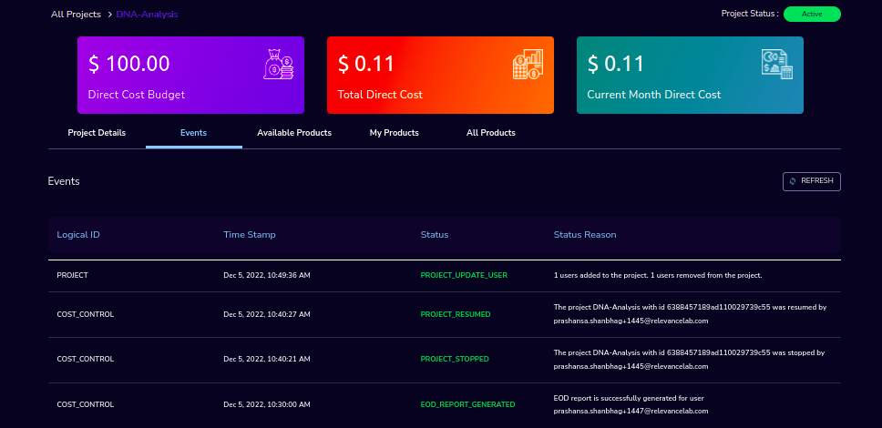

Actions on Projects
^^^^^^^^^^^^^^^^^^^

Once project is active, we can do Pause/Resume/Stop/Archive/Add Budget actions on a project.

**Pause Action**

The project status changed to “Paused”. All the researchers under this project would be affected. In a Paused state new provisioning is not allowed. Users can continue to use already provisioned resources as before. All the available products would be visible  but “Launch Now “ button would be hidden.

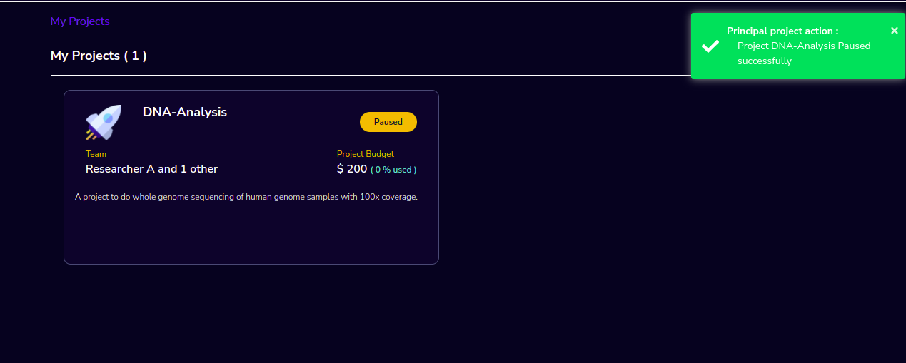

.. image:: images/pause2.png

**Resume Action** 

The project status changed  to “Active”. In the Active state, team-members can launch new products from the catalog of Available Products.

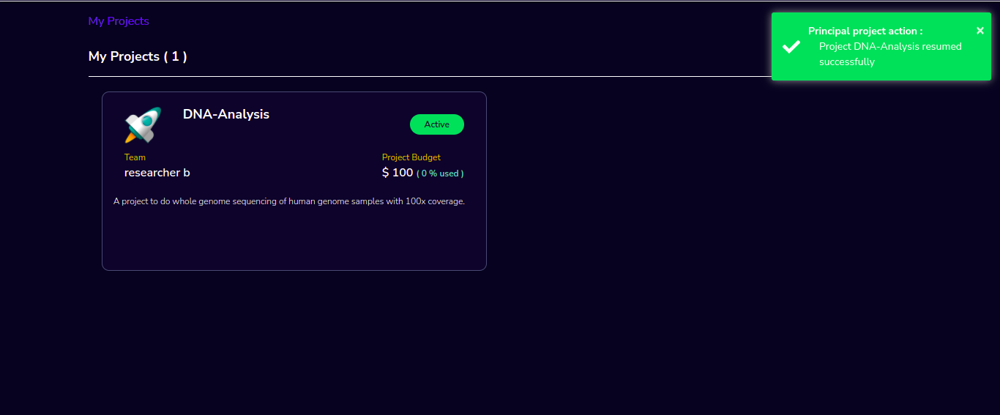

**Stop Action** 

The project status changed to “Stopped”. In a Stopped state all underlying resources will be stopped and the user will not be able to perform actions on them but you are able to terminate the product. You need to manually start the resources except the s3 product.

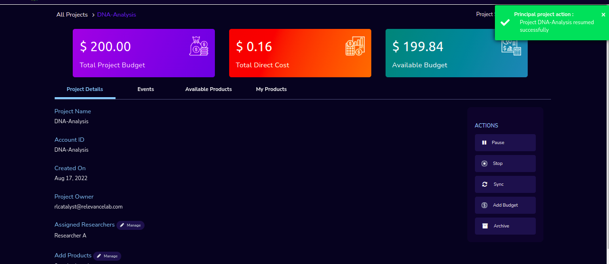

.. image:: images/stop2.png

.. image:: images/stop3.png

**Archive Action**

Click on the "Archive" button which is available on the right side, it was routed to my projects page and showed the message “Archiving project started” and later the project card got removed.

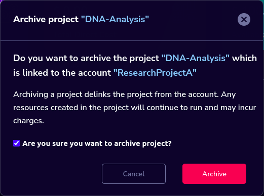

**Add Budget Action**

The “Add Budget” action will provide Principal Investigators a way to add more budget to the project . Clicking on the “Add Budget” button will bring up a dialog box where you can add any whole number greater than 0.

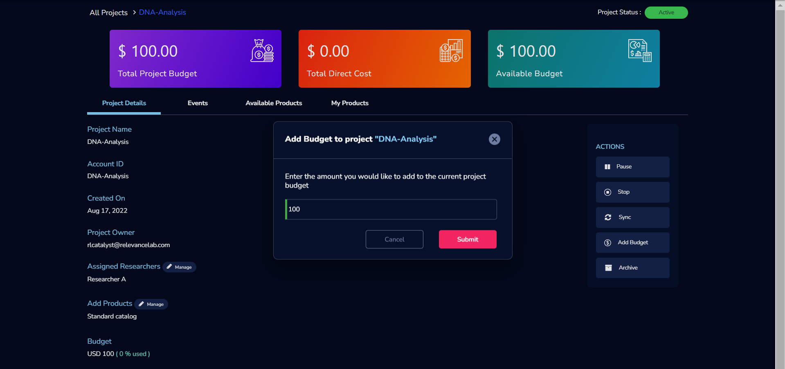

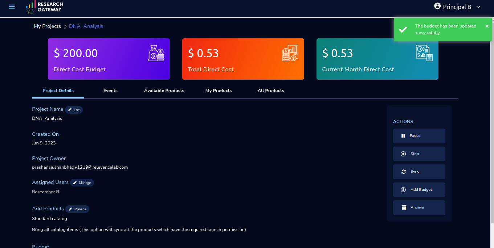

.. note:: 

  a. If there are any failed provisioned product in my products panel you cannot do actions on the project. You need to terminate that product.
  b. Once project is failed, We can do repair on a project. Click on the "Repair" button which is at the project details page. We can see related events in events page.
  c. Once project is failed we can do catalog sync on a project. Click on the "Sync" button which is at the project details page. We can see related events in events page.
  d. If the project is in  “Paused” or "Active"  state the Principal Investigator user can “Add Budget”. If the budget amount added, brings the project back within the budget threshold, the “Resume” button will be visible to the user. 
  e. If the project is no longer required, the Principal Investigator user can click on “Archive” button  which is on the project details page. We can see related events in the events page.

Budgets (for Principal Investigator)
^^^^^^^^^^^^^^^^^^^^^^^^^^^^^^^^^^^^^

As a Principal Investigator, you can view the organization-wide budgets from the **Budgets** screen with drill-down to the project, researcher and product level.

**Navigation to Budget screen**

Sign in as the Principal Investigator. Click on the “☰” Symbol which is available on left side header. Click on the "Budgets" menu item through this, you can navigate to the Budget Details page.  

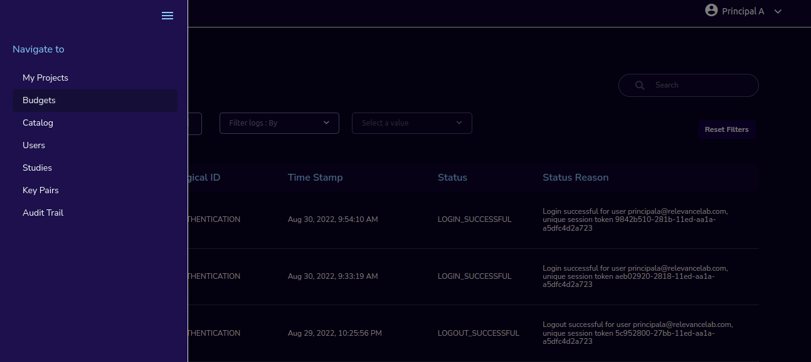

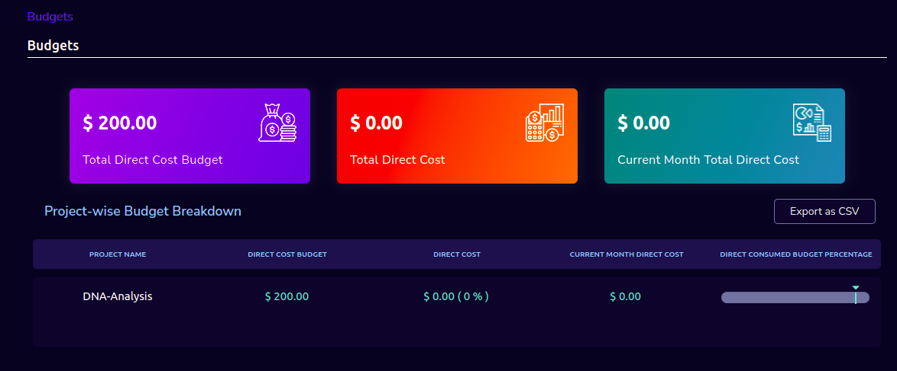

You can see budget details  with different KPI cards. You can see the following KPI cards:

  a. **Total Budget Alloted** : This is the budget allocated for the project during the creation of the project.

  b. **Total Direct Cost** : This is the budget consumed by all the researchers in the project.

  c. **Total Budget Available** : This is available budget for the project

You can see Project-wise Budget details in the table format:

.. csv-table::
   :file: BudgetTable2.csv
   :widths: 10, 15, 10, 10, 15
   :header-rows: 1
 
You can download the budget details through the “Export as CSV”  option.

.. note:: When Consumed Budget exceeds a threshold (say 80%), the budget management screen should show an alert in the UI and the user will also get an email notification.

 .. image:: images/budget6.png
 
You can see researcher budget details which are linked to particular products and you can see configured products information in Researcher-wise Budget details page

.. image:: images/Principal_Budgets_ResearcherWiseBudgetBreakdown.png

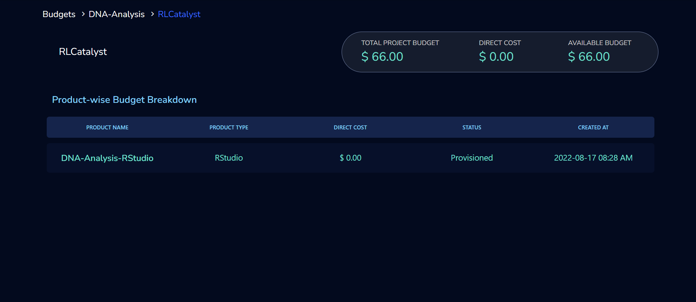

.. _Catalog_PI:

Catalog (for Principal Investigator)
^^^^^^^^^^^^^^^^^^^^^^^^^^^^^^^^^^^^

As a Principal Investigator, you can use the “Catalog” screen to view all catalog products across Research Gateway. Click on the “☰” option which is available on the left side header. You can see the  following details: 
   
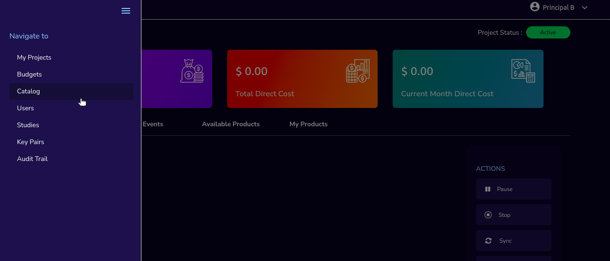

Click on the **Catalog** menu item to navigate to the Catalog screen.

.. image:: images/cat2.png

You can see the standard catalog products on the listing page. To assign a set of items to an Organizational Unit, select the items by checking the checkbox which is at the right corner of each product card. Then click the  "Assign selected to a project" button.

.. image:: images/sc2.png

You can view and update the products for the particular organization. Enable the checkbox which is at the right side of the product and click on “Update selected to  O.U '' button . After completion of updation you can see the successful toaster message.

.. image:: images/Principal_Catalog_UpdateToSelectedO.U.png

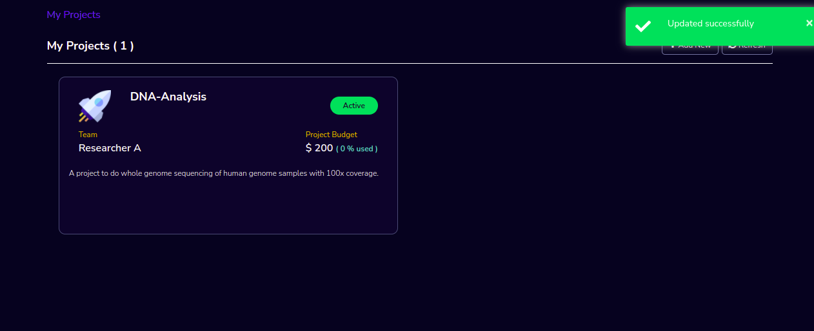

You can use the search field to search for a term in the product name and description of the product. You can also use the filter options as below :
  
 a. **All** : You can see all products here.

  .. image:: images/filter1.png
 
 b. **Research** :  You can see the products realted to compute and analytics here. Eg: Amazon EC2
 
   .. image:: images/Research.png

 c. **IT Application** : You can see application related products here.
 
   .. image:: images/ITApplications.png

If we could not find any products related to the filter you can see the message like “We could not find any products that matched your search”.

.. image:: images/search3.png

Key Pairs(for Principal Investigator)
^^^^^^^^^^^^^^^^^^^^^^^^^^^^^^^^^^^^^
The Key Pairs screen can be used by the Principal Investigator to view keypair details across projects. Click on “☰” Symbol which is available on the left side header. By clicking on the "Key Pairs" menu item, the user will be navigated to the Key Pairs details page.

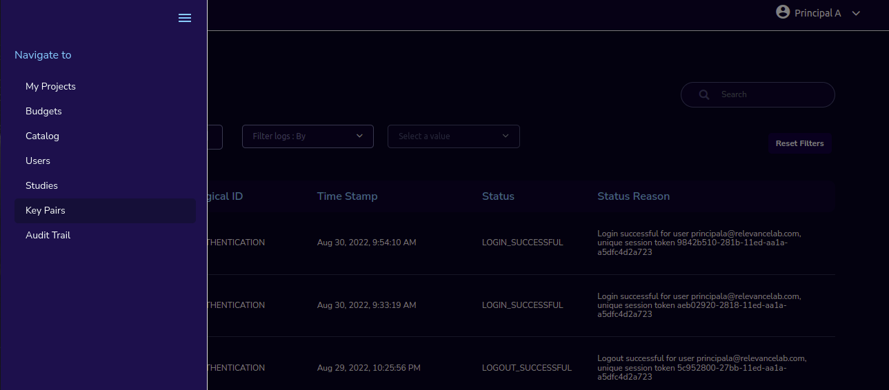
  
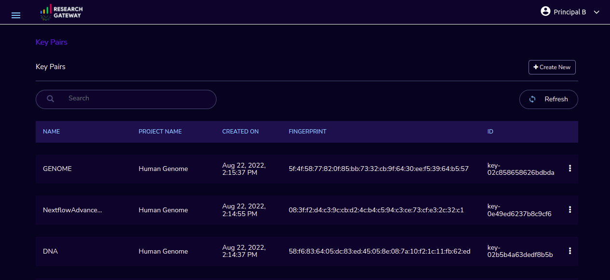

You can create new key pairs through our portal. The user will initiate the creation of a keypair and once it is created the user will download the private key. The download is allowed only once post which the screen only lists the keypair by name.
  
Click on the "+Create New" button which is available at right side of the page. Fill the deatils in the form and click on the “Create Key Pair” button. New Keypair was created successfully.

.. image:: images/key3.png

You can see key Pairs details in table format:

.. csv-table::
   :file: keypair.csv
   :widths: 20, 20, 20, 20, 20
   :header-rows: 1

The user can delete the keypair. Click the 3-dotted action on the right side of the table. You can see the delete keypair through the “Delete” action.

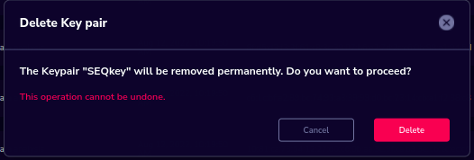

You can search the keypair through Keypair name and Project name.

Ex: Type “Chiron” in the search area it should display the keypairs which are attached to the Chiron project.

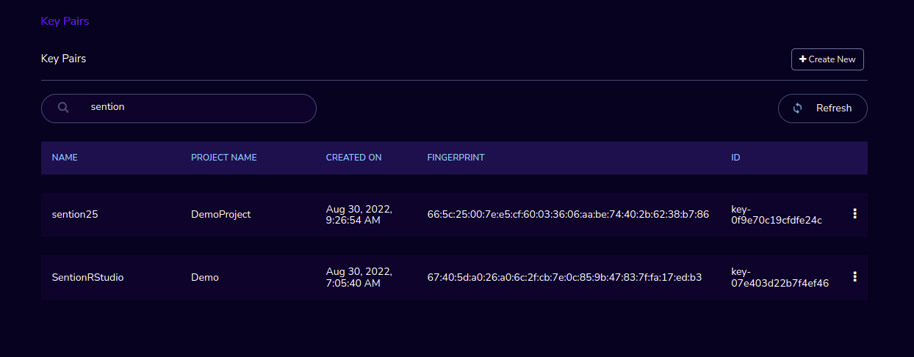

Studies(for Principal Investigator)
^^^^^^^^^^^^^^^^^^^^^^^^^^^^^^^^^^^^^
As a Principal Investigator, You can view the studies in the Research Gateway. Click on “☰” Symbol which is available on the left side header. By clicking on the "Studies" menu item, the user will be navigated to the studies details page.

The “Studies” landing page lists the datasets as cards. 

Each card shows the following data:

1. Name
2. Description
3. Tags
4. Bookmark this study.
5. View Details link(Clicking on the “View details” call-to-action on a study card will lead to a Study details page).

.. image:: images/studies1.png

The studies landing page should have a “Filter” feature that allows the user to filter the listing by predetermined criteria. You can see options like Public/Private/Bookmarked/All Studies.

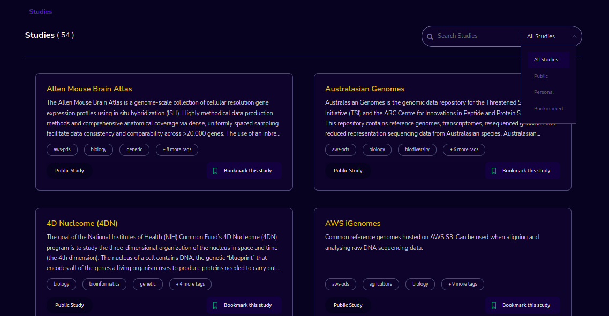

The studies landing page has a search bar that allows users to search the studies based on name and description.

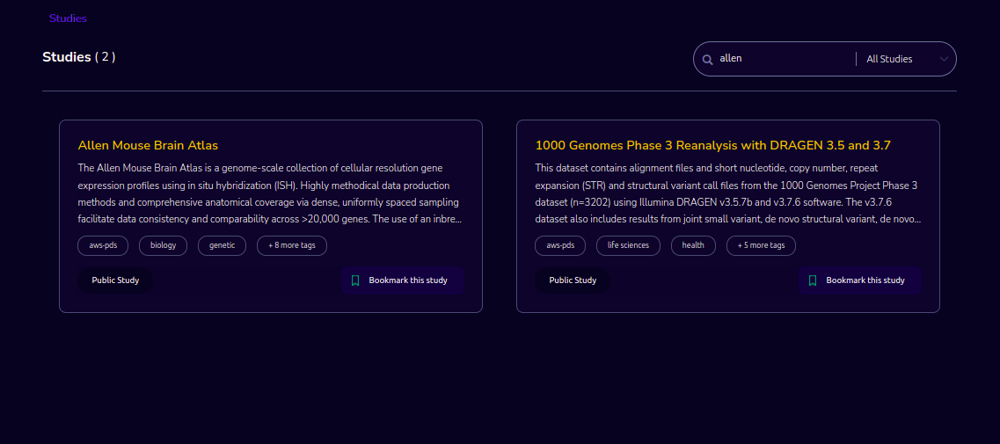

Public Study(for Principal Investigator)
----------------------------------------

.. image:: images/public.png

You can connect to Open Data like the AWS registry of open data. The “Study” details page will show a tabbed area with the following tabs:

	a. Study details : The “Study details” tab will show all the details of the study available in the collection. Actions associated with the study will be shown in an actions bar on the right side of the page.
	b. Resource details: The “Resource details” tab will show the details of the associated product (S3 bucket). This will replicate the product details page of the associated S3 bucket and show the same actions associated with the s3 bucket.
											
 .. image:: images/Principal_Studies_StudyDetails.png
  
**Explore Action**

You can see the files/folders which are  related to the datastore.

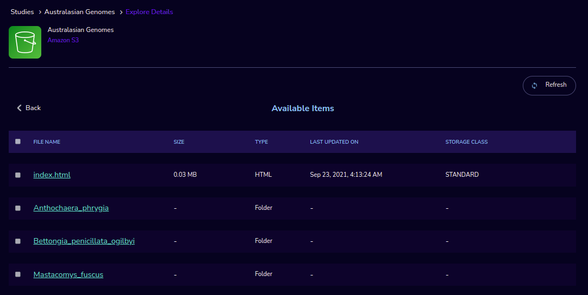

**Link/Unlink Action**

1. A user will be able to link a study to a compute resource using the “Link” action in the Actions bar. This action item should be a pop-up that will have the list (dropdown) of active sagemakers for that user.
2. You can see an icon similar to the shared icon for showing that this S3 bucket is linked with sagemaker.
3. You can link the study with multiple sagemaker notebooks.  Through the “unlink resource” you can unlink with compute resources
4. If there are no active sagemaker products we are showing the following message to the user **There is no provisioned Sagemaker product. Please Launch a sagemaker product from the available products page first, before linking to an s3 bucket**.
 
 .. image:: images/Principal_Studies_Linkaction_Available.png

 .. image:: images/Principal_Studies_UnlinkResource.png

 .. image:: images/Principal_Studies_UnlinkResource_Success.png
  
 .. image:: images/Principal_Studies_Link.png  

 
Audit Trail(For Principal Investigator)
^^^^^^^^^^^^^^^^^^^^^^^^^^^^^^^^^^^^^^^

As a Principal Investigator  you can use the Audit Trail screen to view security-related audits. Click on the “☰” option which is available on the left side header.

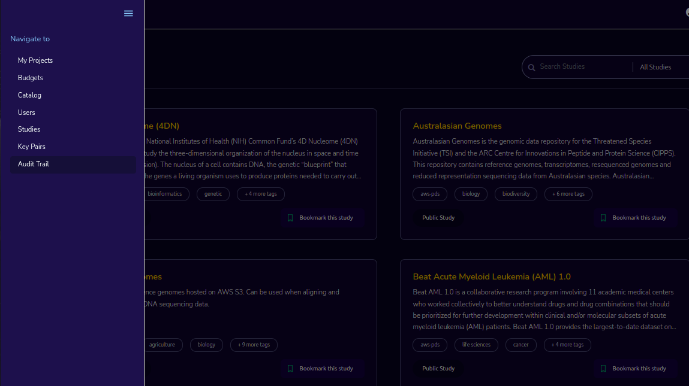

Click on the "Audit Trail" menu item. Through this, you can navigate to the Audit Trail page.

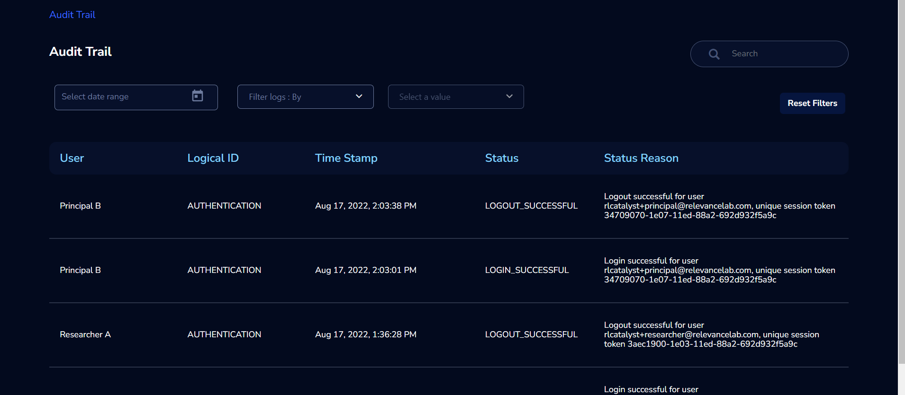

If you try to search the non-existent word it will display a message like “No matching organizations found”. You can see the login and logout and failed login audits. Here you can search based on user, status, and status reason. If audits are not found through the search you can see messages like “No matching audits found”.

.. image:: images/search2.png

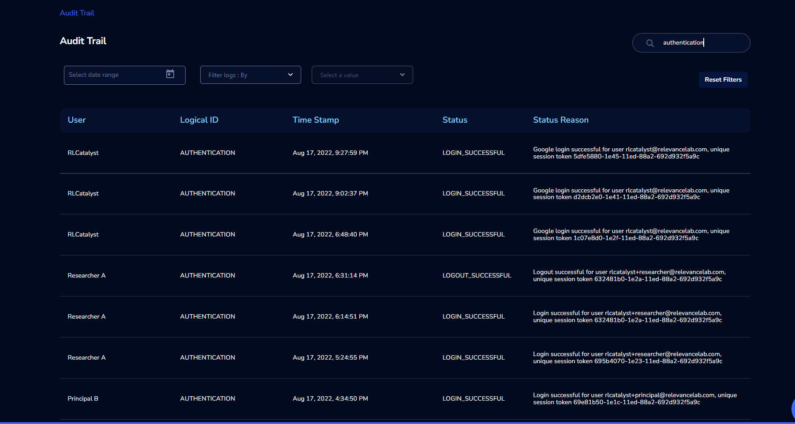

You can filter the logs by Principal Investigator, researcher, and Project which will show the details of your own O.U. . You can also filter the logs through the date. 

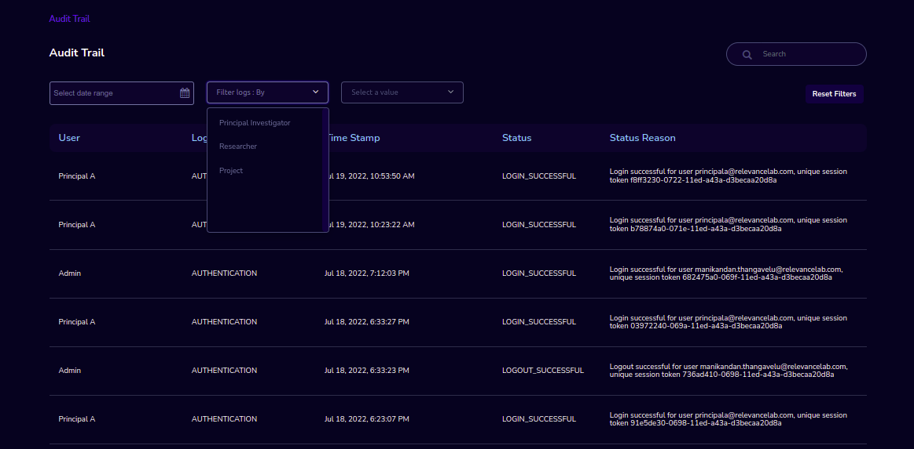

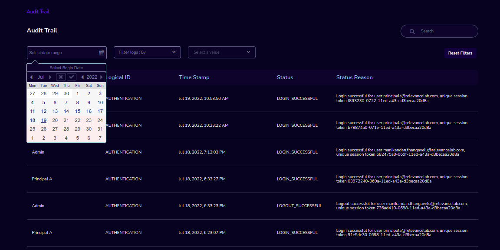

You can see the audit event details in the :ref:`Appendix F<Appendix F>` 

Researcher Features
+++++++++++++++++++

As a Researcher you can view all your projects when you login to Research Gateway. 

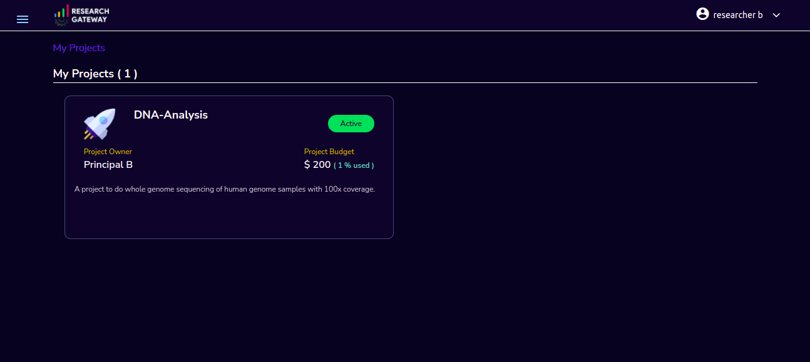
 
Researcher can view service catalog products available for the project. Click on a project card to navigate to the Project Details page. You can see KPI cards, available products and active products information in the project details page.

KPI Cards
^^^^^^^^^

You can see the following KPI cards:

a. Total Budget Alloted
b. Total Direct Cost
c. Total Budget Available

**Total Budget Alloted**

This is the budget allocated for the project during the creation of the project.

**Total Direct Cost**

This is the budget consumed by all the researchers in the project.

**Total Budget Available**

This budget is available by the researcher who is logged in for that project.

.. image:: images/kpi.png 

In project-wise budget details page, you can see below details in a table format

.. csv-table::
   :file: BudgetTable2.csv
   :widths: 10, 15, 10, 10, 55
   :header-rows: 1

In researcher-wise details budget page you can see the below details in a table format

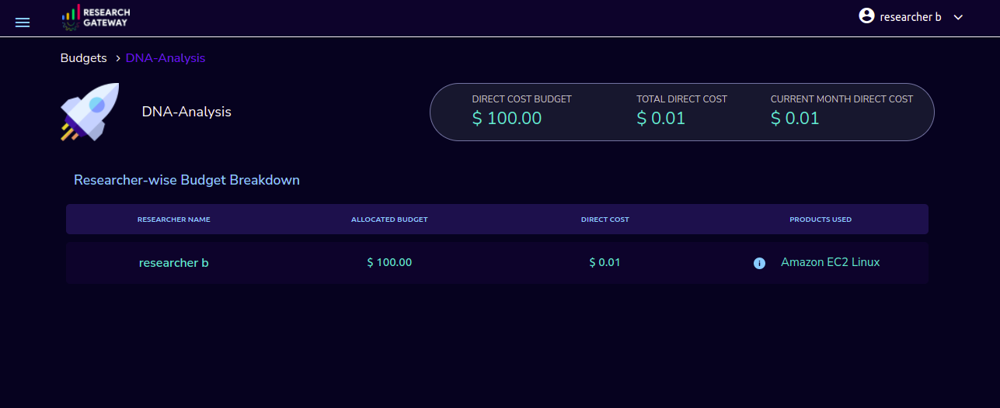

Available Products
^^^^^^^^^^^^^^^^^^

You can view the service catalog of products available for the project. These items will be organized into Portfolios. Clicking on a portfolio will display all the Products available in it.

.. image:: images/avaiableproduct.png

You can see the product information in the card. You can know more information about  the product through the “Know More” link. Through the “View Details” link you can see following :

a. **Available Products List view** - You can see the product details in list view.

b. **Available Products Card view** - You can see the product details in card view.

c. **Keyword search** - You can search products based on product type, product name and product description.

d. **Filter** - We have following filter options:
      
	  a. **All** - You can see the all products here.
	  b. **Research** - You can see the products realted to compute and analytics here. Eg: Amazon EC2
	  c. **IT Applications** - You can see the products related to storage and database here. Eg: Amazon RDS

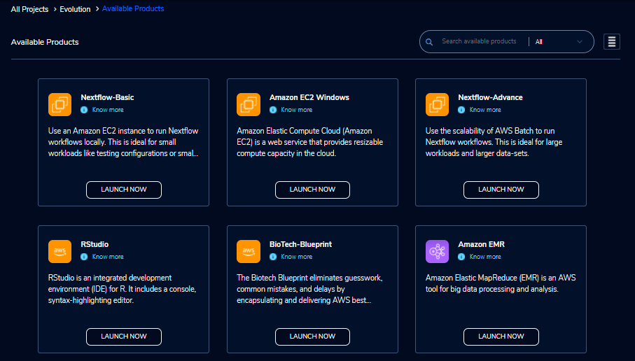

.. note:: Use details from :ref:`Appendix B<Appendix B>` for Standard Catalog Products.

**Secure connections to resources using ALB to RStudio and Nextflow-Advanced products**

1. Research Gateway can set up secure connections to your resources by putting them behind an Application Load Balancer with SSL connections using certificates managed by AWS Certificate Manager.
2. When creating an account if you select the “Use SSL with ALB” check box it will create ALB. An ALB will incur costs irrespective of traffic passing through it. 
   Note: Refer :ref:`Adding AWS Accounts <Adding AWS Accounts>` for account creation.
   
 .. image:: images/ssl-alb.png 
 
3. Once project creation is successful you can see the status about certificates and load balancer, target groups, listener, etc.. on the events page.
   Note: Refer :ref:`Adding a new project <Adding a new project>` for project creation.
4. Navigate to the available products panel and launch Nextflow-Advanced with required parameters. Once the product is provisioned you can see the outputs through the “View Outputs”. You can monitor the pipeline through “Monitor Pipeline”.

.. image:: images/actions-nf.png 

5. Navigate to the available products panel and launch RStudio with the required parameters. Once the product is provisioned you can connect to RStudio through the “Open link” action.
   
.. image:: images/actions-rstudio.png 

`Secure connections to resources using ALB and Amazon certificates video <https://www.youtube.com/watch?v=3MkouV33XJw>`_

Product Order
^^^^^^^^^^^^^

Log into the Research Gateway. Researchers can see the projects in All projects page. Click on a Project. Navigate to the **Available products** panel. Choose the product in the list by clicking the **Launch Now** button on the card.

Product order form is opened. Input parameters associated with the selected product will be displayed as a form at this point. Once all parameters are filled the user will be able to “Launch Now” the form and the item would then be added to the shopping cart.

.. image:: images/product.png 

.. note:: You can see VPC, subnets, security groups and keypair names are displaying in the listbox according to related field. Through this user can easily select the keypair and while provisioning the product and use the compute resources.

.. image:: images/product2.png 

Each product conveys the expected amount of time it takes to provision through this user knows how much time that provision will take. Listed keypairs are displayed under Key name Field in the form.
If you ordered an EC2 product you can see the toaster message like “Amazon EC2 ordered Successfully” and it will display an information message.

.. image:: images/allprojects.png

My Products
^^^^^^^^^^^

You can see the provisioned products details in the My Products Panel.

You can view provisioned product details like product name, product type, consumed budget and product status in the card. Choose one product in the panel and click on the card.

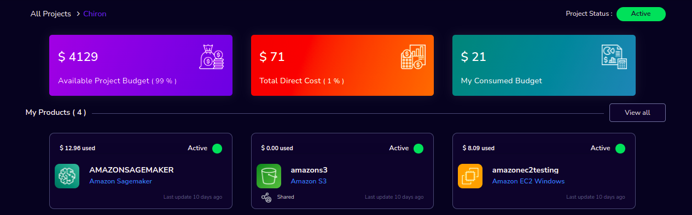

The Product details page will show a tabbed area with the following tabs:
   1. Product Details
   2. Events
   3. Outputs

The “Product details” tab will show all the details of the product available in the collection. The actions associated with the product will be shown in an actions bar on the right side of the page. The “Events” tab will show the event details of the associated product while creation. The "Outputs" tab will show the CFT output details.

.. image:: images/E2E.png

You can see provisioned product details through “View All” option. You can  see all product details.

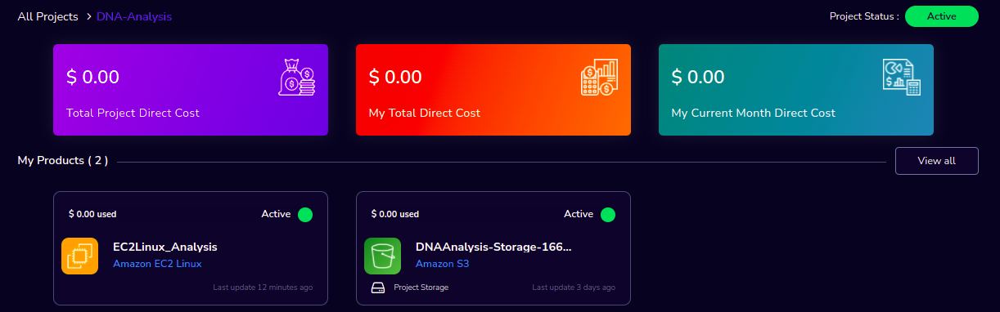

Through the “View All” button in the panel header, you can see following:

   * My Products List view - You can see the details of your provisioned products in list view

   * My Products Card view - You can see the details of your provisioned products in card view

   * Keyword search - You can search provisioned products based on product name, product type and description.
   
   * Filter - We have following filter options:
      
	  a. **All** - You can see the all(i.e., active,terminated,stopped and failed) products here.
	  b. **Active** - You can see all the active products here.
	  c. **Terminated** - You can see all terminated products here.

.. note::

 a. The products which are updated in the last 30 minutes will be visible under active filter.
 b. When the Researcher logs in, the user will be able to see the Active filter by default. And if the user selects a filter, the last chosen filter will be stored for the current session. Once the user logs-out and logs-in again the filter value will be reset to  Active.

.. image:: images/myproduct2.png

.. note:: When you on click on "View All" option you can see active products defaultly. 

While product is in the *Creating* state the details page displays a time limit that provision will take through the “Live in 5/10/15 mins” tag.

When you click any action(Start/Stop/Terminate) in a provisioned product, state should be changed automatically using server side events.

.. note:: On successful provision of a product when you click on any action immediately, if instances not created you can see a message "**The instance-id of the product is not available. Please try after some time**".

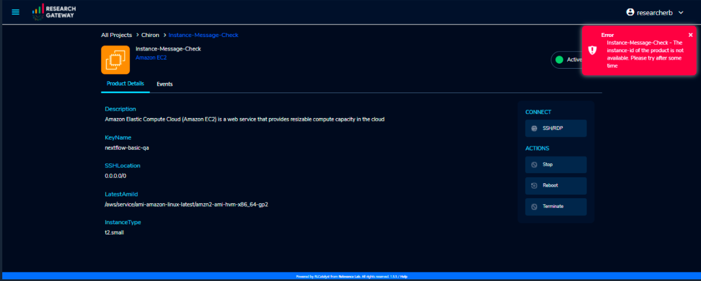

Actions available for products
^^^^^^^^^^^^^^^^^^^^^^^^^^^^^^^

EC2-Linux Product
----------------- 

Researchers can login to the portal and quickly order  EC2 products.
Find the Provisioned EC2 product i.e. EnvironmentalProtectionAgency in the My Products panel or click on the “View All” button to get a list of all provisioned products.
You can see product related actions in the  Actions menu.

1. Start/Stop action : You can start or stop the instance through “Start/Stop” action.

2. Instance Type action : You can change the instance type of the Instance in the stopped state.

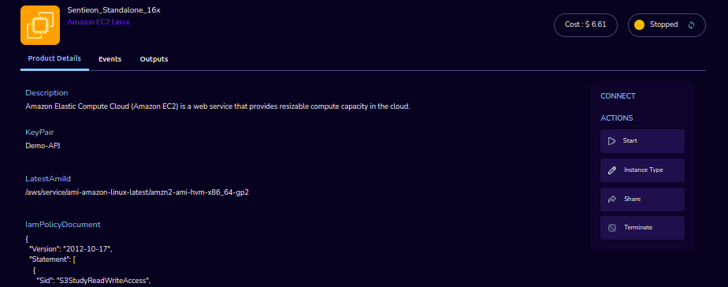

3. Share action : You can share the product to all the members in the project through “Share” action.If you share the product to project, you will have to share the PEM key file outside of Research Gateway.

4. Reboot action : You can reboot instances through  “Reboot” action.

5. Terminate action : You can terminate the product through “Terminate” action.

6. SSH/RDP action : You can connect to the instance in a new tab through "SSH" action.

7. Explore action: Through the Explore action you can see the shared files with 1-click. Note: If project storage is not mounted you can’t see the explore action in the product details page.

Fill the following details

.. list-table:: 
   :widths: 50, 50
   :header-rows: 1

   * - Attribute
     - Details
   * - Username
     - <Jump server user name>
   * - Authentication Type
     - <Choose password/Pem file>
   * - Upload Pem file
     - <Upload the pem file>

Click on the “Submit” button.

.. note:: If you pass empty parameter or wrong parameter in the username or pem file field you can see error message accordingly.

.. image:: images/E2E.png

.. image:: images/E2E2.png

EC2-Windows Product
-------------------

Researchers can login to the Research Gateway and quickly order Amazon EC2-Windows products.
Find the Provisioned Amazon EC2-Windows product in the My Products panel and click on it.
You can see the product related actions in the  Actions menu.

1. Start/Stop action : You can start or stop the instance through “Start/Stop” action.

2. Instance Type action : You can change the instance type of the Instance in the stopped state.

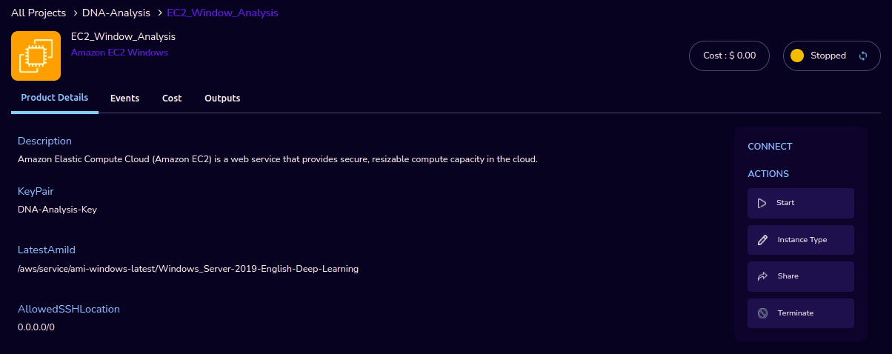

3. Share action : You can share the product to all the members in the project through “Share” action.If you share the product to project, you will have to share the PEM key file outside of Research Gateway.

4. Reboot action : You can reboot instances through  “Reboot” action.

5. Terminate action : Choose the "Terminate" option to de-provision the product.

6. SSH/RDP action : Choose the “RDP” action. Through this you can connect to the Remote Desktop in a new window.

Fill the following Details

.. list-table:: 
   :widths: 50, 50
   :header-rows: 1

   * - Attribute
     - Details
   * - Username
     - <Username>
   * - Authentication Type
     - <Choose Pem file>
   * - Upload Pem file
     - <Upload the pem file>
	 
Click on the “Submit” button. 

.. image:: images/RDP.png

.. note:: If you pass empty parameter or wrong parameter in the username or pem file field you can see error message accordingly.
 
It will navigated to the password generation page. Before the downloading the RDP file you should copy/save the password and unhide it and click on the “Download RDP file" button. 

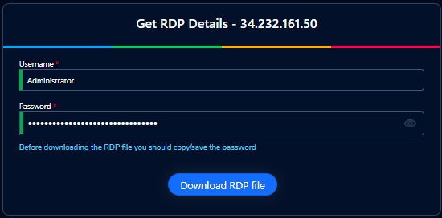

Once completed the download right-click on the file and choose the “Connect” option. Enter the username and password in a remote desktop connection window. 
Due to the nature of self-signed certificates, you might get a warning that the security certificate could not be authenticated. To verify that simply choose [Yes] in the Remote Desktop Connection window. You can connect to the remote desktop successfully.

.. note:: When we launch a new instance, password generation and encryption may take few minutes. We need to wait for 5-10 mins after the instance is created, if you upload any pem file before 10 mins, you can see a message like “**Password not available yet. Please wait at least 4 minutes after launching an instance before trying to retrieve the password**”

S3 Product
-----------

As a Researcher, you can login to the Research Gateway and quickly order S3 Product.
Find the S3 in the Active Products panel. Or click on the “View All” button to get a list of all provisioned products.
You can see product related actions in the  Actions menu.

**1. Upload Action**

Choose the “Upload” option. Through this you can upload a file to the S3 bucket.

.. note:: When you try to upload more than 10MB file you will see a message like **"The size of this file is larger than the maximum(10MB) size allowed on this system. Please contact your administrator."**

.. image:: images/testingevent2.png

**2. Share Action**

Choose the “Share” option. Through this you can  share the details to other team members.

.. note:: If there are no researchers in the list you will see a message like **“No researchers are available. Please add a new researcher to share the s3 bucket"**

.. image:: images/testingevent1.png

.. image:: images/testingevent3.png

.. image:: images/testingevent4.png

**3. Unshare Action**

Choose the "Unshare" option. Through this you can unshare the details from the earlier shared team member.  

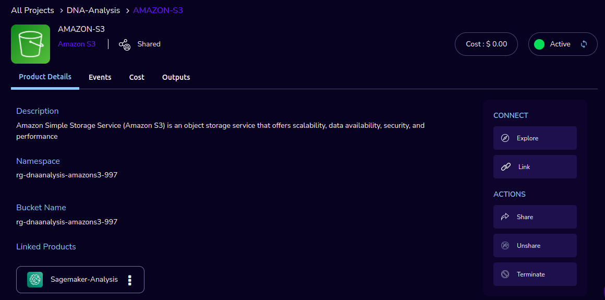

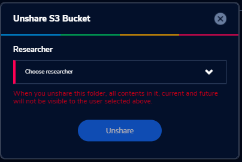

.. note:: The "Unshare" option is available only when the bucket is shared with other researchers. The owner(i.e.,person who provisioned product) can do the share and unshare. 

.. note:: If there are no researchers in the list you will see a message like **“No researchers are available. Please add a new researcher to share the s3 bucket.“**

**4. Terminate Action**

Choose the "Terminate" option to de-provision the product.

There is a check to find out whether the file exists in the bucket or not. If exists it will throw an error message **”The bucket is not empty. Please delete all contents from the bucket and try again.”**

.. image:: images/action.png

**5. Explore Action**

a. In the product details screen of the newly created S3 bucket, click the “Explore” action. Through this action you can see all the files and folders in the S3 bucket with actions (download, delete, Copy to clipboard) against each item.

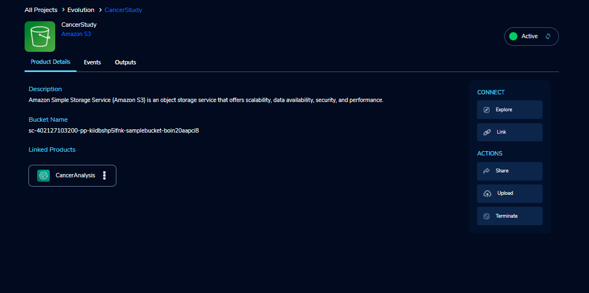
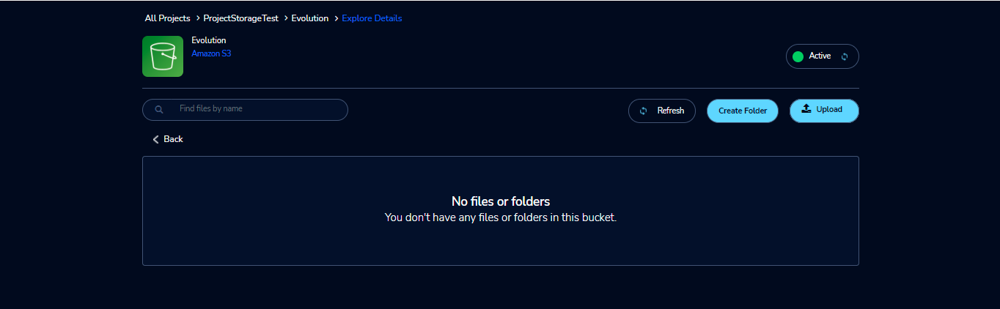

b. For folders the user will be able to double-click on the item and drill-down to a deeper level to see the files and folders in that level.
c. For any deeper level, the user will be able to navigate back to an upper level.
d. Click on the “Upload” action. Click on "Add files" to upload multiple files. The file size should not be greater than 5 GB. Click on "Add folder" to upload entire folder to S3. Click on the “submit” button and the file will be uploaded to the bucket. 

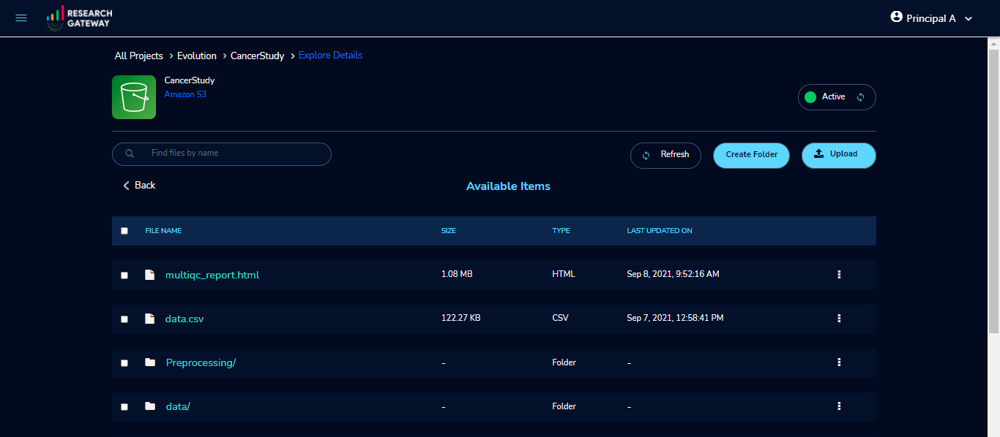
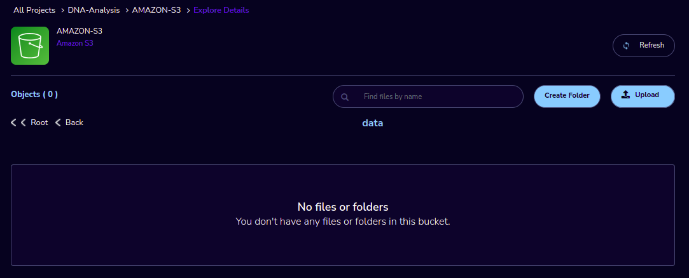

**6. Link Action**

You have to link Sagemaker from the S3 product details page using the provisioned product ID.
For a S3 Provisioned Product, you should have a new action item called “Link”

.. image:: images/linking.png 

This action item should be a pop up which will have the list (dropdown) of active sagemakers for that user.

.. image:: images/linking2.png

You should have an icon similar to the shared icon for showing that this S3 bucket is linked with sagemaker.
You should also see an “Unlink action” to unlink sagemakers from s3 bucket side. You are providing “Copy bucket name” action from sagemaker product side.

.. image:: images/event.png

.. image:: images/event2.png

If there are no active sagemaker products we are showing the following message to the user “There is no provisioned Sagemaker product. Please Launch a sagemaker product from the available products page first,before linking to an s3 bucket”.

.. image:: images/computerresource.png 

SageMaker Product
-----------------

Researcher can login to the portal and quickly order SageMaker product.
Find the Sagemaker product in the Active Products panel. Or click on the “View All” button to get a list of all provisioned products.
You can see product related actions in the  Actions menu.

1. Open Notebook : You can navigate to notebook through “Open Notebook“ action.

2. Start/Stop action : You can stop the instance through “Start/Stop” action. Based on the instance state, you will see either the Start or the Stop action.

3. Share action : You can share the product to all the members in the project through “Share” action.If you share the product to project, you will have to share the PEM key file outside of Research Gateway.

4. Terminate Action: You can terminate the product through “Terminate” action.

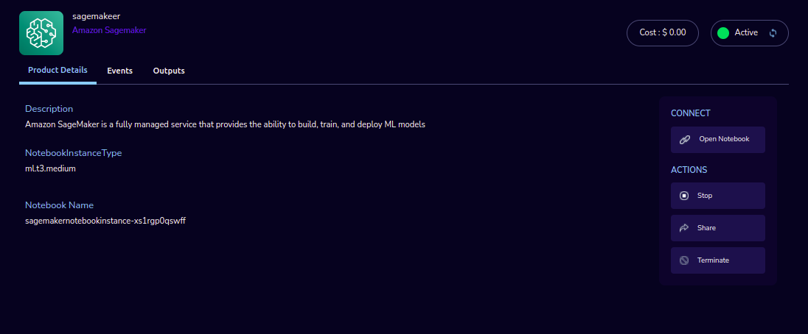

RStudio Product
---------------

Researcher can login to the portal and quickly order RStudio product. Find the RStudio product in the Active Products panel or click on the “View All” button to get a list of all provisioned products.
You can see product related actions in the  Actions menu.

1. Start/Stop action : You can start or stop the instance through “Start/Stop” action.

2. Instance Type action : You can change the instance type of the Instance in the stopped state.

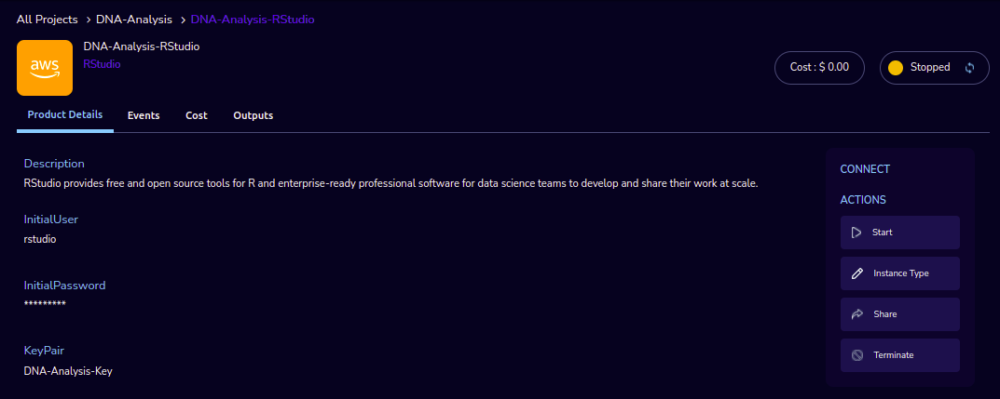

3. Share action : You can share the product to all the members in the project through “Share” action.If you share the product to project, you will have to share the PEM key file outside of Research Gateway.

4. Open link action :  Choose "Open Link" action. It will open RStudio application in a new browser tab. Enter the user name and password details in the form, through this you can connect to the application. 

5. Reboot action : You can reboot instances through  “Reboot” action.

6. Terminate action : Choose the "Terminate" option to de-provision the product.

7. SSH/RDP action : Choose the “SSH” action. Through this you can connect to the EC2 instance via SSH in a new browser tab.

8. Explore action: Through the Explore action you can see the shared files with 1-click. Note: If project storage is not mounted you can’t see the explore action in the product details page.

Fill the following Details

.. list-table:: 
   :widths: 50, 50
   :header-rows: 1

   * - Attribute
     - Details
   * - Username
     - <Username>
   * - Authentication Type
     - <Choose Pem file>
   * - Upload Pem file
     - <Upload the pem file>
	 
Click on the “Submit” button. Once completed the work, scroll to the top of the Terminal screen and click the “Terminate” button to end the session. Alternatively, type exit and hit enter in the terminal.

Nextflow Advanced Product
-------------------------

Researcher can login to the portal and quickly order Nextflow Advanced product. Find the Nextflow Advanced product in the Active Products panel or click on the “View All” button to get a list of all provisioned products.
You can see product related actions in the  Actions menu.

1. Start/Stop action : You can start or stop the instance through “Start/Stop” action.

2. Instance Type action : You can change the instance type of the Instance in the stopped state.

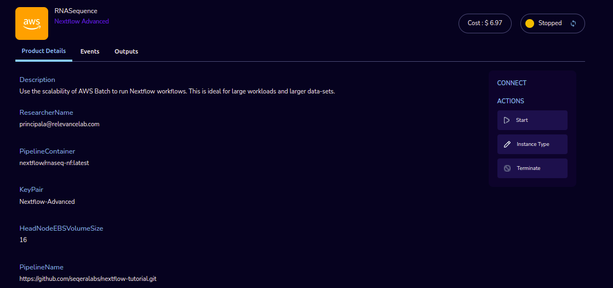

3. Share action : You can share the product to all the members in the project through “Share” action.If you share the product to project, you will have to share the PEM key file outside of Research Gateway.

4. Reboot action : You can reboot instances through  “Reboot” action.

5. Terminate action : Choose the "Terminate" option to de-provision the product.

6. SSH to Server action : Choose the “SSH” action. Through this you can connect to the EC2 instance via SSH in a new browser tab.

7. Monitor Pipeline action : Through this you can monitor the pipeline.

8. View Outputs action : Through this you can see the outputs.  

9. Explore action: Through the Explore action you can see the shared files with 1-click. Note: If project storage is not mounted you can’t see the explore action in the product details page.

Fill the following Details 

.. list-table:: 
   :widths: 50, 50
   :header-rows: 1

   * - Attribute
     - Details
   * - Username
     - <Username>
   * - Authentication Type
     - <Choose Pem file>
   * - Upload Pem file
     - <Upload the pem file>
	 
Click on the “Submit” button. Once completed the work, scroll to the top of the Terminal screen and click the “Terminate” button to end the session. Alternatively, type exit and hit enter in the terminal.

Cromwell Advanced Product
-------------------------

Researcher can login to the portal and quickly order Cromwell Advanced product. Find the Cromwell Advanced product in the Active Products panel or click on the “View All” button to get a list of all provisioned products.
You can see product related actions in the  Actions menu.

1. Start/Stop action : You can start or stop the instance through “Start/Stop” action.

2. Instance Type action : You can change the instance type of the Instance in the stopped state.

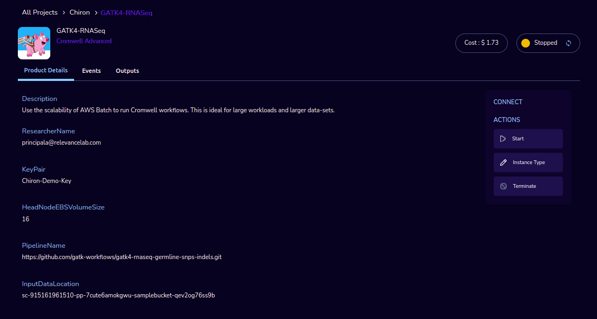

3. Share action : You can share the product to all the members in the project through “Share” action.If you share the product to project, you will have to share the PEM key file outside of Research Gateway.

4. Reboot action : You can reboot instances through  “Reboot” action.

5. Terminate action : Choose the "Terminate" option to de-provision the product.

6. SSH/RDP action : Choose the “SSH” action. Through this you can connect to the EC2 instance via SSH in a new browser tab.

7. View Outputs action : Through this you can see the outputs.  

Fill the following Details 

.. list-table:: 
   :widths: 50, 50
   :header-rows: 1

   * - Attribute
     - Details
   * - Username
     - <Username>
   * - Authentication Type
     - <Choose Pem file>
   * - Upload Pem file
     - <Upload the pem file>
	 
Click on the “Submit” button. Once completed the work, scroll to the top of the Terminal screen and click the “Terminate” button to end the session. Alternatively, type exit and hit enter in the terminal.

Docker on Amazon EC2 Linux product
----------------------------------

Researchers can login to the portal and quickly order  Docker on Amazon EC2 Linux product.
Find the Provisioned Docker on Amazon EC2  Linux product i.e. EnvironmentalProtectionAgency in the My Products panel or click on the “View All” button to get a list of all provisioned products.
You can see product related actions in the  Actions menu.

1. Start/Stop action : You can start or stop the instance through “Start/Stop” action.

2. Instance Type action : You can change the instance type of the Instance in the stopped state.

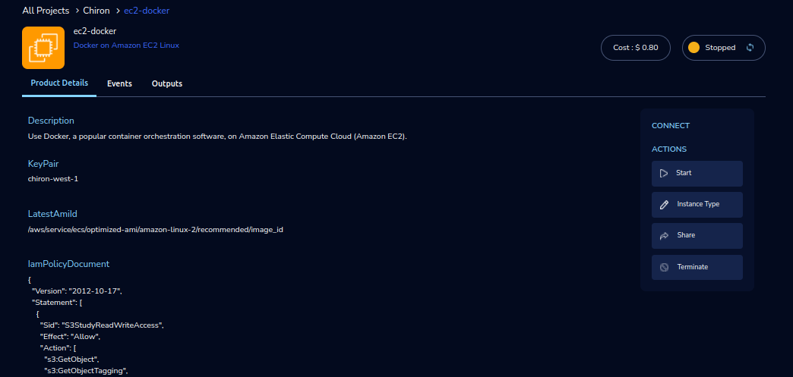

3. Share action : You can share the product to all the members in the project through “Share” action.If you share the product to project, you will have to share the PEM key file outside of Research Gateway.

4. Reboot action : You can reboot instances through  “Reboot” action.

5. Terminate action : You can terminate the product through “Terminate” action.

6. SSH/RDP action : You can connect to the instance in a new tab through "SSH" action.

7. Explore action: Through the Explore action you can see the shared files with 1-click. Note: If project storage is not mounted you can’t see the explore action in the product details page.

Fill the following details

.. list-table:: 
   :widths: 50, 50
   :header-rows: 1

   * - Attribute
     - Details
   * - Username
     - <Jump server user name>
   * - Authentication Type
     - <Choose password/Pem file>
   * - Upload Pem file
     - <Upload the pem file>

Click on the “Submit” button.

.. note:: If you pass empty parameter or wrong parameter in the username or pem file field you can see error message accordingly.

MySQL Product
-------------

Researchers can login to the portal and quickly order MySQL product.
Find the Provisioned MySQL product i.e. EnvironmentalProtectionAgency in the My Products panel or click on the “View All” button to get a list of all provisioned products.
You can see product related actions in the  Actions menu.

1. Start/Stop action : You can start or stop the instance through “Start/Stop” action.

2. Instance Type action : You can change the instance type of the Instance in the stopped state.

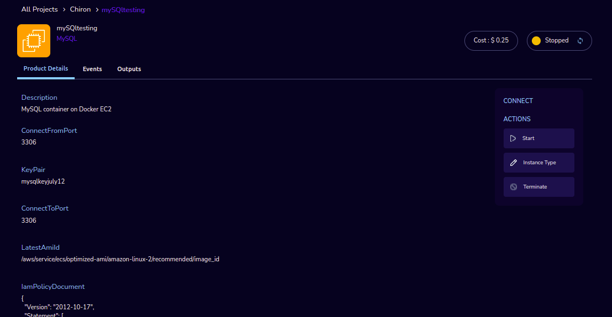

3. Share action : You can share the product to all the members in the project through “Share” action.If you share the product to project, you will have to share the PEM key file outside of Research Gateway.

4. Reboot action : You can reboot instances through  “Reboot” action.

5. Terminate action : You can terminate the product through “Terminate” action.

6. SSH/RDP action : You can connect to the instance in a new tab through "SSH" action.

7. Explore action: Through the Explore action you can see the shared files with 1-click. Note: If project storage is not mounted you can’t see the explore action in the product details page.

Fill the following details

.. list-table:: 
   :widths: 50, 50
   :header-rows: 1

   * - Attribute
     - Details
   * - Username
     - <Jump server user name>
   * - Authentication Type
     - <Choose password/Pem file>
   * - Upload Pem file
     - <Upload the pem file>

Click on the “Submit” button.

.. note:: If you pass empty parameter or wrong parameter in the username or pem file field you can see error message accordingly.

PCluster Product
----------------

Researchers can login to the Research Gateway and quickly order PCluster products. 
Find the Provisioned PCluster product in the My Products panel and click on it. 
You can see the product related actions in the Actions Menu.

1. Start/Stop action : You can start or stop the instance through “Start/Stop” action.

2. Share action: You can share the product  with all the members in the Project through “Share” action.If you share the product to project, you will have to share the PEM key file outside of Research Gateway.

3. Reboot action : You can reboot instances through “Reboot” action.

4. Terminate action : Choose the “Terminate” option to de-provision the product.

5. SSH Terminal action : Choose the “SSH Terminal” action. Through this you can connect to the SSH Terminal in a new window.

6. Remote Desktop : Choose the "Remote Desktop" action. The cluster head-node by default has NICE DCV installed which allows you to connect to the head-node via a GUI interface. This is especially useful to visualize results of the jobs that you run on the cluster (e.g. using Paraview to view the results of OpenFOAM jobs).

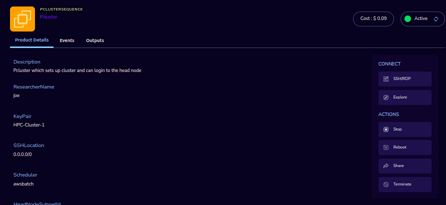

Fill the following details

.. list-table:: 
   :widths: 50, 50
   :header-rows: 1

   * - Attribute
     - Details
   * - Username
     - <Jump server user name>
   * - Authentication Type
     - <Choose password/Pem file>
   * - Upload Pem file
     - <Upload the pem file>

Click on the “Submit” button.

.. note:: If you pass an empty parameter or wrong parameter in the username or pem file field you may see an error message accordingly.

Click on the “Submit” button. Once completed the work, scroll to the top of the Terminal screen and click the “Terminate” button to end the session. Alternatively, type exit and hit enter in the terminal.

Budgets (for Researcher)
^^^^^^^^^^^^^^^^^^^^^^^^
As a researcher you can use the **Budgets** screen to view your individual budget consumption across projects. You can see budget details with different KPI cards. You can see the following KPI cards:

**Navigation to Budget screen**

Login as the Researcher. Click on “☰” Symbol which is available on the left side header. By clicking on the "Budgets" menu item, the user will be navigated to the Budget details page.

 .. image:: images/bud1.png 
  
You can see budget details with different KPI cards. You can see the following KPI cards :

1. **Total Budget Allotted** : This is the budget allocated for the project during the creation of the project.
2. **Consumed Budget** : This is the budget consumed by all the researchers in the project.
3. **Available Budget** : This is the available budget for the project.

 
 .. image:: images/bud2.png 
 
You can see Project-wise Budget details in the table format:

.. csv-table::
   :file: BudgetTable2.csv
   :widths: 20, 20, 20, 20, 20
   :header-rows: 1

You can see configured Researcher-wise budget details which are linked to a particular project.

 .. image:: images/Researcherbudget.png

You can also see configures Product-wise budget details which are linker to a particular Researcher.

 .. image:: images/ResearcherProductwisebudget.png

Studies (For Researcher)
^^^^^^^^^^^^^^^^^^^^^^^^
In the research field, the ability to use data stores or "Studies" is key. A researcher may have his own data ("My Study"), or a Principal may create a data-store that is shared across researchers in the same project (Project Studies) or the researcher may connect to Open Data like the AWS registry of open data.

.. image:: images/studies.png

A researcher persona will have a menu item that leads to the “Studies” landing page. The “Studies” landing page lists the datasets as cards. 

Each card shows the following data:

1. Name
2. Description
3. Tags
4. Bookmark this study.
5. View Details link(Clicking on the “View details” call-to-action on a study card will lead to a Study details page).

.. image:: images/studies1.png

The studies landing page should have a “Filter” feature that allows the user to filter the listing by predetermined criteria. You can see options like Public/Private/Bookmarked/All Studies.

The studies landing page has a search bar that allows users to search the collection. (search will be dynamic).

Personal Study
--------------
A researcher may have his own data or a Principal may create a data-store that is shared across researchers in the same project through the “Share” option. The “Study” details page will show a tabbed area with the following tabs:
   1. Study details
   2. Product details

The “Study details” tab will show all the details of the study available in the collection. The actions associated with the study will be shown in an actions bar on the right side of the page. The “Product details” tab will show the details of the associated product (S3 bucket). This will replicate the product details page of the associated S3 bucket and show the same actions associated with the s3 bucket.

 .. image:: images/personal.png
 
 .. image:: images/sc4.png

**Explore Action**
 
Through this action, you can see all the files and folders in the S3 bucket with actions (download, delete) against each item.
  a. For folders, the user will be able to double-click on the item and drill-down to a deeper level to see the files and folders in that level.
  b. For any deeper level, the user will be able to navigate back to an upper level.
  c. You can upload the different files (The file should not contain more than 10MB).
  
 .. image:: images/ex1.png
 
**Link/Unlink Action**
 
1. A user can link a study to a compute resource using the “Link” action in the Actions bar. This action item should be a 
   p-up that will have the list (dropdown) of active sagemakers for that user.
2. You will see an icon similar to the shared icon for showing that this S3 bucket is linked with sagemaker.
3. You can link the study with multiple sagemaker notebooks.  Through the “unlink resource” you can unlink with compute resources
4. If there are no active sagemaker products we are showing the following message to the user **There is no provisioned Sagemaker product. Please Launch a sagemaker 
   product from the available products page first, before linking to an s3 bucket**.

 .. image:: images/link1.png  
 
 .. image:: images/unlink.png

 .. image:: images/unlink2.png
 
**Share Action**
 
Choose the option like “Share”. Through this, you can share the details with other team members. If there are no researchers in the list it will show a message like “No researchers are available. Please add a new researcher to share the s3 bucket “

 .. image:: images/share1.png
 
 .. image:: images/share3.png
 
**Terminate Action**

You can terminate the study through the “Terminate” option.

 .. image:: images/ter1.png

Public Study
------------

 .. image:: images/public.png

You can connect to Open Data like the AWS registry of open data. The “Study” details page will show a tabbed area with the following tabs:

	a. Study details : The “Study details” tab will show all the details of the study available in the collection. Actions associated with the study will be shown in an actions bar on the right side of the page.
	b. Resource details: The “Resource details” tab will show the details of the associated product (S3 bucket). This will replicate the product details page of the associated S3 bucket and show the same actions associated with the s3 bucket.
											
 .. image:: images/sc3.png
  
**Explore Action**

You can see the files/folders which are  related to the datastore.

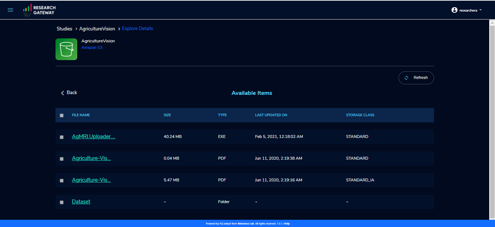

**Link/Unlink Action**

1. A user will be able to link a study to a compute resource using the “Link” action in the Actions bar. This action item should be a pop-up that will have the list (dropdown) of active sagemakers for that user.
2. You can see an icon similar to the shared icon for showing that this S3 bucket is linked with sagemaker.
3. You can link the study with multiple sagemaker notebooks.  Through the “unlink resource” you can unlink with compute resources
4. If there are no active sagemaker products we are showing the following message to the user **There is no provisioned Sagemaker product. Please Launch a sagemaker product from the available products page first, before linking to an s3 bucket**.
 
 .. image:: images/link2.png
 
 .. image:: images/unlink.png
 
 .. image:: images/unlink2.png
  
 .. image:: images/link1.png  
 

Key Pairs (For Researcher)
^^^^^^^^^^^^^^^^^^^^^^^^^^
The Key Pairs screen can be used by the Researcher to view keypair details across projects. Click on “☰” Symbol which is available on the left side header. By clicking on the "Key Pairs" menu item, the user will be navigated to the Key Pairs details page.

 .. image:: images/Researcherkey1.png

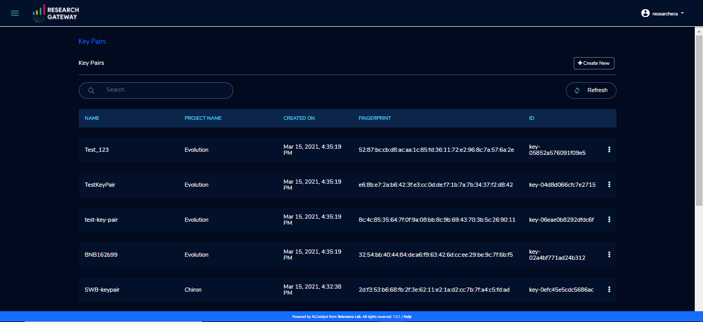

You can create new key pairs through our portal. The user will initiate the creation of a keypair and once it is created the user will download the private key. The download is allowed only once post which the screen only lists the keypair by name.
  
Click on the "+Create New" button which is available at right side of the page. Fill the deatils in the form and click on the “Create Key Pair” button. New Keypair was created successfully.

.. image:: images/key3.png

You can see key Pairs details in table format:

.. csv-table::
   :file: keypair.csv
   :widths: 20, 20, 20, 20, 20
   :header-rows: 1

The user can delete the keypair. Click the 3-dotted action on the right side of the table. You can see the delete keypair through the “Delete” action.

.. image:: images/deletionkeypair.png

You can search the keypair through Keypair name and Project name.

Ex: Type “Chiron” in the search area it should display the keypairs which are attached to the Chiron project.

.. image:: images/se1.png

Instance-wide Features
++++++++++++++++++++++

SAML Integration using OKTA as an example
^^^^^^^^^^^^^^^^^^^^^^^^^^^^^^^^^^^^^^^^^^
SAML stands for Security Assertion Markup Language, an open standard that passes authorization credentials from identity providers (IdPs) to service providers (SPs). SAML is the link between the authentication of a user’s identity and the authorization to use a service. It’s the language that helps IdPs and SPs communicate. 

Within the SAML workflow, OKTA can act as both the IdP and SP. When a user requests access to a third-party application registered with OKTA, they are redirected to the OKTA dashboard. SAML is most frequently used to enable single sign-on (SSO), which authenticates accredited users between an identity provider and a service provider.

As an example, We can do it with OKTA. You can follow the below SAML integration steps with OKTA.

Configuration steps for Research Gateway application in OKTA
------------------------------------------------------------

1. Sign in to your OKTA tenant as an administrator.
2. In the Admin Console, navigate to **Applications-->Applications**.
3. Click on the “**Add Application**” button.
4. Click on the “**Create New App**”  button.
5. In the Create a New Application dialog
	a. Select platform as “Web”.
	b. Select SAML 2.0 in the Sign-on method section.
	c. Click on the “**Create**” button.
6. On the General Settings tab, enter an application name for your integration and upload a logo and click on the “**Next**” button. 
7. On the Configure SAML tab, configure the following things.
    a. In the Single Sign-on URL, enter the Assertion Consumer Service (ACS) URL
	b. Enter the Audience URI into the Audience URI (SP Entity ID) field.
	c. Choose the Name ID format and application username that must be sent to your application in the SAML response.
	d. In the **Attribute Statements** section, enter the SAML attributes to be shared with your application. 
	
       .. image:: images/statement1.png	

   e. For Group Attribute Statement follow the below things. 
   
       .. image:: images/statement2.png

8. Click the “**Next**” button.
9. Fill the Feedback form and click on the “**Finish**” button.

Research Gateway supports integration with Identity Providers that support SAML 2.0. If you need your instance of the gateway integrated with your IdP please contact us.	

Research Gateway as SaaS solution on AWS Marketplace
^^^^^^^^^^^^^^^^^^^^^^^^^^^^^^^^^^^^^^^^^^^^^^^^^^^^
Research Gateway is available as a software as a service (SaaS) solution on AWS Marketplace as a SaaS Contract on Monthly or Annual basis. Customers can choose to auto-renew their contacts on expiry.

SaaS Subscription Steps
-----------------------
The below steps that will be done for publishing our product as Saas in the AWS marketplace.

**a. User Subscription**

When our product has been listed for consumption in the AWS marketplace, customers can subscribe to our product.

1. Log in to AWS account with valid credentials. Navigate to AWS Marketplace.
2. Type “RLCatalyst” in the search bar. You can see the result as **RLCatalyst Research Gateway(Saas)**. 

    a. Show the pricing information(Small/Medium/Large). 
	b. Show option of Monthly or Annual. 
	c. Show option of Auto-renewal (Yes/No).
	
 Click on the **Continue on Subscribe** button which is available at the top right side of the page. Fill the required parameters like contract options and renewal settings. Now click on the “Create contract” button. Click on “Pay Now” button. After completion of payment options, the user will be redirected to the RG registration website.
 
**b. Registration page**

After subscribing to the product, the customer is directed to a website we create and manage as a part of our SaaS product to register their account and configure the product. When creating our product, we provide a URL to our registration landing page. AWS Marketplace 
uses that URL to redirect customers to our registration landing page after they subscribe. On our software's registration URL, we collect whatever information is required to create an account for the customer. After successful registration, we will be notifying the customer 
when the product is available for them to consume with a login URL and admin credentials.

**c. Create a new instance of the portal**

When a new customer signs up for our product, we will be creating a new instance of our product and host it in a different environment for 
the customer. An URL will be created for the new environment which they will be shared with the customer. Once a new environment 
is created, we will seed admin credentials to the database and the same will be shared with the customer along with the URL created in the previous step.

1. Login to the Research Gateway  with the new password. Navigate to the Provider settings and click on the “+Add New” button ---Fill the required parameters and click on the “Add” button.
2. Navigate to the “Users” through the left navigation menu.
3. Click on the “+Add New” button in the users listing page. A new user form opened. Fill the required parameters and click on the “Add User” button. A new user with PI role was created.
4. Navigate to “Users” through the left navigation menu. Click on the “+Add New” button in the users listing page. A new user form opened. Fill the required parameters and click on the “Add User” button. A new user with a researcher role was created.
   .. note:: Assign the researcher to the organization while .
5. Navigate to “My Organization” through the left navigation menu . Users can create a new organization with the “+Add New” button on the landing page.
6. Navigate to catalog through the left navigation menu . In the filter select the “View -Standard catalog “  option and enable the checkboxes which are available at the right side of the products and click on the “Assign to selected O.U” button. Select the organization in the list box and click on the “Assign” button.
7. Login to PI account<<Create a new project with the “+Add New” button on the landing page.
   .. note:: You need to select the researcher from the list.
8. Navigate to the catalog through the left navigation menu and choose the  “View-O.U catalog” in the filter and enable the checkboxes which are at the right side of the products and click on “Assign to a project” button and on Successful completion of assign you can see green color toaster message.
9. Login as Researcher <<Navigate to the project details page--you can see the assigned catalog products in the available products panel. 
   Choose the product and click on the **Launch Now** button. Fill the required parameters in the form and launch it. 
   .. note:: While creating the EC2 we need to enter the key pair name.  Navigate to the keypairs through the left navigation menu. Click on the “+Create New” button. Fill the required parameters and click on the “Create key pair” button. New key pair was created. Now navigate to the available products panel. Choose EC2 product and fill the params and click on the “Launch Now” button. The product was launched successfully.

**d. Tracking usage**

When the product is live for the customer to use, we have to track the usage of the customer based on the pricing model they chose while subscribing to our product and the dimension they are consuming. For software as a service (SaaS) subscriptions, we meter for all usage, and then customers are billed by AWS based on the metering records that we provide. For SaaS contracts, we only make sure that the customer is not using the product beyond the contract’s entitlements.

Securely managing multiple AWS accounts with Cross-Account IAM-Roles
^^^^^^^^^^^^^^^^^^^^^^^^^^^^^^^^^^^^^^^^^^^^^^^^^^^^^^^^^^^^^^^^^^^^

You can use AWS Identity and Access Management (IAM) roles to grant access to resources in your AWS account, another AWS account you own, or a third-party account. We are taking your credentials and creating the roles that’s why we want your IAMFull access/Administrator Access. 

Role Creation Process in Research Gateway
-----------------------------------------

1. While adding the settings once you provide the credentials, we will verify the credentials and give the required access.
2. Later we created the role and attached the required policy and this was created by Research Gateway.
3. We shouldn’t use your credentials in any other place.

Role usage
----------
Whenever the call is made to your AWS account we assume the created role and get the temporary credentials and proceed with the action.

