Features
========

.. contents::

---------------------------------

Administrator Features
++++++++++++++++++++++

An Administrator user can perform the following actions.

  * :ref:`Add an Organizational Unit<Adding Organizational Units>`
  * :ref:`Add AWS Accounts for projects<Adding AWS Accounts>`
  * View `Budgets`_
  * View the `Audit Trail`_
  * Add or Assign `Users`_
  * Assign `Catalog`_ Items

If the administrator logs in for the first time, you can see the welcome screen. Click on the "Let's get Started" button it will navigate to the "Add Account" screen. Use details from :ref:`Appendix A<Appendix A>`  to create an account. Once account creation is successful it will navigate to the "Create Organization" screen.

.. _Budgets:

Budgets
^^^^^^^
As an Administrator, you can view the organization-wide budgets from the **Budgets** screen with a drill-down to the project, researcher and product level.

**Navigation to the Budget**

Login as the Administrator user. Click on the “☰” option which is available on the top-left side. Click on the **Budgets** menu item to navigate to the Budgets page.

 
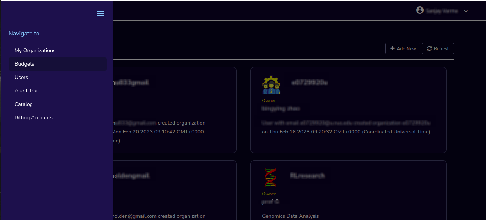

**Budget KPIs**

At the top of this view, you can see the summary of budgets across all organizational units in the KPI cards.
You can see the following KPI cards:

  * **Total Budget Allotted**: This is the sum total of the budget allocated for all projects in the Organization.
  * **Total Direct Cost**: This is the budget consumed by all Organizations.
  * **Total Budget Available**: This is the portion of the allotted budget that is not yet consumed.

.. image:: images/Admin_Budgets_Organization-WiseBudgetBreakdown.png

**Organization-wise budget view**

The Administrator user can view organization-specific budget details by clicking on a specific organization in the available list. 

The following details are visible in a table format:

.. csv-table::
   :file: BudgetTable.csv
   :widths: 10, 15, 10, 10, 55
   :header-rows: 1

The Administrator user can download the Budget details through the “Export as CSV” option. 

When the Consumed Budget exceeds a threshold (say 80%), the budget management screen should show an alert in the UI and the user will also get an email notification.

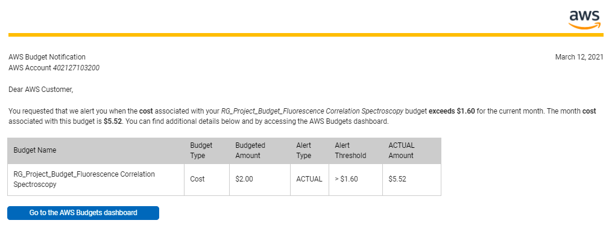

**Project-wise budget view**

The Administrator user can view project-specific budget details by clicking on a specific project in the available list. 

The following details are visible in a table format:

.. csv-table::
   :file: BudgetTable2.csv
   :widths: 10, 15, 10, 10, 15
   :header-rows: 1
   
   
.. image:: images/Admin_Budgets_Project-WiseBudgetBreakdown.png

**Researcher-wise budget view**

You can also see researcher-wise budget details which are linked to a particular project and you can see configured product details on the product-wise budget details page.
 
.. image:: images/Admin_Budgets_Researcher-WiseBudgetBreakdown.png

.. _`Cost_allocation`:

Cost allocation tags activation
-------------------------------

1. Login to your AWS account.
2. Note that if your account is a child account under a master account, these actions will have to be done in the Master account.
3. In the services search bar at the top, type "Billing", then click on the search result which says "Billing".
4. In the Billing screen, click on "Cost Allocation tags" in the left-hand panel.

.. image:: images/Billing_CostAllocationTagsActivation.png

5. Approve the following tags: project_name, researcher_name and cost_resource. Once completion of this step, the tags are activated.

Users
^^^^^
As an Administrator, you can use the "Users" screen to view all users across Research Gateway. Click on the “☰” option which is available on the left side header.
   
Click on the **Users** menu item to navigate to the Users page.

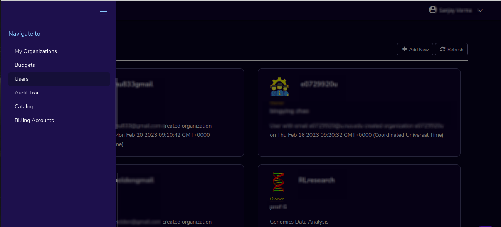

.. image:: images/Admin_Users_DefaultPage.png

You can see the users in card view or table view. Click on the “≣”  button which is on the right side of the screen.
  
  
.. image:: images/Admin_Users_DefaultPage_TableView.png

There is a search option which is beside the “+Add New” button. You can search based on users, usernames, and Email IDs. 

.. image:: images/Administrator_Users_Search.png

If the results are not matched with the searched item it will show a message like “No matching users found”.

.. image:: images/Admin_User_SearchAction_NoMatchingUserFound.png

You can filter by O.U, Filter by role(Admin/Researcher/Principal Investigator), and sort by username(Asc/Desc), user-role(Asc/Desc), and creation date(Asc/Desc).

.. image:: images/Administrator_Users_FilterbyRole.png
.. image:: images/Administrator_Users_FilterByOU_filter.png
.. image:: images/Administrator_Users_SortBy.png

The user can see an active filter with enable and disable options. You can toggle the view between active or all users.

.. image:: images/Admin_Users_Active_Toggle.png

.. _`Adding Users`:

You can add a new user through the “+Add New” button which is on the right side of the screen. 

.. image:: images/Admin_Users_addnewuserDropdown.png

1. Click on the "Add New User" button to add a single user via the “Add User” form.

Fill in the following details 

.. list-table:: 
   :widths: 90, 90 
   :header-rows: 1

   * - Field
     - Details
   * - Email 
     - <Enter an Email ID>
   * - Role
     - <Select a role in the drop-down list>
   * - First Name
     - <Please enter the first name of the user>
   * - Last Name
     - <Please enter the last name of the user> 
   * - Organizational Unit
     - <Select an organizational unit in the drop-down list>
   * - Tags
     - <Add tags to associate with the user>

.. note:: 

 Users can add the tags based on following  
  a. Users can add a maximum of 5 tags. Or A user may add up to five tags.
  b. Each tag should have a minimum of 3 characters and a maximum of 32.
  c. Users cannot duplicate tags for one user.
  d. Each tag can include:
    a. Alphabetic characters(a-z , A-Z)
    b. Numerical characters(0-9)
    c. Special characters( @ - + . -)
 

Click on the “Add User” button. On successful completion of user creation, you can see the green color toaster message. We are not allowing duplication of Email id and username while new user creation.

.. image:: images/Admin_Users_AddNewUserForm.png

The verification email has been sent. Check the verification email delivered to the registered email address and click on the verification link to activate the account. 

.. image:: images/User_NewUser_VerificationEmail.png

.. note:: The verification email will be sent from **"no-reply@verificationemail.com"**. If you don't get the link please check the spam folder.

Users can choose a password and click on the “Submit” button. 

.. note::

 The password policy should meet the following requirement :
   a. The minimum password length of 8 characters and a maximum of 16 characters.
   b. It should have at least one lowercase character(a-z).
   c. It should have at least one upper case character(A-Z).
   d. It should have at least one number(0-9).
   e. It should have at least one special character(= + - ^ $ * . [ ] { } ( ) ? ! @ # % & / , > < ' : ; | _ ~ ` ).
   
On successful validation, users will be allowed to login to the Research Gateway.

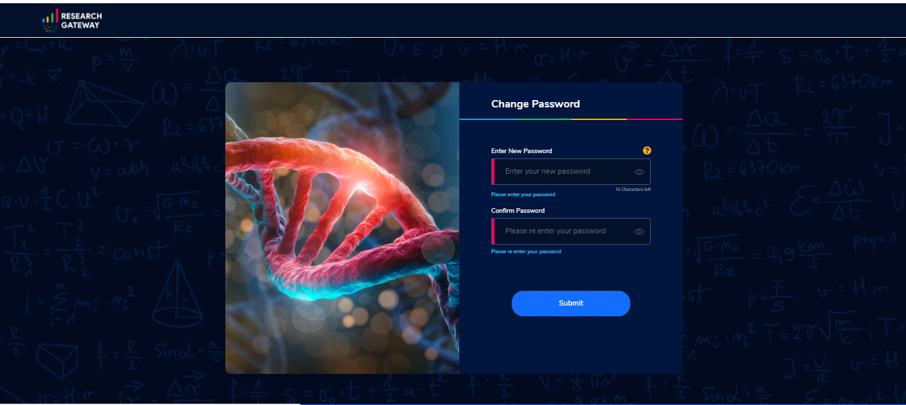

2. Click on "Download CSV format" to download a sample CSV file that provides all the appropriate columns.

3. Click on "Import Users via CSV" to add multiple users via CSV file.

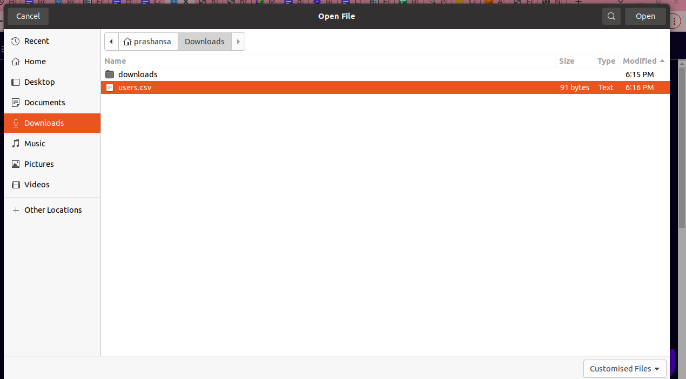

CSV file should contain the following details

.. list-table:: 
   :widths: 90, 90 
   :header-rows: 1

   * - Field
     - Details
   * - email 
     - <Enter an Email ID>
   * - first_name
     - <Please enter the first name of the user>
   * - last_name
     - <Please enter the last name of the user>
   * - role
     - <Add role for the user>
   * - userTags
     - <Add tags for the user>

.. note:: 

 a. If the user role is other than valid values (0 = Researcher, 1 = Principal Investigator, 2 = Administrator ), it will be automatically reset to 0  (researcher) and the user will be created with the role of researcher.

 b. Users will see a red-colored toaster with a failure message if they have added invalid headers, more than the permitted number of user records in a single CSV file, or not even one user record.

 c. we can edit the tag for the user using the edit user action and Import Users via CSV action by adding the same user Email.
 
The new user creation process will begin when the user clicks the "Open" button and a green toaster message will appear. When importing users in bulk, user creation may take some time. The green toaster message does not imply the successful creation of all users. Please check the audit trail to see if any user creation failed.

The verification email has been sent. Check the verification email delivered to the registered email address and click on the verification link to activate the account. 

.. image:: images/User_NewUser_VerificationEmail.png

.. note:: The verification email will be sent from **"no-reply@verificationemail.com"**. If you don't get the link please check the spam folder.

Users can choose a password and click on the “Submit” button. 

.. note::

 The password policy should meet the following requirement :
   a. The minimum password length of 8 characters and a maximum of 16 characters.
   b. It should have at least one lowercase character(a-z).
   c. It should have at least one upper case character(A-Z).
   d. It should have at least one number(0-9).
   e. It should have at least one special character(= + - ^ $ * . [ ] { } ( ) ? ! @ # % & / , > < ' : ; | _ ~ ` ).
   
On successful validation, users will be allowed to login to the Research Gateway.

You can perform the following user actions 

**Assign O.U.**

There is a contextual menu which is at the right side of the card. On clicking that, you can see the actions that can be performed. Choose the organizational unit in the drop-down list and click on the “Assign” button. You can see a successful toaster message also. Once assigned you can see O.U's name under the Email id. 

.. image:: images/Admin_Users_AssignO.U.png

.. image:: images/Admin_Users_AssignO.U_PopUp.png 

**Enable**

There is a contextual menu which is at the right side of the card. On clicking that, you can see the actions that can be performed. When clicking on the enable action you can see the message "A user, once enabled, will be able to log in to the system and carry out activities according to his role. Are you sure you want to proceed?"  in the pop-up with the “Enable” button.

.. image:: images/Admin_Users_EnableAction_PopUp.png 

**Disable**

There is a contextual menu which is at the right side of the card. On clicking that, you can see the actions that can be performed. When clicking on the disable action you can see a message like "A user, once disabled, will no longer be able to login to the system. Are you sure you want to proceed? in the pop-up with the “Disable” button.

.. image:: images/Admin_Users_DisableAction_PopUp.png 

**Resend verification mail**

There is a contextual menu which is at the right side of the card. On clicking that, you can see the actions that can be performed. Through the "Resend verification mail" option you can get another verification email to the registered email address. On successful completion, you can see the green color toaster message. Check the verification email delivered to the registered email address and click on the verification link to activate the account.  

.. image:: images/Admin_Users_ResendVerificationEmail.png

.. note:: The "Resend verification mail" option is available only if the user is inactive.

**Edit**

There is a contextual menu which is at the right side of the card. On clicking that, you can see the actions that can be performed. Through the "Edit" option you can edit User Information. On successful completion, you can see the green color toaster message. 

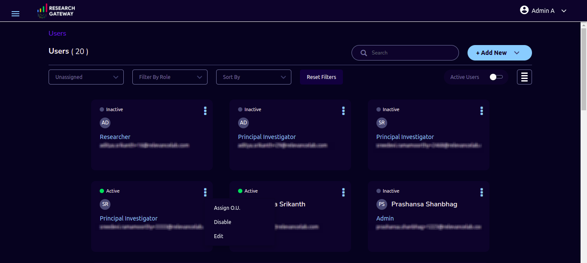

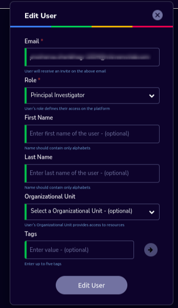

The following details are editable

.. list-table::  
   :widths: 90, 90  
   :header-rows: 1 

   * - Field 
     - Details 
   * - First Name 
     - <Please enter the first name of the user> 
   * - Last Name 
     - <Please enter the last name of the user>  
   * - Organizational Unit 
     - <Select an organizational unit in the drop-down list> 
   * - Tags 
     - <Add tags to associate with the user> 

.. note:: 
   a. If the user is unassigned, the Organizational unit field will be enabled and can be assigned to OU. 
   b. If the user is already assigned Organization unit field will be disabled. 
   c. Only if any of the First Name, Last Name, Organizational Unit and tags fields are edited Edit User Button will be enabled. 

Click on the Edit User button and edited user information will be visible on the user card. Once the user clicks on the Edit User button they will be able to see a green color toaster message. 

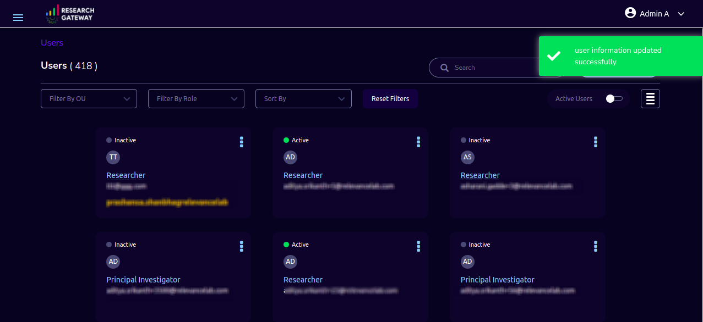

Audit Trail
^^^^^^^^^^^

As an Administrator, you can use the **Audit Trail** screen to view security-related audits. Click on the “☰” option which is available on the left side header.
   
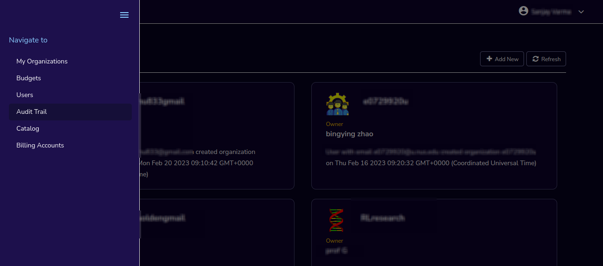

Click on the **Audit Trail** menu item. Through this, you can navigate to the Audit Trail page.

.. image:: images/Admin_AuditTrail_DefaultPage.png

You can see the audit event details in the :ref:`Appendix D<Appendix D>` 
   
If you try to search the non-existent word it will display a message like “No matching organizations found". You can see the login and logout and failed login audits. Here you can search based on user, status, and status reason. If audits are not found through the search you can see messages like “No matching audits found”.

.. image:: images/Admin_AuditTrail_SearchAction_NoMatchingAuditLogsFound.png

.. image:: images/Admin_AuditTrail_LoginFailedRecords.png

You can filter the logs by admin, Principal Investigator, researcher, Organization, and Project. You can also filter the logs through the date. 

.. image:: images/Admin_AuditTrail_FilterLogsBy.png

.. image:: images/Admin_AuditTrail_SelectDateRange.png

.. _Catalog:

Catalog
^^^^^^^
As an Administrator, you can use the “Catalog” screen to view all catalog products across Research Gateway. Click on the “☰” option which is available on the left side header. 
   
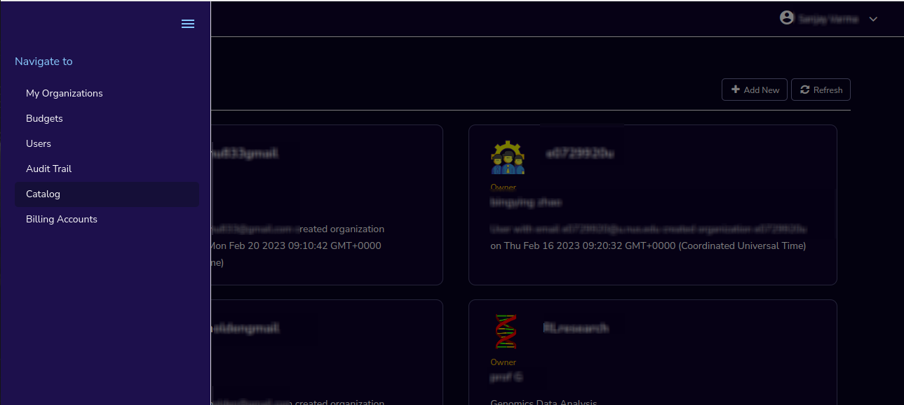

Click on the "Catalog" menu item. Through this, you can navigate to the Catalog details page.

.. image:: images/Admin_Catalog_DefaultPage.png

You can see the standard catalog products on the listing page and you can enable the checkbox which is at the right side of the product and assign it to a particular  O.U through the “Assign selected to O.U” button.

.. image:: images/Admin_Catalog_ProductCheckboxEnabled_AssignSelectedToOU.png

.. image:: images/Admin_Catalog_AssignToOU_PopUp.png

You can view and update the products for the particular organization. Enable the checkbox which is on the right side of the product and click on the “Update selected to  O.U" button. After the completion of the updation, you can see the successful toaster message.

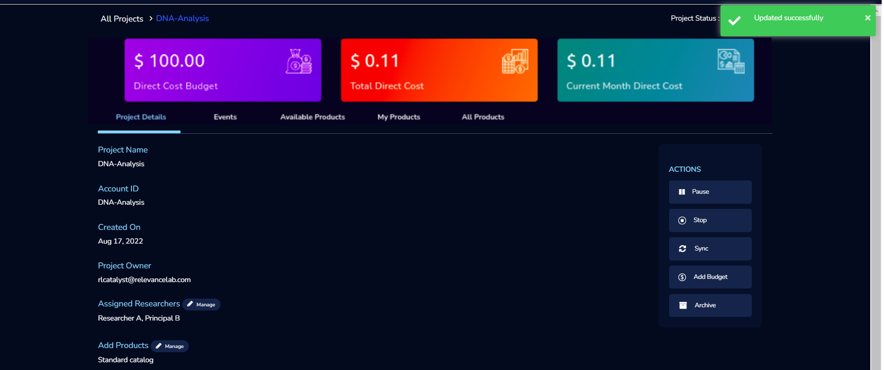

.. image:: images/Admin_Catalog_UpdateToSelectedO.U_ToasterMessage.png

You can search for the product name and descriptions of the product. We have the following filter options:
 
  a. **All**: You can see all products here.

  .. image:: images/Admin_Catalog_AllFilter_DropDown.png

  b. **Research**: You can see the products related to computing and analytics here. Eg: Amazon EC2.

   .. image:: images/Admin_Catalog_ResearchFilter_DropDown.png

  c. **IT Applications**: You can see application-related products here.

 .. image:: images/Admin_Catalog_ITApplicationsFilter_DropDown.png

If we could not find any products related to the filter you can see a message like “We could not find any products that matched your search”.

.. image:: images/Admin_Catalog_SearchAction_NoMatchingProductsFound.png

.. note:: Use details from :ref:`Appendix B<Appendix B>` for Standard Catalog products.

Billing Accounts
^^^^^^^^^^^^^^^^^

As an administrator, you will be able to view monthly billing data at the Organization Unit level for all the Organizations.  

**Navigation to the Billing Accounts** 

Log in as the Administrator user. Click on the "☰" option which is available on the top-left side. Click on the Billing Accounts menu item to navigate to the Billing Accounts page.  

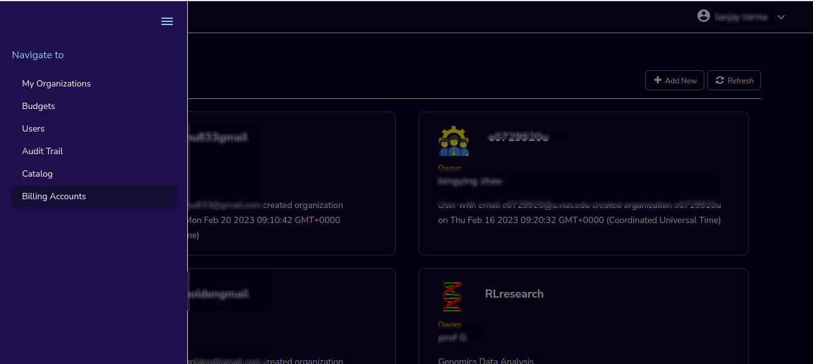

**KPIs**  

At the top of this view, you can see the summary of Billing Accounts across all organizational units in the KPI cards. You can see the following KPI cards:  

 * **Number of Organizations**: This is the number of Organizations that have consumed cost.  
 * **Number of Accounts**: The number of unlinked accounts that are linked to the organization and have consumed costs is shown here. 
 * **Current Month Billing**: This is the total Month to Date cost of Accounts across all organizations. 
 

The following details are visible in a table format:  

.. csv-table::
   :file: BillingAccountsTableAdministrator.csv
   :widths: 10, 15, 10, 10, 55
   :header-rows: 1

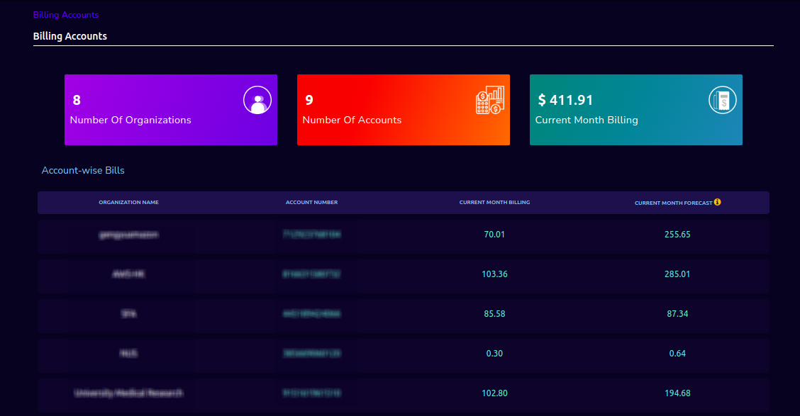

.. note::   
    a. The account will not appear in the table if it is not assigned to any O.U. 
    b. Forecast value will not be shown if the account has less than one full billing cycle of historical data available.

Principal Investigator Features
+++++++++++++++++++++++++++++++

As a Principal Investigator, you can create an account and project also. A project will be associated with a Budget with an associated dollar amount that is funded from a specific Grant to the organization. A Project can use Resources only if there is an associated budget that can meet the forecasted needs.

If Principal Investigator logs in for the first time, he can view the welcome screen. Click on the "Let's get Started" button it will navigate to the "Add Account" screen. 

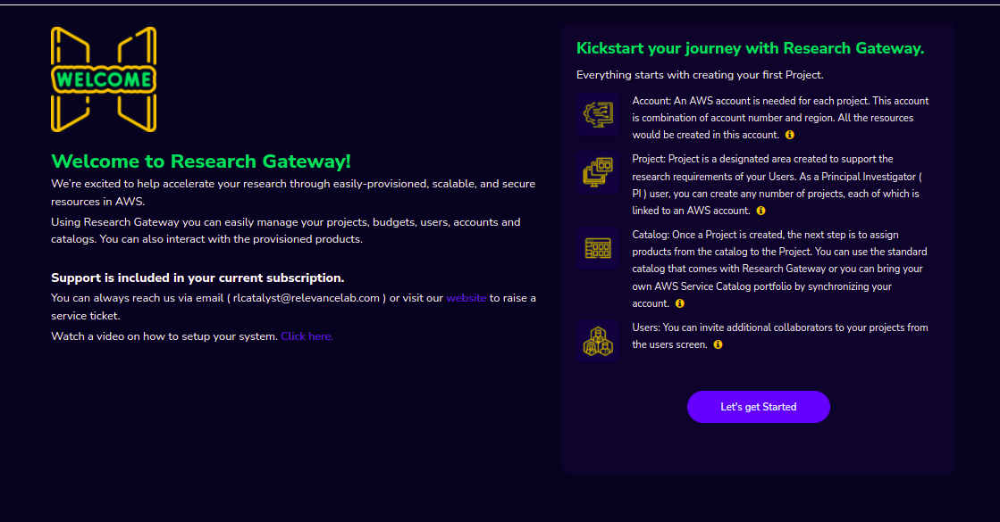

Use details from :ref:`Appendix A<Appendix A>`  to create an account. Once account creation is successful it will navigate to the "Create Project" screen.

.. image:: images/Principal_CreateProject_1.png

.. image:: images/Principal_CreateProject_2.png

.. image:: images/Principal_CreateProject_3.png 

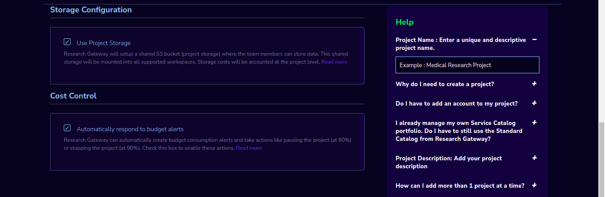

My Projects page of the Research Gateway will list all the existing projects created along with other details.

.. image:: images/Principal_MyProjects.png

Clicking on a specific project will lead to a project details page.

.. image:: images/Principal_ProjectDetails.png  

How to add a new Project 
^^^^^^^^^^^^^^^^^^^^^^^^
Login to the Research Gateway. Click on the  “+Add New” button on the My Project page or use details from :ref:`Appendix A<Appendix A>`  to create an account. Once account creation is successful it will navigate to the "Create Project" screen. The project application form is open. 

.. image:: images/Principal_CreateProject_1.png

.. image:: images/Principal_CreateProject_2.png

.. image:: images/Principal_CreateProject_3.png 

Fill in the following details

.. list-table:: 
   :widths: 90, 90
   :header-rows: 1

   * - Attribute
     - Details
   * - Project Name
     - <Project Name>
   * - Project Description
     - <Description about the project> 
   * - Budget Available
     - <Budget to allocate to this project (cumulative)>
   * - Project Copies
     - <Please enter number of projects you want to create -(between 1 and 10)>
   * - Account Details 
     - <Select an Account ID in the list or create a new account from the **"Add Accounts"** button>
   * - Add Users
     - <Select collaborators from the list or create a new user from the **"Add Users"** button> [optional]
   * - Add products
     - <Create products in the service catalog from our standard catalog or bring your own service catalog portfolio> [optional] 
   * - Use Project Storage 
     - <Research Gateway will setup a shared S3 bucket (project storage) where the team members can store data. This shared storage will be mounted into all supported workspaces. Storage costs will be accounted for at the project level. Note: For now by default, it will create the project storage. Selecting "Use Project Storage" will pull in the S3 into your project catalog>
   * - Cost Control
     - <Research Gateway can automatically create budget consumption alerts and take actions like pausing the project (at 12%) or stopping the project (at 18%). Check this box to enable these actions.>

     
Click on the “Create Project” button. Added a new project successfully.

.. note::
 
 a. While creating the project, if you select the "Standard Catalog" option it will create 7 products(Amazon Sagemaker, Amazon S3, Amazon EC2-Linux, Amazon EC2-Windows, RStudio, Cromwell Advanced and Nextflow Advanced). 
 b. If you select the "Bring all catalog items" option it will sync all the products which have the required launch permission in the portfolio of the AWS account.
 c. If you select the "Bring specific catalog items" option it will sync only the products which have the tag in the portfolio of the AWS account.
 d. If you select the “Use Project Storage” option it will create project storage at the time of project creation, if you unselect the “Use Project Storage” option it will not create project storage.

Project Storage
---------------

Research Gateway will set up a shared S3 bucket(Project Storage) where the team members can store data. This shared storage will be mounted into all supported workspaces. Storage costs will be accounted for at the project level. For a lot of scientific research, data is stored in file format (e.g. fasta, fastq files for Genomics research). The natural choice for storage of this data could be S3 (inexpensive, highly elastic) or Elastic Block Storage (access is extremely fast). As part of project creation, we are creating project storage(i.e., S3 Bucket) and sharing it with users. At the same time, we would also like individual users to be able to access personal storage from their computing resources. 

1. The Project level storage will be listed as a product in the My Products tab inside the project as an S3 bucket. There is explore action inside the S3 bucket<<There is a folder called “Shared”.
  
 .. note:: It is a common folder(only accessible by the user unless shared)  and it is available to all users.

.. image:: images/Principal_Project_ProjectStorage.png   

.. image:: images/Principal_Project_ProjectStorage_SharedFolder.png  

2. You can able to view, upload and delete objects in the storage.
3. While launching any EC2-based product, the user will be prompted to mount the Project and User level storage.
4. The Storage will be mounted as a specific folder inside the EC2 machine which the user can use to perform any tasks on. Any data written to the folder will be synced back to the storage and will be accessible to the user upon exploring.

Cost Control
------------

1. Research Gateway can automatically create budget consumption alerts and take actions like pausing the project (at 80%) or stopping the project (at 90%).
2. When creating a project if you select the “Automatically respond to budget alerts” checkbox and it will open a pop-up box that contains a message, Once you confirm that it will control the costs by taking automatic actions when budget thresholds are breached. By turning this feature off, you will lose the benefits of this cost control feature.

.. image:: images/Principal_CreateProject_1.png

.. image:: images/Principal_CreateProject_2.png

.. image:: images/Principal_CreateProject_3.png 

3. You can manually Stop/Pause/Resume/Archive/Add Budget to the project through the actions which are available on the project details page.

.. note:: Project Storage can be deleted while archiving a project. You will now be prompted for deletion of the project storage when you archive a project. Select the checkbox if you want to delete the project storage bucket along with all of its contents.

.. image:: images/Principal_ProjectDetails.png

4. You can see the events related to cost control on the events page

.. image:: images/Principal_Project_Events_CostControlEvents.png

Once you click on the project, you can see the budget in the cards and the remaining details will show a tabbed area with the following tabs:

   1. Project Details
   2. Events
   3. Available Products
   4. My Products
   5. All Products

Project Details Tab
-------------------

1. You can view the project details here. 
2. If the project was in a failed state, you can repair the project through the “Repair” option.
3. Click on the “Pause” action which is available on the right side. When you click on the "Pause" action,  all the researchers under this project would be affected. In a Paused state new provisioning is not allowed. Users can continue to use already provisioned resources as before. All the available products would be visible but the “Launch Now “ button would be hidden.
4. Click on the “Resume” button which is available on the right side. The project status changed to “Active”. In the Active state, team members can launch new products from the catalog of Available Products.
5. Click on the “Stop” button which is available on the right side. In a Stopped state, all underlying resources will be stopped and the user will not be able to perform actions on them but you are able to terminate the product. You need to manually start the resources except for the s3 product.
6. Click on the “Sync” button which is available on the right side. It should sync the catalog. You can see related events in the events tab.
7. Click on the "Archive" button which is available on the right side, it was routed to my projects page and showed the message “Archiving project started” and later the project card got removed. Project Storage can be deleted while archiving a project. You will now be prompted for deletion of the project storage when you archive a project. Select the checkbox if you want to delete the project storage bucket along with all of its contents.

.. image:: images/Principal_ProjectDetails.png 

8. Click on the "Edit" option under the **Project Name** field. Once clicked on that you can add an updated Project name in the appropriate field(should be less than or equal to 32 characters) and click on the "Update" button. It will update the Project Name successfully and show a green color toaster message.

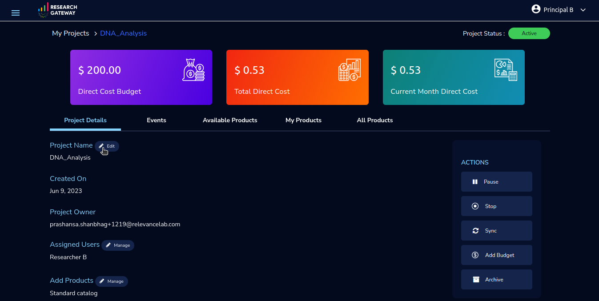

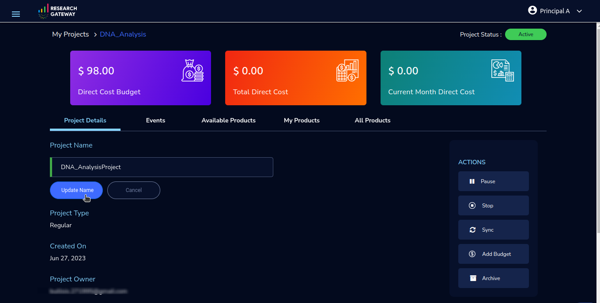

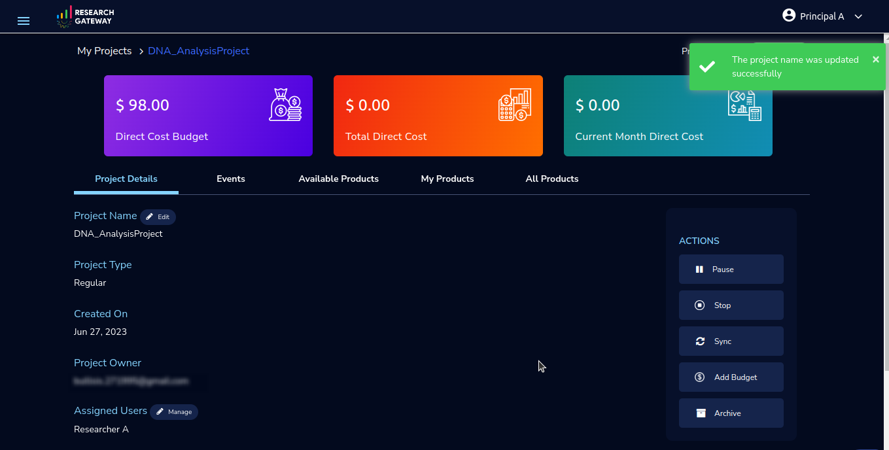

if you have not made any changes in Project Name and then you click on update action you will be able to see blue color toaster message

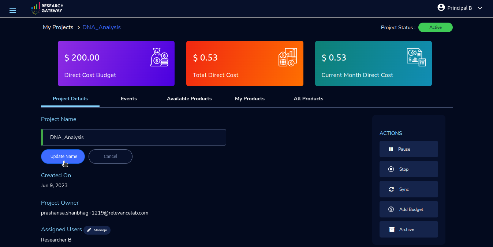

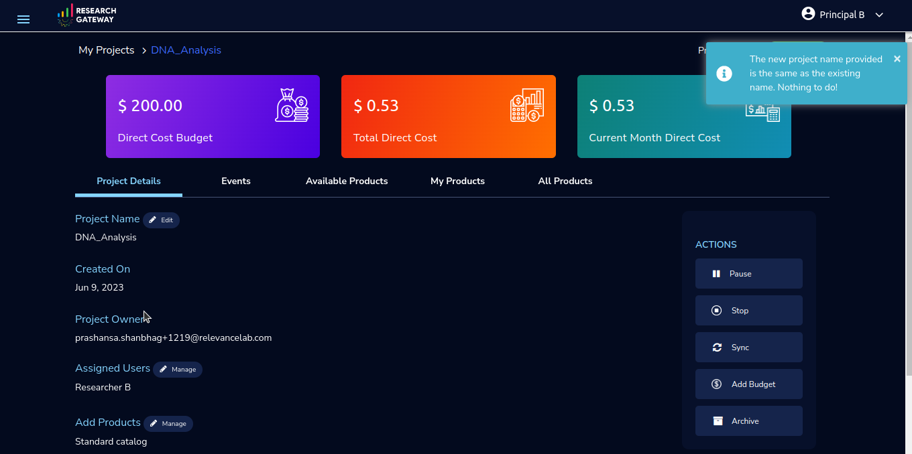

9. Click on the “Manage” option under the **Assigned Researchers** field. Once clicked on that, enable the checkbox beside the researcher Emails and click on the “Update list” button. It will add collaborators to the project. You can search the researchers, through the search option.

.. image:: images/Principal_ProjectDetails_AssignUsers.png

10. Click on the "Manage" option under the **Add products** field. Once clicked on that, it will display the list. Select the option from the list and click on the "Update list" button.

.. image:: images/Principal_ProjectDetails_AddProducts.png

.. note:: Whenever you clicked on the budget it will navigate to the researcher-wise budget details page.

Events Tab
----------

You can see the project-related events in the :ref:`Appendix E<Appendix E>`.

.. image:: images/Principal_Project_EventsTab.png
   
Available Products Tab
-----------------------

1. 	You can view the Available Products information here and you can see products in a table view also.
2. 	You can search based on product name and description. You can filter the products. We have the following filter options
      
	  a. **All** - You can see the all products here.
	  b. **Research** - You can see the products related to compute and analytics here. Eg: Amazon EC2
	  c. **IT Applications** - You can see the products related to storage and database here. Eg: Amazon RDS

.. image:: images/Principal_Project_AvailableProducts.png	 

My Products Tab
---------------

1. You can view the provisioned products details here and You can see products in a table view also.
2. You can search for the product name and description of the product.
3. You can filter the products. We have the following filter options:
      
	  a. **All** - You can see the all(i.e., active,terminated,stopped and failed) products here.
	  b. **Active** - You can see all the active products here.
	  c. **Terminated** - You can see all terminated products here.
	 
.. image:: images/Principal_Project_MyProducts.png

.. note:: 
 a. When adding a project we are passing collaborator information. Through this, we are linking researchers to the project. 
 b. The project is independent of the researcher. We can create an empty project and add collaborators later. We can add collaborators through the "Manage" option which is on the project details screen.
 c. **My Projects** page of the Research Gateway will list all the existing projects created along with other details. Clicking on a specific project will lead to a project details page. Click on the specific project you can navigate to the project details page.
 d. The products which are updated in the last 30 minutes will be visible under the active filter.
 e. When the Principal Investigator logs-in, the user will be able to see the Active filter by default. And if the user selects a filter, the last chosen filter will be stored for the current session. Once the user logs-out and logs-in again the filter value will be reset to  Active.

All Products Tab
-----------------
 
1. Principal Investigators will now see all the products launched by all the project team members in the All Products tab. They will also be able to perform Stop and Terminate actions on the products using the 3-dotted icon which is available at the right side of the table. 

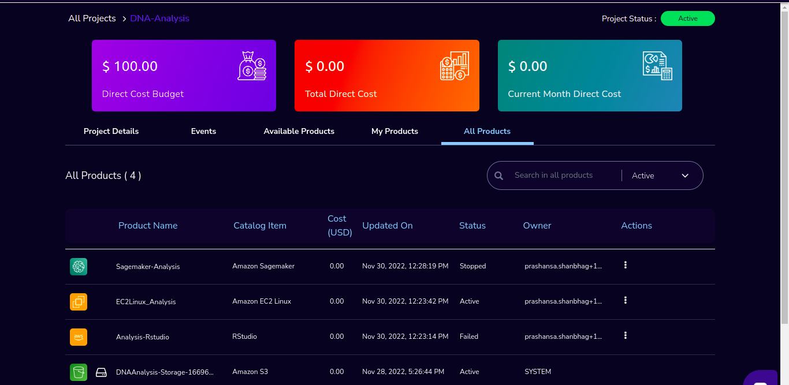

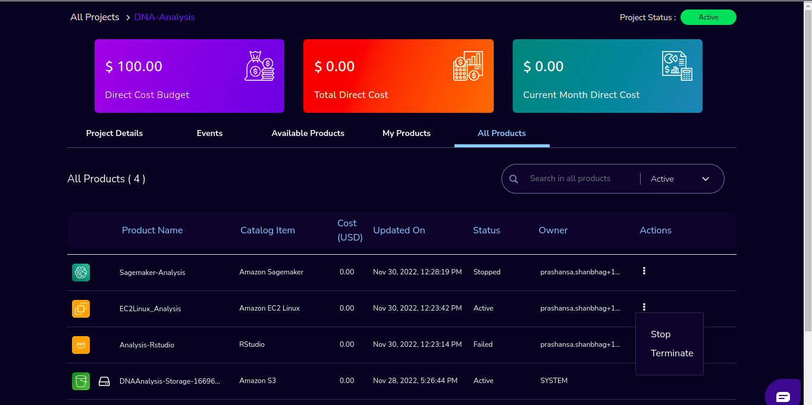

2. You can search for the product name and description of the product. 
3. You can filter the products. We have the following filter options: 
    
    a. All - You can see all the (i.e., active, terminated, stopped and failed) products here. 
    b. Active - You can see all the active products here. 
    c. Terminated - You can see all terminated products here. 
 
.. note::
  a. Products that are in Creating, Transitioning, and Terminating State will not show any actions in the All Products tab. 
  b. Products that are in the active state will show both Active and Terminate action 
  c. Products that are in a stopped state will show only the Terminate action. 
  d. Products that are in the failed state will show only the Terminate action. 
  e. Project Storage will not show any actions as it cannot be terminated independent of the project. 
  f. EFS or FSx file-systems will only show the Terminate action. 
 

Auto-Stop Resources on Idle
^^^^^^^^^^^^^^^^^^^^^^^^^^^

If there is no action happening in the provisioned RStudio product by default it will auto-stop the product after 15 minutes. if you want to use the product you can manually start the product again.

.. image:: images/Product_RStudio_ProductDetails.png
 
.. _Users_PI:

Users (for Principal Investigator)
^^^^^^^^^^^^^^^^^^^^^^^^^^^^^^^^^^
As a Principal Investigator, you can use the "Users" screen to view all users across all your projects in Research Gateway. Click on the “☰” option which is available on the left side header.

Click on the **Users** menu item to navigate to the Users page.

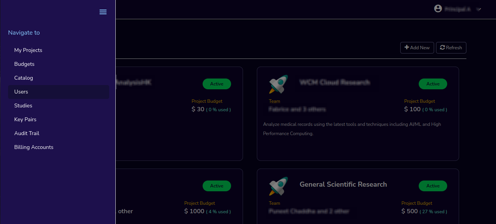

.. image:: images/Principal_Users_ActiveUserToggle.png

You can see the users in card view or table view. Click on the “≣”  button which is on the right side of the screen.
  
  
.. image:: images/Principal_Users_TableView.png

There is a search option which is beside the “+Add New” button. You can search based on users, usernames, and Email IDs. 

.. image:: images/Principal_Users_Search.png

If the results are not matched with the searched item it will show a message like “No matching users found”.

.. image:: images/Principal_Users_Searchnotmatched.png

You can filter by role(Researcher/Principal Investigator), and sort by username(Asc/Desc), user-role(Asc/Desc), and creation date(Asc/Desc).

.. image:: images/Principal_Users_FilterByRole.png
.. image:: images/Principal_Users_SortBy.png

The user can see an active filter with enable and disable options. You can toggle the view between active or all users.

.. image:: images/Principal_Users_ActiveUserToggle.png
.. _`Adding Users_PI`:

You can add a new user through the “+Add New” button which is on the right side of the screen. 

.. image:: images/Principal_Users_AddNewUser.png

1. Click on the “Add New User” button to add a single user via the “Add User” form.

Fill in the following details 

.. list-table:: 
   :widths: 90, 90 
   :header-rows: 1

   * - Field
     - Details
   * - Email 
     - <Enter an Email ID>
   * - Role
     - <Select a role in the drop-down list>
   * - First Name
     - <Please enter the first name of the user>
   * - Last Name
     - <Please enter the last name of the user>
   * - Tags
     - <Add tags to associate with the user>

.. note:: 
  
  Users can add the tags based on following 
   a. Users can add a maximum of 5 tags. Or A user may add up to five tags.
   b. Each tag should have a minimum of 3 characters and a maximum of 32.
   c. Users cannot duplicate tags for one user.
   d. Each tag can include :
       a. Alphabetic characters(a-z , A-Z)
       b. Numerical characters(0-9)
       c. Special characters( @ - + . -)

Click on the “Add User” button. On successful completion of user creation, you can see the green color toaster message. We are not allowing duplication of Email id and username while new user creation.

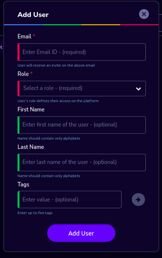

The verification email has been sent. Check the verification email delivered to the registered email address and click on the verification link to activate the account. 

.. image:: images/User_NewUser_VerificationEmail.png

.. note:: The verification email will be sent from **"no-reply@verificationemail.com"**. If you don't get the link please check the spam folder.

Users can choose a password and click on the “Submit” button. 

.. note:: 
  
  The password policy should meet the following requirement :
   a. The minimum password length of 8 characters and a maximum of 16 characters.
   b. It should have at least one lowercase character(a-z).
   c. It should have at least one upper case character(A-Z).
   d. It should have at least one number(0-9).
   e. It should have at least one special character(= + - ^ $ * . [ ] { } ( ) ? ! @ # % & / , > < ' : ; | _ ~ ` ).
   
On successful validation, users will be allowed to login to the Research Gateway.

2. Click on "Download CSV format" to download a sample CSV file that provides all the appropriate columns.

3. Click on “Import Users via CSV” to add multiple users via CSV file.

.. image:: images/Principal_Users_ImportUsers_PopUp.png

CSV file should contain the following details

.. list-table:: 
   :widths: 90, 90 
   :header-rows: 1

   * - Field
     - Details
   * - email 
     - <Enter an Email ID>
   * - first_name
     - <Please enter the first name of the user>
   * - last_name
     - <Please enter the last name of the user>
   * - role
     - <Add role for the user>
   * - userTags
     - <Add tags for the user>

.. note::

 a. If the user role is other than valid values (0 = Researcher, 1 = Principal Investigator), it will be automatically reset to 0  (researcher) and the user will be created with the role of a researcher.

 b. Users will see a red-colored toaster with a failure message if they have added invalid headers, more than the permitted number of user records in a single CSV file, or not even one user record.

 c. we can edit the tag for the user using the edit user action and Import Users via CSV action by adding the same user Email.

The new user creation process will begin when the user clicks the "Open" button and a green toaster message will appear. When importing users in bulk, user creation may take some time. The green toaster message does not imply the successful creation of all users. Please check the audit trail to see if any user creation failed.

The verification email has been sent. Check the verification email delivered to the registered email address and click on the verification link to activate the account. 

.. image:: images/User_NewUser_VerificationEmail.png

.. note:: The verification email will be sent from **"no-reply@verificationemail.com"**. If you don't get the link please check the spam folder.

Users can choose a password and click on the “Submit” button. 

.. note::

 The password policy should meet the following requirement :
   a. The minimum password length of 8 characters and a maximum of 16 characters.
   b. It should have at least one lowercase character(a-z).
   c. It should have at least one upper case character(A-Z).
   d. It should have at least one number(0-9).
   e. It should have at least one special character(= + - ^ $ * . [ ] { } ( ) ? ! @ # % & / , > < ' : ; | _ ~ ` ).
   
On successful validation, users will be allowed to login to the Research Gateway.

You can perform the following user actions 

**Enable**

There is a contextual menu which is at the right side of the card. On clicking that, you can see the actions that can be performed. When clicking on the enable action you can see the message "A user, once enabled, will be able to log in to the system and carry out activities according to his role. Are you sure you want to proceed?"  in the pop-up with the “Enable” button.

.. image:: images/Principal_Users_EnableAction_PopUp.png 

**Disable**

There is a contextual menu which is at the right side of the card. On clicking that, you can see the actions that can be performed. When clicking on the disable action you can see a message like "A user, once disabled, will no longer be able to login to the system. Are you sure you want to proceed? in the pop-up with the “Disable” button.

.. image:: images/Principal_Users_DisableAction_PopUp.png

**Resend verification mail**

There is a contextual menu which is at the right side of the card. On clicking that, you can see the actions that can be performed. Through the "Resend verification mail" option you can get another verification email to the registered email address. On successful completion, you can see the green color toaster message. Check the verification email delivered to the registered email address and click on the verification link to activate the account.  

.. image:: images/Principal_Users_ResendVerificationEmail.png

.. note:: The "Resend verification mail" option is available only if the user is inactive.

**Edit**

There is a contextual menu which is at the right side of the card. On clicking that, you can see the actions that can be performed. Through the "Edit" option you can edit User Information. On successful completion, you can see the green color toaster message. 

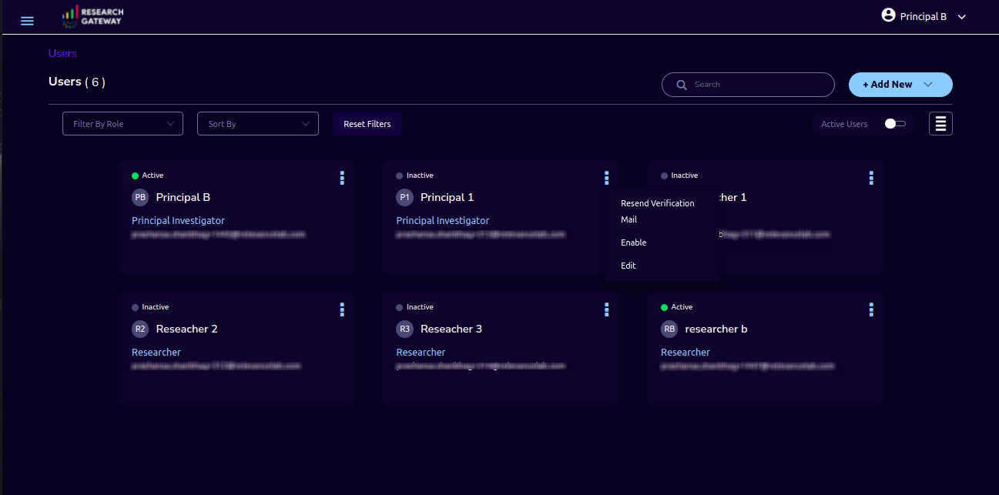

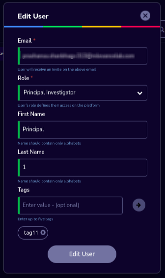

The following details are editable

.. list-table::  
   :widths: 90, 90  
   :header-rows: 1 

   * - Field 
     - Details 
   * - First Name 
     - <Please enter the first name of the user> 
   * - Last Name 
     - <Please enter the last name of the user>  
   * - Tags 
     - <Add tags to associate with the user> 

.. note:: Only if any of the First Name, Last Name and tags fields are edited Edit User Button will be enabled. 

Click on the Edit User button and edited user information will be visible on the user card. Once the user clicks on the Edit User button they will be able to see a green color toaster message. 

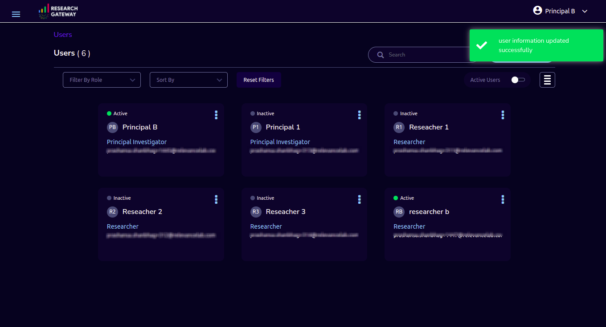

.. _add-researchers-existing-project:

How to add researchers to existing project 
^^^^^^^^^^^^^^^^^^^^^^^^^^^^^^^^^^^^^^^^^^
There is an edit functionality for the project entity. The project is independent of the researcher. A user can create an empty project and add researchers later also. Click on “Manage (i.e., Pencil icon)” which is in the "Assigned researchers" field in the Project Details tab.

.. image:: images/Principal_ProjectDetails.png

Select the Researchers and click on the “Update List” button. You can see the “Updated Successfully” toaster message in the UI and see events regarding update action in the “Events” tab. You can’t unselect the researchers who have associated products.

.. image:: images/Principal_ProjectDetails_AssignUsers.png
 
.. image:: images/Principal_ProjectDetails_AssignUsers_Completed.png

How to edit the catalog type 
^^^^^^^^^^^^^^^^^^^^^^^^^^^^

There is an edit functionality for the catalog type. You can create a project without the selection of catalog type, once the project is active you can see the message "There are no Bring your own catalog type configured for this project" under the "Add Products" field.

.. image:: images/Principal_ProjectDetails_WithoutEditCatalogType.png

Once the project is active, navigate to the project details tab and click on the “Manage (i.e., Pencil icon)” option which is at the **Add products** field in the Project Details tab. Once clicked on that, it will display the list. Select the option from the list and click on the "Update list" button.

.. image:: images/Principal_ProjectDetails.png 

.. image:: images/Principal_ProjectDetails_AddProducts.png

.. note::

 a. While creating the project, if you select the "Standard Catalog" option it will create 7 products(Amazon Sagemaker, Amazon S3, Amazon EC2-Linux, Amazon EC2-Windows, RStudio, Cromwell Advanced and Nextflow Advanced). 
 b. If you select the "Bring all catalog items" option it will sync all the products which have the required launch permission in the portfolio of the AWS account.
 c. If you select the "Bring specific catalog items" option it will sync only the products which have the tag in the portfolio of the AWS account.
 d. If you select the “Use Project Storage” option it will create project storage at the time of project creation, if you unselect the “Use Project Storage” option it will not create project storage.

End of Day - Email report on  the running instances
^^^^^^^^^^^^^^^^^^^^^^^^^^^^^^^^^^^^^^^^^^^^^^^^^^^^

The end of the day shall be deemed to be 8 PM based on the time-zone for each account. This should preferably be configurable at least at the instance level. 

Since Research Gateway supports multiple regions (and hence multiple time-zones), there is a need to only process those accounts which are currently at the end of the day. RG currently supports seven regions only but could support more in the future. So the mechanism to determine EOD should be independent of which regions are supported. Based on this, the best option is to have a scheduled task that runs hourly in the scheduler component. This task can then determine if any of the supported regions are at the end of the day.

You will receive a consolidated end-of-day - Email report(8 PM IST) for all your projects with details. You will see the report for active products only.

.. image:: images/Principal_EODReport_Email.png

.. note::

 a. The active users(Principal Investigator and Researchers) will receive the EOD report if at least one instance is in a running state.
 b. The Emails shall be sent only to verified users of Research Gateway.
 c. In the project events tab, you can see the EOD report generated information.

.. image:: images/Principal_Project_Events_EODReportEvents.png

Actions on Projects
^^^^^^^^^^^^^^^^^^^

Once the project is active, we can do Pause/Resume/Stop/Archive/Add Budget actions on a project.

.. image:: images/Principal_ProjectDetails.png 

**Pause Action**

The project status changed to “Paused”. All the researchers under this project would be affected. In a Paused state new provisioning is not allowed. Users can continue to use already provisioned resources as before. All the available products would be visible but the “Launch Now“ button would be hidden.

.. image:: images/Principal_ProjectPause_Success.png

.. image:: images/Principal_Project_PauseAction_AvailableProducts.png

**Resume Action** 

The project status changed to “Active”. In the Active state, team members can launch new products from the catalog of Available Products.

.. image:: images/Project_ResumeAction_Active.png

**Stop Action** 

The project status changed to “Stopped”. In a Stopped state all underlying resources will be stopped and the user will not be able to perform actions on them but you are able to terminate the product. You need to manually start the resources except for the s3 product.

.. image:: images/Principal_Project_Stopped_SuccessMessage.png

.. image:: images/Principal_Project_StopAction_AvailableProducts.png

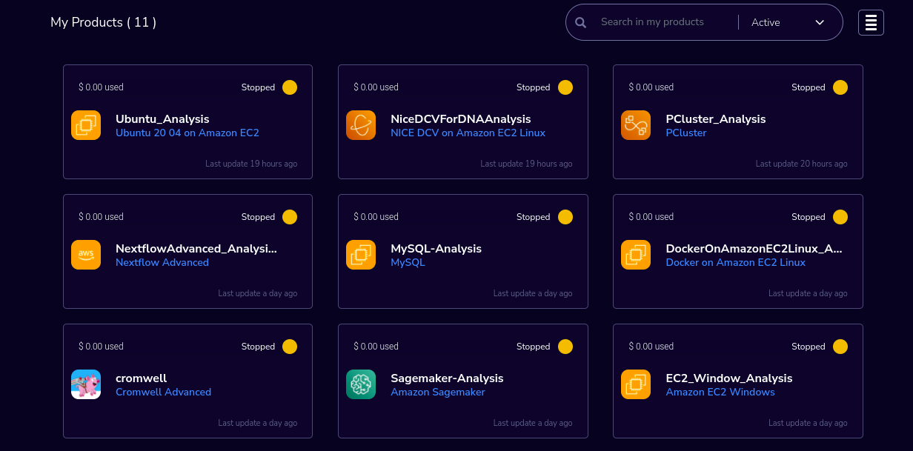

.. image:: images/Principal_Project_StopAction_ALLProducts.png

**Archive Action**

Click on the "Archive" button which is available on the right side, it was routed to my projects page and showed the message “Archiving project started” and later the project card got removed.

.. image:: images/Principal_ProjectDetails.png

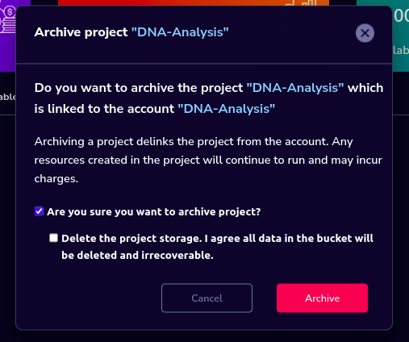

Project Storage can be deleted while archiving a project. You will now be prompted for deletion of the project storage when you archive a project. Select the checkbox if you want to delete the project storage bucket along with all of its contents.

.. image:: images/ProjectArchive_BothCheckboxSelected.png

**Add Budget Action**

The “Add Budget” action will provide Principal Investigators with a way to add more budget to the project. Clicking on the “Add Budget” button will bring up a dialog box where you can add any whole number greater than 0.

.. image:: images/Principal_ProjectDetails.png

.. image:: images/Principal_ProjectDetails_AddBudget.png

.. image:: images/Principal_ProjectDetails_AddBudget_Completed.png

.. note:: 

  a. If there are any failed provisioned products in my products panel you cannot do actions on the project. You need to terminate that product.
  b. Once the project is failed, We can do repair to the project. Click on the "Repair" button which is on the project details page. We can see related events on the events page.
  c. Once the project is failed we can do catalog sync on a project. Click on the "Sync" button which is on the project details page. We can see related events on the events page.
  d. If the project is in a “Paused” or "Active"  state the Principal Investigator user can “Add Budget”. If the budget amount added, brings the project back within the budget threshold, the “Resume” button will be visible to the user. 
  e. If the project is no longer required, the Principal Investigator user can click on the “Archive” button which is on the project details page. We can see related events on the events page.

Budgets (for Principal Investigator)
^^^^^^^^^^^^^^^^^^^^^^^^^^^^^^^^^^^^^

As a Principal Investigator, you can view the organization-wide budgets from the **Budgets** screen with a drill-down to the project, researcher and product level.

**Navigation to Budget screen**

Sign in as the Principal Investigator. Click on the “☰” Symbol which is available on the left side header. Click on the "Budgets" menu item through this, you can navigate to the Budget Details page.  

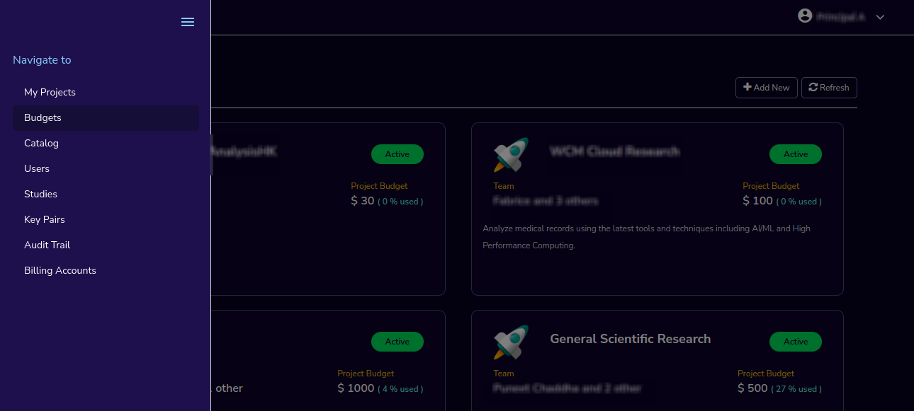

.. image:: images/Principal_Budget_Project-WiseBudgetBreakdown.png

You can see budget details with different KPI cards. You can see the following KPI cards:

  a. **Total Direct Cost Budget**: This is the budget allocated for the project during the creation of the project.

  b. **Total Direct Cost**: This is the budget consumed by all the researchers in the project.

  c. **Current Month Total Direct Cost**: This is the budget consumed by all the researchers in the project during the current month.

You can see Project-wise Budget details in the table format:

.. csv-table::
   :file: BudgetTable2.csv
   :widths: 10, 15, 10, 10, 15
   :header-rows: 1
 
You can download the budget details through the “Export as CSV”  option.

.. note:: When Consumed Budget exceeds a threshold (say 80%), the budget management screen should show an alert in the UI and the user will also get an email notification.

 .. image:: images/Principal_BudgetExceedThreshold_Email.png
 
You can see researcher budget details which are linked to particular products and you can see configured products information in the Researcher-wise Budget details page

.. image:: images/Principal_Budgets_ResearcherWiseBudgetBreakdown.png

.. image:: images/Principal_Budgets_Product-WiseBudgetBreakdown.png

.. _Catalog_PI:

Catalog (for Principal Investigator)
^^^^^^^^^^^^^^^^^^^^^^^^^^^^^^^^^^^^

As a Principal Investigator, you can use the “Catalog” screen to view all catalog products across Research Gateway. Click on the “☰” option which is available on the left side header. You can see the  following details: 
   
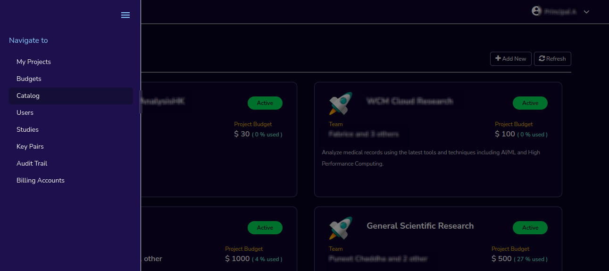

Click on the **Catalog** menu item to navigate to the Catalog screen.

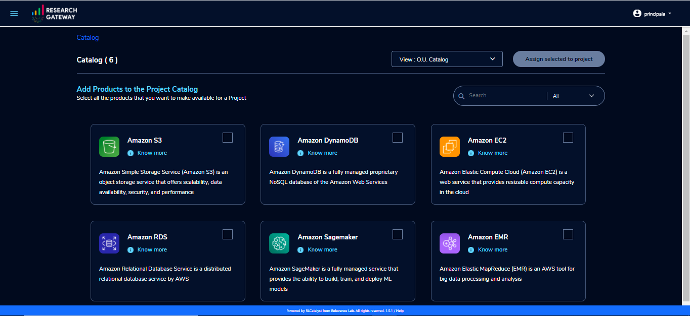

You can see the standard catalog products on the listing page. To assign a set of items to an Organizational Unit, select the items by checking the checkbox which is at the right corner of each product card. Then click the  "Assign selected to a project" button.

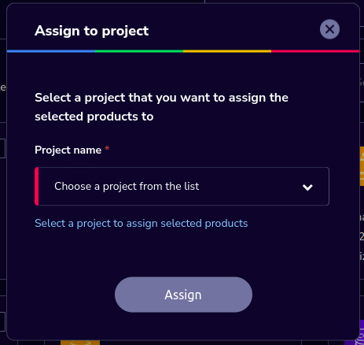

.. image:: images/Principal_Catalog_ProductCheckboxEnabled_AssignSelectedToProject.png

You can view and update the products for the particular organization. Enable the checkbox which is at the right side of the product and click on the “Update selected to  O.U '' button. After the completion of the updation, you can see the successful toaster message.

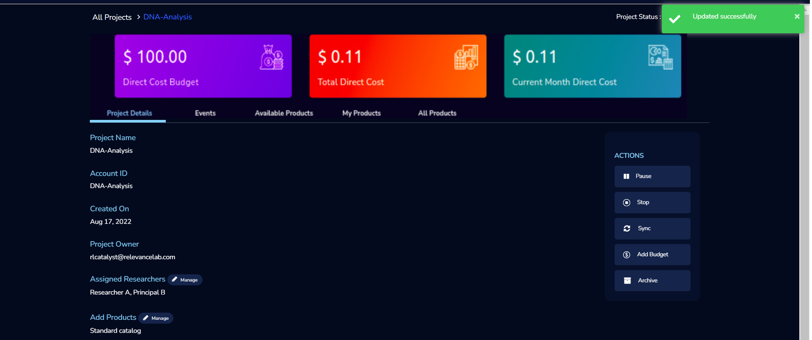

.. image:: images/Principal_Catalog_UpdateToSelectedO.U_ToasterMessage.png

You can use the search field to search for a term in the product name and description of the product. You can also use the filter options below :
  
 a. **All**: You can see all products here.

  .. image:: images/Principal_Catalog_AllFilter_DropDown.png
 
 b. **Research**:  You can see the products related to compute and analytics here. Eg: Amazon EC2
 
   .. image:: images/Principal_Catalog_ResearchFilter_DropDown.png

 c. **IT Application**: You can see application-related products here.
 
   .. image:: images/Principal_Catalog_ITApplicationsFilter_DropDown.png

If we could not find any products related to the filter you can see a message like “We could not find any products that matched your search”.

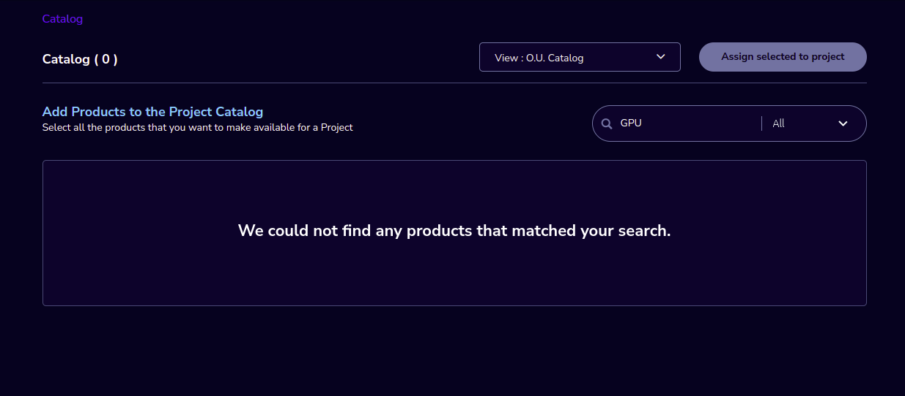

Key Pairs(for Principal Investigator)
^^^^^^^^^^^^^^^^^^^^^^^^^^^^^^^^^^^^^
The Key Pairs screen can be used by the Principal Investigator to view keypair details across projects. Click on the “☰” Symbol which is available on the left side header. By clicking on the "Key Pairs" menu item, the user will be navigated to the Key Pairs details page.

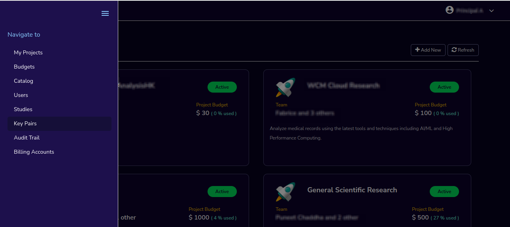
  
.. image:: images/Principal_Keypair_DefaultPage.png

You can create new key pairs through our portal. The user will initiate the creation of a keypair and once it is created the user will download the private key. The download is allowed only once post and the screen only lists the keypair by name.
  
Click on the "+Create New" button which is available on the right side of the page. Fill the details in the form and click on the “Create Key Pair” button. New Keypair was created successfully.

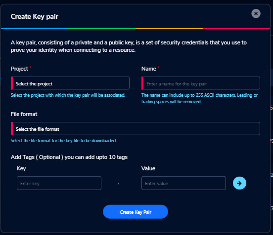

You can see key Pairs details in table format:

.. csv-table::
   :file: keypair.csv
   :widths: 20, 20, 20, 20, 20
   :header-rows: 1

The user can delete the keypair. Click the 3-dotted action on the right side of the table. You can see the delete keypair through the “Delete” action.

.. image:: images/keypair_DeleteKeypair_PopUp.png

You can search the keypair through the Keypair name and Project name.

Ex: Type “Chiron” in the search area it should display the keypairs which are attached to the Chiron project.

.. image:: images/Principal_KeyPairs_Search.png

Studies(for Principal Investigator)
^^^^^^^^^^^^^^^^^^^^^^^^^^^^^^^^^^^^^
As a Principal Investigator, You can view the studies in the Research Gateway. Click on the “☰” Symbol which is available on the left side header. By clicking on the "Studies" menu item, the user will be navigated to the Studies details page.

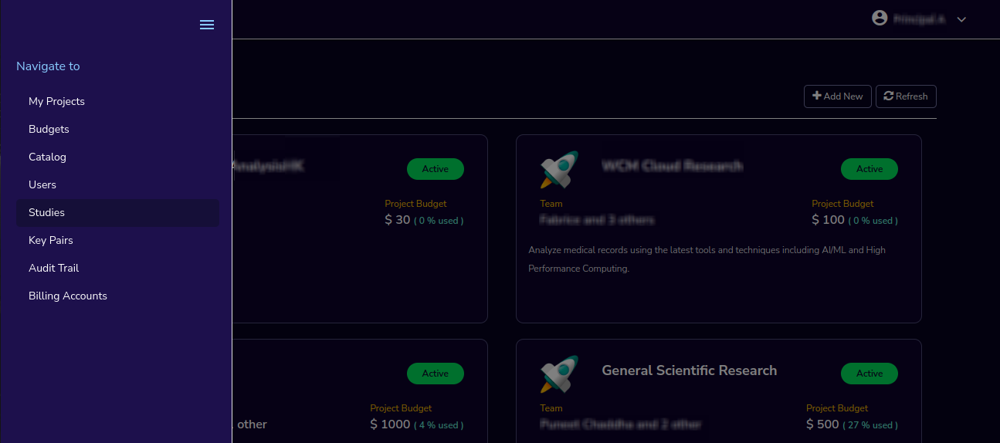

The “Studies” landing page lists the datasets as cards. 

Each card shows the following data:

1. Name
2. Description
3. Tags
4. Bookmark this study.
5. View Details link(Clicking on the “View details” call-to-action on a study card will lead to a Study details page).

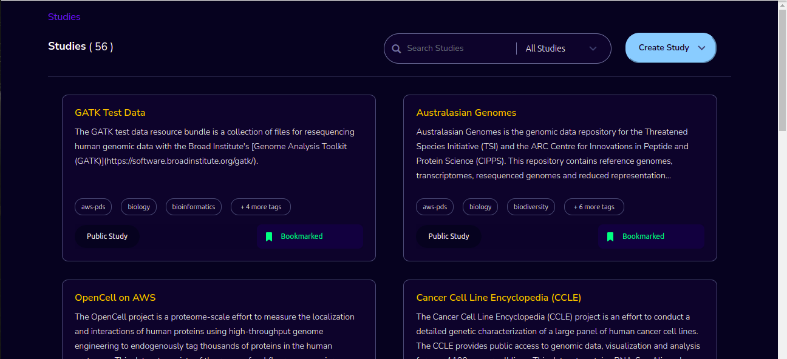

The studies landing page should have a “Filter” feature that allows the user to filter the listing by predetermined criteria. You can see options like Public/Private/Bookmarked/All Studies/Internal.

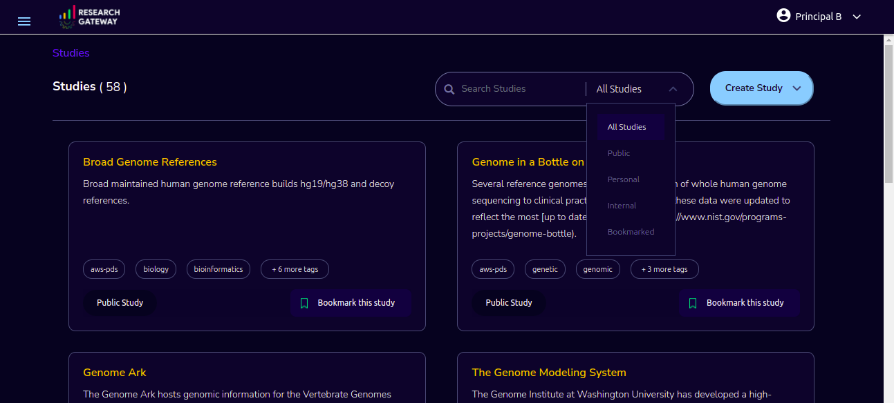

The studies landing page has a search bar that allows users to search the studies based on name and description.

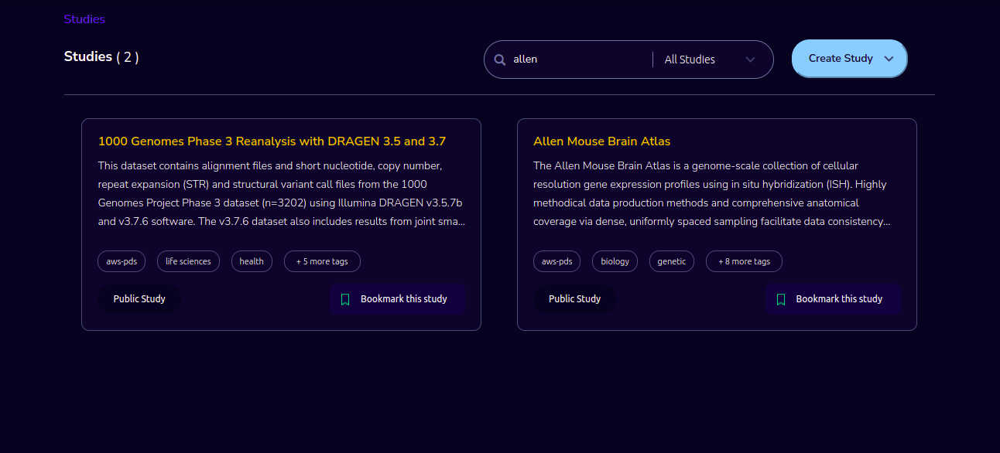

Public Study(for Principal Investigator)
----------------------------------------

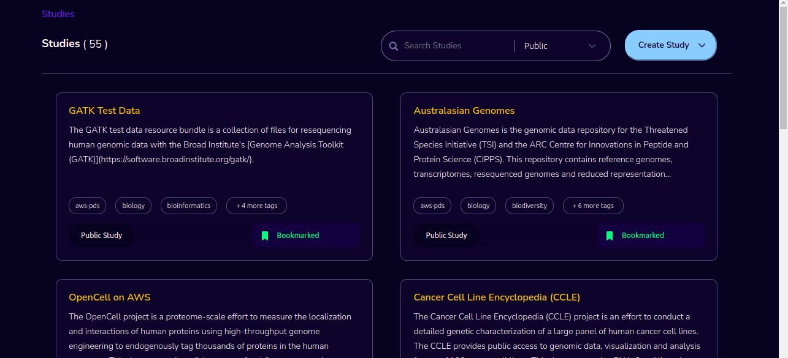

You can connect to Open Data like the AWS registry of open data. The “Study” details page will show a tabbed area with the following tabs:

	a. Study details: The “Study details” tab will show all the details of the study available in the collection. Actions associated with the study will be shown in an actions bar on the right side of the page.
	b. Resource details: The “Resource details” tab will show the details of the associated product (S3 bucket). This will replicate the product details page of the associated S3 bucket and show the same actions associated with the s3 bucket.
											
 .. image:: images/Principal_Studies_StudyDetails.png
  
**Explore Action**

You can see the files/folders which are related to the datastore.

.. image:: images/Principal_Studies_Explore.png

**Link/Unlink Action**

1. A user will be able to link a study to a compute resource using the “Link” action in the Actions bar. This action item should be a pop-up that will have the list (dropdown) of active sagemakers for that user.
2. You can see an icon similar to the shared icon for showing that this S3 bucket is linked with PageMaker.
3. You can link the study with multiple PageMaker notebooks.  Through the “unlink resource” you can unlink with computing resources
4. If there are no active Sagemaker products we are showing the following message to the user **There is no provisioned Sagemaker product. Please Launch a sagemaker product from the available products page first, before linking to an s3 bucket**.
 
 .. image:: images/Principal_Studies_Linkaction_Available.png

..

 .. image:: images/Principal_Studies_UnlinkResource.png

..

 .. image:: images/Principal_Studies_UnlinkResource_Success.png

..

 .. image:: images/Principal_Studies_Link.png  

**Assign To Projects**

The "Assign to Project" action allows users to associate a study with one or more projects, enabling the study to be accessible and linked to those projects.  

The "Assign to Project" action is a feature available on the Study Details page below Connect tab, which allows authorized users to assign a study to one or more projects. When accessing the Study Details page, users will see an "Assign to Project" button. This button is only visible to users with the appropriate authorization, such as Principal Investigators (PIs). 

Upon clicking the "Assign to Project" button, a dialog box will appear, presenting the user with a list of available projects. The user can then select one or more projects from the list. Initially, the "Submit" button in the dialog box is disabled until the user selects at least one project. 

.. note:: Internal studies can only be assigned to projects using the same AWS account and region. In addition, the list of projects shown will be the projects that the user is assigned to. So, if the PI is not assigned to some projects in the same AWS account, he will not be shown those projects. 

Once the user has made their project selection(s), the "Submit" button becomes enabled. Clicking the "Submit" button will associate the study with the selected projects. A success toaster message will be displayed to confirm that the assignment was successful. 

To cancel the assignment, the user can click the "Cancel" button, and the dialog box will close without making any changes. 

In case of any failures during the assignment process, appropriate error messages will be displayed, providing feedback to the user regarding the encountered issue. 

After successfully assigning a project to a study, the user will be able to view the assigned project list on the Study Details page. Additionally, the linked studies list will be updated on the Project Details page, reflecting the association between the study and the project. 

If there are no projects available for selection, the dialog box will display a default message indicating that no projects have been created or assigned to the user. This message serves as a prompt for the user to ensure that projects are available before attempting to assign them to a study. 

It's important to note that the "Assign to Project" action is not available for users with researcher or admin roles.

Lastly, when studies appear in the "Study Selection" pane while launching a product, the assigned study will be visible as a public study, denoting its read-only status. Users will have the ability to select the study, and it will be mounted to the instance, allowing them to access and utilize the study's information and resources. 

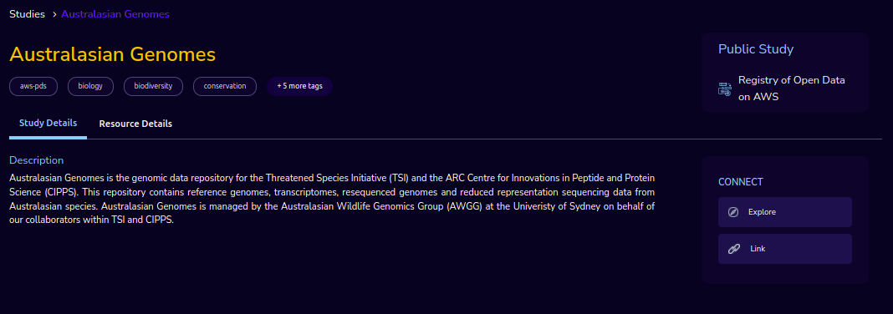

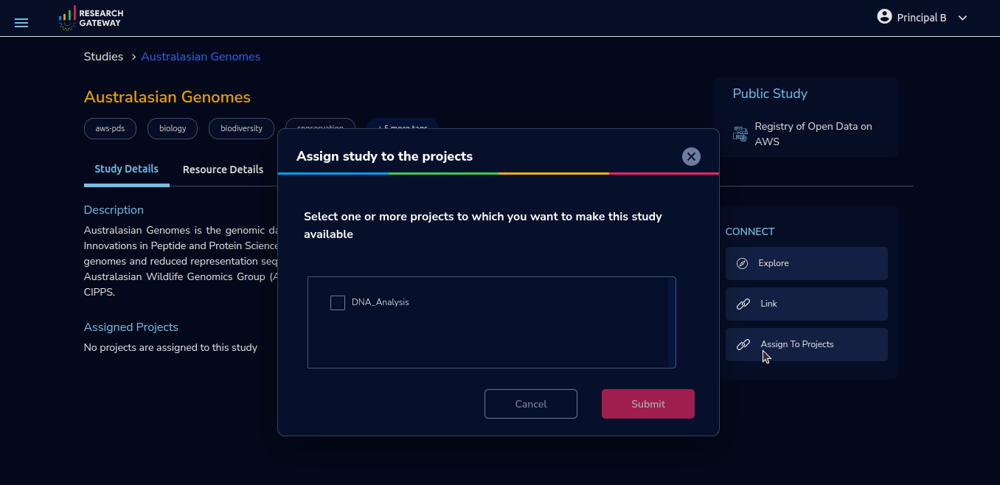

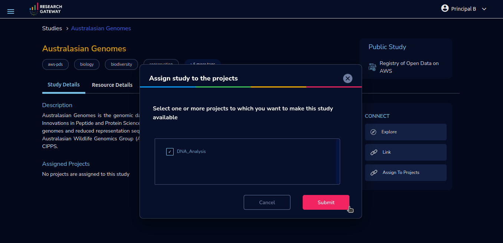

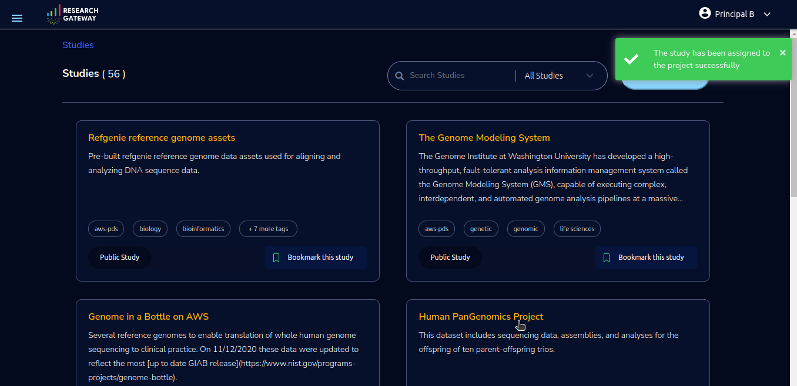

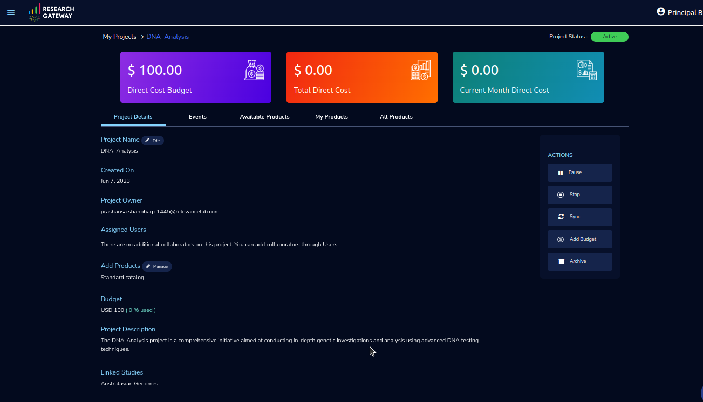

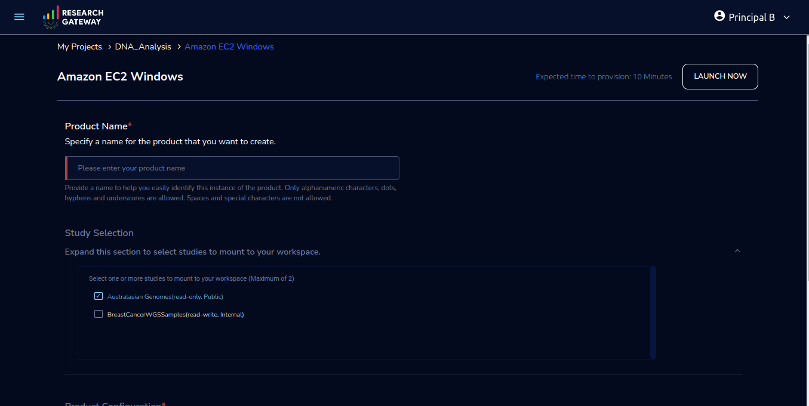

.. _internal-study:  

Internal Study(for Principal Investigator)
------------------------------------------

As a Principal Investigator, you can bring an existing S3 bucket in your AWS project account as an Internal study and the same can be mounted to the workspaces launched in the projects to which the study has been assigned. An Internal study can only be used in projects which use the same AWS account.

**Navigation to Studies screen**

To create an Internal Study, Click on “☰” Symbol which is available on the left side header. By clicking on the “Studies” menu item, you will be navigated to the Studies details page.

Click on the “Create Study” Button to open up the create study form 

 .. image:: images/PrincipalInvestigator_Studies_DefaultPage.png
 
Fill in the following details

1. Study Details

.. list-table:: 
   :widths: 100, 100 
   :header-rows: 1

   * - Field
     - Details
   * - Study Name 
     - <Please provide a name to help you easily identify the study. Only alphanumeric characters, hyphens and underscores are allowed. Spaces and special characters are not allowed. The study name is not unique, you can create different studies with the same study name>
   * - Description   
     - <Please provide a description of the contents of the study. This description will be displayed on the Study card.>
   * - Study Type
     - <Select Study Type as Internal Study>
   * - Access Level
     - <Select Access Level - (required)> note: read-write or read-only study is supported
   * - Tags for this study
     - <Enter a value (optional) You can add up to 15 unique tags. You can give any value and click on the arrow button the tags are added to the study. You can add the alphabet and special characters like hyphens. You cannot add numbers or special characters as tags. You can add only add 15 tags or fewer. Once you add 15 tags then the tag field will disappear. You can not duplicate the tags.>

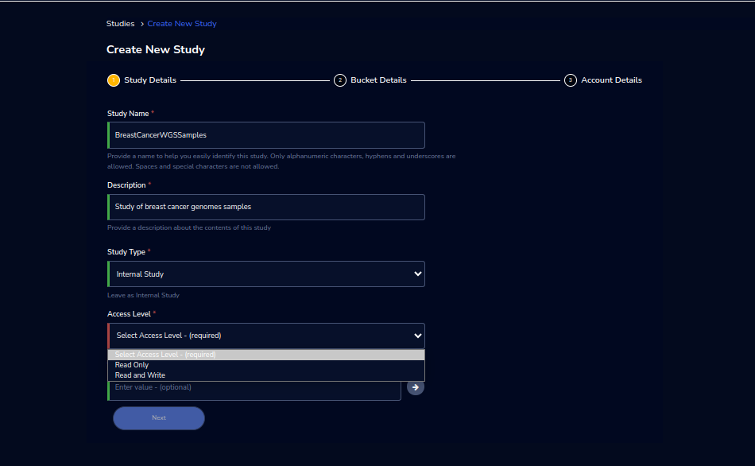

2. Bucket Details

.. list-table:: 
   :widths: 100, 100 
   :header-rows: 1

   * - Field
     - Details
   * - Bucket Name 
     - <Please provide a bucket name that hosts the data. The bucket should already exist in AWS. Only lowercase letters, numbers, dots, and hyphens are allowed. Spaces and special characters are not allowed. If the bucket is not available in AWS, then You cannot register that bucket as a study and you will be able to  see an error message when you click on the “Register Study” button>
   * - Bucket Region   
     - <Choose the region in which the bucket resides.>
   * - Is the Bucket Encrypted?
     - <You can keep it as default value “No" or When you click on the checkbox “Yes” it will ask you for KMS Arn (In Study Account) - Enter the ARN for the KMS key>
   * - Prefix
     - <Please provide a location within the bucket to which access is provided. Only Alphanumeric, underscore, hyphen, dot and forward slash are allowed. spaces and special characters are not allowed. The prefix should end with a forward slash character (/). The prefix should not correspond to an object name in the bucket. If no prefix is provided, the entire bucket will be accessible. An incomplete prefix or non-existing prefix will throw an error message when you click on the “Register Study” button>

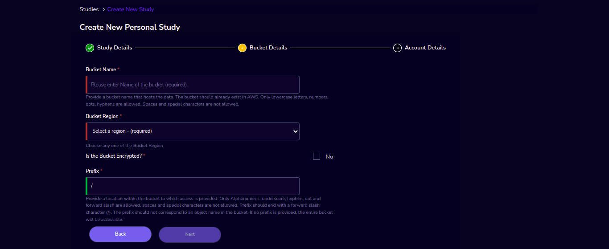


3. Account Details

.. list-table:: 
   :widths: 100, 100 
   :header-rows: 1

   * - Field
     - Details
   * - Project Account 
     - <Choose the account configured as settings in RG to which you want the study to be mapped. All the projects linked to this particular study account will only show up here. You can select any one of the projects from the dropdown. The project account, account number and study account should be the same, then only you can create a study with one account. If not the creation of an internal study will not be possible>
   * - Study Scope   
     - <Currently only Project level scope is allowed. All the project members can see the study details. But if any user who is not part of the project, will not be able to see the study details.>
   * - Projects
     - <Choose the projects to which the study needs to be assigned. Linux-based workspaces and Sagemaker instances in the selected projects will automatically mount this study. Users can select the project during study creation and also can add or remove projects of the same account using Edit Action available on the Study Details page. By default, it shows no project is added to the account. Once you select the account, all the projects linked to the selected account settings will be listed here.>
  


After filling in the details click on the Register Study button below the form, your study will be registered successfully

.. image:: images/InternalStudy_SuccessMessage.png
  

The studies landing page should have a “Filter” feature that allows you to filter the listing by predetermined criteria. You can see options like Public/Private/Bookmarked/All Studies/Internal. You will be able to see your registered Internal Study using the “Internal” filter


Each card shows the following data:

1. Name
2. Description
3. Tags
4. Bookmark this study.

When you click on the Internal Study card you will be able to see  The “Study” details page which will show a tabbed area with the following tabs:

1. Study details: The “Study details” tab will show all the details of the study available in the collection. Actions associated with the study will be shown in an actions bar on the right side of the page.


2. Resource details: In the “Resource details” tab you can see the Bucket information.


**Explore Action**

When you click on the Explore button which is available at the right side of the page below Connect tab you will be able to see the files/folders which are related to the datastore. You can do root and back action but you will not be able to 'back' any further than the prefix specified.


**Link/Unlink Action**

1. You will be able to link a study to a Sagemaker workspace using the “Link” action in the Actions bar. This action item should be a pop-up that will have the list (dropdown) of active Sagemaker workspaces owned by you.
2. You can see an icon similar to the shared icon for showing that this S3 bucket is linked with AWS Sagemaker.
3. You can link the study with multiple AWS Sagemaker notebooks. Through the “unlink resource” you can unlink with compute resources
4. If there are no active AWS Sagemaker products we are showing the following message to the You There is no provisioned Sagemaker product. Please Launch an AWS Sagemaker product from the available products page first, before linking to an s3 bucket.


.. note:: When your Internal Study creation fails due to invalid/unavailable input values you will be able to see the following error toaster message

.. image:: images/InternalStudy_ErrorMessage.png

.. note::  Only Principal Investigator users can create an Internal Study. Researcher users cannot create internal studies.

**Edit Action**

1. You can edit the study through the "Edit" action.


.. image:: images/InternalStudy_Edit_StudyDetails.png


.. csv-table::
   :file: EditStudyParameters.csv
   :widths: 10, 15
   :header-rows: 1


**Terminate Action** 

The "Terminate" action allows you to delete a study. This action is available on the right side of the page, below the Actions tab. When you click on the "Terminate" action, a confirmation dialog box will appear. 

In the confirmation dialog box, you will see two checkboxes. To proceed with the deletion, you need to select both checkboxes. This ensures that you are aware of the consequences and are ready to proceed with the deletion. 

After selecting both checkboxes, the "Delete" action will become enabled. Clicking on the "Delete" action will unassign the study from the project and delete the study. A success toaster message will be displayed, confirming the successful termination and deletion of the study. 

 .. note:: If the study is still assigned to the project, you can select the second checkbox in the confirmation dialog box. This will unassign the study from the project and terminate it successfully, resulting in a successful toaster message. 


If the study is not assigned to any project, clicking on the "Terminate" action will display a confirmation dialog box. Once you click on the "Delete" button in the confirmation dialog box, the internal study will be successfully deleted, and a success toaster message will be displayed. 


If the study is linked to any Sagemaker product, and if the user clicks on the terminate button it will throw an error toaster message "Please unlink all Sagemaker instances from this study before you terminate it." 


When any project that is linked to an internal study is archived without unassigning a study and you try to delete the account which is linked to it, you will get the  below dialog box
 


External Study(for Principal Investigator)
------------------------------------------
As a Principal Investigator, you can bring an existing S3 bucket in any AWS (Amazon Web Services) account apart as an external study and the same can be mounted to the workspaces launched in the projects to which the study has been assigned. An External study can be used in projects that use a different account than the Project Account 

`Watch a video on how to create an external study and mount it to an instance <https://youtu.be/TfJCmH5AM1o>`_

To be able to create an External study and use it in a Project you need to first Add the Study Account from the Settings Page 

**Adding an AWS Study account to create an External Study** 

Login into the Research Gateway. Click on the dropdown bar which is above the header. Choose the “Settings” option 

Click on the “Settings” menu item. The Project Accounts page is opened.


On this page you will see the Study Accounts tab once you navigate to this tab you will be able to see the below screen if you do not have any study account added to your login  


.. note::
  a. Study account creation is restricted to the Principal Investigator role. 
  b. Only a user who is the Account Owner can see and access the Study Account and create an external study using that account. 

Click on the “+Add New” button on the Study Accounts page. This will open the Add Account form. 


Fill in the following details 

.. list-table:: 
   :widths: 50, 50
   :header-rows: 1

   * - Attribute
     - Details
   * - Account Name
     - <Account Name>
   * - Account Key
     - <Account Key> [It should be a minimum of 16 characters and a maximum of 128 characters]
   * - Secret Key
     - <Secret Key> [It should be a minimum of 40 characters and a maximum of 128 characters]
   * - Region
     - <Select a region from the drop-down list> 
   * - Account Number
     - <Enter an AWS Account Number> [It should be a 12-digit number]

Click on the “Verify” button, it will check whether the provided details are valid or not. If details are valid, it will show a verified account message with a green color tick mark below the header otherwise it will throw an error message accordingly. 


Once a study account is added successfully, you will be able to see the study account added and will be able to see a 3-dotted icon which is available on the right side of the account  

.. note:: The 3 dotted icons will be only visible if there are no external studies linked with the study account 

.. image:: images/Principal_StudyAccount_AddedSuccessfully.png

Click on the 3 dotted icon which is available on the right side of the study account you will be able to see the Delete Option  


**How to add external study** 

To be able to create an External study and use it in Project you need to first Add the Study Account from the Settings Page.  

If you try to add External Study without a Study Account, you will see a red color error toaster message 


Navigation to the Studies screen 

To create an External Study, click on “☰” Symbol which is available on the left side header. By clicking on the “Studies” menu item, you will be navigated to the Studies details page. 


Click on the “Create Study” Button to open the Create Study form 

Fill in the following details 

1. Study Details 

.. list-table:: 
   :widths: 100, 100 
   :header-rows: 1

   * - Field 
     - Details 
   * - Study Name 
     - <Please provide a name to help you easily identify the study. Only alphanumeric characters, hyphens and underscores are allowed. Spaces and special characters are not allowed. The study name is not unique, you can create different studies with the same study name> 
   * - Description 
     - <Please provide a description of the contents of the study. This description will be displayed on the Study card.> 
   * - Study Type 
     - <Select Study Type as External Study> 
   * - Access Level 
     - <Select Access Level - (required)> note: read-write or read-only study is supported 
   * - Tags for this study 
     - <Enter a value (optional) You can add up to 15 unique tags. You can give any value and click on the arrow button the tags are added to the study. You can add the alphabet and special characters like hyphens. You cannot add numbers or special characters as tags. You can add only add 15 tags or fewer. Once you add 15 tags then the tag field will disappear. You can not duplicate the tags.>


2. Bucket Details 
   
.. list-table:: 
   :widths: 100, 100 
   :header-rows: 1

   * - Field 
     - Details 
   * - Bucket Name 
     - <Please provide a bucket name that hosts the data. The bucket should already exist in AWS. Only lowercase letters, numbers, dots, and hyphens are allowed. Spaces and special characters are not allowed. If the bucket is not available in AWS, then You cannot register that bucket as a study and you will be able to see an error message when you click on the “Register Study” button> 
   * - Bucket Region 
     - <Choose the region in which the bucket resides.> 
   * - Is the Bucket Encrypted? 
     - <You can keep it as default value “No” or when you click on the checkbox “Yes” it will ask you for KMS Arn (In Study Account) - Enter the ARN for the KMS key> 
   * - Prefix 
     - <Please provide a location within the bucket to which access is provided. Only Alphanumeric, underscore, hyphen, dot, and forward slash are allowed. spaces and special characters are not allowed. The prefix should end with a forward slash character (/). The prefix should not correspond to an object name in the bucket. If no prefix is provided, the entire bucket will be accessible. An incomplete prefix or non-existing prefix will throw an error message when you click on the “Register Study” button> 


3. Account Details 

.. list-table:: 
   :widths: 100, 100 
   :header-rows: 1

   * - Field 
     - Details 
   * - Study Account 
     - <Choose the study account configured as settings in RG (Research Gateway) to which you want the study to be mapped.> 
   * - Study Scope 
     - <Currently only Project level scope is allowed. All the project members can see the study details. But if any user who is not part of the project, will not be able to see the study details.> 
   * - Projects 
     - <Choose the projects to which the study needs to be assigned. Linux-based workspaces and Sagemaker instances in the selected projects will automatically mount this study. Users can select the project during study creation. Once you select the account, all the projects that you have access to under your organizational unit will be listed here.> 


After filling in the details click on the Register Study button below the form, your study will be registered successfully 

.. image:: images/Principal_ExternalStudy_CreatingToastermessage.png

The studies landing page should have a “Filter” feature that allows you to filter the listing by predetermined criteria. You can see options like Public/Private/Bookmarked/All Studies/Internal/External. You will be able to see your registered External Study using the “External” filter 


Each card shows the following data: 

1. Name 
2. Description 
3. Study Type 
4. Bookmark this study. 

Immediately after you click on Register Study it will automatically navigate to the Studies page with an external study filter with a green colour toaster message 


Click on External Study card you will be able to see the study in creating State 


Once the study is successfully created you can see the status as Active, and you will be able to view the Delete action in the Study Details page 


The “Study” details page which will show a tabbed area with the following tabs: 

1. Study details: The “Study details” tab will show all the details of the study available in the collection. Actions associated with the study will be shown in an actions bar on the right side of the page. 

2. Resource details: In the “Resource details” tab you can see the Bucket information. 


.. note::
  a. When your External Study creation fails due to an invalid/unavailable KMS ARN value you will be able to see the following error toaster message  

     .. image:: images/Principal_ExternalStudyCreation_Errormessage.png  

  b. Only Principal Investigator users can create an External Study. Researcher users cannot create external studies.
  c. Study account is restricted to Principal Investigator user, User who is the Account Owner can only see and access the Study Account and create an external study for that account. 
  d. If the user onboards one AWS account as a project account, they cannot onboard the same account as a study account.  
  e. If the user onboarded one AWS account as a study account, any other user (irrespective of the Organizational Unit) cannot onboard the same AWS account as the study account. 
  f. User can create an external study with the same bucket name and prefix in the same org.  
  g. User cannot register study with an empty bucket. It should have some data. 
  h. In the study creation form user adds a bucket name below they can choose the region that should be the exact region of the bucket in the AWS console. Otherwise mounting will not work.  

**Delete Action**

The “Delete” action allows you to delete a study. This action is available on the right side of the page, below the Actions tab. When you click on the “Terminate” action, a confirmation dialog box will appear. 


In the confirmation dialog box, you will see one checkbox. To proceed with the deletion, you need to select the checkbox. This ensures that you are aware of the consequences and are ready to proceed with the deletion. 


After selecting the checkbox, the “Delete” action will become enabled. Clicking on the “Delete” action will unassign the study from the project and delete the study. A success toaster message will be displayed, confirming the successful termination and deletion of the study. 


You can see the study in the Deleting state by clicking on Study which you deleted  


Once the study is deleted permanently you cannot further see the study card 

**Delete study account** 

Click on the dropdown bar which is above the header. Choose the “Settings” option 

Click on the “Settings” menu item. The Project Accounts page is opened. Navigate to the Study Accounts page you will be able to see Study Account added 

Click on the 3 dotted icon which is available on the right side of the study account you will be able to see the Delete Option  

.. note:: the 3 dotted icon will be only visible if there are no external studies linked with the study account 


.. image:: images/Principal_StudyAccountstab_Delete.png

Click on the delete action this will open a confirmation dialog box is opened and enable the check box and click on the “Delink” button, the study account will be deleted, and a green colour success toaster message will be visible. You can only delete a Study account which is not linked to any external study 


Audit Trail(For Principal Investigator)
^^^^^^^^^^^^^^^^^^^^^^^^^^^^^^^^^^^^^^^

As a Principal Investigator, you can use the Audit Trail screen to view security-related audits. Click on the “☰” option which is available on the left side header.


Click on the "Audit Trail" menu item. Through this, you can navigate to the Audit Trail page.

.. image:: images/Principal_AuditTrail_DefaultPage.png

If you try to search the non-existent word it will display a message like “No matching organizations found”. You can see the login and logout and failed login audits. Here you can search based on user, status, and status reason. If audits are not found through the search you can see messages like “No matching audits found”.


.. image:: images/Principal_AuditTrail_Search.png

You can filter the logs by Principal Investigator, researcher, and Project which will show the details of your own O.U. You can also filter the logs through the date. 

.. image:: images/Principal_AuditTrail_FilterLogsByDropdown.png

.. image:: images/Principal_AuditTrail_DateRangeDropdown.png

You can see the audit event details in the :ref:`Appendix F<Appendix F>` 

Billing Accounts (Principal Investigator)
^^^^^^^^^^^^^^^^^^^^^^^^^^^^^^^^^^^^^^^^^
As a Principal Investigator, you will be able to view monthly billing data on the account level data for the Organization Unit that the user is part of.

**Navigation to the Billing Accounts**

Login as the Principal Investigator user. Click on the "☰" option, which is available on the top-left side. Click on the Billing Accounts menu item to navigate to the Billing Accounts page.


**KPIs**   

At the top of this view, you can see the summary of Billing Accounts across all organizational units in the KPI cards. You can see the following KPI cards: 

*  **Number of Accounts**: This is the total number of accounts in the Organizational Unit that the user is part of.  

* **Current Month Billing**: This is the total month-to-date cost of accounts In the Organizational Unit that the user is part of.  

* **Total Forecast Value**: This is the total forecast value cost across all accounts in the Organizational unit that the user is part of.  

The following details are visible in table format: 
 
.. csv-table::
   :file: BillingAccountsTablePrincipalInvestigator.csv
   :widths: 15, 15, 15
   :header-rows: 1


.. note::
  a. If the Principal Investigator user is not assigned to any Organizational Unit, then they can only see this screen with this message: "You are not assigned to any OU. Contact your administrator." 
  b. A forecast value will not be shown if the account has less than one full billing cycle of historical data available  
  c. A Researcher user will not be able to navigate and see the Billing Accounts screen  

Researcher Features
+++++++++++++++++++

As a Researcher, you can view all your projects when you login to Research Gateway. 

.. image:: images/Researcher_LandingPage.png
 
The researcher can view service catalog products available for the project. Click on a project card to navigate to the Project Details page. You can see KPI cards, available products and active product information on the project details page.

KPI Cards
^^^^^^^^^

You can see the following KPI cards:

a. Total Project Direct Cost
b. My Total Direct Cost
c. My Current Month Direct Cost

**Total Project Direct Cost**

This is the total budget consumed by all the researchers in the project.

**My Total Direct Cost**

This is the total budget consumed by the researcher who is logged in for that project.

**My Current Month Direct Cost**

This is the current month's budget consumed by the researcher who is logged in for that project.


In the project-wise budget details page, you can see the below details in a table format

.. csv-table::
   :file: BudgetTable2.csv
   :widths: 10, 15, 10, 10, 55
   :header-rows: 1

In the researcher-wise details budget page, you can see the below details in a table format

.. image:: images/Researcher_Budget_ProductWiseBudgetBreakdown.png

Available Products
^^^^^^^^^^^^^^^^^^

You can view the service catalog of products available for the project. These items will be organized into Portfolios. Clicking on a portfolio will display all the Products available in it.


You can see the product information on the card. You can know more information about the product through the “Know More” link. Through the “View Details” link you can see the following:

a. **Available Products List view** - You can see the product details in the list view.

b. **Available Products Card view** - You can see the product details in the card view.

c. **Keyword search** - You can search products based on product type, product name and product description.

d. **Filter** - We have the following filter options:
      
	  a. **All** - You can see the all products here.
	  b. **Research** - You can see the products related to compute and analytics here. Eg: Amazon EC2
	  c. **IT Applications** - You can see the products related to storage and database here. Eg: Amazon RDS


.. note:: Use details from :ref:`Appendix B<Appendix B>` for Standard Catalog Products.

**Secure connections to resources using ALB to RStudio and Nextflow-Advanced products**

1. Research Gateway can set up secure connections to your resources by putting them behind an Application Load Balancer with SSL connections using certificates managed by AWS Certificate Manager.
2. When creating an account if you select the “Use SSL with ALB” check box it will create ALB. An ALB will incur costs irrespective of traffic passing through it. 

.. note :: Refer :ref:`Adding AWS Accounts <Adding AWS Accounts>` for account creation.
   
 .. image:: images/User_AddAccount_LaunchForm_SSL-ALBCheckbox.png
 
3. Once project creation is successful you can see the status of certificates and load balancer, target groups, listeners, etc.. on the events page.
   
  .. note:: Refer :ref:`Adding a new project <Adding a new project>` for project creation.

4. Navigate to the panel of the available product and launch Nextflow-Advanced with the required parameters. Once the product is provisioned you can see the outputs through the “View Outputs”. You can monitor the pipeline through “Monitor Pipeline”.

.. image:: images/Product_NextflowAdvanced_Actions.png 

5. Navigate to the panel of the available product and launch RStudio with the required parameters. Once the product is provisioned you can connect to RStudio through the “Open link” action.
   


`Secure connections to resources using ALB and Amazon certificates video <https://www.youtube.com/watch?v=3MkouV33XJw>`_

Product Order
^^^^^^^^^^^^^

Log into the Research Gateway. Researchers can see the projects on the All Projects page. Click on a Project. Navigate to the **Available products** panel. Choose the product in the list by clicking the **Launch Now** button on the card.

The product order form is opened. Input parameters associated with the selected product will be displayed as a form at this point. Once all parameters are filled the user will be able to “Launch Now” the form and the item would then be added to the shopping cart.

.. image:: images/Product_EC2Linux_LaunchForm.png 

.. note:: You can see VPC, subnets, security groups and keypair names are displaying in the list box according to the related field. Through this user can easily select the keypair while provisioning the product and use the compute resources.


Each product conveys the expected amount of time it takes to provision through this user knows how much time that provision will take. Listed keypairs are displayed under Key name Field in the form.
If you ordered an EC2 product you can see the toaster message like “Amazon EC2 ordered Successfully” and it will display an information message.


My Products
^^^^^^^^^^^

You can see the provisioned products details in the My Products Panel.

You can view provisioned product details like product name, product type, consumed budget and product status on the card. Choose one product in the panel and click on the card.


The Product details page will show a tabbed area with the following tabs:
   1. Product Details
   2. Events
   3. Outputs

The “Product details” tab will show all the details of the product available in the collection. The actions associated with the product will be shown in an actions bar on the right side of the page. The “Events” tab will show the event details of the associated product while creation. The "Outputs" tab will show the CFT output details.

.. image:: images/Product_EC2Linux_Actions.png

You can see provisioned product details through the “View All” option. You can see all the product details.

.. image:: images/Researcher_Project_MyProducts.png

Through the “View All” button in the panel header, you can see the following:

   * My Products List view - You can see the details of your provisioned products in the list view

   * My Products Card view - You can see the details of your provisioned products in the card view

   * Keyword search - You can search provisioned products based on product name, product type and description.
   
   * Filter - We have the following filter options:
      
	  a. **All** - You can see the all(i.e., active,terminated,stopped and failed) products here.
	  b. **Active** - You can see all the active products here.
	  c. **Terminated** - You can see all terminated products here.

.. note::

 a. The products which are updated in the last 30 minutes will be visible under the active filter.
 b. When the Researcher logs in, the user will be able to see the Active filter by default. And if the user selects a filter, the last chosen filter will be stored for the current session. Once the user logs-out and logs-in again the filter value will be reset to  Active.

.. image:: images/Researcher_Project_MyProducts_ViewAll.png

.. note:: When you click on the "View All" option you can see active products by default. 

While the product is in the *Creating* state the details page displays a time limit that provision will take through the “Live in 5/10/15 mins” tag.

When you click any action(Start/Stop/Terminate) in a provisioned product, the state should be changed automatically using server-side events.

.. note:: On successful provision of a product when you click on any action immediately, if instances are not created you can see a message "**The instance-id of the product is not available. Please try after some time**".

.. image:: images/ActiveProduct_TerminateAction_ErrorMessage.png
 
Actions available for products
^^^^^^^^^^^^^^^^^^^^^^^^^^^^^^^

EC2-Linux Product
----------------- 

Researchers can login to the portal and quickly order  EC2 products.
Find the Provisioned EC2 product i.e. EnvironmentalProtectionAgency in the My Products panel or click on the “View All” button to get a list of all provisioned products.
You can see product-related actions in the  Actions menu.

1. Start/Stop action: You can start or stop the instance through the “Start/Stop” action.

2. Attach Volume/Detach Volume action: You can attach a secondary EBS volume to your EC2 instance. First, create the EBS volume from the available products tab. While launching the EBS product, choose the same availability zone as your EC2 instance (find it in the Outputs tab). Once the EBS volume has been created, go to your EC2 Instance product details page and click the “Attach Volume” button and select the volume from the dropdown. Conversely, you can also detach it by clicking the “Detach Volume” button in the kebab menu on the Product Details tab.

**Steps to follow to mount the secondary EBS volume to your EC2 instance:**

    1. Create a file system on the newly created EBS volume. Here we selected the device name /dev/SDF at the time of attaching the volume
		sudo mkfs -t xfs /dev/sdf
    2. Create a folder
		sudo mkdir /data
    3. Mount the volume
		sudo mount /dev/sdf /data

You can run the following command in the SSH terminal of your EC2 instance to determine if the EBS volume has been successfully mounted: 
lsblk

The volume will only be displayed in the list if it has been mounted.
       
.. note::
   a. If you have already created the file system on the volume, then skip the command “sudo mkfs -t xfs /dev/sdf”.
   b. For further details please refer to `the AWS documentation <https://docs.aws.amazon.com/AWSEC2/latest/UserGuide/ebs-using-volumes.html>`_


3. Instance Type action: You can change the instance type of the Instance in the stopped state.


4. Share action: You can share the product with all the members of the project through the “Share” action. If you share the product with the project, you will have to share the PEM key file outside of Research Gateway.

5. Reboot action: You can reboot instances through the “Reboot” action.

6. Terminate action: You can terminate the product through the “Terminate” action.

7. SSH/RDP action: You can connect to the instance in a new tab through the "SSH" action.

8. Explore action: Through the Explore action, you can see the shared files with 1-click. Note: If project storage is not mounted you can’t see the explore action in the product details page.

Fill in the following details

.. list-table:: 
   :widths: 50, 50
   :header-rows: 1

   * - Attribute
     - Details
   * - Username
     - <Jump server user name>
   * - Authentication Type
     - <Choose password/Pem file>
   * - Upload Pem file
     - <Upload the pem file>

Click on the “Submit” button.

.. note:: If you pass an empty parameter or wrong parameter in the username or pem file field you can see an error message accordingly.

.. image:: images/Product_EC2Linux_Actions.png


EC2-Windows Product
-------------------

Researchers can login to the Research Gateway and quickly order Amazon EC2-Windows products.
Find the Provisioned Amazon EC2-Windows product in the My Products panel and click on it.
You can see the product-related actions in the  Actions menu.

1. Start/Stop action: You can start or stop the instance through the “Start/Stop” action.

2. Instance Type action: You can change the instance type of the Instance in the stopped state.


3. Share action: You can share the product with all the members of the project through the “Share” action. If you share the product with the project, you will have to share the PEM key file outside of Research Gateway.

4. Reboot action: You can reboot instances through the “Reboot” action.

5. Terminate action: Choose the "Terminate" option to de-provision the product.

6. SSH/RDP action: Choose the “RDP” action. Through this, you can connect to the Remote Desktop in a new window.

Fill in the following Details

.. list-table:: 
   :widths: 50, 50
   :header-rows: 1

   * - Attribute
     - Details
   * - Username
     - <Username>
   * - Authentication Type
     - <Choose Pem file>
   * - Upload Pem file
     - <Upload the pem file>
	 
Click on the “Submit” button. 


.. note:: If you pass an empty parameter or wrong parameter in the username or pem file field you can see an error message accordingly.
 
It will be navigated to the password generation page. Before downloading the RDP file you should copy/save the password and unhide it and click on the “Download RDP file" button. 

.. image:: images/Product_EC2Windows_SSHRDPAction_RDPWindow_UserNamePasswordWindow.png

Once completed the download, right-click on the file and choose the “Connect” option. Enter the username and password in a remote desktop connection window. 
Due to the nature of self-signed certificates, you might get a warning that the security certificate could not be authenticated. To verify that simply choose [Yes] in the Remote Desktop Connection window. You can connect to the remote desktop successfully.

.. note:: When we launch a new instance, password generation and encryption may take a few minutes. We need to wait for 5-10 mins after the instance is created, if you upload any pem file before 10 mins, you can see a message like “**Password not available yet. Please wait at least 4 minutes after launching an instance before trying to retrieve the password**”

S3 Product
-----------

As a Researcher, you can login to the Research Gateway and quickly order S3 Product.
Find the S3 in the Active Products panel. Or click on the “View All” button to get a list of all provisioned products.
You can see product-related actions in the  Actions menu.

**1. Share Action**

Choose the “Share” option. Through this, you can share the details with other team members.

.. note:: If there are no researchers in the list you will see a message like **“No researchers are available. Please add a new researcher to share the s3 bucket"**

.. image:: images/Product_S3_ProductDetails_ShareAction.png

.. image:: images/Product_S3_ProductDetails_ShareAction_PopUp.png


**2. Unshare Action**

Choose the "Unshare" option. Through this, you can unshare the details from the earlier shared team member.  


.. image:: images/Product_S3_ProductDetails_UnShareAction_PopUp.png

.. note:: The "Unshare" option is available only when the bucket is shared with other researchers. The owner(i.e., the person who provisioned the product) can do the share and unshare. 

.. note:: If there are no researchers in the list you will see a message like **“No researchers are available. Please add a new researcher to share the s3 bucket.“**

**3. Terminate Action**

Choose the "Terminate" option to de-provision the product.

There is a check to find out whether the file exists in the bucket or not. If exists it will throw an error message **”The bucket is not empty. Please delete all contents from the bucket and try again.”**


**4. Explore Action**

a. In the product details screen of the newly created S3 bucket, click the “Explore” action. Through this action, you can see all the files and folders in the S3 bucket with actions (download, delete, Copy to clipboard) against each item.

.. image:: images/Product_S3_ProductDetails_ExploreAction.png 


b. For folders the user will be able to double-click on the item and drill down to a deeper level to see the files and folders at that level.
c. For any deeper level, the user will be able to navigate back to an upper level.
d. Click on the “Upload” action. Click on "Add files" to upload multiple files. The file size should not be greater than 5 GB. Click on "Add folder" to upload the entire folder to S3. Click on the “submit” button and the file will be uploaded to the bucket. 


.. image:: images/Product_S3_Explore_NoFilesAndFolders.png

.. note:: When you try to upload more than a 10 MB file you will see a message like **"The size of this file is larger than the maximum(10MB) size allowed on this system. Please contact your administrator."**

**5. Link Action**

You have to link Sagemaker from the S3 product details page using the provisioned product ID.
For an S3 Provisioned Product, you should have a new action item called “Link”

.. image:: images/Product_S3_ProductDetails_LinkAction.png 

This action item should be a pop-up that will have the list (dropdown) of active sagemaker products for that user.

.. image:: images/Product_S3_Link_PopUpAction.png

You should have an icon similar to the shared icon for showing that this S3 bucket is linked with Sagemaker.
You should also see an “Unlink action” to unlink sagemaker product from the s3 bucket side. You are providing a “Copy bucket name” action from sagemaker product side.

.. image:: images/Product_S3_LinkedProducts_UnlinkResourceAction.png


If there are no active Sagemaker products we are showing the following message to the user “There is no provisioned Sagemaker product. Please Launch a Sagemaker product from the available products page first, before linking to an s3 bucket”.


SageMaker Product
-----------------

The researcher can login to the portal and quickly order SageMaker products.
Find the Sagemaker product in the Active Products panel. Or click on the “View All” button to get a list of all provisioned products.
You can see product-related actions in the  Actions menu.

1. Open Notebook: You can navigate to the notebook through the “Open Notebook“ action.

2. Start/Stop action: You can stop the instance through the “Start/Stop” action. Based on the instance state, you will see either the Start or the Stop action.

3. Share action: You can share the product with all the members of the project through the “Share” action. If you share the product with the project, you will have to share the PEM key file outside of Research Gateway.

4. Terminate Action: You can terminate the product through the “Terminate” action.

.. image:: images/Product_Sagemaker_ProductDetails_Action.png

RStudio Product
---------------

The researcher can login to the portal and quickly order RStudio products. Find the RStudio product in the Active Products panel or click on the “View All” button to get a list of all provisioned products.
You can see product-related actions in the  Actions menu.

1. Start/Stop action: You can start or stop the instance through the “Start/Stop” action.

2. Attach Volume/Detach Volume action: You can attach a secondary EBS volume to your EC2 instance. First, create the EBS volume from the available products tab. While launching the EBS product, choose the same availability zone as your EC2 instance (find it in the Outputs tab). Once the EBS volume has been created, go to your EC2 Instance product details page and click the “Attach Volume” button and select the volume from the dropdown. Conversely, you can also detach it by clicking the “Detach Volume” button in the kebab menu on the Product Details tab.

**Steps to follow to mount the secondary EBS volume to your EC2 instance:**

    1. Create a file system on the newly created EBS volume. Here we selected the device name /dev/sdf at the time of attaching the volume
		sudo mkfs -t xfs /dev/sdf
    2. Create a folder
		sudo mkdir /data
    3. Mount the volume
		sudo mount /dev/sdf /data

You can run the following command in the SSH terminal of your EC2 instance to determine if the EBS volume has been successfully mounted: 
lsblk

The volume will only be displayed in the list if it has been mounted.
       
.. note::
   a. If you have already created the file system on the volume, then skip the command “sudo mkfs -t xfs /dev/sdf”.
   b. For further details please refer to `the AWS documentation <https://docs.aws.amazon.com/AWSEC2/latest/UserGuide/ebs-using-volumes.html>`_

.. image:: images/RStudio_AttachVolume_1.png


.. image:: images/RStudio_AttachVolume_5.png

3. Instance Type action: You can change the instance type of the Instance in the stopped state.


4. Share action: You can share the product with all the members of the project through the “Share” action. If you share the product with the project, you will have to share the PEM key file outside of Research Gateway.

5. Open link action:  Choose the "Open Link" action. It will open the RStudio application in a new browser tab.Through this you can connect to the application. 

6. Reboot action: You can reboot instances through the “Reboot” action.

7. Terminate action: Choose the "Terminate" option to de-provision the product.

8. SSH/RDP action: Choose the “SSH” action. Through this, you can connect to the EC2 instance via SSH in a new browser tab.

9. Explore action: Through the Explore action, you can see the shared files with 1-click. Note: If project storage is not mounted you can’t see the explore action in the product details page.

Fill in the following Details

.. list-table:: 
   :widths: 50, 50
   :header-rows: 1

   * - Attribute
     - Details
   * - Username
     - <Username>
   * - Authentication Type
     - <Choose Pem file>
   * - Upload Pem file
     - <Upload the pem file>
	 
Click on the “Submit” button. Once completed the work, scroll to the top of the Terminal screen and click the “Terminate” button to end the session. Alternatively, type exit and hit enter in the terminal.

Nextflow Advanced Product
-------------------------

The researcher can login to the portal and quickly order Nextflow Advanced products. Find the Nextflow Advanced product in the Active Products panel or click on the “View All” button to get a list of all provisioned products.
You can see product-related actions in the  Actions menu.

1. Start/Stop action: You can start or stop the instance through the “Start/Stop” action.

2. Attach Volume/Detach Volume action: You can attach a secondary EBS volume to your EC2 instance. First, create the EBS volume from the available products tab. While launching the EBS product, choose the same availability zone as your EC2 instance (find it in the Outputs tab). Once the EBS volume has been created, go to your EC2 Instance product details page and click the “Attach Volume” button and select the volume from the dropdown. Conversely, you can also detach it by clicking the “Detach Volume” button in the kebab menu on the Product Details tab.

**Steps to follow to mount the secondary EBS volume to your EC2 instance:**

    1. Create a file system on the newly created EBS volume. Here we selected the device name /dev/sdf at the time of attaching the volume
		sudo mkfs -t xfs /dev/sdf
    2. Create a folder
		sudo mkdir /data
    3. Mount the volume
		sudo mount /dev/sdf /data

You can run the following command in the SSH terminal of your EC2 instance to determine if the EBS volume has been successfully mounted: 
lsblk

The volume will only be displayed in the list if it has been mounted.
       
.. note::
   a. If you have already created the file system on the volume, then skip the command “sudo mkfs -t xfs /dev/sdf”.
   b. For further details please refer to `the AWS documentation <https://docs.aws.amazon.com/AWSEC2/latest/UserGuide/ebs-using-volumes.html>`_


.. image:: images/Nextflow_AttachVolume_EBS.png


3. Instance Type action: You can change the instance type of the Instance in the stopped state.


4. Share action: You can share the product with all the members of the project through the “Share” action. If you share the product with the project, you will have to share the PEM key file outside of Research Gateway.

5. Reboot action: You can reboot instances through the “Reboot” action.

6. Terminate action: Choose the "Terminate" option to de-provision the product.

7. SSH to Server action: Choose the “SSH” action. Through this, you can connect to the EC2 instance via SSH in a new browser tab.

8. Monitor Pipeline action: Through this, you can monitor the pipeline.

9. View Outputs action: Through this, you can see the outputs.  

10. Explore action: Through the Explore action, you can see the shared files with 1-click. Note: If project storage is not mounted you can’t see the explore action in the product details page.

Fill in the following Details 

.. list-table:: 
   :widths: 50, 50
   :header-rows: 1

   * - Attribute
     - Details
   * - Username
     - <Username>
   * - Authentication Type
     - <Choose Pem file>
   * - Upload Pem file
     - <Upload the pem file>
	 
Click on the “Submit” button. Once completed the work, scroll to the top of the Terminal screen and click the “Terminate” button to end the session. Alternatively, type exit and hit enter in the terminal.

Cromwell Advanced Product
-------------------------

The researcher can login to the portal and quickly order Cromwell Advanced product. Find the Cromwell Advanced product in the Active Products panel or click on the “View All” button to get a list of all provisioned products.
You can see product-related actions in the  Actions menu.

1. Start/Stop action: You can start or stop the instance through the “Start/Stop” action.

2. Attach Volume/Detach Volume action: You can attach a secondary EBS volume to your EC2 instance. First, create the EBS volume from the available products tab. While launching the EBS product, choose the same availability zone as your EC2 instance (find it in the Outputs tab). Once the EBS volume has been created, go to your EC2 Instance product details page and click the “Attach Volume” button and select the volume from the dropdown. Conversely, you can also detach it by clicking the “Detach Volume” button in the kebab menu on the Product Details tab.

**Steps to follow to mount the secondary EBS volume to your EC2 instance:**

    1. Create a file system on the newly created EBS volume. Here we selected the device name /dev/sdf at the time of attaching the volume
		sudo mkfs -t xfs /dev/sdf
    2. Create a folder
		sudo mkdir /data
    3. Mount the volume
		sudo mount /dev/sdf /data

You can run the following command in the SSH terminal of your EC2 instance to determine if the EBS volume has been successfully mounted: 
lsblk

The volume will only be displayed in the list if it has been mounted.
       
.. note::
   a. If you have already created the file system on the volume, then skip the command “sudo mkfs -t xfs /dev/sdf”.
   b. For further details please refer to `the AWS documentation <https://docs.aws.amazon.com/AWSEC2/latest/UserGuide/ebs-using-volumes.html>`_


3. Instance Type action: You can change the instance type of the Instance in the stopped state.


4. Share action: You can share the product with all the members of the project through the “Share” action. If you share the product with the project, you will have to share the PEM key file outside of Research Gateway.

5. Reboot action: You can reboot instances through the “Reboot” action.

6. Terminate action: Choose the "Terminate" option to de-provision the product.

7. SSH/RDP action: Choose the “SSH” action. Through this, you can connect to the EC2 instance via SSH in a new browser tab.

8. View Outputs action: Through this, you can see the outputs.  

Fill in the following Details 

.. list-table:: 
   :widths: 50, 50
   :header-rows: 1

   * - Attribute
     - Details
   * - Username
     - <Username>
   * - Authentication Type
     - <Choose Pem file>
   * - Upload Pem file
     - <Upload the pem file>
	 
Click on the “Submit” button. Once completed the work, scroll to the top of the Terminal screen and click the “Terminate” button to end the session. Alternatively, type exit and hit enter in the terminal.

Docker on Amazon EC2 Linux product
----------------------------------

Researchers can login to the portal and quickly order  Docker on Amazon EC2 Linux product.
Find the Provisioned Docker on Amazon EC2  Linux product i.e. EnvironmentalProtectionAgency in the My Products panel or click on the “View All” button to get a list of all provisioned products.
You can see product-related actions in the  Actions menu.

1. Start/Stop action: You can start or stop the instance through the “Start/Stop” action.

2. Attach Volume/Detach Volume action: You can attach a secondary EBS volume to your EC2 instance. First, create the EBS volume from the available products tab. While launching the EBS product, choose the same availability zone as your EC2 instance (find it in the Outputs tab). Once the EBS volume has been created, go to your EC2 Instance product details page and click the “Attach Volume” button and select the volume from the dropdown. Conversely, you can also detach it by clicking the “Detach Volume” button in the kebab menu on the Product Details tab.

**Steps to follow to mount the secondary EBS volume to your EC2 instance:**

    1. Create a file system on the newly created EBS volume. Here we selected the device name /dev/sdf at the time of attaching the volume
		sudo mkfs -t xfs /dev/sdf
    2. Create a folder
		sudo mkdir /data
    3. Mount the volume
		sudo mount /dev/sdf /data

You can run the following command in the SSH terminal of your EC2 instance to determine if the EBS volume has been successfully mounted: 
lsblk

The volume will only be displayed in the list if it has been mounted.
       
.. note::
   a. If you have already created the file system on the volume, then skip the command “sudo mkfs -t xfs /dev/sdf”.
   b. For further details please refer to `the AWS documentation <https://docs.aws.amazon.com/AWSEC2/latest/UserGuide/ebs-using-volumes.html>`_


.. image:: images/Docker_AttachVolume_2.png


3. Instance Type action: You can change the instance type of the Instance in the stopped state.


4. Share action: You can share the product with all the members of the project through the “Share” action. If you share the product with the project, you will have to share the PEM key file outside of Research Gateway.

5. Reboot action: You can reboot instances through the “Reboot” action.

6. Terminate action: You can terminate the product through the “Terminate” action.

7. SSH/RDP action: You can connect to the instance in a new tab through the "SSH" action.

8. Explore action: Through the Explore action, you can see the shared files with 1-click. Note: If project storage is not mounted you can’t see the explore action in the product details page.

Fill in the following details

.. list-table:: 
   :widths: 50, 50
   :header-rows: 1

   * - Attribute
     - Details
   * - Username
     - <Jump server user name>
   * - Authentication Type
     - <Choose password/Pem file>
   * - Upload Pem file
     - <Upload the pem file>

Click on the “Submit” button.

.. note:: If you pass an empty parameter or wrong parameter in the username or pem file field you can see an error message accordingly.

MySQL Product
-------------

Researchers can login to the portal and quickly order MySQL product.
Find the Provisioned MySQL product i.e. EnvironmentalProtectionAgency in the My Products panel or click on the “View All” button to get a list of all provisioned products.
You can see product-related actions in the  Actions menu.

1. Start/Stop action: You can start or stop the instance through the “Start/Stop” action.

2. Attach Volume/Detach Volume action: You can attach a secondary EBS volume to your EC2 instance. First, create the EBS volume from the available products tab. While launching the EBS product, choose the same availability zone as your EC2 instance (find it in the Outputs tab). Once the EBS volume has been created, go to your EC2 Instance product details page and click the “Attach Volume” button and select the volume from the dropdown. Conversely, you can also detach it by clicking the “Detach Volume” button in the kebab menu on the Product Details tab.

**Steps to follow to mount the secondary EBS volume to your EC2 instance:**

    1. Create a file system on the newly created EBS volume. Here we selected the device name /dev/sdf at the time of attaching the volume
		sudo mkfs -t xfs /dev/sdf
    2. Create a folder
		sudo mkdir /data
    3. Mount the volume
		sudo mount /dev/sdf /data

You can run the following command in the SSH terminal of your EC2 instance to determine if the EBS volume has been successfully mounted: 
lsblk

The volume will only be displayed in the list if it has been mounted.
       
.. note::
   a. If you have already created the file system on the volume, then skip the command “sudo mkfs -t xfs /dev/sdf”.
   b. For further details please refer to `the AWS documentation <https://docs.aws.amazon.com/AWSEC2/latest/UserGuide/ebs-using-volumes.html>`_

.. image:: images/MySQL_AttachVolume_1.png


3. Instance Type action: You can change the instance type of the Instance in the stopped state.

.. image:: images/Product_MySQL_InstanceTypeAction.png

4. Share action: You can share the product with all the members of the project through the “Share” action.  If you share the product with the project, you will have to share the PEM key file outside of Research Gateway.

5. Reboot action: You can reboot instances through the “Reboot” action.

6. Terminate action: You can terminate the product through the “Terminate” action.

7. SSH/RDP action: You can connect to the instance in a new tab through the "SSH" action.

8. Explore action: Through the Explore action, you can see the shared files with 1-click. Note: If project storage is not mounted you can’t see the explore action in the product details page.

Fill in the following details

.. list-table:: 
   :widths: 50, 50
   :header-rows: 1

   * - Attribute
     - Details
   * - Username
     - <Jump server user name>
   * - Authentication Type
     - <Choose password/Pem file>
   * - Upload Pem file
     - <Upload the pem file>

Click on the “Submit” button.

.. note:: If you pass an empty parameter or wrong parameter in the username or pem file field you can see an error message accordingly.

PCluster Product
----------------

Researchers can login to the Research Gateway and quickly order PCluster products. Find the Provisioned PCluster product in the My Products panel and click on it. 

You can see the product-related actions in the Actions Menu.

1. Start/Stop action: You can start or stop the instance through the “Start/Stop” action.

2. Share action: You can share the product with all the members of the Project through “Share” action. If you share the product with the project, you will have to share the PEM key file outside of Research Gateway.

3. Reboot action: You can reboot instances through the “Reboot” action.

4. Terminate action: Choose the “Terminate” option to de-provision the product.

5. SSH Terminal action: Choose the “SSH Terminal” action. Through this, you can connect to the SSH Terminal in a new window.

6. Remote Desktop: Choose the "Remote Desktop" action. The cluster head-node by default has NICE DCV installed which allows you to connect to the head-node via a GUI interface. This is especially useful to visualize the results of the jobs that you run on the cluster (e.g. using Paraview to view the results of OpenFOAM jobs).


Fill in the following details

.. list-table:: 
   :widths: 50, 50
   :header-rows: 1

   * - Attribute
     - Details
   * - Username
     - <Jump server user name>
   * - Authentication Type
     - <Choose password/Pem file>
   * - Upload Pem file
     - <Upload the pem file>

Click on the “Submit” button.

.. note:: If you pass an empty parameter or wrong parameter in the username or pem file field you may see an error message accordingly.

Click on the “Submit” button. Once completed the work, scroll to the top of the Terminal screen and click the “Terminate” button to end the session. Alternatively, type exit and hit enter in the terminal.

Budgets (for Researcher)
^^^^^^^^^^^^^^^^^^^^^^^^
As a researcher, you can use the **Budgets** screen to view your individual budget consumption across projects. You can see budget details with different KPI cards. You can see the following KPI cards:

**Navigation to Budget screen**

Login as the Researcher. Click on the “☰” Symbol which is available on the left side header. By clicking on the "Budgets" menu item, the user will be navigated to the Budget details page.

 .. image:: images/Researcher_Budgets_Navigation.png
  
You can see budget details with different KPI cards. You can see the following KPI cards :

1. **Total Project Direct Cost**: This is the total budget consumed by all the researchers in the project.
2. **My Total Direct Cost**: This is the total budget consumed by the researcher who is logged in for that project.
3. **My Current Month Direct Cost**: This is the current month's budget consumed by the researcher who is logged in for that project.
 
 .. image:: images/Researcher_Budget_Project-WiseBudgetBreakdown.png 
 
You can see Project-wise Budget details in the table format:

.. csv-table::
   :file: BudgetTable2.csv
   :widths: 20, 20, 20, 20, 20
   :header-rows: 1

You can see configured Researcher-wise budget details that are linked to a particular project.

 .. image:: images/Researcher_Budget_ResearcherWiseBudgetBreakdown.png

You can also see configures Product-wise budget details which are linked to a particular Researcher.

 .. image:: images/Researcher_Budget_ProductWiseBudgetBreakdown.png

Studies (For Researcher)
^^^^^^^^^^^^^^^^^^^^^^^^
In the research field, the ability to use data stores or "Studies" is key. A researcher may have his own data ("My Study"), or a Principal may create a data-store that is shared across researchers in the same project (Project Studies) or the researcher may connect to Open Data like the AWS registry of open data.

.. image:: images/Researcher_Studies_Navigation.png

A researcher persona will have a menu item that leads to the “Studies” landing page. The “Studies” landing page lists the datasets as cards. 

Each card shows the following data:

1. Name
2. Description
3. Tags
4. Bookmark this study.
5. View Details link(Clicking on the “View details” call-to-action on a study card will lead to a Study details page).


The studies landing page should have a “Filter” feature that allows the user to filter the listing by predetermined criteria. You can see options like Public/Private/Bookmarked/All Studies.

.. image:: images/Researcher_Studies_AllFilters_DefaultPage.png

The studies landing page has a search bar that allows users to search the collection. (search will be dynamic).

.. image:: images/Researcher_Studies_SearchAction.png

Public Study
------------

 .. image:: images/Researcher_Studies_PublicFilter_DefaultPage.png

You can connect to Open Data like the AWS registry of open data. The “Study” details page will show a tabbed area with the following tabs:

	a. Study details: The “Study details” tab will show all the details of the study available in the collection. Actions associated with the study will be shown in an actions bar on the right side of the page.
	b. Resource details: The “Resource details” tab will show the details of the associated product (S3 bucket). This will replicate the product details page of the associated S3 bucket and show the same actions associated with the s3 bucket.
											
 .. image:: images/Researcher_Studies_PublicStudy_StudyDetailsPage.png
  
**Explore Action**

You can see the files/folders which are related to the datastore.

.. image:: images/Principal_Studies_PublicStudy_ExploreAction.png

**Link/Unlink Action**

1. A user will be able to link a study to a compute resource using the “Link” action in the Actions bar. This action item should be a pop-up that will have the list (dropdown) of active sagemaker products for that user.
2. You can see an icon similar to the shared icon for showing that this S3 bucket is linked with sagemaker.
3. You can link the study with multiple sagemaker notebooks.  Through the “unlink resource” you can unlink with compute resources
4. If there are no active Sagemaker products we are showing the following message to the user **There is no provisioned Sagemaker product. Please Launch a sagemaker product from the available products page first, before linking to an s3 bucket**.
 
 .. image:: images/Researcher_PublicStudies_Linkaction_Available.png

..

 .. image:: images/Researcher_Studies_PublicStudy_UnlinkResourceAction.png

..

 .. image:: images/Researcher_Studies_PublicStudy_Unlink_SucessToasterMessage.png

..
    
 .. image:: images/Researcher_PublicStudies_Link.png 
 

Key Pairs (For Researcher)
^^^^^^^^^^^^^^^^^^^^^^^^^^
The Key Pairs screen can be used by the Researcher to view keypair details across projects. Click on the “☰” Symbol which is available on the left side header. By clicking on the "Key Pairs" menu item, the user will be navigated to the Key Pairs details page.

 .. image:: images/Researcher_Keypair_Navigation.png

.. image:: images/Researcher_Keypair_DefaultPage.png

You can create new key pairs through our portal. The user will initiate the creation of a keypair and once it is created the user will download the private key. The download is allowed only once post and the screen only lists the keypair by name.
  
Click on the "+Create New" button which is available on the right side of the page. Fill the details in the form and click on the “Create Key Pair” button. New Keypair was created successfully.

.. image:: images/Researcher_Keypair_CreateKeypair_PopUp.png

You can see key Pairs details in table format:

.. csv-table::
   :file: keypair.csv
   :widths: 20, 20, 20, 20, 20
   :header-rows: 1

The user can delete the keypair. Click the 3-dotted action on the right side of the table. You can see the delete keypair through the “Delete” action.


You can search the keypair through the Keypair name and Project name.

Ex: Type “Chiron” in the search area it should display the keypairs which are attached to the Chiron project.


Instance-wide Features
++++++++++++++++++++++

Integration with 3rd Party Identity Providers
^^^^^^^^^^^^^^^^^^^^^^^^^^^^^^^^^^^^^^^^^^^^^^

In today's interconnected digital landscape, businesses and organizations often need to collaborate with third-party identity providers to ensure secure access to their services and applications. This integration is crucial for a seamless and user-friendly experience, as users can use their existing credentials from trusted identity providers to access various services. 


**Integration Options** 

To facilitate this integration, we offer versatile integration options, allowing you to connect seamlessly with third-party identity providers. Two primary methods we support are: 

- **SAML 2.0 Integration**: Security Assertion Markup Language (SAML) 2.0 is a widely adopted standard for exchanging authentication and authorization data between parties. With SAML 2.0 integration, you can establish a secure single sign-on (SSO) experience for your users. This means that users can log in once with their identity provider credentials and gain access to multiple applications and services without the need to re-enter their credentials. 

- **Azure Active Directory (Azure AD) Integration**: If your organization relies on Microsoft's Azure Active Directory for identity and access management, our system seamlessly integrates with Azure AD. This allows you to leverage the existing Azure AD infrastructure for user authentication and access control, simplifying the user experience and ensuring security. 

Now, let's delve into the specifics of these integration options and how they work. Below, we'll provide detailed information on SAML 2.0 integration and Azure AD integration 

Integrating Research Gateway with a SAML 2.0 compliant Identity Provider using OKTA as an example
^^^^^^^^^^^^^^^^^^^^^^^^^^^^^^^^^^^^^^^^^^^^^^^^^^^^^^^^^^^^^^^^^^^^^^^^^^^^^^^^^^^^^^^^^^^^^^^^^^

SAML stands for Security Assertion Markup Language, an open standard that passes authorization credentials from identity providers (IdPs) to service providers (SPs). SAML is the link between the authentication of a user’s identity and the authorization to use a service. It is the language that helps IdPs, and SPs communicate. 

Within the SAML workflow, OKTA can act as both the IdP (Identity provider) and SP. When a user requests access to a third-party application registered with OKTA, they are redirected to the OKTA dashboard. SAML is most frequently used to enable single sign-on (SSO), which authenticates accredited users between an identity provider and a service provider. 

As an example, we can do it with OKTA. You can follow the below SAML integration steps with OKTA. 

Configuration steps for Research Gateway application in OKTA
--------------------------------------------------------------

1. Sign into your OKTA tenant as an administrator. 

2. In the Admin Console, navigate to Applications–>Applications. 

3. Click on the “Create App Integration” button. 

4. In the Create a New Application dialog 

   a. Select SAML 2.0 in the Sign-on method section. 

   b. Click on the “Next” button. 

5. On the General Settings tab, enter an application name for your integration and upload a logo and click on the “Next” button. 

6. On the Configure SAML tab, configure the following things 

   a. In the Single Sign-on URL, enter the Assertion Consumer Service (ACS) URL (example: https://enterprise-test1.rlcatalyst.com/samllogin) 

   b. Enter the Audience URI into the Audience URI (SP Entity ID) field. (example: https://enterprise-test1.rlcatalyst.com/) 

   c. Choose the Name ID format as EmailAddress and application username that must be sent to your application in the SAML response. 

   d. In the Attribute Statements section, enter the SAML attributes to be shared with your application.

   .. list-table::
      :widths: 25 25 50
      :header-rows: 1

      * - Name
        - Name Format
        - Value
      * - firstName
        - Basic
        - user.firstName
      * - lastName
        - Basic
        - user.lastName
      * - email
        - Basic
        - user.email
      * - login
        - Basic
        - user.login
      * - name
        - Basic
        - user.email

   e. For Group Attribute Statement follow the below things.
   
   .. list-table::
      :widths: 25 25 50
      :header-rows: 1
    
      * - Name
        - Name Format
        - Filter
      * - group 
        - Basic 
        - Matches regex: [a-zA-Z]+ 

7. Click the “Next” button.
   
8. Fill out the Feedback form and click on the “Finish” button.

Research Gateway supports integration with Identity Providers that support SAML 2.0. If you need your instance of the gateway integrated with your IDP please contact us. 

**Create a group** 

To create a group: 

1. Navigate to Directory -> Groups 

2. Click Groups. 

3. Click Add Group. 

4. From the Add Group window, enter a group name in the Name parameter. (this should be the Active Linked Directory Group name which was added in UI (User Interface)) 


5. Optional. Add any Description to the group in the Description parameter. 

6. Click Save. 

If you need your instance of the gateway integrated with your IDP please contact us.	

AZURE AD INTEGRATION WITH RESEARCH GATEWAY 
^^^^^^^^^^^^^^^^^^^^^^^^^^^^^^^^^^^^^^^^^^
 
Register a new application 
---------------------------

a. In the Azure portal, select Azure Active Directory. 

b. Select App registrations.

.. image:: images/AZURE_AppRegistration_1.png

c. Select New registration. 

d. For Supported account types, select Accounts in any organizational directory (Any Microsoft Entra ID tenant - Multitenant). Leave the other options as is.  


e. Select Register. 

 
**Application ID (client ID)** 

After registering a new application, you can find the application (client) ID and Directory (tenant) ID from the overview menu option. Make a note of the values for use later. 

.. image:: images/Azure_AppRegistration_ApplicationId_1.png

.. image:: images/Azure_AppRegistration_ApplicationId_2.png

**Authentication setting: confidential vs. public** 

Select Authentication to review the settings. The default value for Allow public client flows is "No". 
If you keep this default value, the application registration is a confidential client application, and a certificate or secret is required. 
 
.. image:: images/Azure_AppRegistration_AuthenticationSetting_1.png

If you change the default value to "Yes" for the "Allow public client flows" option in the advanced setting, the application registration is a public client application, and a certificate or secret is not required. The "Yes" value is useful when you want to use the client application in your mobile app or a JavaScript app where you do not want to store any secrets. 

For tools that require a redirect URL, select Add a platform to configure the platform. 

.. image:: images/Azure_AppRegistration_AuthenticationSetting_2.png

Select Web in Web Applications  

It redirects to Configure Web page here enter the redirect URI of the application for example: https://enterprise-test1.rlcatalyst.com/auth/callback 

Once you add the URI click on the Configure button on the page 

**Certificates & secrets** 

Select Certificates & Secrets and select New Client Secret. Select Recommended 6 months in the Expires field. This new secret will be valid for six months. You can also choose different values such as: 

- 03 months 

- 12 months 

- 24 months 

- Custom start date and end date. 

.. note:: It is important that you save the secret value, not the secret ID. 

.. image:: images/AZURE_APP_Secrets.png

Optionally, you can upload a certificate (public key) and use the Certificate ID, a GUID value associated with the certificate. For testing purposes, you can create a self-signed certificate using tools such as the PowerShell command line, New-SelfSignedCertificate, and then export the certificate from the certificate store. 

**API permissions** 

- Select the API permissions blade.

.. image:: images/AZURE_APIPermissions_1.png

- Select Add a permission. 


- Select the Microsoft APIs tab on this page and select Microsoft Graph 

- On Selecting Microsoft Graph you will be redirected to the permissions page 


- Select the Delegated permissions option you will be able to see the Select Permissions division 


- In this section, you should be able to see the below permission and select, once you select all the permissions click on the Add permissions button 

    .. list-table::
       :widths: 100
       :header-rows: 1

       * - Delegated Permissions
       * - email
       * - offline_access
       * - openid
       * - profile
       * - Group.Read.All
       * - GroupMember.Read.All
       * - User.Read

- Select the Application permissions option you will be able to see the Select Permissions division 


- In this section, you should be able to see the below permission and select, once you select all the permissions click on the Add permissions button 

   .. list-table::
      :widths: 100
      :header-rows: 1

      * - Application Permissions
      * - Group.Read.All
      * - Group.ReadWrite.All
      * - GroupMember.Read.All
      * - GroupMember.ReadWrite.All
      * - User.Read.All

Your application registration is now complete. 

**Create an Azure Group and Add Members**  

Create the Group:   

1. Sign in to your Azure Portal using a Global Admin account for the directory. 

2. Search for and select Azure Active Directory. 

3. On the Active Directory page, select Groups > + New group. 

Fill out the New Group form: 

.. list-table::
   :widths: 40 60
   :header-rows: 1

   * - Group type
     - Security
   * - Group name
     - Enter a name for your Group that you have added in the Linked Active Directory group parameter in UI. A check will be performed to determine if the name is already in use by another
   * - Group description
     - Enter a description for your Group such as "Group name SAML settings"
   * - Azure AD roles can be assigned to the group (Preview)
     - No
   * - Membership type
     - Assigned

4. Click Create. Your Group is created and ready for you to add members. 

.. note:: Group name should be the same which you added in the Linked Active Directory group 
 
.. image:: images/AZURE_AddGroup_1.png

.. image:: images/AZURE_AddGroup_2.png

**Add Members**  

1. From your Group, under Manage, select Members. 

2. Click + Add members, and search for members to add to your Group. 

3. When you have finished adding members, click Select. 
   


Research Gateway as SaaS solution on AWS Marketplace
^^^^^^^^^^^^^^^^^^^^^^^^^^^^^^^^^^^^^^^^^^^^^^^^^^^^
Research Gateway is available as a software as a service (SaaS) solution on AWS Marketplace as a SaaS Contract on a Monthly or Annual basis. Customers can choose to auto-renew their contacts on expiry.

SaaS Subscription Steps
-----------------------
The below steps will be done for publishing our product as Saas in the AWS marketplace.

**a. User Subscription**

When our product has been listed for consumption in the AWS marketplace, customers can subscribe to our product.

1. Log in to your AWS account with valid credentials. Navigate to AWS Marketplace.
2. Type “RLCatalyst” in the search bar. You can see the result as **RLCatalyst Research Gateway(Saas)**. 

    a. Show the pricing information(Small/Medium/Large). 
	b. Show option of Monthly or Annual. 
	c. Show the option of Auto-renewal (Yes/No).
	
 Click on the **Continue on Subscribe** button which is available at the top right side of the page. Fill in the required parameters like contract options and renewal settings. Now click on the “Create contract” button. Click on the “Pay Now” button. After the completion of payment options, the user will be redirected to the RG registration website.
 
**b. Registration page**

After subscribing to the product, the customer is directed to a website we create and manage as a part of our SaaS product to register their account and configure the product. When creating our product, we provide a URL to our registration landing page. AWS Marketplace 
uses that URL to redirect customers to our registration landing page after they subscribe. On our software's registration URL, we collect whatever information is required to create an account for the customer. After successful registration, we will be notifying the customer 
when the product is available for them to consume with a login URL and admin credentials.

**c. Create a new instance of the portal**

When a new customer signs up for our product, we will be creating a new instance of our product and host it in a different environment for 
the customer. An URL will be created for the new environment which will be shared with the customer. Once a new environment 
is created, we will seed admin credentials to the database and the same will be shared with the customer along with the URL created in the previous step.

1. Login to the Research Gateway with the new password. Navigate to the Provider settings and click on the “+Add New” button ---Fill the required parameters and click on the “Add” button.
2. Navigate to the “Users” through the left navigation menu.
3. Click on the “+Add New” button on the user's listing page. A new user form opened. Fill in the required parameters and click on the “Add User” button. A new user with a PI role was created.
4. Navigate to “Users” through the left navigation menu. Click on the “+Add New” button on the user's listing page. A new user form opened. Fill in the required parameters and click on the “Add User” button. A new user with a researcher role was created.
   .. note:: Assign the researcher to the organization while.
5. Navigate to “My Organization” through the left navigation menu. Users can create a new organization with the “+Add New” button on the landing page.
6. Navigate to the catalog through the left navigation menu. In the filter select the “View -Standard catalog “  option and enable the checkboxes which are available on the right side of the products and click on the “Assign to selected O.U” button. Select the organization in the list box and click on the “Assign” button.
7. Login to PI account<<Create a new project with the “+Add New” button on the landing page.
   .. note:: You need to select the researcher from the list.
8. Navigate to the catalog through the left navigation menu and choose the  “View-O.U catalog” in the filter and enable the checkboxes which are on the right side of the products and click on the “Assign to a project” button and on Successful completion of assign you can see green color toaster message.
9. Login as Researcher <<Navigate to the project details page--you can see the assigned catalog products in the panel of the available product. 
   Choose the product and click on the **Launch Now** button. Fill the required parameters in the form and launch it. 
   .. note:: While creating the EC2 we need to enter the key pair name.  Navigate to the keypairs through the left navigation menu. Click on the “+Create New” button. Fill in the required parameters and click on the “Create key pair” button. New key pair was created. Now navigate to the panel of the available product. Choose the EC2 product and fill in the parameters and click on the “Launch Now” button. The product was launched successfully.

**d. Tracking usage**

When the product is live for the customer to use, we have to track the usage of the customer based on the pricing model they chose while subscribing to our product and the dimension they are consuming. For software as a service (SaaS) subscriptions, we meter for all usage, and then customers are billed by AWS based on the metering records that we provide. For SaaS contracts, we only make sure that the customer is not using the product beyond the contract’s entitlements.

Securely managing multiple AWS accounts with Cross-Account IAM-Roles
^^^^^^^^^^^^^^^^^^^^^^^^^^^^^^^^^^^^^^^^^^^^^^^^^^^^^^^^^^^^^^^^^^^^

You can use AWS Identity and Access Management (IAM) roles to grant access to resources in your AWS account, another AWS account you own, or a third-party account. We are taking your credentials and creating the roles that’s why we want your IAMFull access/Administrator Access. 

Role Creation Process in Research Gateway
-----------------------------------------

1. While adding the settings once you provide the credentials, we will verify the credentials and give the required access.
2. Later we created the role and attached the required policy and this was created by Research Gateway.
3. We shouldn’t use your credentials in any other place.

Role usage
----------
Whenever the call is made to your AWS account we assume the created role and get the temporary credentials and proceed with the action.

