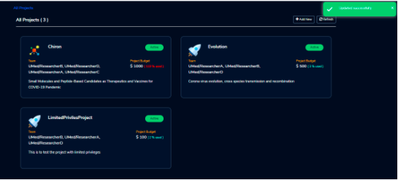
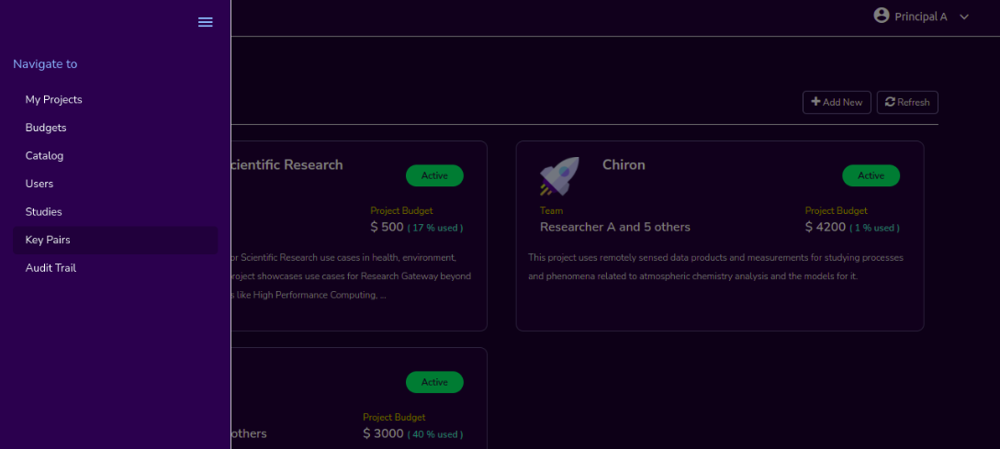

Features
========

.. contents::

---------------------------------

Administrator Features
++++++++++++++++++++++

An Administrator user can perform the following actions.

  * :ref:`Add an Organizational Unit<Adding Organizational Units>`
  * :ref:`Add AWS Accounts for projects<Adding AWS Accounts>`
  * View `Budgets`_
  * View the `Audit Trail`_
  * Add or Assign `Users`_
  * Assign `Catalog`_ Items

.. _Budgets:

Budgets
^^^^^^^
As an Administrator, you can view the organization-wide budgets from the **Budgets** screen with drill-down to the project, researcher and product level.

**Navigation to the Budget**

Login as the Administrator user. Click on “ ≣ “ option which is available on the top-left side. You can see the  following details:

   a. **My Organizations** : Through this, you can navigate to the My Organizations page
   b. **Budget Management** : Through this, you can navigate to the Budget Details page
   c. **Users** : Through this, you can navigate to the User Management page
   d. **Audit Trail** : Through this, you can navigate to the Audit Trail page
   e. **Catalog** : Through this, you can navigate to the Catalog Management page

.. image:: images/AdminMenu.png

**Budget KPIs**

At the top of this view you can see the summary of budgets across all organizational units in the KPI cards.
You can see the following KPI cards:

  * **Total Budget Allotted**: This is the sum total of budget allocated for all projects in the Organization.
  * **Total Budget Consumed**: This is the budget consumed by all Organizations.
  * **Total Budget Available**: This is the portion of the alloted budget which is not yet consumed.

.. image:: images/Image2.png

**Organization-wise budget view**

The Administrator user can view organization-specific budget details by clicking on a specific organization in the available list. 
line
The following details are visible in a table format:

.. csv-table::
   :file: BudgetTable.CSV
   :widths: 70, 100, 70, 70, 300
   :header-rows: 1

The Administrator user can download the Budget details through the “Export CSV”  option. By clicking on a specific line item, the user can see project-wise budget details which are linked to a particular Organizational Unit.

.. image:: images/Image3.png

When Consumed Budget exceeds a threshold (say 80%), the budget management screen should show an alert in the UI and the user will also get an email notification

.. image:: images/budget1.png

**Researcher-wise budget view**

You can  also see researcher-wise budget details which are linked to a particular project and  you can see configured product  details in product-wise budget details page.
 

.. image:: images/Image4.png

Users
^^^^^
As an Administrator you can use the "Users" screen to view all users across Research Gateway. Click on the “ ≣ “ option which is available on the left side header. You can see the  following details:
   
Click on the **Users** menu item to navigate to the Users page.

.. image:: images/user.png

.. image:: images/user1.png

You can see the users in card view or table view. Click on the “≣”  button which is on the right side of the screen.
  
  
.. image:: images/user2.png

There is a search option which is beside the “+Add New” button. You can search based on users, username, and Email id. 

.. image:: images/search.png

If the results are not matched with the searched item it will show a message like “No matching users found”.

.. image:: images/search1.png

You can filter by O.U, Filter by role(Admin/Researcher/Principal Investigator), and sort by username(Asc/Desc), user-role(Asc/Desc), and creation date(Asc/Desc).

.. image:: images/role.png
.. image:: images/filter.png
.. image:: images/sort.png

We have an active filter: enable and disable option. You can toggle between active or all users.

.. image:: images/toggle.png

You can add a new user through the “+Add New” button which is on the right side of the screen. 

Fill the following details 

.. list-table:: 
   :widths: 90, 90 
   :header-rows: 1

   * - Field
     - Details
   * - First Name
     - <Please enter firstname of the user>
   * - Last Name
     - <Please enter last name of the user>
   * - E-mail 
     - <Registered Email ID>
   * - Username
     - <Give the user a name to identify on this platform>
   * - Role
     - <Select a role>
   * - Organizational Unit
     - <Select organizational unit>

Click on the “Add User” button. On successsful completion of user creation you can see the green color toaster message. We are not allowing duplication of Email id and username while new user creation.

.. image:: images/form.png

The verification email has been sent. Check the verification email delivered to the registered email address and click on the verification link to activate the account. 

.. image:: images/Verificationmail-1.png

Users can choose a password and click on the “Submit” button. On successful validation, users will be allowed to login into the Research Gateway. 

.. image:: images/password1.png 

You can perform the following user actions :  

**Assign**

There is a contextual menu which is at the right side of the card. Once clicked on that you can see the actions one by one.  Choose the organizational unit in the drop-down list and click on the “Assign” button. You can see a successful toaster message also. Once assigned you can see O.U name under the Email id. 

.. image:: images/assign.png 

.. image:: images/assign1.png 

**Enable**

There is a contextual menu which is at the right side of the card. Once clicked on that you can see the actions one by one. When clicking on the disable action you can see the message like "A user, once enabled, will be able to log in to the system and carry out activities according to his role. Are you sure you want to proceed?"  in the pop- up with “Enable” button.

.. image:: images/enable.png 

**Disable**

There is a contextual menu which is at the right side of the card. Once clicked on that you can see the actions one by one. When clicking on the disable action you can see the message like "A user, once disabled, will no longer be able to login to the system. Are you sure you want to proceed? in the pop-up with the “Disable” button.

.. image:: images/disable.png 

Audit Trail
^^^^^^^^^^^

We have brought in an  Audit Trail screen for the Administrator to view security-related audits. Click on the “ ≣ “ option which is available on the left side header. You can see the  following details:
   
.. image:: images/Audit1.png

Click on the **Audit Trail** menu item to navigate to the Audit Trail page.

.. image:: images/Audit2.png

You can see the following details in the table view : 

.. csv-table::
   :file: AuditTable.CSV
   :widths: 70, 70, 100, 70, 90
   :header-rows: 1

If we try to search the non-existent word it will display a message like “No matching organizations found". You can see the login and logout and failed login audits. Here you can search based on user, status, and status reason. If audits are not found through the search you can see messages like “No matching audits found”.

.. image:: images/search2.png

.. image:: images/fail.png

You can filter the logs by admin, Principal Investigator, researcher, Organization, and Project. You can also filter the logs through the date. 

.. image:: images/Audit3.png

.. image:: images/Audit4.png

.. _Catalog:

Catalog
^^^^^^^
We have brought in a “Catalog” screen for the Administrator to view all catalog products across RG. Click on the “ ≣ “ option which is available on the left side header. You can see the  following details: 
   
     a. **My Organizations** : Through this, you can navigate to the My Organizations page
     b. **Budgets** : Through this, you can navigate to the Budget Details page 
     c. **Key Pairs**: Through this, you can navigate to the Key Pairs page.
     d. **Users**: Through this, you can navigate to the Users page.
     e. **Catalog**: Through this, you can navigate to the Catalog page.

.. image:: images/catalog.png

.. image:: images/catalog1.png

You can see the standard catalog products on the listing page and you can enable the checkbox which is at the right side of the product and assign to a particular  O.U through the “Assign selected to O.U” button.

.. image:: images/sc.png

.. image:: images/assign2.png

You can view and update the products for the particular organization. Enable the checkbox which is at the right side of the product and click on “Update selected to  O.U '' button . After completion of updation you can see the successful toaster message.

.. image:: images/update.png

You can search  product name and description of the product. We have following filter options:
 
  a. **ALL** : You can see all products here.
  b. **Compute** :  You can see compute related products here.
  c. **Storage**  : You can see storage related products here.
  d. **Application** : You can see application related products here.
 
 .. image:: images/filter1.png
 
 .. image:: images/compute.png
 
If we could not find any products related to the filter you can see the message like “We could not find any products that matched your search”.

.. image:: images/search3.png

Principal Investigator Features
+++++++++++++++++++++++++++++++

As a Principal Investigator, I will be able to create Projects within my Organization. A project will be associated with a Budget with an associated dollar amount that is funded from a specific Grant to the organization. A Project can use Resources only if there is an associated budget that can meet the forecasted needs.

My Projects page of the Research Gateway will list all the existing projects created along with other details. Clicking on a specific project will leads to a project details page.

.. image:: images/projectdetails.png 

How to add a new Project 
^^^^^^^^^^^^^^^^^^^^^^^^
Login to the Research Gateway. Click on the  “+Add New” button. The project application form is opened. 

.. image:: images/add1.png 
 
Fill in the following details

.. list-table:: 
   :widths: 90, 90
   :header-rows: 1

   * - Attribute
     - Details
   * - Project Name
     - <Project Name>
   * - Budget Available
     - <Budget to allocate to this project (cumulative)>
   * - Account ID 
     - <Account ID>
   * - Project Description
     - <Description about the project> 
   * - Add Researchers
     - <Select researchers from the list>
   
Click on the “Add Project” button. Added a new project successfully.

.. image:: images/add.png 

**NOTE**: 

1. When adding a project we are passing researcher information. Through this, we are linking researchers to the project. The project form allows multi-select 
   addition of researchers while creating a project.
2. My Projects page of the Research Gateway will list all the existing projects created along with other details. Clicking on a specific project will lead 
   to a project details page. Click on the specific project you can navigate to the project details page.

How to add researchers to existing project 
^^^^^^^^^^^^^^^^^^^^^^^^^^^^^^^^^^^^^^^^^^
We implemented the Edit functionality for the project entity. The project is independent of the researcher. We should create an empty project and add researchers later also. Click on “Manage (i.e., Pencil icon)” which is at the Assigned researchers field in the Project Details Page.

.. image:: images/add.png 

Select the Researchers and click on the “Update List” button. You can see the “Updated Successfully” toaster message in the UI. You can't unselect the researchers who have associated products. 
 
 .. image:: images/view.png 
 .. image:: images/view1.png
 .. image:: images/update1.png
 
*Note*: Earlier Researchers can be added to a project only at Project creation time(i.e, PI logs into the Organization and creates Projects. In the Add Project screen, the PI associates one or more Researchers to the project).

Actions on Projects
^^^^^^^^^^^^^^^^^^^

The Principal can do Pause/Resume/Stop actions on  a project.

.. image:: images/actionon.png

**Pause Action**

The project status changed to “Paused”. All the researchers under this project would be affected. In a Paused state new provisioning is not allowed. Users can continue to use already provisioned resources as before. All the available products would be visible  but “Launch Now “ button would be hidden.

.. image:: images/pause.png

.. image:: images/pause2.png

**Resume Action** 

The project status changed  to “Active”. In the Active state, team-members can launch new products from the catalog of Available Products.

.. image:: images/resume.png

**Stop Action** 

The project status changed to “Stopped”. In a Stopped state all underlying resources will be stopped and the user will not be able to perform actions on them but you are able to terminate the product. You need to manually start the resources except the s3 product.

.. image:: images/stop.png

.. image:: images/stop2.png

.. image:: images/stop3.png

**Note**: 

If there are any failed provisioned product in my products panel you cannot do actions on the project. You need to terminate that product.

Budgets (for Principal Investigator)
^^^^^^^^^^^^^^^^^^^^^^^^^^^^^^^^^^^^^

We have brought in a budget  screen for the Principal Investigator to view budget consumption across projects.

**Navigation to Budget screen**

Logged as Principal Account. Click on “☰” Symbol which is available  on left side header. You can see menu like: 

  a. **My projects** : Through this, you can navigate to My Projects page.

  b. **Budget**  : Through this, you can navigate to the Budget Details page. 

.. image:: images/budget.png 

.. image:: images/budget2.png

You can see budget details  with different KPI cards. You can see the following KPI cards:

  a. **Total Budget Allotted** : This is the budget allocated for the project during the creation of the project.

  b. **Total Budget Consumed** : This is the budget consumed by all the researchers in the project.

  c. **Total Budget Available** : This is available budget for the project

You can see Project-wise Budget details in the table format:

.. csv-table::
   :file: BudgetTable2.CSV
   :widths: 70, 90, 70, 70, 150
   :header-rows: 1
 
You can download the budget details through the “Export CSV”  option.

Note: When Consumed Budget exceeds a threshold (say 80%), the budget management screen should show an alert in the UI and the user will also get an email notification.

 .. image:: images/budget6.png
 
You can see researcher budget details which are linked to particular products and you can see configured products information in Researcher-wise Budget details page

.. image:: images/budget3.png

.. image:: images/budget4.png

Catalog (for Principal Investigator)
^^^^^^^^^^^^^^^^^^^^^^^^^^^^^^^^^^^^

We have brought in a “Catalog” screen for the Principal Investigator to view all catalog products across RG. Click on the “ ≣ “ option which is available on the left side header. You can see the  following details: 
   
.. image:: images/cat1.png

Click on the **Catalog** menu item to navigate to the Catalog management screen.

.. image:: images/cat2.png

You can see the standard catalog products on the listing page. To assign a set of items to an Organizational Unit, select the items by checking the checkbox which is at the right corner of each product card. Then click the  "Assign selected to a project" button.

.. image:: images/assign2.png

.. image:: images/sc2.png

You can view and update the products for the particular organization. Enable the checkbox which is at the right side of the product and click on “Update selected to  O.U '' button . After completion of updation you can see the successful toaster message.

.. image:: images/update.png

You can use the search field to search for a term in the product name and description of the product. 
You can also use the filter options as below :
  
 a. **ALL** : You can see all products here.
 
 b. **Compute** :  You can see compute related products here.
 
 c. **Storage**  : You can see storage related products here.
 
 d. **Application** : You can see application related products here.
 
  .. image:: images/filter1.png
  
  .. image:: images/compute.png
  
  .. image:: images/storage.png
 
If we could not find any products related to the filter you can see the message like “We could not find any products that matched your search”.

.. image:: images/search3.png

Researcher Features
+++++++++++++++++++

As a Researcher you can view all your projects when you login to Research Gateway. 

.. image:: images/ResearcherLanding.png
 
Researcher can view service catalog products available for the project. Click on a project card to navigate to the Project Details page. You can see KPI cards, available products and active products information in the project details page.

KPI Cards
^^^^^^^^^

You can see the following KPI cards:
a. Available Project Budget
b. Consumed Project Budget
c. My Consumed Budget

**Available Project Budget**

This is the budget allocated for the project during the creation of the project.

**Consumed Project Budget**

This is the budget consumed by all the researchers in the project.

**My Consumed Budget**

This budget is consumed by the researcher who is logged in for that project.

.. image:: images/kpi.png 

Available Products
^^^^^^^^^^^^^^^^^^

You can view the service catalog of products available for the project. These items will be organized into Portfolios. Clicking on a portfolio will display all the Products available in it.

.. image:: images/avaiable.png

You can see the product information in the card. You can know more information about  the product through the “Know More” link. Through the “View Details” link you can see following :

a. **Available Products List view** - You can see the product details in list view.

b. **Available Products Card view** - You can see the product details in card view.

c. **Keyword search** - You can search products based on product type and product description.

.. image:: images/avaiableproduct.png

Product Order
^^^^^^^^^^^^^

Log into the Research Gateway. Researchers can see the projects in All projects page. Click on a Project. Navigate to the **Available products** panel. Choose the product in the list by clicking the **Launch** button on the card.

Product order form is opened. Input parameters associated with the selected product will be displayed as a form at this point. Once all parameters are filled the user will be able to “Launch Now” the form and the item would then be added to the shopping cart.

.. image:: images/product.png 

Note: You are displaying VPC,Subnets and security groups,Subnets and keypair names in the listbox. Through this user can easily select the keypair and while provisioning the product and use the compute resources.

.. image:: images/product2.png 

Each product conveys the expected amount of time it takes to provision through this user knows how much time that provision will take. Listed keypairs are displayed under Key name Field in the form.
If you ordered an EC2 product you can see the toaster message like “Amazon EC2 ordered Successfully” and it will display an information message.

.. image:: images/allprojects.png

My Products
^^^^^^^^^^^

You can see the provisioned products details in the My Products Panel.

You can view provisioned product details like product name, product type and state in the card.
You can see provisioned product details through “View All” option. You can  see all product details.

.. image:: images/myproducts.png

Through the “View All” button in the panel header, you can see following:

   * My Products List view - You can see the details of your provisioned products in list view

   * My Products Card view - You can see the details of your provisioned products in card view

   * Keyword search - You can search provisioned products based on product name, product type and description

.. image:: images/myproduct2.png

.. image:: images/myproducts3.png 

While product is in the *Creating* state the details page displays a time limit that provision will take through the “Live in 5/10/15 mins” tag.

When you click any action(Start/Stop/Terminate) in a provisioned product , state should be changed automatically using server side events.

Actions available for products
^^^^^^^^^^^^^^^^^^^^^^^^^^^^^^^

EC2 Product
----------- 

Researchers can login to the portal and quickly order  EC2 products.
Find the Provisioned EC2 product i.e. Ayush Medicine in the Active Products panel. Or click on the “View All” button to get a list of all provisioned products.
You can see product related actions in the  Actions menu.

1. Start/Stop action : You can start or stop the instance through “Start/Stop” action.

2. Reboot action : You can reboot instances through  “Reboot” action.

3. Terminate action : You can terminate the product through “Terminate” action.

4. SSH/RDP action : Choose options like “SSH/RDP”. Through this you can connect to the server.

Fill the following Details

.. list-table:: 
   :widths: 50, 50
   :header-rows: 1

   * - Attribute
     - Details
   * - Username
     - <Jump server user name>
   * - Authentication Type
     - <Choose password/Pem file>
   * - Upload Pem file
     - <Upload the pem file>

Click on the “Submit” button. Now You can connect to the SSH Terminal in a new window

.. image:: images/E2E.png

.. image:: images/E2E2.png

S3 Product
-----------

Researcher can login to the portal and quickly order S3 Product.
Find the S3 in the Active Products panel. Or click on the “View All” button to get a list of all provisioned products.
You can see product related actions in the  Actions menu.

**1. Upload Action**

Choose an option like “Upload”. Upload file(File should not contain more than 10MB). Through this you can Upload a file in S3 bucket.

.. image:: images/testingevent2.png

**2. Share Action**

Choose the option like “Share”. Through this you can  share the details to other team members.

**NOTE:** If there are no researchers in the list you will see a message like **“No researchers are available. Please add a new researcher to share the s3 bucket “**

.. image:: images/testingevent1.png

.. image:: images/testingevent3.png

.. image:: images/testingevent4.png

**3. Terminate Action**

Choose an option like “Terminate”. Through this you can terminate the product
You implemented a check to find out if a file exists in the bucket or not . If exists it will throw an error message accordingly. i.e. ”The bucket is not empty. Please delete all contents from the bucket and try again.”

.. image:: images/action.png

**4. Explore Action**

a. Through this action you can show all the files and folders in the S3 bucket with actions (download, delete) against each item.
b. For folders the user will be able to double-click on the item and drill-down to a deeper level to see the files and folders in that level.
c. For any deeper level, the user will be able to navigate back to an upper level.
d. You can upload the different files (File should not contain more than 10MB)

.. image:: images/exploreaction.png

.. image:: images/exploreaction2.png

**5. Link Action**

You have to link Sagemaker from the S3 product details page using the provisioned product ID.
For a S3 Provisioned Product, you should have a new action item called “Link”

.. image:: images/linking.png 

This action item should be a pop up which will have the list (dropdown) of active sagemakers for that user.

.. image:: images/linking2.png

You should have an icon similar to the shared icon for showing that this S3 bucket is linked with sagemaker.
You should also see an “Unlink action” to unlink sagemakers from s3 bucket side. You are providing “Copy bucket name” action from sagemaker product side.

.. image:: images/event.png

.. image:: images/event2.png

If there are no active sagemaker products we are showing the following message to the user “There is no provisioned Sagemaker product. Please Launch a sagemaker product from the available products page first,before linking to an s3 bucket”.

.. image:: images/computerresource.png 

SageMaker Product
-----------------

Researcher can login to the portal and quickly order SageMaker products.
Find the Sagemaker product in the Active Products panel. Or click on the “View All” button to get a list of all provisioned products.
You can see product related actions in the  Actions menu.

1. Open Notebook : You can navigate to notebook through “Open Notebook“ action.

2. Start/Stop action : You can stop the instance through “Start/Stop” action. Based on the instance state, you will see either the Start or the Stop action.

3. Terminate Action: You can terminate the product through “Terminate” action.

.. image:: images/sagemaker.png

HPC Product
-----------

AWS provides the most elastic and scalable cloud infrastructure to run your HPC applications. AWS delivers an integrated suite of services that provides everything needed to quickly and easily build and manage HPC clusters in the cloud to run the most compute intensive workloads across various industry verticals. These workloads span the traditional HPC applications, weather prediction, and seismic imaging, as well as emerging applications, like machine learning, deep learning, and autonomous driving. This product has a master node and cluster nodes with a auto scaling group which will enable the cluster nodes required to be completed. It has many job schedulers like Slurm, AWS jobs. You have used a CFT to make this product provisioned.

.. image:: images/hpc.png

.. image:: images/hpc2.png

**Navigation to the other screens**

Click on the “☰”  Symbol which is available on the left side header. You can see a menu like :

1. **My Projects** : Through this, you can navigate to My Projects page
2. **Budgets** : Through this, you can navigate to the Budget Details page 
3. **Studies** : Through this, you can navigate to the Studies Details page.
4. **Key Pairs** : Through this, you can navigate to the Key Pairs Details page.

Budgets (for Researcher)
^^^^^^^^^^^^^^^^^^^^^^^^
As a researcher you can use the **Budgets** screen to view your individual budget consumption across projects. You can see budget details with different KPI cards. You can see the following KPI cards:

**Navigation to Budget screen**

Logged as Researcher Account. Click on “☰” Symbol which is available  on left side header. You can see menu like :

  a. **My projects** : Through this, you can navigate to My Projects page.
  b. **Budget**  : Through this, you can navigate to the Budget Details page. 
  
 .. image:: images/bud1.png 
  
You can see budget details with different KPI cards. You can see the following KPI cards :

1. **Total Budget Allotted** : This is the budget allocated for the project during the creation of the project.
2. **Total Budget Consumed** : This is the budget consumed by all the researchers in the project.
3. **Total Budget Available** : This is the available budget for the project.

 
 .. image:: images/bud2.png 
 
You can see Project-wise Budget details in the table format:

.. csv-table::
   :file: BudgetTable2.CSV
   :widths: 70, 90, 100, 100, 150
   :header-rows: 1

You can see configured product-wise budget details which are linked to a particular project.

 .. image:: images/prod1.png

Studies
^^^^^^^
In the research field, the ability to use data stores or "Studies" is key. A researcher may have his own data ("My Study"), or a Principal may create a data-store that is shared across researchers in the same project (Project Studies) or the researcher may connect to Open Data like the AWS registry of open data.

.. image:: images/studies.png

A researcher persona will have a menu item that leads to the “Studies” landing page. The “Studies” landing page lists the datasets as cards. 

Each card shows the following data:

1. Name
2. Description
3. Tags
4. Bookmark this study.
5. View Details link(Clicking on the “View details” call-to-action on a study card will lead to a Study details page).

.. image:: images/studies1.png

The studies landing page should have a “Filter” feature that allows the user to filter the listing by predetermined criteria. You can see options like Public/Private/Bookmarked/All Studies.

.. image:: images/fil1.png

The studies landing page has a search bar that allows users to search the collection. (search will be dynamic).

.. image:: images/sea1.png

Personal Study
--------------
A researcher may have his own data or a Principal may create a data-store that is shared across researchers in the same project through the “Share” option.  The “Study” details page will show a tabbed area with the following tabs:
   1. Study details
   2. Product details

The “Study details” tab will show all the details of the study available in the collection. The actions associated with the study will be shown in an actions bar on the right side of the page. The “Product details” tab will show the details of the associated product (S3 bucket). This will replicate the product details page of the associated S3 bucket and show the same actions associated with the s3 bucket.

 .. image:: images/personal.PNG
 .. image:: images/sc4.PNG

**Explore Action**
 
Through this action, you can see all the files and folders in the S3 bucket with actions (download, delete) against each item.
  a. For folders, the user will be able to double-click on the item and drill-down to a deeper level to see the files and folders in that level.
  b. For any deeper level, the user will be able to navigate back to an upper level.
  c. You can upload the different files (The file should not contain more than 10MB).
  
 .. image:: images/ex1.png
 
**Link/Unlink Action**
 
1. A user can link a study to a compute resource using the “Link” action in the Actions bar. This action item should be a 
   p-up that will have the list (dropdown) of active sagemakers for that user.
2. You will see an icon similar to the shared icon for showing that this S3 bucket is linked with sagemaker.
3. You can link the study with multiple sagemaker notebooks.  Through the “unlink resource” you can unlink with compute resources
4. If there are no active sagemaker products we are showing the following message to the user **There is no provisioned Sagemaker product. Please Launch a sagemaker 
   product from the available products page first, before linking to an s3 bucket**.

 .. image:: images/link1.png  
 
 .. image:: images/unlink.PNG

 .. image:: images/unlink2.PNG
 
**Share Action**
 
 Choose the option like “Share”. Through this, you can share the details with other team members. If there are no researchers in the list it will show a message like “No researchers are available. Please add a new researcher to share the s3 bucket “

 .. image:: images/share1.png
 
 .. image:: images/share3.png
 
**Terminate Action**

You can terminate the study through the “Terminate” option.

 .. image:: images/ter1.png

Public Study
------------
A principal may create a data-store. The “Study” details page will show a tabbed area with the following tabs:

	a. Study details : The “Study details” tab will show all the details of the study available in the collection. Actions associated with the study will be shown in an actions bar on the right side of the page.
	b. Resource details: The “Resource details” tab will show the details of the associated product (S3 bucket). This will replicate the product details page of the associated S3 bucket and show the same actions associated with the s3 bucket.
											
 .. image:: images/sc3.png
 
 .. image:: images/public.png
  
**Explore Action**

You can see the files/folders which are  related to the datastore.

.. image:: images/ex1.png

**Link/Unlink Action**

1. A user will be able to link a study to a compute resource using the “Link” action in the Actions bar. This action item should be a pop-up that will have the list (dropdown) of active sagemakers for that user.
2. You can see an icon similar to the shared icon for showing that this S3 bucket is linked with sagemaker.
3. You can link the study with multiple sagemaker notebooks.  Through the “unlink resource” you can unlink with compute resources
4. If there are no active sagemaker products we are showing the following message to the user **There is no provisioned Sagemaker product. Please Launch a sagemaker product from the available products page first, before linking to an s3 bucket**.
 
 .. image:: images/link2.png
 
 .. image:: images/unlink.png
 
 .. image:: images/unlink2.png
  
 .. image:: images/link1.png  
 

Key Pairs
^^^^^^^^^
The Key Pairs screen can be used by the Researcher to view keypair details across projects.
 

.. image:: images/key2.png

You can create new key pairs through our portal. The user will initiate the creation of a keypair and once it is created the user will download the private key. The download is allowed only once post which the screen only lists the keypair by name.
  
Click on the "+Create New" button which is available at right side of the page. Fill the deatils in the form and click on the “Create Key Pair” button. New Keypair was created successfully.

.. image:: images/key3.png

You can see key Pairs details in table format:

.. csv-table::
   :file: Keypair.CSV
   :widths: 70, 70, 70, 70, 70
   :header-rows: 1

The user can delete the keypair. Click the 3-dotted action on the right side of the table. You can see the delete keypair through the “Delete” action.

.. image:: images/delete.png

You can search the keypair through Keypair name and Project name.

Ex: Type “Chiron” in the search area it should display the keypairs which are attached to the Chiron project.

.. image:: images/se1.png

Instance-wide Features
++++++++++++++++++++++

SAML 2.0
^^^^^^^^

SAML is an open standard for exchanging authentication and authorization data between parties, in particular, between an identity provider and a service provider. SAML is an XML-based markup language for security assertions

Security Assertion Markup Language (SAML) is a standard for logging users into applications based on their sessions in another context. This single sign-on (SSO) login standard has significant advantages over logging in using a username/password

.. image:: images/saml.png

RLCatalyst Research Gateway supports integration with Identity Providers that support SAML 2.0. If you need your instance of the gateway integrated with your IdP please contact us.

Research Gateway as SaaS solution on AWS Marketplace
^^^^^^^^^^^^^^^^^^^^^^^^^^^^^^^^^^^^^^^^^^^^^^^^^^^^
Research Gateway is available as a software as a service (SaaS) solution on AWS Marketplace as a SaaS Contract on Monthly or Annual basis. Customers can choose to auto-renew their contacts on expiry.

SaaS Subscription Steps
-----------------------
The below steps that will be done for publishing our product as Saas in the AWS marketplace.

**a. User Subscription**

When our product has been listed for consumption in the AWS marketplace, customers can subscribe to our product.

1. Log in to AWS account with valid credentials. Navigate to AWS Marketplace.
2. Type “RLCatalyst” in the search bar. You can see the result as **RLCatalyst Research Gateway(Saas)** 

  a. Show the pricing information(Small/Medium/Large). 
	b. Show option of Monthly or Annual. 
	c. Show option of Auto-renewal (Yes/No).
	
 Click on the “Continue on Subscribe” button which is available at the top right side of the page. Fill the required parameters like contract options and renewal settings. Now click on the “Create contract” button. Click on “Pay Now” button. After completion of payment options, the user will be redirected to the RG registration website.
 
**b. Registration page**

After subscribing to the product, the customer is directed to a website we create and manage as a part of our SaaS product to register their account and configure the product. When creating our product, we provide a URL to our registration landing page. AWS Marketplace 
uses that URL to redirect customers to our registration landing page after they subscribe. On our software's registration URL, we collect whatever information is required to create an account for the customer. After successful registration, we will be notifying the customer 
when the product is available for them to consume with a login URL and admin credentials.

**c. Create a new instance of the portal**

When a new customer signs up for our product, we will be creating a new instance of our product and host it in a different environment for 
the customer. An URL will be created for the new environment which they will be shared with the customer. Once a new environment 
is created, we will seed admin credentials to the database and the same will be shared with the customer along with the URL created in the previous step.

1. Login to the Research Gateway  with the new password. Navigate to the Provider settings and click on the “+Add New” button ---Fill the required parameters and click on the “Add” button.
2. Navigate to the “Users” through the left navigation menu.
3. Click on the “+Add New” button in the users listing page. A new user form opened. Fill the required parameters and click on the “Add User” button. A new user with PI role was created.
4. Navigate to “Users” through the left navigation menu. Click on the “+Add New” button in the users listing page. A new user form opened. Fill the required parameters and click on the “Add User” button. A new user with a researcher role was created.
   **Note**: Assign the researcher to the organization while .
5. Navigate to “My Organization” through the left navigation menu . Users can create a new organization with the “+Add New” button on the landing page.
6. Navigate to catalog through the left navigation menu . In the filter select the “View -Standard catalog “  option and enable the checkboxes which are available at the right side of the products and click on the “Assign to selected O.U” button. Select the organization in the list box and click on the “Assign” button.
7. Login to PI account<<Create a new project with the “+Add New” button on the landing page.
   **Note**: You need to select the researcher from the list.
8. Navigate to the catalog through the left navigation menu and choose the  “View-O.U catalog” in the filter and enable the checkboxes which are at the right side of the products and click on “Assign to a project” button and on Successful completion of assign you can see green color toaster message.
9. Login as Researcher <<Navigate to the project details page--you can see the assigned catalog products in the available products panel. 
   Choose the product and click on the “Launch Now” button. Fill the required parameters in the form and launch it. 
   **Note**: While creating the EC2 we need to enter the key pair name.  Navigate to the keypairs through the left navigation menu. Click on the “+Create New” button. Fill the required parameters and click on the “Create key pair” button. New key pair was created. Now navigate to the available products panel. Choose EC2 product and fill the params and click on the “Launch Now” button. The product was launched successfully.

**d. Tracking usage**

When the product is live for the customer to use, we have to track the usage of the customer based on the pricing model they chose while subscribing to our product and the dimension they are consuming. For software as a service (SaaS) subscriptions, we meter for all usage, and then customers are billed by AWS based on the metering records that we provide. For SaaS contracts, we only make sure that the customer is not using the product beyond the contract’s entitlements.

