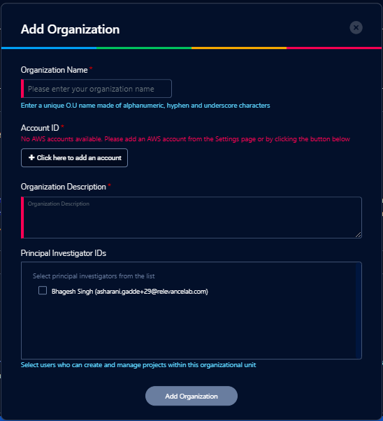

Getting Started
===============

Research Gateway is a cloud-based solution that makes it possible for researchers and other consumers of High Performance Computing to easily access resources in the AWS cloud.
RLCatalyst Research Gateway is designed for simplicity and you can get started very quickly. 
You can access this product either as a `hosted SaaS product`_ or as an Enterprise product.

.. _hosted SaaS product: https://relevancelab.com/2021/02/11/8-steps-to-set-up-rlcatalyst-research-gateway/

If you are using the hosted version, you will be provided a public URL to which you can navigate using your browser. 
You will also be provided with the credentials for the Administrator user.

If you are using the Enterprise version, your IT department will provide you a URL to access the product. You can set up an Administrator user by following the steps below.

.. contents::

Planning your set up
--------------------

Setting up your RLCatalyst Research Gateway for use involves the following steps.

.. image:: images/FirstSetupTask.png 

Users with the Administrator role can perform the steps below.

  * :ref:`Adding Users<Adding Users>` - Users can have Administrator, Principal Investigator or Researcher roles.
  * `Adding AWS Accounts`_
  * `Adding Organizational Units`_

Users with the Principal Investigator role can perform the steps below.
  
  * `Adding a New Project`_
  * `Assigning Researchers to projects`_

Create an Admin user
--------------------

If you have subscribed to the hosted version of the Research Gateway application, you would have created the Admin user during registration.
You would have subsequently received an email with a link to confirm the Administrator user's email. Use this username to login to Research Gateway.

Sign-In Process
---------------
Use details from :ref:`Appendix A<Appendix A>` for  User Name, Password as per password policy.

Fill the following details 

.. list-table:: 
   :widths: 50 50
   :header-rows: 1

   * - Field
     - Details
   * - Username
     - <Username that is used for login>
   * - Password
     - <Password for this user>
	 
Click on the “Sign-In“ button. We can log in successfully.

.. image:: images/login.png

	
Forgot Password
---------------
In case you have forgotten your password, you can use the “Forgot Password” link on the login screen which is under the "Sign In" button.

click the link to navigate to the reset password screen.  

.. image:: images/forgot.png

Fill the following details

.. list-table:: 
   :widths: 50, 50
   :header-rows: 1

   * - Field
     - Details
   * - Username
     - <Username that is used for login>
   * - E-mail address
     - <Registered Email ID>
   
Click on "Send Resend link" button. If the provided details are valid, you will get a verification link on the registered email address to reset the password. On clicking the link in the email, the user is lead to the change password screen.  

.. image:: images/verificationemail.png

**Note**: The password policy should meet the following requirement
   a. The minimum password length of 8 characters and a maximum of 16 characters.
   b. It should have atleast one lower case character(a-z).
   c. It should have atleast one upper case character(A-Z).
   d. It should have atleast one number(0-9).
   e. It should have atleast one special character (= + - ^ $ * . [ ] { } ( ) ? ! @ # % & / , > < ' : ; | _ ~).

If the password change is successful you can navigate to the verification successful page. Through the "Click here to login button" you can navigate to the login screen.
 
If the password change is unsuccessful you can see the verification error screen. 

.. image:: images/password.png

.. image:: images/success.png

Sign-Up process
---------------

An Administrator can add a new user to the system. See the :ref:`Adding Users<Adding Users>` section for details.
When an Administrator adds a user to the systen, the user will receive a verification email with a link. When the user clicks on the link he is led to a page where he should change his password.

The password needs to confirm to the password policy. 

.. image:: images/verificationemail2.png

On successful validation, users  will be allowed to login into the Research Gateway. 

.. _`Adding Organizational Units`:

Adding Organizational Units
---------------------------

To plan the creation of a new Organization, use the planning sheet in :ref:`Appendix A<Appendix A>` to collect all the information required upfront. Login into the Research Gateway. User landed to the  main dashboard.

.. image:: images/OrganizationPage.png

Click on the “+Add New” icon  which is at the top right corner. Organization form is opened.

.. list-table:: 
   :widths: 50, 50
   :header-rows: 1

   * - Field
     - Details
   * - Organization Name
     - <Name of the Organization> [Enter a unique O.U. name made of the alphanumeric, hyphen and underscore characters]
   * - Organization Description
     - <Description>
   * - Account ID
     - <Select ID>
   * - Principal Investigator ID
     - <Select Principal ID > [Optional]
	 
Click on the **“Add Organization”** button. The new organizational unit is added successfully.

**NOTE**: 

a. Through the "Click here to add an account" button you can navigate to the add provider settings page and add an account. 
b. You can create an organization without Principal Investigator. Through the "Assign O.U." option in user management, you can assign later.

The Organizations page of the Research Gateway lists all the existing organizational units created, with some details of each organization displayed on the card. Clicking on a specific organization shall lead to “View Organization Details” window .

.. image:: images/ViewOrganizationDetailsPage.png

.. _`Adding AWS Accounts`:

Adding an AWS account to use in a project
---------------------------------------------

Login into the Research Gateway. Click on dropdown bar which is above the header. Choose the  “Settings” option

.. image:: images/Providersettings.png 
   :name: Provider Settings menu item

Click on  the  “Settings” menu item. Provider settings page is opened.

.. image:: images/Provider2.png 
   :name: Provider Settings Page
   
**Note:**  When we add the settings please make sure the user credentials has the IAMFullAccess.

Click on  the  “+Add New” button in the provider setting page. The Add Provider setting dialog-box is opened.

.. image:: images/AddProviderNew.png
   :name: Add Provider Settings screen
   
Fill the following details

.. list-table:: 
   :widths: 50, 50
   :header-rows: 1

   * - Attribute
     - Details
   * - Account Name
     - <Account Name> [The Account name should be unique and only alphanumeric characters, hyphen and underscores are allowed]
   * - Account Key
     - <Account Key> [It should be a minimum of 16 characters and a maximum of 128 characters]
   * - Secret Key
     - <Secret Key> [It should be a minimum of 40 characters and a maximum of 128 characters]
   * - Region
     - <Region> 
   * - Account Number
     - <AWS Account Number> [It should be a 12-digit number]

Click on the “Add” button. An AWS account was added successfully. You can see all the account details in a table format.

**NOTE**: Please ensure that the IAM user whose credentials you entered has the IAMFullAccess/AdministratorAccess policy attached otherwise, it will through an error message accordingly.

On each line item there is a contextual menu. Through this we can edit, delete, Assign O.U. and sync the account.

.. image:: images/Project.png

Click on the 3-dotted icon which is available at the right side of the account details page and select “Edit” option and Edit provider settings page is opened.
Update the  access key  and secret key fields and click on “Add” button. The provider setting got updated successfully.

.. image:: images/Editprovider.png 
.. image:: images/editprovider2.png

Click on the 3-dotted icon which is available at the right side of the account details page and choose “Delete” option. A confirmation dialog box is opened. On confirmation the account will be deleted. You can only delete provider settings that are not linked to any project or organization.

.. image:: images/deleteprovider.png

Click on the contextual menu which is available at the right side of the account name and choose the "Assign O.U" option. 

.. image:: images/Assign-OU.png

One window is opened and all organizational units are listed there. Choose one organization from the list and click on the "Assign" button. On successful completion you can see the green color toaster message.

.. image:: images/Assign123.png

.. image:: images/Assign4.png

**Note** : When the account is not linked to any other organizations than only you can see the "Assign O.U" option.
 
Research Gateway works in conjunction with AWS Service Catalog. To synchronize the Service Catalog to your project, select the Product Sync option.
Click on the “Sync Now” button. Once the synchronization is started you should see the “Sync Started” message.

.. image:: images/sync1.png

.. image:: images/sync2.png

**Note**: The "Sync Now" option can get the products from the shared, local, account and organization level portfolio.

.. _`Adding a new project`:

Adding a new project
-------------------- 

Login to the Research Gateway as a Principal Investigator. Click on the  “+Add New” button. Project application form is opened.

.. image:: images/principalaccount.png

.. image:: images/AddProjectNew.png

Fill in the following details

.. list-table:: 
   :widths: 50, 50
   :header-rows: 1

   * - Attribute
     - Details
   * - Project Name
     - <Project Name> [Enter a unique project name made of alphanumeric, hyphen and underscore characters]
   * - Budget Available
     - <Budget to allocate to this project (cumulative)> 
   * - Account ID 
     - <Account ID>
   * - Project Description
     - <Description about the project> 
   * - Add Researchers
     - <Select researchers from the list> [optional]

Click on the “Add Project” button. Added a new project successfully.

**Note**:

a. When adding a project we are passing researcher information. Through this, we are linking researchers to the project. 
b. The project is independent of the researcher. We can create an empty project and add researchers later. Through the "Manage" option in the view project details screen.
c. If an AWS account is not available under an account ID field you can see a message like **"No AWS accounts available. Please contact your administrator to add AWS accounts to your organization"**.

*My Projects* page of the Research Gateway lists all the existing projects created along with other details. Clicking on a specific project shall leads to a project details page.

.. image:: images/projectdetails.png 

Assigning Researchers to projects
---------------------------------

There is an edit functionality for the project entity. The project is independent of the researcher. An user can create an empty project and add researchers later also. Click on “Manage (i.e., Pencil icon)” which is at the Assigned researchers field in the Project Details Page.

.. image:: images/Add.png 

Select the Researchers and click on the “Update List” button. You can see the “Updated Successfully” toaster message in the UI. You can't unselect the researchers who have associated products. 
 
 .. image:: images/view.png 
 .. image:: images/view1.png
 .. image:: images/update1.png
 
