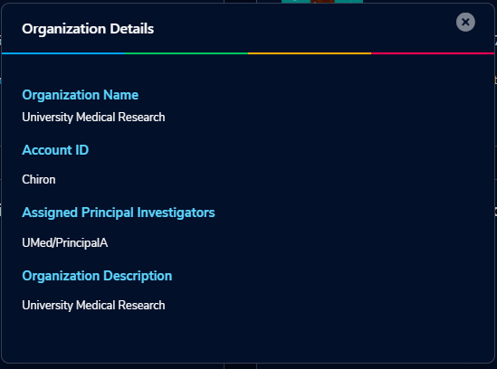
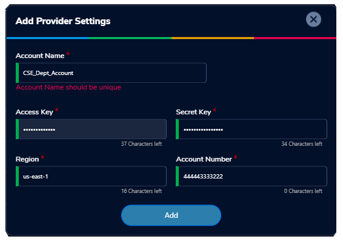
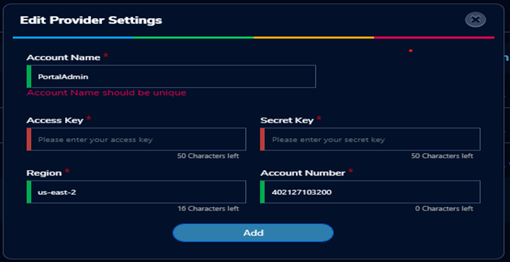
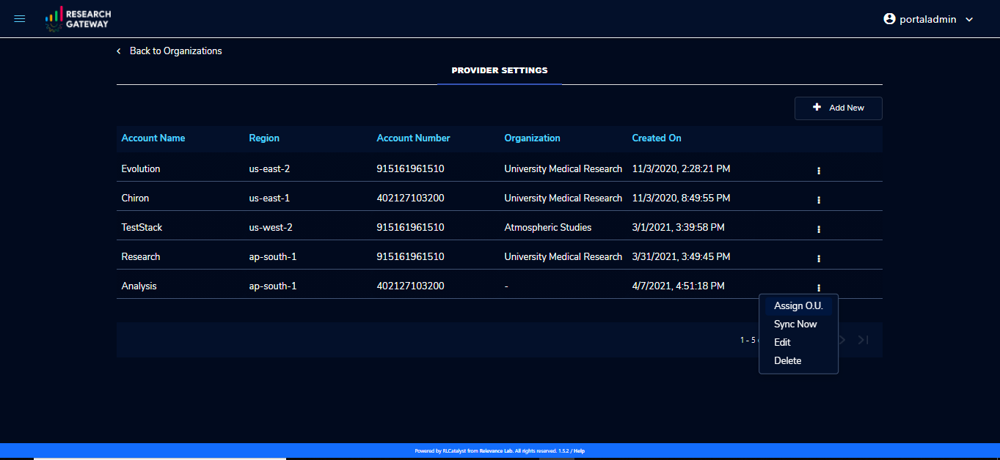
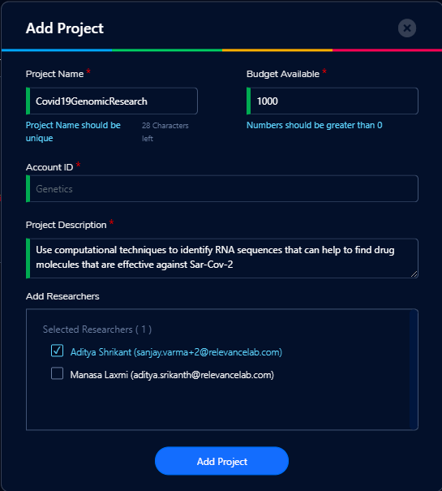
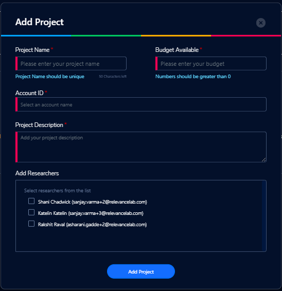

Getting Started
===============

Research Gateway is a cloud-based solution that makes it possible for researchers and other consumers of High Performance Computing to easily access resources in the AWS cloud.
RLCatalyst Research Gateway is designed for simplicity and you can get started very quickly. 
You can access this product either as a `hosted SaaS product`_ or as an Enterprise product.

.. _hosted SaaS product: https://relevancelab.com/2021/02/11/8-steps-to-set-up-rlcatalyst-research-gateway/

If you are using the hosted version, you will be provided a public URL to which you can navigate using your browser. 
You will also be provided with the credentials for the Administrator user.

If you are using the Enterprise version, your IT department will provide you a URL to access the product. You can set up an Administrator user by following the steps below.

.. contents::

Planning your set up
--------------------

Setting up your RLCatalyst Research Gateway for use involves the following steps.

.. image:: images/FirstSetupTask.png 

Users with the Administrator role can perform the steps below.

  * :ref:`Adding Users<Adding Users>` - Users can have Administrator, Principal Investigator or Researcher roles.
  * `Adding AWS Accounts`_
  * `Adding Organizational Units`_

Users with the Principal Investigator role can perform the steps below.
  
  * `Adding a New Project`_
  * `Assigning Researchers to projects`_

Create an Admin user
--------------------

If you have subscribed to the hosted version of the Research Gateway application, you would have created the Admin user during registration.
You would have subsequently received an email with a link to confirm the Administrator user's email. Use this username to login to Research Gateway.

Sign-In Process
---------------
Use details from :ref:`Appendix A<Appendix A>` for  User Name, Password as per password policy.

Fill the following details 

.. list-table:: 
   :widths: 50 50
   :header-rows: 1

   * - Field
     - Details
   * - Username
     - <Username that is used for login>
   * - Password
     - <Password for this user>
	 
Click on the “Sign-In“ button. We can log in successfully.

.. image:: images/login.png

	
Forgot Password
---------------
In case you have forgotten your password, you can use the “Forgot Password” link on the login screen which is under the "Sign In" button.

click the link to navigate to the reset password screen.  

.. image:: images/forgot.png

Fill the following details

.. list-table:: 
   :widths: 50, 50
   :header-rows: 1

   * - Field
     - Details
   * - Username
     - <Username that is used for login>
   * - E-mail address
     - <Registered Email ID>
   
Click on "Send Resend link" button. If the provided details are valid, you will get a verification link on the registered email address to reset the password. On clicking the link in the email, the user is lead to the change password screen.  

.. image:: images/verificationemail.png

The password change is either successful or unsuccessful (this will be like verification success and error screens).  The user is then redirected back to the login screen.

.. image:: images/password.png

.. image:: images/success.png

Sign-Up process
---------------

An Administrator can add a new user to the system. See the :ref:`Adding Users<Adding Users>` section for details.
When an Administrator adds a user to the systen, the user will receive a verification email with a link. When the user clicks on the link he is led to a page where he should change his password.

The password needs to conform to the password policy. 

.. image:: images/verificationemail2.png

On successful validation, users  will be allowed to login into the Research Gateway. 

.. _`Adding Organizational Units`:

Adding Organizational Units
---------------------------

To plan the creation of a new Organization, use the planning sheet in :ref:`Appendix A<Appendix A>` to collect all the information required upfront. Login into the Research Gateway. User landed to the  main dashboard.

.. image:: images/OrganizationPage.png

Click on the “+Add New” icon  which is at the top right corner. Organization form is opened.

.. list-table:: 
   :widths: 50, 50
   :header-rows: 1

   * - Field
     - Details
   * - Organization Name
     - <Name of the Organization>
   * - Organization Description
     - <Description>
   * - Account ID
     - <Select ID> [Multiple AWS accounts to be  linked.Here we have a list]
   * - Principal
     - <Select Principal ID > [Select from the list one or more users with the Principal Investigator role]

Click on the **“Add Organization”** button. The new organizational unit should be added successfully.

**NOTE**:We are selecting a specific AWS account when adding new organization. This links the account to organizations. The organization form allows multiple Account IDs and multi-select on the Principal Investigators list.

The Organizations page of the Research Gateway lists all the existing organizational units created, with some details of each organization displayed on the card. Clicking on a specific organization shall lead to “View Organization Details” window .

.. _`Adding AWS Accounts`:

Adding an AWS account to use in a project
---------------------------------------------

Login into the Research Gateway. Click on dropdown bar which is above the header. Choose the  “Settings” option

.. image:: images/Providersettings.png 
   :name: Provider Settings menu item

Click on  the  “Settings” menu item. Provider settings page is opened.

.. image:: images/Provider2.png 
   :name: Provider Settings Page
   
**Note:** You need to follow the below steps before adding the settings. These steps are used to create the IAM user in the target account which has the following policies attached. We perform all the operations using this user.
 
Method-1:

1. Login to the AWS console and navigate to the IAM service. 
2. Click on the "Add User" button and give the username exactly as "RG-PortalUser". 
3. Select Access type as Programmatic access this will create secret key and access key and AWS Management console access. You need to use these credentials while creating the settings.
4. Select “Attach existing policies directly” and select the AWS Managed Policies which is mentioned below

	* arn:aws:iam::aws:policy/AmazonEC2FullAccess
	* arn:aws:iam::aws:policy/SecretsManagerReadWrite
	* arn:aws:iam::aws:policy/service-role/AWSConfigRole
	* arn:aws:iam::aws:policy/AmazonSSMFullAccess
	* arn:aws:iam::aws:policy/AWSServiceCatalogAdminFullAccess
	* arn:aws:iam::aws:policy/AmazonSageMakerFullAccess
	* arn:aws:iam::aws:policy/AWSBudgetsActionsWithAWSResourceControlAccess
	* arn:aws:iam::aws:policy/AmazonEventBridgeFullAccess
	* arn:aws:iam::aws:policy/AWSCloudTrail_FullAccess
	* arn:aws:iam::aws:policy/AWSCloudFormationFullAccess

5. Click on the "Next" button. It will create a user.
6. Click on the “Add Inline Policy” and copy the JSON with the inline policy name which is mentioned below. 

*Note:* You have to add all the below mentioned policies.

AWSConfigFullAccess

.. literalinclude:: AWSConfigFullAccess.json
  :language: JSON
  :linenos:
  
CostExplorerReadOnlyAccess

.. literalinclude:: CostExplorerReadOnlyAccess.json
  :language: JSON
  :linenos:

IAMFullAccess

.. literalinclude:: IAMFullAccess.json
  :language: JSON
  :linenos:
  
S3FullAccess

.. literalinclude:: S3FullAccess.json
  :language: JSON
  :linenos:
  
SESFullAccess

.. literalinclude:: SESFullAccess.json
  :language: JSON
  :linenos:
  
SNSFullAccess

.. literalinclude:: SNSFullAccess.json
  :language: JSON
  :linenos:

STSFullAccess

.. literalinclude:: STSFullAccess.json
  :language: JSON
  :linenos:

-------------------------------------------------------------------------------------

Method-2

This method will make the use of script to create the user. Please follow the below mentioned steps:

1. Download the RG-PortalUserScriptFolder from the following link 
    https://rlcatalyst-researchportal.s3.us-east-2.amazonaws.com/RG-PortalUserScriptFolder.zip
2. After extracting the zipped folder you will find the following documents
	a. Access-policy.json
	b. RGPortalUserScript.sh
3. Please make sure you have AWS CLI installed and configured with user credentials which have IAMFullAccess. You can do this  using `aws configure` command before executing the script. Refer the following link for help
	a. https://docs.aws.amazon.com/cli/latest/userguide/cli-chap-install.html
	b. https://docs.aws.amazon.com/cli/latest/reference/configure/
4. Set the execute permission on your script using the below chmod command. 
     chmod +x RGPortalUserScript.sh
5. You can run the script using any of the following commands. Please save the *AccessKeyId* and *SecretAccessKey* from the output of the script to use them during the settings creation of Research Gateway.
	a. ./RGPortalUserScript.sh 
	b. sh RGPortalUserScript.sh 
	c. bash RGPortalUserScript.sh

-------------------------------------------------------------------------------------------------

Click on  the  “+Add New” button in the provider setting page. The Add Provider setting dialog-box is opened.

   
Fill the following details

.. list-table:: 
   :widths: 50, 50
   :header-rows: 1

   * - Attribute
     - Details
   * - Account Name
     - <Account Name>
   * - Account Key
     - <Account Key>
   * - Secret Key
     - <Secret Key>
   * - Region
     - <Region>
   * - Account Number
     - <AWS Account Number>

Click on the “Add” button. AWS account was added successfully and will show in the table of providers in the Provider Settings page.

On each line item there is a contextual menu. Through this we can edit, delete, Assign O.U. and sync the account.

.. image:: images/Project.png

Click on the 3-dotted icon which is available at the right side of the account details page and select “Edit” option. Provider settings page is opened.
Update the fields and click on “Add”. Provider setting is updated successfully.

.. image:: images/Editprovider.png 

Click on the 3-dotted icon which is available at the right side of the account details page and choose “Delete” option. A confirmation dialog box is opened. On confirmation the account will be deleted. You can only delete provider settings that are not linked to any project or organization.

.. image:: images/deleteprovider.png

Click on the contextual menu which is available at the right side of the account name and choose the "Assign O.U" option. 

One window is opened and all organizational units are listed there. Choose one organization from the list and click on the "Assign" button. On successful completion you can see the green color toaster message.

.. image:: images/Assign123.png

.. image:: images/Assign4.png

**Note** : When the account is not linked to any other organizations than only you can see the "Assign O.U" option.
 
Research Gateway works in conjunction with AWS Service Catalog. To synchronize the Service Catalog to your project, select the Product Sync option.
Click on the “Sync Now” button. Once the synchronization is complete you should see the “Sync completed” message.

.. image:: images/sync1.png

.. image:: images/sync2.png

.. _`Adding a new project`:

Adding a new project
-------------------- 

Login to the Research Gateway as a Principal Investigator. Click on the  “+Add New” button. Project application form is opened.

.. image:: images/principalaccount.png

Fill in the following details

.. list-table:: 
   :widths: 50, 50
   :header-rows: 1

   * - Attribute
     - Details
   * - Project Name
     - <Project Name>
   * - Budget Available
     - <Budget to allocate to this project (cumulative)>
   * - Account ID 
     - <Account ID>
   * - Project Description
     - <Description about the project> 
   * - Add Researchers
     - <Select researchers from the list>

Click on the “Add Project” button. Added a new project successfully.

**Note**:When adding a project we are  passing researcher information. Through this we are linking researchers to the project. The project form allows multi-select addition of researchers while creating a project.

**Note:  The project is independent of the researcher. We can create an empty project and add researchers later**

*My Projects* page of the Research Gateway lists all the existing projects created along with other details. Clicking on a specific project shall leads to a project details page.

.. image:: images/projectdetails.png 

Assigning Researchers to projects
---------------------------------

There is an edit functionality for the project entity. The project is independent of the researcher. An user can create an empty project and add researchers later also. Click on “Manage (i.e., Pencil icon)” which is at the Assigned researchers field in the Project Details Page.

Select the Researchers and click on the “Update List” button. You can see the “Updated Successfully” toaster message in the UI. You can't unselect the researchers who have associated products. 
 
 .. image:: images/view.png 
 .. image:: images/view1.png
 .. image:: images/update1.png
 
