Getting Started
===============

Research Gateway is a cloud-based solution that makes it possible for researchers and other consumers of High Performance Computing to easily access resources in the AWS cloud.
RLCatalyst Research Gateway is designed for simplicity and you can get started very quickly. 
You can access this product either as a `hosted Silo model`_ or as a hosted Shared model.

.. _hosted Silo model: https://relevancelab.com/2021/02/11/8-steps-to-set-up-rlcatalyst-research-gateway/

If you are using the hosted Silo model, you will be provided a public URL to which you can navigate using your browser. 
You will also be provided with the credentials for the Administrator user.

If you are using the hostel Shared model, you can sign up with your details. Use details from :ref:`Sign-Up <Sign-Up process>` to create a new user.

.. contents::

Planning your set up
--------------------

Setting up your RLCatalyst Research Gateway for use involves the following steps.

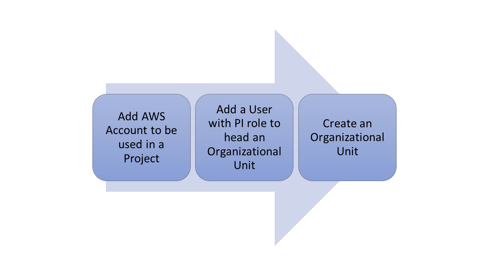

Users with the Administrator role can perform the steps below.

  * :ref:`Adding Users<Adding Users>` - Users can have Administrator, Principal Investigator or Researcher roles.
  * `Adding AWS Accounts`_
  * `Adding Organizational Units`_

Users with the Principal Investigator role can perform the steps below.
  
  * `Adding a New Project`_
  * `Assigning Researchers to projects`_

Create an Admin user
--------------------

If you have subscribed to the hosted version of the Research Gateway application, you would have created the Admin user during registration.
You would have subsequently received an email with a link to confirm the Administrator user's email. Use this details to login into Research Gateway.

Sign-In Process
---------------
Use details from :ref:`Appendix A<Appendix A>` for  Email, Password as per password policy.

Fill the following details 

.. list-table:: 
   :widths: 50 50
   :header-rows: 1

   * - Field
     - Details
   * - Email
     - <Email ID that is used for login>
   * - Password
     - <Password for this user>
	 
Click on the “Sign-In“ button. We can log in successfully.

.. image:: images/login.png

	
Forgot Password
---------------
In case you have forgotten your password, you can use the “Forgot Password” link on the login screen which is under the "Sign In" button.

click the link to navigate to the reset password screen.  

.. image:: images/forgot.png

Fill the following details

.. list-table:: 
   :widths: 50, 50
   :header-rows: 1

   * - Field
     - Details
   * - E-mail address
     - <Registered Email ID>
   
Click on "Send Resend link" button. If the provided details are valid, you will get a verification link on the registered email address to reset the password. On clicking the link in the email, the user is lead to the change password screen.  

.. image:: images/verificationemail.png

**Note**: The password policy should meet the following requirement
   a. The minimum password length of 8 characters and a maximum of 16 characters.
   b. It should have atleast one lower case character(a-z).
   c. It should have atleast one upper case character(A-Z).
   d. It should have atleast one number(0-9).
   e. It should have atleast one special character (= + - ^ $ * . [ ] { } ( ) ? ! @ # % & / , > < ' : ; | _ ~).

If the password change is successful you can navigate to the verification successful page. Through the "Click here to login button" you can navigate to the login screen.
 
If the password change is unsuccessful you can see the verification error screen. 

.. image:: images/password.png

.. image:: images/success.png

.. _`Sign-Up process`:

Sign-Up process
---------------

You can follow the below instructions to create a new user in hosted shared model.

**Sign up with a Google ID**

1. In a browser window, open the Research Gateway URL (https://research.rlcatalyst.com/login).
2. Click on the “Sign up with Google” button.
3. If you are already signed in to your Google account, you will be prompted to choose the Google account to use. Select an account.
4. If you are not signed in to your Google account, you will be prompted for your credentials. Enter your Google account email address and password. 
5. Once logged in to your account, you will land on the Welcome page in Research Gateway.

.. image:: images/registerform.png

**Sign up with an Email address**

1. In a browser window, open the Research Gateway URL (https://research.rlcatalyst.com/login).
2. Click on the "Sign up for new account" link which is below the sign-in button. 
3. A registration form will be opened. 

.. image:: images/registerform.png

Fill the following details 

.. list-table:: 
   :widths: 50 50
   :header-rows: 1

   * - Field
     - Details
   * - Email
     - <Enter an Email ID>[Mandatory]
   * - First Name
     - <Enter first name> [Optional]
   * - Last Name
     - <Enter Last name> [Optional]
   * - Phone number
     - <Enter phone number of the user> [Optional]
	 
Click on the “Sign Up“ button. If the provided details are valid, you will receive a verification link on the registered email address to reset the password. On clicking the link in the email, you will be led to the change password screen.

The password needs to confirm to the password policy. 

.. image:: images/verificationemail2.png

If the password change is successful you will be navigated to the verification successful page. Through the “Click here to login button” you will be navigated to the Research Gateway login screen.

.. _`Adding Organizational Units`:

Adding Organizational Units
---------------------------

To plan the creation of a new Organization, use the planning sheet in :ref:`Appendix A<Appendix A>` to collect all the information required upfront. Login into the Research Gateway. User landed to the  main dashboard.

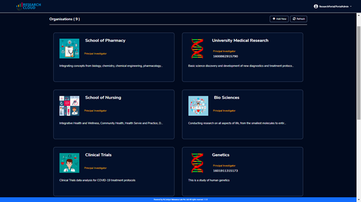

Click on the “+Add New” icon  which is at the top right corner. Organization form is opened.

.. list-table:: 
   :widths: 50, 50
   :header-rows: 1

   * - Field
     - Details
   * - Organization Name
     - <Name of the Organization> 
   * - Organization Description
     - <Description>
   * - Account Details
     - <Select account ID from the list or create new account through **"Add Accounts"** button >
   * - Add Users
     - <Select Principal Investigator ID from the list or create new one through **"Add users"** button > [Optional]
	 
Click on the **“Create Organization”** button. The new organizational unit is added successfully.

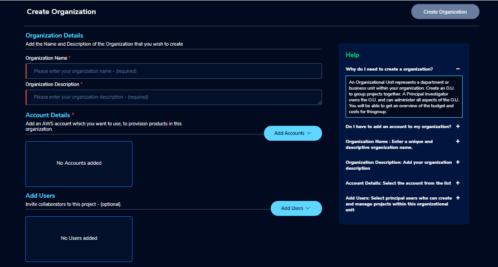

**NOTE**: You can create an organization without Principal Investigator. Through the "Assign O.U." option in users, you can assign later.

The Organizations page of the Research Gateway lists all the existing organizational units created, with some details of each organization displayed on the card. 

.. _`Adding AWS Accounts`:

Adding an AWS account to use in a project
---------------------------------------------

Login into the Research Gateway. Click on dropdown bar which is above the header. Choose the  “Settings” option

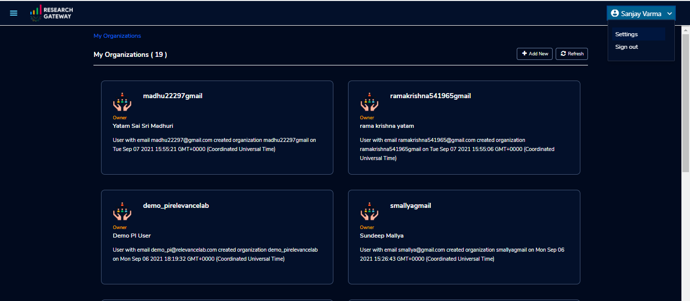

Click on  the  “Settings” menu item. Provider settings page is opened.

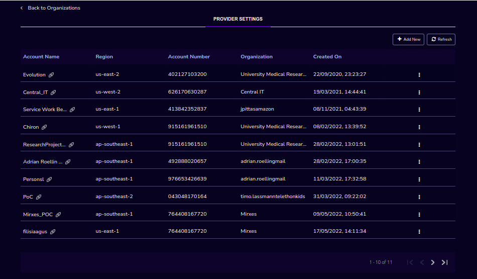
   
**Note:**  When we add the settings please make sure the user credentials has the IAMFullAccess/AdministratorAccess Permissions. You can refer the list of policies that we are using create the role in Research Gateway.

AccessPolicies

.. literalinclude:: AccessPolicies.json
  :language: JSON
  :linenos:

Click on  the  “+Add New” button in the provider setting page. The Add Provider setting dialog-box is opened.

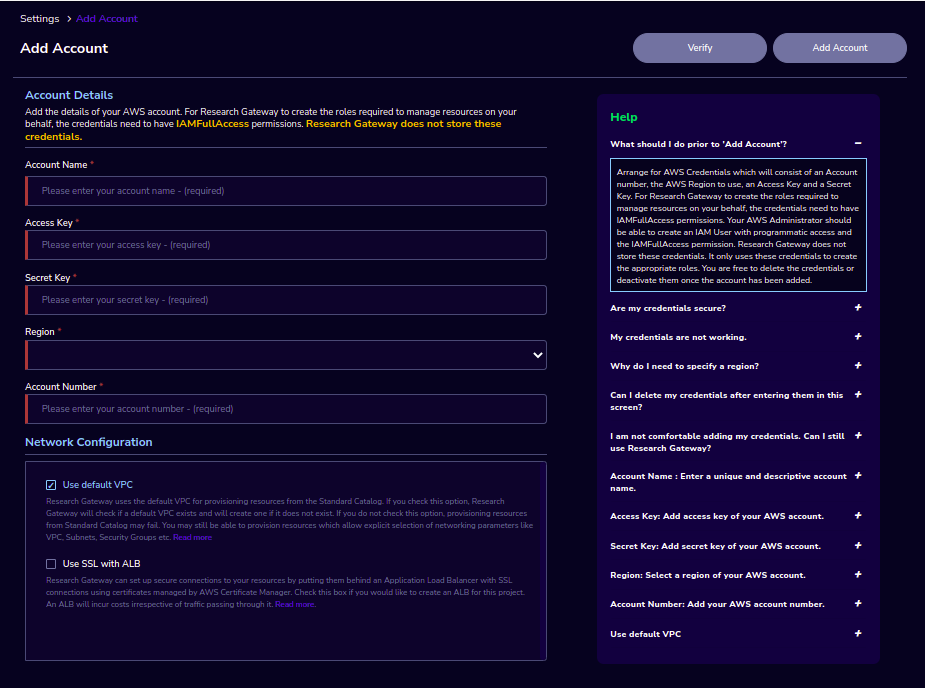
   
Fill the following details

.. list-table:: 
   :widths: 50, 50
   :header-rows: 1

   * - Attribute
     - Details
   * - Account Name
     - <Account Name>
   * - Account Key
     - <Account Key> [It should be a minimum of 16 characters and a maximum of 128 characters]
   * - Secret Key
     - <Secret Key> [It should be a minimum of 40 characters and a maximum of 128 characters]
   * - Region
     - <Select region from the drop-down list> 
   * - Account Number
     - <Enter an AWS Account Number> [It should be a 12-digit number]
   * - Network Configuration
     -
   * - Use deafult VPC
     - <If you enable this option, Research Gateway will check if a default VPC exists and will create one if it does not exist. If you disable this option, provisioning resources from Standard Catalog may fail.>
   * - Use SSL with ALB
     - <If you enable this option, Research Gateway can set up secure connections to your resources by putting them behind an Application Load Balancer with SSL connections using certificates managed by AWS Certificate Manager. Check this box if you would like to create an ALB for this project. An ALB will incur costs irrespective of traffic passing through it.>	 
   * - Storage Configuration
     -
   * - Use Project Storage	 
     - <Research Gateway will setup a shared S3 bucket (project storage) where the team members can store data. This shared storage will be mounted into all supported workspaces. Storage costs will be accounted at the project level. Note: For now defaultly it will create the project storage.>
	 
Click on the "Verify" button, it will check the provided details are valid or not. If details are valid, it will show verified account message with green color tick mark below the header otherwise it will throw an error message accordingly.

Click on the “Add Account” button. An AWS account is added successfully. You can see all the account details in a table format.

**NOTE**: 

1. The "Add Account" button was disabled until the details are verified.
2. Please ensure that the IAM user whose credentials you entered has the IAMFullAccess/AdministratorAccess policy attached otherwise, it will through an error message accordingly.

On each line item there is a contextual menu. Through this we can delete and sync the account/repair the account.

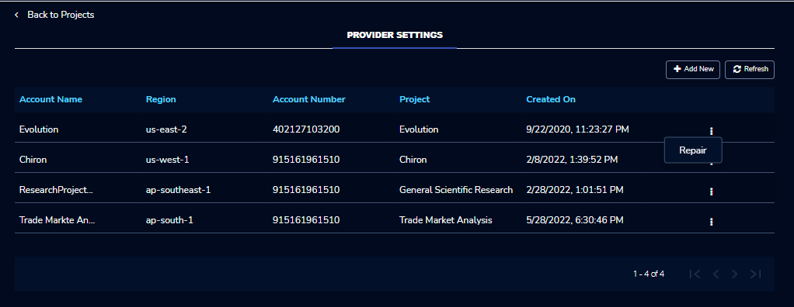

Click on the 3-dotted icon which is available at the right side of the account details page and choose “Delete” option. A confirmation dialog box is opened and enable the check box and click on the "Delink" button, the account will be deleted. You can only delete provider settings that are not linked to any project or organization.

.. image:: images/delete.png

Research Gateway works in conjunction with AWS Service Catalog. To synchronize the Service Catalog to your project, select the Product Sync option.
Click on the “Sync Now” button. Once the synchronization is started you should see the “Sync Started” message.

.. image:: images/sync1.png

.. image:: images/sync2.png

**Note**: The "Sync Now" option can get the products from the shared, local, account and organization level portfolio.

Click on the contextual menu which is available at the right side of the account name and choose the "Repair" option. 

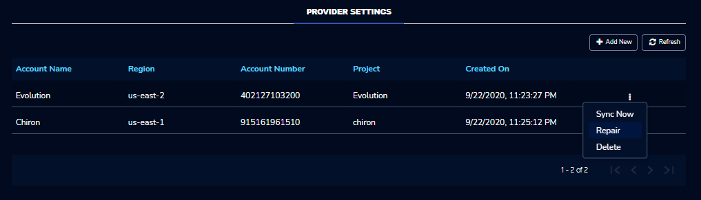

Fill the access key and secret key values in the assigned boxes and click on the "Verify" button.

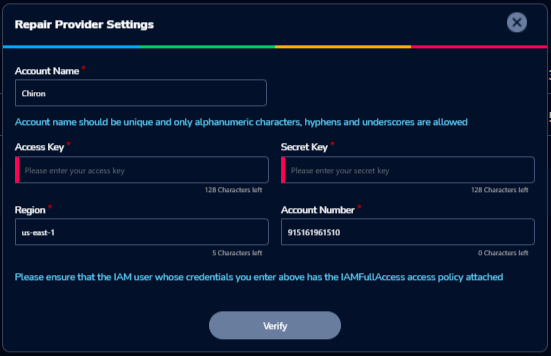

On successful completion of verify you can see the "repair" option, click on the button in the window, the account will be repaired.

Click on the contextual menu which is available at the right side of the account name and choose the "Assign O.U" option. One window is opened and all organizational units are listed there. Choose one organization from the list and click on the "Assign" button. On successful completion you can see the green color toaster message.

.. image:: images/Assign123.png

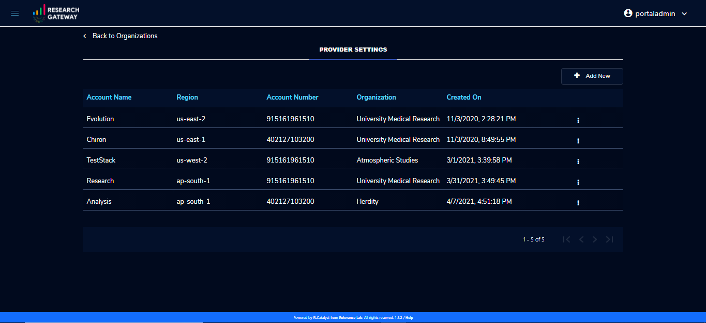

**Note** : When the account is not linked to any other organizations than only you can see the "Assign O.U" option.

**Secure connections to resources using ALB to RStudio and Nextflow-Advanced Products** 

1. Research Gateway can set up secure connections to your resources by putting them behind an Application Load Balancer with SSL connections using certificates managed by AWS Certificate Manager.
2. When creating an account if you select the “Use SSL with ALB” check box it will create ALB. An ALB will incur costs irrespective of traffic passing through it. 
   Note: Refer :ref:`Adding AWS Accounts <Adding AWS Accounts>` for account creation.
   
 .. image:: images/ssl-alb.png 
 
3. Once project creation is successful you can see the status about certificates and load balancer, target groups, listener, etc.. on the events page.
   Note: Refer :ref:`Adding a new project <Adding a new project>` for project creation.
4. Navigate to the available products panel and launch Nextflow-Advanced with required parameters. Once the product is provisioned you can see the outputs through the “View Outputs”. You can monitor the pipeline through “Monitor Pipeline”.

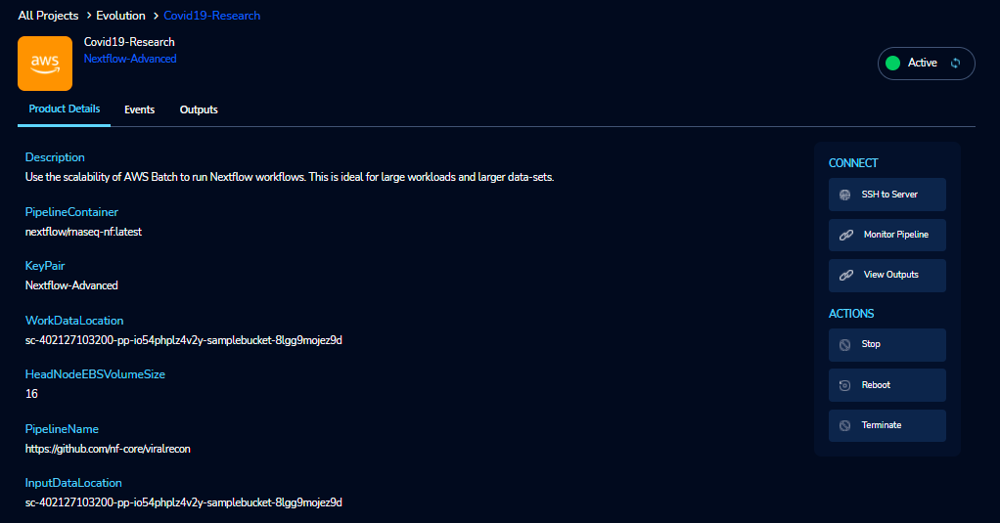

5. Navigate to the available products panel and launch RStudio with the required parameters. Once the product is provisioned you can connect to RStudio through the “Open link” action.
   
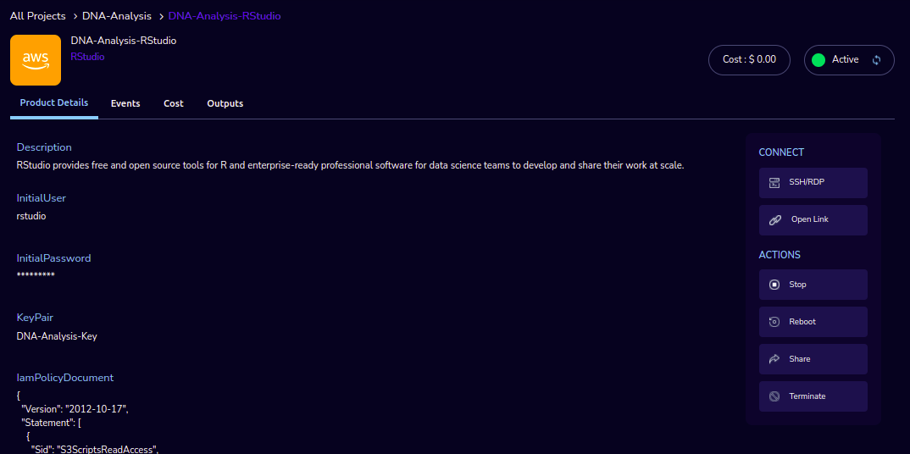

`Secure connections to resources using ALB and Amazon certificates video <https://www.youtube.com/watch?v=3MkouV33XJw>`_

.. _`Adding a new project`:

Adding a new project
-------------------- 

Login to the Research Gateway as a Principal Investigator. 

If Principal Investigator logs as a first time, you can view the welcome screen. Click on the "Let's get Started" button it will navigate to the "Add Account" screen. 

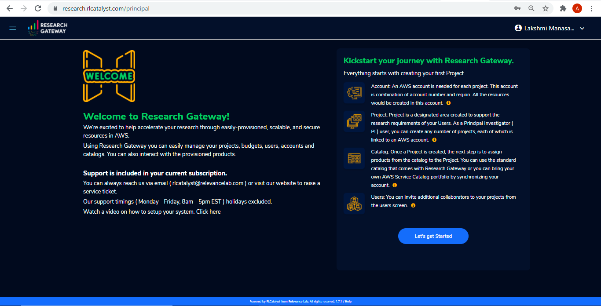

Click on the  “+Add New” button in the My Project page or use details from :ref:`Appendix A<Appendix A>`  to create account. Once account creation is successful it will navigate to "Create Project" screen. The project application form is opened. 

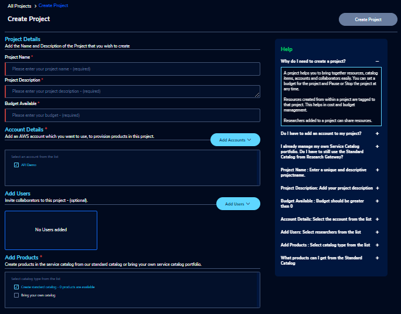

Fill in the following details

.. list-table:: 
   :widths: 50, 50
   :header-rows: 1

   * - Attribute
     - Details
   * - Project Name
     - <Project Name>
   * - Project Description
     - <Description about the project> 
   * - Budget Available
     - <Budget to allocate to this project (cumulative)> 
   * - Account Details
     - <Select an Account ID from the list. If accounts are not listed create a new account through "Add Accounts" button.> 
   * - Add Users
     - <Select users from the list or create new collaborators through "Add Users" button.> [optional]
   * - Add Products
     - <Select any one of the catalog type from the list>

Click on the “Create Project” button. Added a new project successfully.

**Note**: While creation of project, if you select "Standard Catalog" option it will create 6 products(Amazon Sagemaker, Amazon S3, Amazon EC2-Linux, Amazon EC2-Windows, RStudio and Nextflow-Advanced). If you select "Bring your own catalog" option it will pull all the products in the portfolio of the AWS account.

Research Gateway will set up a shared S3 bucket(Project Storage) where the team members can store data. This shared storage will be mounted into all supported workspaces. Storage costs will be accounted for at the project level. For a lot of scientific research, data is stored in file format (e.g. fasta, fastq files for Genomics research). The natural choice for storage of this data could be S3 (inexpensive, highly elastic) or Elastic Block Storage (access is extremely fast). As part of project creation we are creating project storage(i.e., S3 Bucket) and sharing with users.

1. The Project level storage will be listed as a product in the My Products tab inside the project as an S3 bucket. There is explore action inside the S3 bucket<<There is a folder called “Shared”.
   Note: It is a common folder(only accessible by user unless shared)  and it  is available to all users.

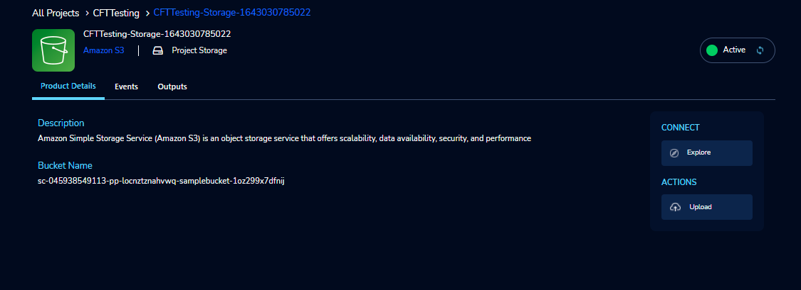

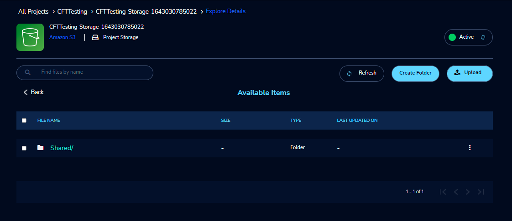

2. You can able to view, upload and delete objects in the storage.
3. While launching any EC2 based product, the user will be prompted whether to mount the Project and User level storage.
4. The Storage will be mounted as a specific folder inside the EC2 machine which the user can use to perform any tasks on. Any data written to the folder will be synced back to the storage and will be accessible to the user on exploring.

Initially project is in creating state. Once project creation completed the status will be changed to "Active". Click on the project in **"My Projects"** list. 

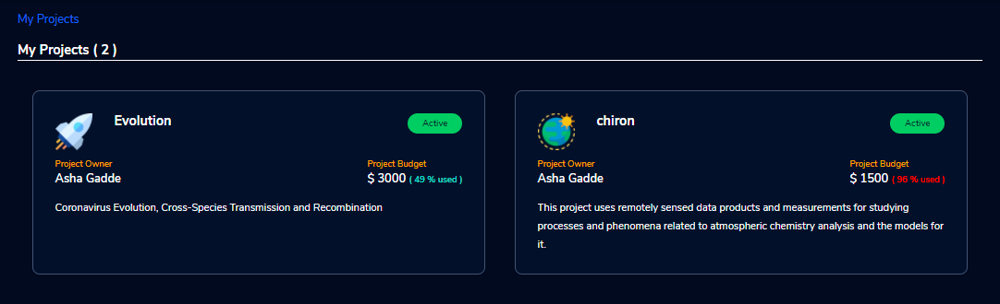

Once you click on the project, you can see the budget in the cards and remaining details will show a tabbed area with the following tabs:
   1. Project Details
   2. Events
   3. Available Products
   4. My Products

**Project Details**

1. You can view the project details here. If the project is in a failed state, you can repair the project through the “Repair” option. 
2. You can see the project-related events in the “Events” tab.
3. Click on the “Pause” action which is available on the right side. When you click on "Pause" action,  all the researchers under this project would be affected. In a Paused state new provisioning is not allowed. Users can continue to use already provisioned resources as before. All the available products would be visible but the “Launch Now “ button would be hidden.
4. Click on the “Resume” button which is available on the right side. The project status changed to “Active”. In the Active state, team members can launch new products from the catalog of Available Products.
5. Click on the “Stop” button which is available on the right side. In a Stopped state, all underlying resources will be stopped and the user will not be able to perform actions on them but you are able to terminate the product. You need to manually start the resources except for the s3 product.
6. Click on the “Sync” button which is available on the right side. It should sync the catalog. You can see related events in the events tab.

.. image:: images/projectdetails.png 

7. Click on the “Manage” option under the **Assigned Researchers** field. Once clicked on that, enable the checkbox beside the researcher Emails and click on the “Update List” button. It will add collaborators to the project. 

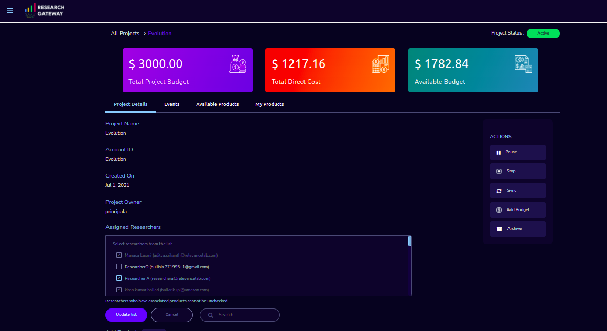

**Events**

You can see project-related events here.

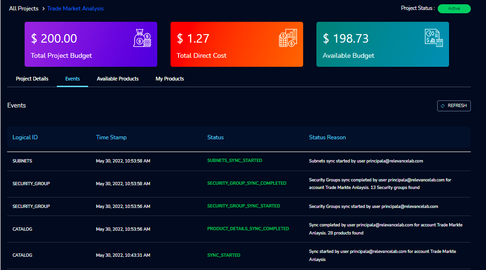

.. csv-table::
   :file: ProjectEvents.csv
   :widths: 10, 10, 30, 50
   :header-rows: 1
   
**Available Products**

1. You can view the Available Products information here and you can see products in a table view also.
2. You can search based on product name and description. You can filter the products. We have following filter options:
      
	  a. **All** - You can see the all products here.
	  b. **Research** - You can see the products realted to compute and analytics here. Eg: Amazon EC2
	  c. **IT Applications** - You can see the products related to storage and database here. Eg: Amazon S3
	  
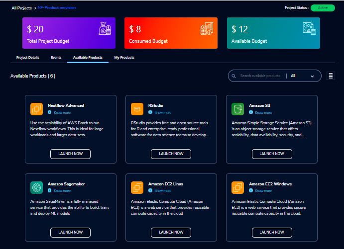
	 
**My Products**

1. You can view the provisioned products details here and You can see products in a table view also.
2. You can search the product name and description of the product.
3. You can filter the products. We have following filter options:
      
	  a. **All** - You can see the all(i.e., active,terminated,stopped and failed) products here.
	  b. **Active** - You can see all the active products here.
	  c. **Terminated** - You can see all terminated products here.
	 
.. image:: images/myproducts.png

**Note**:

a. When adding a project we are passing collaborators information. Through this, we are linking collaborators to the project. 
b. The project is independent of the researcher. We can create an empty project and add researchers later. Once project is active, we can add researchers through the "Manage" option which is at the project details screen.

*My Projects* page of the Research Gateway lists all the existing projects created along with other details. Clicking on a specific project shall leads to a project details page.

.. image:: images/projectdetails.png 

Assigning Researchers to projects
---------------------------------

There is an edit functionality for the project entity. The project is independent of the researcher. An user can create an empty project and add researchers later also. Click on “Manage (i.e., Pencil icon)” which is at the Assigned researchers field in the Project Details Page.

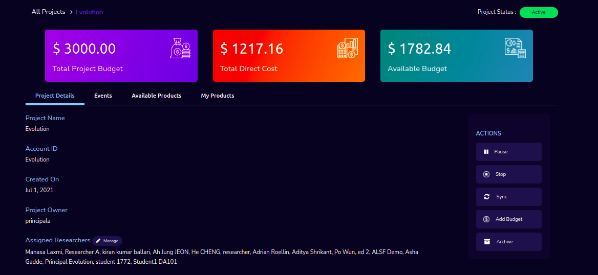

Select the Researchers and click on the “Update List” button. You can see the “Updated Successfully” toaster message in the UI. You can't unselect the researchers who have associated products. 
 
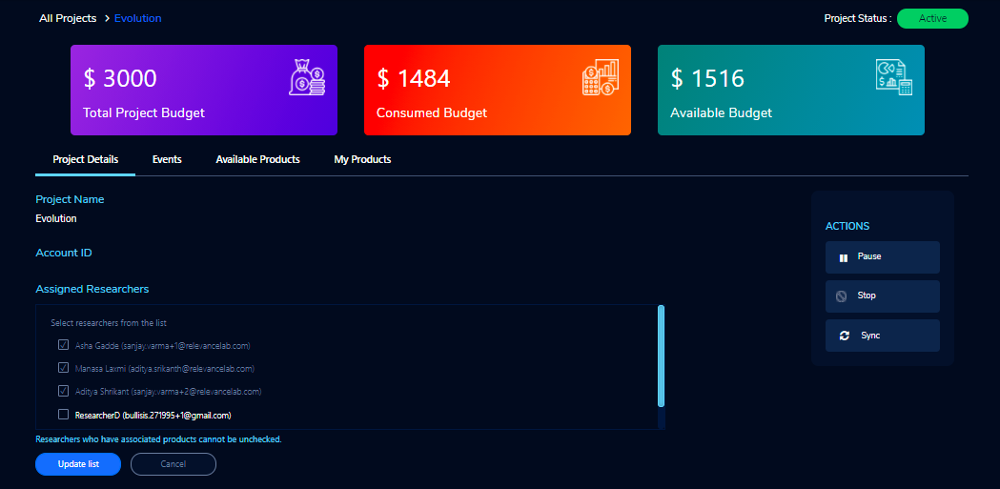
 
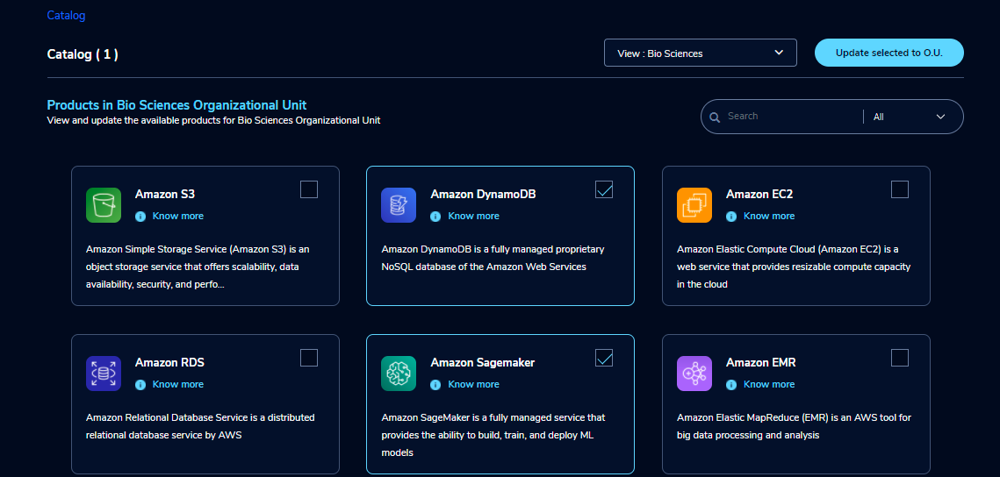
