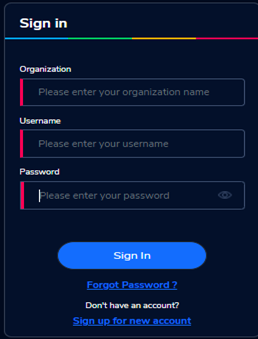
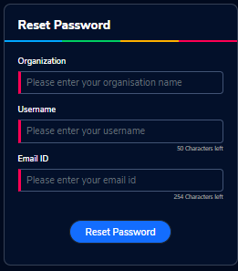
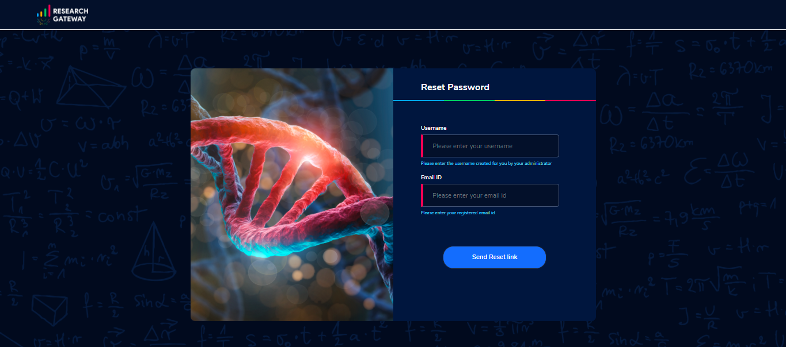

Getting Started
---------------
You will be provided the following pieces of information in your starter kit:
URL:______Application URL:__________

**Portal Admin**

Organization name:_________

Username: __________

Password:___________

**Principal**  

Organization name: ___________

Username: ____________________

Password: ____________________

**Researcher**
Organization name:___________

Username: _______________

Password: _______________

Keep this information handy as you go through this guide and configure your system.

**Planning your deployment**

Research Gateway is a cloud-based solution that makes it possible for researchers and other consumers of High Performance Computing to easily access resources in the AWS cloud.

PortalAdmin
------------

The Admin can create new organizations within the portal.Each such organization shall be associated with a single AWS Organization which shall be accessed via credentials provided by the Administrator. He will perform all administrative tasks.He will be able to create Researchers (alias for a user) with the Researcher role under an organization. A Researcher shall be associated with a user record in the Active Directory. A user can be a Researcher in more than one organization with a Researcher alias created in each organization but mapped to the same AD record for login purposes.

Sign-Up process:
----------------
Use details from Appendix A for Company Name, User Name ,Email  & set the  Password as per Password policy. Click on the “Sign-up for  a new  account “ button.

.. image:: images/SigninPage.png

Fill the following details:

  Organization name : <Organization name>

  Username       :   <Username>

  Email          :   <Email address>

  Password       :   <Password>

    Click on the  “Sign Up” button.

.. image:: images/Registeraccountpage.png

Image  - Register Account page

You will see a  successful  toaster message and verification email has been sent to the email address registered

.. image:: images/thankyou.png

Check the verification email delivered to the registered email address & click on the verification link to activate the account. 

.. image:: images/verificationemail2.png

On successful validation, users  will be allowed to login into the Research Gateway.

Forgot Password
---------------

 A user sees a Forgot Password link on the login screen.  

On clicking the link the user is navigated to reset password screen and fill the following details

<Organization>  : <Name of the Organization>

<Username>      : <Name of the user>

<Email ID>      : <Registered Email ID>

If a user is valid he will get a verification link that has been sent to his email to reset the password.

On clicking the link in the email, the user is prompted to enter (and confirm) a new password.  The password change is either successful or unsuccessful (this will be like verification success and error screens).  The user is then redirected back to the login screen.

.. image:: images/verificationlink.png

**Note:** If a user tries to reset password more than 10 times it should throw the above message **“Attempt limit exceeded. Please try again”**

How to add New Organization
---------------------------

To plan the creation of a new Organization, use the planning sheet in *Appendix A* to collect all the information required upfront.Login into the Research Gateway..
        
Login to the Research Gateway.User landed to the  main dashboard.

.. image:: images/OrganizationPage.png

Image  - Organization Page

Click the “+” icon  which is at the top right corner.Organization form is opened.

Fill the following details:
**Organization Name**        :<Name of the Organization>
**Organization Description** :<Description>
**Account ID**               :<Select ID>
[Multiple AWS accounts to be  linked.Here we have a list]
**Principal**                :<Select Principal ID >
[Select Principal Investigator who has signed up being linked to the Organization]

Click on the **“Add Organization”**                                button.New organization was added successfully.

**NOTE**:We are selecting principal accounts when adding new organization.Through this we are linking  to organizations. The organization form allows multiple Account IDs and multi-select on the Principal Investigators list.

The Organizations page of the Research Gateway shall list all the existing organizations created along with other details. Clicking on a specific organization shall lead to “View Organization Details” window .

.. image:: images/ViewOrganizationDetailsPage.png

Image  - View Organization Details Page
