Getting Started
===============

Research Gateway is a cloud-based solution that makes it possible for researchers and other consumers of High Performance Computing to easily access resources in the AWS cloud.
RLCatalyst Research Gateway is designed for simplicity and you can get started very quickly. 
You can access this product either as a `hosted Silo model`_ or as a hosted Shared model.

.. _hosted Silo model: https://relevancelab.com/2021/02/11/8-steps-to-set-up-rlcatalyst-research-gateway/

If you are using the hosted Silo model, you will be provided a public URL to which you can navigate using your browser. 
You will also be provided with the credentials for the Administrator user.

1. The Administrator can add Organizational Units and AWS Accounts, create Users, assign them to the OUs and assign catalog items to the OUs.
2. If you are using the hosted Shared model, you can sign up with your details. Use details from :ref:`Sign-Up <Sign-Up process>` to create a new tenant.

.. contents::

Planning your set up
--------------------

Setting up your RLCatalyst Research Gateway for use involves the following steps.

.. image:: images/FirstSetupTask.png 

Users with the Administrator role can perform the steps below.

  * :ref:`Adding Users<Adding Users>` - Users can have Administrator, Principal Investigator or Researcher roles.
  * `Adding AWS Accounts`_
  * `Adding Organizational Units`_
  * :ref:`Adding Catalog Items<Catalog>`

.. note:: The administrator should assign products from standard catalog collection to the organizational unit before a PI can successfully create a project with attached Project Storage.

Users with the Principal Investigator role can perform the steps below.
  
  * `Adding a New Project`_
  * :ref:`Adding Users<Users_PI>` - Users can have Principal Investigator or Researcher roles.
  * `Adding AWS Accounts`_
  * :ref:`Adding Catalog Items<Catalog_PI>`
  * `Assigning Researchers to projects`_

Create an Admin user
--------------------

If you have subscribed to the hosted version of the Research Gateway application, you would have created the Admin user during registration.
You would have subsequently received an email with a link to confirm the Administrator user's email. Use these details to login into Research Gateway.

Sign-In Process
---------------
Use details from :ref:`Forgot Password<Forgot Password>` for  Email, Password as per password policy.

Fill the following details 

.. list-table:: 
   :widths: 50 50
   :header-rows: 1

   * - Field
     - Details
   * - Email
     - <Email ID that is used for login>
   * - Password
     - <Password for this user>
	 
Click on the “Sign-In“ button. We can log in successfully.

.. image:: images/User_Login_Window.png

.. _`Forgot Password`:

Forgot Password
---------------
In case you have forgotten your password, you can use the “Forgot Password” link on the login screen which is under the "Sign In" button.

Click the link to navigate to the reset password screen.  

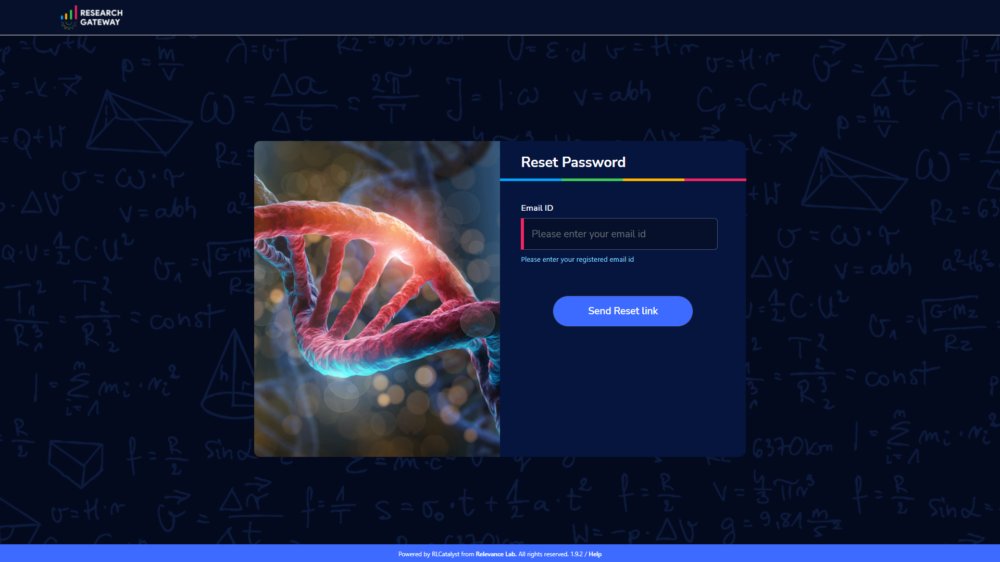

Fill the following details

.. list-table:: 
   :widths: 50, 50
   :header-rows: 1

   * - Field
     - Details
   * - E-mail address
     - <Registered Email ID>
   
Click on "Send Resend link" button. If the provided details are valid, you will get a verification link on the registered email address to reset the password. On clicking the link in the email, the user is lead to the change password screen.  

.. image:: images/User_Account_ResentVerificationEmail.png

.. note::

 The password policy should meet the following requirement
   a. The minimum password length of 8 characters and a maximum of 16 characters.
   b. It should have at least one lower case character(a-z).
   c. It should have at least one upper case character(A-Z).
   d. It should have at least one number(0-9).
   e. It should have at least one special character (= + - ^ $ * . [ ] { } ( ) ? ! @ # % & / , > < ' : ; | _ ~).

If the password change is successful you can navigate to the verification successful page. Through the "Click here to login button" you can navigate to the login screen.
 
If the password change is unsuccessful you can see the verification error screen. 

.. image:: images/User_ChangePasswordWindow.png

.. image:: images/User_ChangePassword_Success.png

.. _`Sign-Up process`:

Sign-Up process
---------------

You can follow the below instructions to create a new user in hosted shared model.

Sign up with a Google ID
^^^^^^^^^^^^^^^^^^^^^^^^

1. In a browser window, open the Research Gateway URL (https://research.rlcatalyst.com/login).
2. Click on the “Sign up with Google” button.
3. If you are already signed in to your Google account, you will be prompted to choose the Google account to use. Select an account.
4. If you are not signed in to your Google account, you will be prompted for your credentials. Enter your Google account email address and password. 
5. Once logged in to your account, you will land on the Welcome page in Research Gateway.

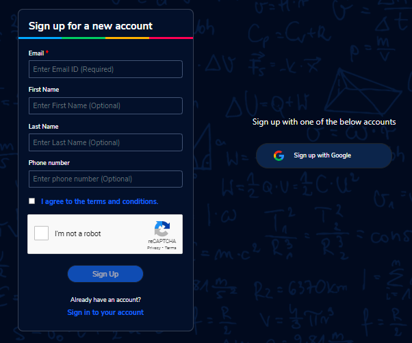

.. note:: You can watch the system setup video through the `Click here <https://www.youtube.com/watch?v=zDksIb1n9zI>`_ link in the welcome screen.

Sign up with an Email address
^^^^^^^^^^^^^^^^^^^^^^^^^^^^^

1. In a browser window, open the Research Gateway URL (https://research.rlcatalyst.com/login).
2. Click on the "Sign up for new account" link which is below the sign-in button. 
3. A registration form will be opened. 

Fill the following details 

.. list-table:: 
   :widths: 50 50
   :header-rows: 1

   * - Field
     - Details
   * - Email
     - <Enter an Email ID>[Mandatory]
   * - First Name
     - <Enter first name> [Optional]
   * - Last Name
     - <Enter Last name> [Optional]
   * - Phone number
     - <Enter phone number of the user> [Optional]
	 
Click on the “Sign Up“ button. If the provided details are valid, you will receive a verification link on the registered email address to reset the password. On clicking the link in the email, you will be led to the change password screen.

The password needs to confirm to the password policy. 

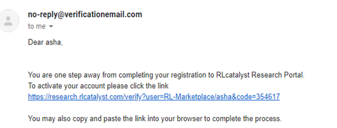

If the password change is successful you will be navigated to the verification successful page. Through the “Click here to login button” you will be navigated to the Research Gateway login screen.

Once logged in to your account, you will land on the Welcome page in Research Gateway.

.. note:: You can watch the system setup video through the `Click here <https://www.youtube.com/watch?v=zDksIb1n9zI>`_ link in the welcome screen.

.. _`Session timeout`:

Session Timeout
-------------------------

If the user is idle for more than 15 minutes and then performs any activity on the website, the current session will be logged out with a red toaster message and the user will be routed to the login page. In an enterprise deployment, the duration of the timeout can be customized.

.. _`Adding Organizational Units`:

Adding Organizational Units
---------------------------

To plan the creation of a new Organization, use the planning sheet in :ref:`Appendix A<Appendix A>` to collect all the information required upfront. Login into the Research Gateway. User landed to the  main dashboard.

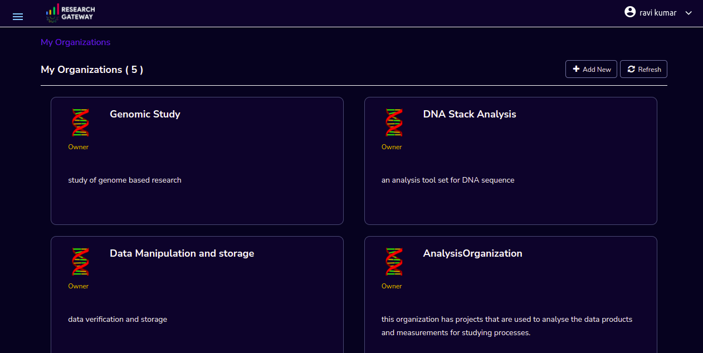

Click on the “+Add New” icon  which is at the top right corner. Organization form is opened.

.. list-table:: 
   :widths: 50, 50
   :header-rows: 1

   * - Field
     - Details
   * - Organization Name
     - <Name of the Organization> 
   * - Organization Description
     - <Description>
   * - Account Details
     - <Select account ID from the list or create new account through **"Add Accounts"** button >
   * - Add Users
     - <Select Principal Investigator ID from the list or create new one through **"Add users"** button > [Optional]
	 
Click on the **“Create Organization”** button. The new organizational unit is added successfully.

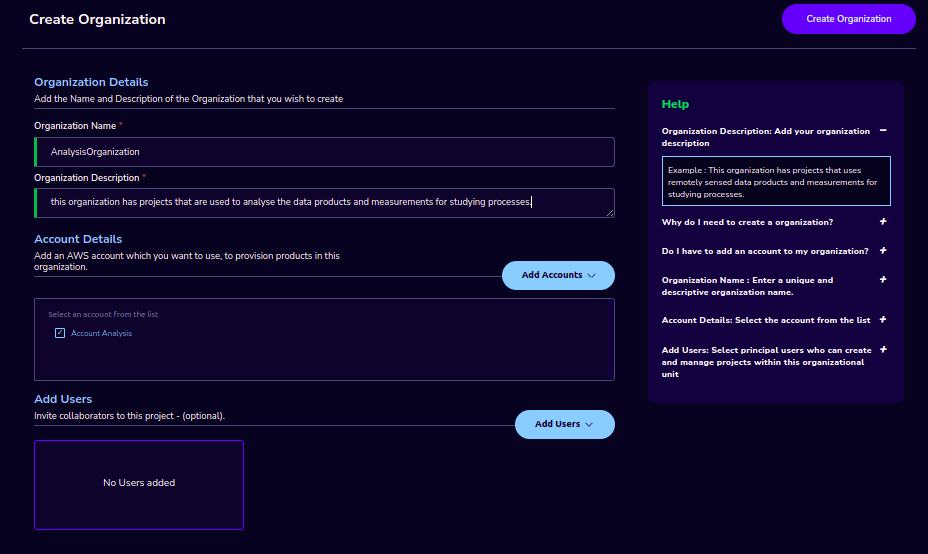

.. note:: 

  a. You can create an organization without Principal Investigator. Through the "Assign O.U." option in users, you can assign later.
  b. You can create an organization without selection of account name.

The Organizations page of the Research Gateway lists all the existing organizational units created, with some details of each organization displayed on the card. 

.. _`Assigning catalog items to OU`:

Assigning catalog items to OU
------------------------------

The administrator should :ref:`assign products from standard catalog collection to the organizational unit<catalog>` before a PI can successfully create a project with attached Project Storage.

.. _`Adding AWS Accounts`:

Adding an AWS account to use in a project
---------------------------------------------

Login into the Research Gateway. Click on dropdown bar which is above the header. Choose the “Settings” option

.. image:: images/Principal_LandingPage_SettingsMenu.png 

Click on  the  “Settings” menu item. Provider settings page is opened.

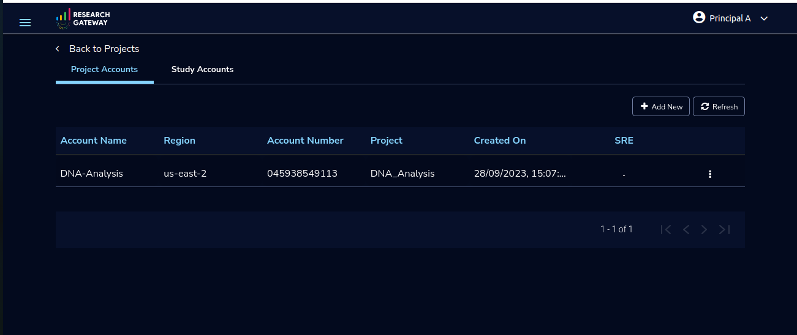
   
.. note::  When we add the settings please make sure the user credentials has the IAMFullAccess/AdministratorAccess Permissions. You can refer the list of policies that we are using create the role in Research Gateway.

AccessPolicies

.. literalinclude:: AccessPolicies.json
  :language: JSON
  :linenos:

Click on  the  “+Add New” button in the provider setting page. The Add Provider setting dialog-box is opened.

.. image:: images/AddAccount_Form.png
   
Fill the following details

.. list-table:: 
   :widths: 50, 50
   :header-rows: 1

   * - Attribute
     - Details
   * - Account Name
     - <Account Name>
   * - Account Key
     - <Account Key> [It should be a minimum of 16 characters and a maximum of 128 characters]
   * - Secret Key
     - <Secret Key> [It should be a minimum of 40 characters and a maximum of 128 characters]
   * - Region
     - <Select region from the drop-down list> 
   * - Account Number
     - <Enter an AWS Account Number> [It should be a 12-digit number]
   * - Network Configuration
     -
   * - Use default VPC
     - <If you enable this option, Research Gateway will check if a default VPC exists and will create one if it does not exist. If you disable this option, provisioning resources from Standard Catalog may fail.>
   * - Use SSL with ALB
     - <If you enable this option, Research Gateway can set up secure connections to your resources by putting them behind an Application Load Balancer with SSL connections using certificates managed by AWS Certificate Manager. Check this box if you would like to create an ALB for this project. An ALB will incur costs irrespective of traffic passing through it.>	 
  
	 
Click on the "Verify" button, it will check the provided details are valid or not. If details are valid, it will show verified account message with green color tick mark below the header otherwise it will throw an error message accordingly.

Click on the “Add Account” button. An AWS account is added successfully. You can see all the account details in a table format.

.. note::

  a. The "Add Account" button was disabled until the details are verified.

  b. Please ensure that the IAM user whose credentials you entered has the IAMFullAccess/AdministratorAccess policy attached otherwise, it will through an error message accordingly. 

On each line item there is a contextual menu. Through this we can repair the account. 

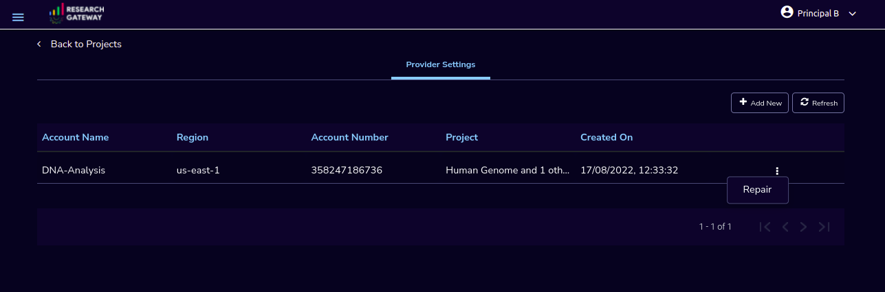

Click on the 3-dotted icon which is available at the right side of the account details page and choose “Delete” option. A confirmation dialog box is opened and enable the check box and click on the "Delink" button, the account will be deleted. You can only delete provider settings that are not linked to any project or organization.

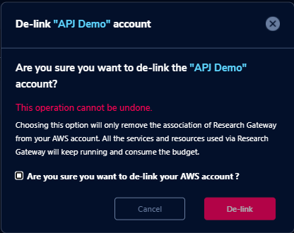

.. note:: If the account is not linked to project then only you can see the "Delete" option in the contextual menu .

Click on the contextual menu which is available at the right side of the account name and choose the "Repair" option. 

Fill the access key and secret key values in the assigned boxes and click on the "Verify" button.

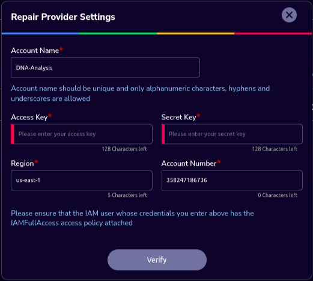

On successful completion of verify you can see the "repair" option, click on the button in the window, the account will be repaired.

Click on the contextual menu which is available at the right side of the account name and choose the "Assign O.U" option. One window is opened and all organizational units are listed there. Choose one organization from the list and click on the "Assign" button. On successful completion you can see the green color toaster message.

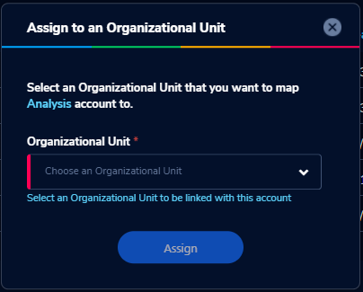

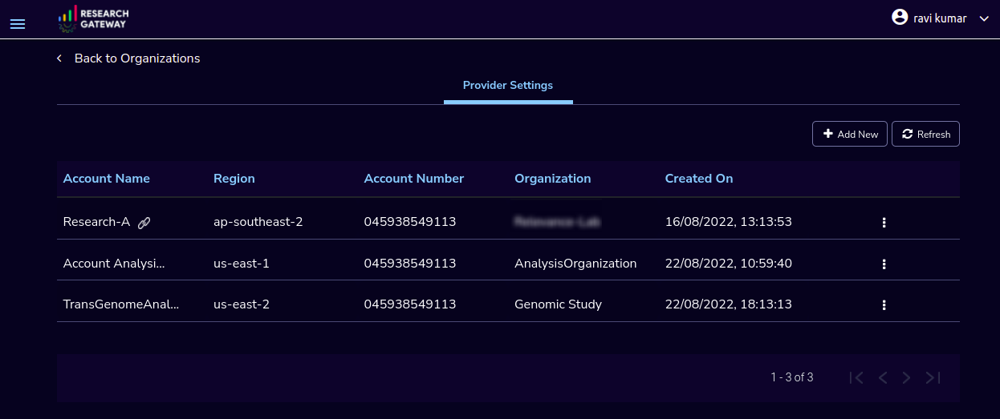

For Administrator login, 

1. The link option beside each account will show the details of the project which is linked to it. 

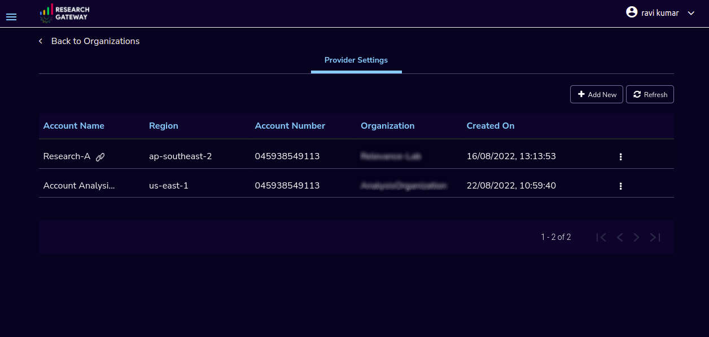

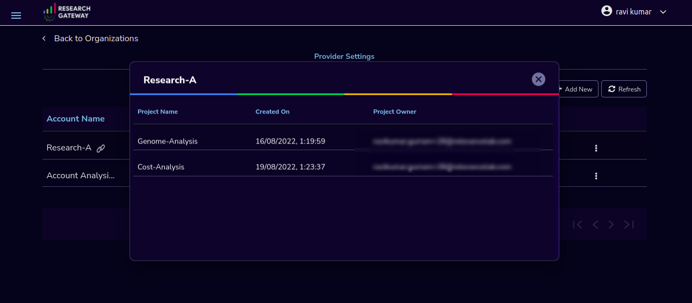

2. Click on the 3-dotted icon which is available at the right side of the account details page and choose  details option which will show the details of the project which is linked to it.

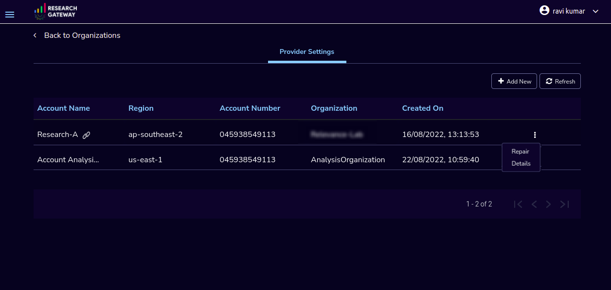

.. note::

 a. When the account is not linked to any other organizations than only you can see the "Assign O.U" option.
 b. You can create multiple projects with one account.

Secure connections to resources using ALB to RStudio and Nextflow-Advanced Products 
^^^^^^^^^^^^^^^^^^^^^^^^^^^^^^^^^^^^^^^^^^^^^^^^^^^^^^^^^^^^^^^^^^^^^^^^^^^^^^^^^^^

1. Research Gateway can set up secure connections to your resources by putting them behind an Application Load Balancer with SSL connections using certificates managed by AWS Certificate Manager.
2. When creating an account if you select the “Use SSL with ALB” check box it will create ALB. An ALB will incur costs irrespective of traffic passing through it. 
   Note: Refer :ref:`Adding AWS Accounts <Adding AWS Accounts>` for account creation.
   
 .. image:: images/User_AddAccount_LaunchForm_SSL-ALBCheckbox.png
 
3. Once project creation is successful you can see the status about certificates and load balancer, target groups, listener, etc.. on the events page.
   Note: Refer :ref:`Adding a new project <Adding a new project>` for project creation.
4. Navigate to the available products panel and launch Nextflow-Advanced with required parameters. Once the product is provisioned you can see the outputs through the “View Outputs”. You can monitor the pipeline through “Monitor Pipeline”.

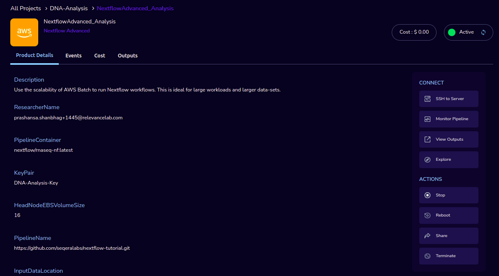

5. Navigate to the available products panel and launch RStudio with the required parameters. Once the product is provisioned you can connect to RStudio through the “Open link” action.
   
.. image:: images/Product_RStudio_ProductDetails.png 

`Secure connections to resources using ALB and Amazon certificates video <https://www.youtube.com/watch?v=3MkouV33XJw>`_

Navigation to help
------------------
Through the "Help" option, you can see the Research Gateway documentation. Click on the top-right menu which is available on the header. 

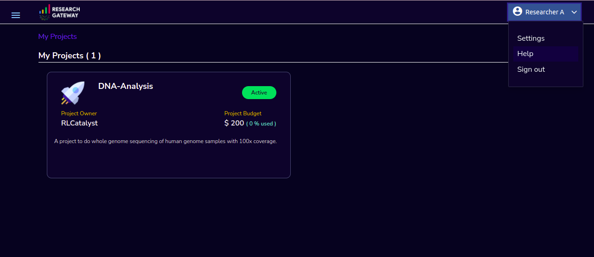

.. note:: There is Help option which is available on the footer, through this option also you can navigate to the  Research Gateway documentation.

.. _`Adding a new project`:

Adding a new project
-------------------- 

Login to the Research Gateway as a Principal Investigator. 

If Principal Investigator logs as a first time, you can view the welcome screen. Click on the "Let's get Started" button it will navigate to the "Add Account" screen. 

.. image:: images/User_WelcomeScreen.png

Click on the  “+Add New” button in the My Project page or use details from :ref:`Appendix A<Appendix A>`  to create account. Once account creation is successful it will navigate to "Create Project" screen. The project application form is opened. 

.. image:: images/Principal_CreateProject_1.png

.. image:: images/Principal_CreateProject_2.png

.. image:: images/Principal_CreateProject_3.png

.. image:: images/Principal_CreateProject_4.png  

Fill in the following details

.. list-table:: 
   :widths: 50, 50
   :header-rows: 1

   * - Attribute
     - Details
   * - Project Name
     - <Project Name>
   * - Project Description
     - <Description about the project> 
   * - Budget Available
     - <Budget to allocate to this project (cumulative)> 
   * - Project Copies
     - <Please enter number of projects you want to create -(between 1 and 10)>
   * - Account Details
     - <Select an Account ID from the list. If accounts are not listed create a new account through "Add Accounts" button> 
   * - Add Users
     - <Select users from the list or create new collaborators through "Add Users" button> [optional]
   * - Add Products
     - <Create products in the service catalog from our standard catalog or bring your own service catalog portfolio> [optional] 
   * - Use Project Storage 
     - <Research Gateway will setup a shared S3 bucket (project storage) where the team members can store data. This shared storage will be mounted into all supported workspaces. Storage costs will be accounted at the project level. Note: For now by default it will create the project storage. Selecting "Use Project Storage" will pull in S3 into your project catalog>
   * - Cost Control
     - <Research Gateway can automatically create budget consumption alerts and take actions like pausing the project (at 12%) or stopping the project (at 18%). Check this box to enable these actions.>

Click on the “Create Project” button. Added a new project successfully.

.. note:: 
 
 a. While creating the project, if you select the "Standard Catalog" option it will create 7 products(Amazon Sagemaker, Amazon S3, Amazon EC2-Linux, Amazon EC2-Windows, RStudio, Cromwell Advanced and Nextflow Advanced). 
 b. If you select the "Bring all catalog items" option it will sync all the products which have the required launch permission in the portfolio of the AWS account.
 c. If you select the "Bring specific catalog items" option it will sync only the products which have the tag in the portfolio of the AWS account.
 d. If you select the “Use Project Storage” option it will create project storage at the time of project creation, if you unselect the “Use Project Storage” option it will not create project storage.

Project Storage
^^^^^^^^^^^^^^^

Research Gateway will set up a shared S3 bucket(Project Storage) where the team members can store data. This shared storage will be mounted into all supported workspaces. Storage costs will be accounted for at the project level. For a lot of scientific research, data is stored in file format (e.g. fasta, fastq files for Genomics research). The natural choice for storage of this data could be S3 (inexpensive, highly elastic) or Elastic Block Storage (access is extremely fast). As part of project creation we are creating project storage(i.e., S3 Bucket) and sharing with users.

1. The Project level storage will be listed as a product in the My Products tab inside the project as an S3 bucket. There is explore action inside the S3 bucket<<There is a folder called “Shared”.
   Note: It is a common folder(only accessible by user unless shared)  and it  is available to all users.

.. image:: images/Principal_Project_ProjectStorage.png   

.. image:: images/Principal_Project_ProjectStorage_SharedFolder.png  

2. You can able to view, upload and delete objects in the storage.
3. While launching any EC2 based product, the user will be prompted whether to mount the Project and User level storage.
4. The Storage will be mounted as a specific folder inside the EC2 machine which the user can use to perform any tasks on. Any data written to the folder will be synced back to the storage and will be accessible to the user on exploring.
5. Use the "Copy to clipboard" action from the "Actions" dropdown to copy all selected file names and folder names along with the full path. The same action can also be performed from the three-dotted icon next to each file or folder.

Cost Control
^^^^^^^^^^^^
1. Research Gateway can automatically create budget consumption alerts and take actions like pausing the project (at 80%) or stopping the project (at 90%).
2. When creating a project if you select the “Automatically respond to budget alerts” checkbox and it will open a popup box which contains message, Once you confirm that it  will control the costs by taking automatic actions when budget thresholds are breached. By turning this feature off, you will lose the benefits of this cost control feature.

.. image:: images/Principal_CreateProject_1.png

.. image:: images/Principal_CreateProject_2.png

.. image:: images/Principal_CreateProject_3.png

.. image:: images/Principal_CreateProject_4.png 

3. You can manually stop/pause/resume/Add Budget/Archive the project through the actions which are available on the project details page.

.. note:: Project Storage can be deleted while archiving a project. You will now be prompted for deletion of the project storage when you archive a project. Select the checkbox if you want to delete the project storage bucket along with all of its contents.

.. image:: images/Principal_ProjectDetails.png

4. You can see the events related to cost control in the events page

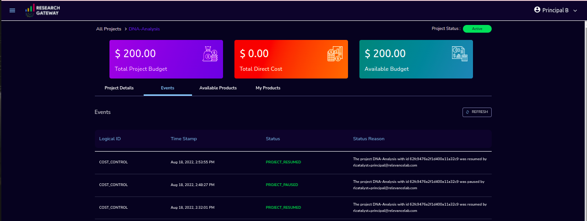

Initially project is in creating state. Once project creation completed the status will be changed to "Active". Click on the project in **"My Projects"** list. 

.. image:: images/Principal_MyProjects.png

Once you click on the project, you can see the budget in the cards and remaining details will show a tabbed area with the following tabs:
   1. Project Details
   2. Events
   3. Available Products
   4. My Products

Project Details
^^^^^^^^^^^^^^^

1. You can view the project details here. If the project is in a failed state, you can repair the project through the “Repair” option. 
2. You can see the project-related events in the “Events” tab.
3. Click on the “Pause” action which is available on the right side. When you click on "Pause" action, all the researchers under this project would be affected. In a Paused state new provisioning is not allowed. Users can continue to use already provisioned resources as before. All the available products would be visible but the “Launch Now “ button would be hidden.
4. Click on the “Resume” button which is available on the right side. The project status changed to “Active”. In the Active state, team members can launch new products from the catalog of Available Products.
5. Click on the “Stop” button which is available on the right side. In a Stopped state, all underlying resources will be stopped and the user will not be able to perform actions on them but you are able to terminate the product. You need to manually start the resources except for the s3 product.
6. Click on the “Sync” button which is available on the right side. It should sync the catalog. You can see related events in the events tab.
7. Click on the "Archive" button which is available on the right side, it was routed to my projects page and showed the message “Archiving project started” and later the project card got removed. Project Storage can be deleted while archiving a project. You will now be prompted for deletion of the project storage when you archive a project. Select the checkbox if you want to delete the project storage bucket along with all of its contents.
8. Click on the “Add Budget” button which is available on the right side, it should show a dialog box where you can add budget value of whole number greater than 0.

.. image:: images/Principal_ProjectDetails.png 

9. Click on the “Manage” option under the **Assigned Researchers** field. Once clicked on that, enable the checkbox beside the researcher Emails and click on the “Update list” button. It will add collaborators to the project. You can search the researchers, through the search option.

.. image:: images/Principal_ProjectDetails_AssignUsers.png

10. Click on the "Manage" option under the **Add products** field. Once clicked on that, it will display the list. Select the option from the list and click on the "Update list" button.

.. image:: images/Principal_ProjectDetails_AddProducts.png

Events
^^^^^^

You can see project-related events in the :ref:`Appendix E<Appendix E>`.

.. image:: images/Principal_Project_EventsTab.png
   
Available Products
^^^^^^^^^^^^^^^^^^

1. You can view the Available Products information here and you can see products in a table view also.
2. You can search based on product name and description. You can filter the products. We have following filter options:
      
	  a. **All** - You can see the all products here.
	  b. **Research** - You can see the products related to compute and analytics here. Eg: Amazon EC2
	  c. **IT Applications** - You can see the products related to storage and database here. Eg: Amazon RDS
	  
.. image:: images/Principal_Project_AvailableProducts.png	 
	 
My Products
^^^^^^^^^^^

1. You can view the provisioned products details here and You can see products in a table view also.
2. You can search the product name and description of the product.
3. You can filter the products. We have following filter options:
      
	  a. **All** - You can see all the (i.e., active, terminated, stopped and failed) products here.
	  b. **Active** - You can see all the active products here.
	  c. **Terminated** - You can see all terminated products here.

.. image:: images/Principal_Project_MyProducts.png

.. note::

 a. When adding a project we are passing collaborators information. Through this, we are linking collaborators to the project. 
 b. The project is independent of the researcher. We can create an empty project and add researchers later. Once project is active, we can add researchers through the "Manage" option which is at the project details screen.
 c. The products which are updated in the last 30 minutes will be visible under the active filter.
 d. When the Principal Investigator logs in, the user will be able to see the Active filter by default. And if the user selects a filter, the last chosen filter will be stored for the current session. Once the user logs-out and logs-in again the filter value will be reset to  Active.

*My Projects* page of the Research Gateway lists all the existing projects created along with other details. Clicking on a specific project shall leads to a project details page.

.. image:: images/Principal_ProjectDetails.png

All Products 
^^^^^^^^^^^^^
 
1. Principal Investigators will now see all the products launched by all the project team members in the All Products tab. They will also be able to perform Stop and Terminate actions on the products using the 3-dotted icon which is available at the right side of the table. 

.. image:: images/Principal_Project_AllProducts.png

.. image:: images/Principal_Project_AllProducts_Actions.png

2. You can search the product name and description of the product. 
3. You can filter the products. We have the following filter options: 
    
    a. All - You can see all the (i.e., active, terminated, stopped and failed) products here. 
    b. Active - You can see all the active products here. 
    c. Terminated - You can see all terminated products here. 
 
.. note::
  a. Products that are in Creating, Transitioning, and Terminating State will not show any actions in the All Products tab. 
  b. Products that are in the active state will show both Active and Terminate action 
  c. Products that are in stopped state will show only the Terminate action. 
  d. Products that are in failed state will show only the Terminate action. 
  e. Project Storage will not show any actions as it cannot be terminated independent of the project. 
  f. EFS or FSx file-systems will only show the Terminate action. 

Assigning Researchers to Projects
---------------------------------

There is an edit functionality for the project entity. The project is independent of the researcher. A user can create an empty project and add researchers later also. Click on “Manage (i.e., Pencil icon)” which is at the Assigned researchers field in the Project Details tab.

.. image:: images/Principal_ProjectDetails.png

Select the Researchers and click on the “Update List” button. You can see the “Updated Successfully” toaster message in the UI and see events regarding update action in “Events ” tab  . You can’t unselect the researchers who have associated products.

.. image:: images/Principal_ProjectDetails_AssignUsers.png 
 
.. image:: images/Principal_ProjectDetails_AssignUsers_Completed.png

How to edit the catalog type
----------------------------

There is an edit functionality for the catalog type. You can create a project without selection of catalog type, once project is active you can see message "There are no Bring your own catalog type configured for this project" under "Add Products" field.

.. image:: images/Principal_ProjectDetails_WithoutEditCatalogType.png 

Once project is active, navigate to the project details tab and click on the “Manage (i.e., Pencil icon)” option which is at the **Add products** field in the Project Details tab. Once clicked on that, it will display the list. Select the option from the list and click on the "Update list" button.

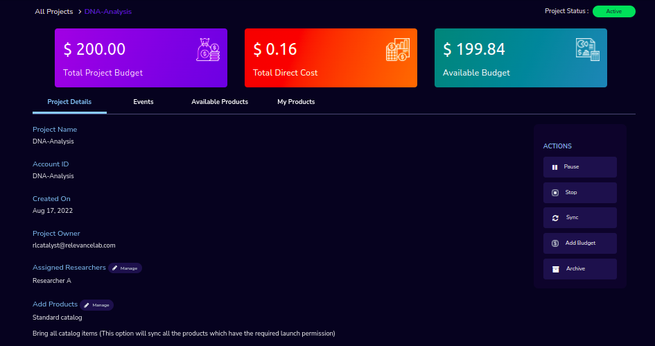

.. image:: images/Principal_ProjectDetails_AddProducts.png

.. note::

 a. While creating the project, if you select the "Standard Catalog" option it will create 7 products(Amazon Sagemaker, Amazon S3, Amazon EC2-Linux, Amazon EC2-Windows, RStudio, Cromwell Advanced and Nextflow Advanced). 
 b. If you select the "Bring all catalog items" option it will sync all the products which have the required launch permission in the portfolio of the AWS account.
 c. If you select the "Bring specific catalog items" option it will sync only the products which have the tag in the portfolio of the AWS account.
 d. If you select the “Use Project Storage” option it will create project storage at the time of project creation, if you unselect the “Use Project Storage” option it will not create project storage.
