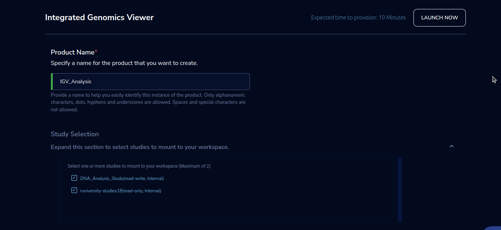
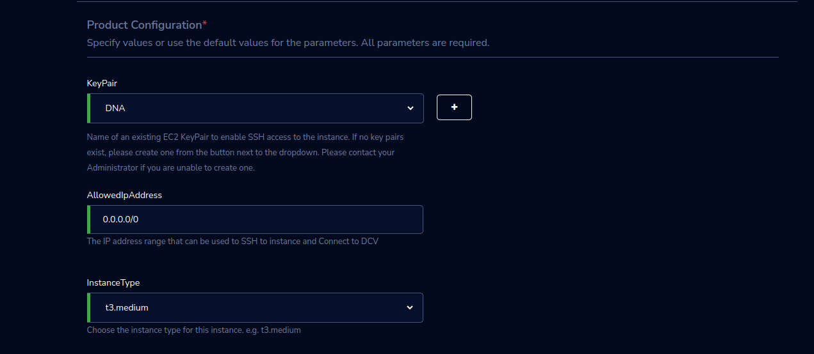
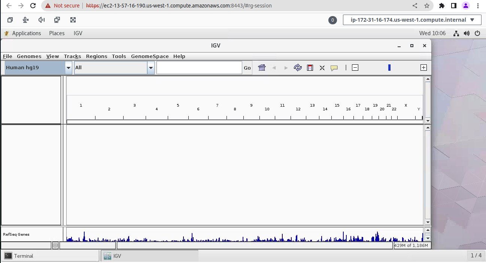

Integrated Genomics Viewer 
==========================

Integrative Genomics Viewer (IGV) product of Research Gateway is a lightweight visualization tool that enables intuitive real-time exploration of diverse, large-scale genomic datasets on standard desktop computers.

Parameters
-----------

.. list-table:: 
   :widths: 50, 50
   :header-rows: 1

   * - Parameter
     - Details
   * - Product Name
     - Provide a name to help you easily identify this instance of the product. Only alphanumeric characters, dots, hyphens and underscores are allowed. Spaces and special characters are not allowed 
   * - Study Selection 
     - Expand the section to select studies to mount to your workspace. Select one or more studies to mount to your workspace from the dropdown list (Maximum of 2) 
   * - KeyPair
     - Choose a Keypair in the dropdown list. Note: If Keypair is not available in the drop-down, click on the “+” button. A Keypair creation form is opened. Fill the details in the form and click on the “Create Keypair” button. Now that Keypair is available in the list. Remember to save the private key file securely for future use. Do not share this file with others for the security of your account. 
   * - AllowedIpAddress
     - Please enter the IP address range that is allowed to Connect to the instance via SSH.
   * - InstanceType
     - Choose instance type in the drop-down list E.g.: t3.medium

Steps to launch
----------------------

1. Click on the project on the “My Projects” page. 

2. Navigate to the available products tab 

3. Click the “Launch Now” button on the “Integrated Genomics Viewer” product card. A product order form will open. Fill the details in the form and click the “Launch Now” button. You will see an Integrated Genomics Viewer being created. In a few minutes, that product should appear in the “Active” state. 

Estimated time to provision - 10 minutes 

 

Steps to connect 
----------------------

1. Click on “Remote Desktop” under the “Connect” list on the right side of the page. This action will open the IGV window in another tab. While the remote desktop is opened the IGV Viewer will be already running in the window. 

2. You can de-provision the product through the “Terminate” option. 

 

Other considerations
----------------------

You can stop your instance using the “Stop” button on the product details page of your instance. The instance will incur lower costs when it is stopped than when it is running. Conversely, if the instance is stopped, use the “Start” button to get the instance “Running”. 

You can share the product with all the members of the project using the “Share” button on the product details page of your product. If you share the product with the project, you will have to share the PEM key file outside of Research Gateway. 