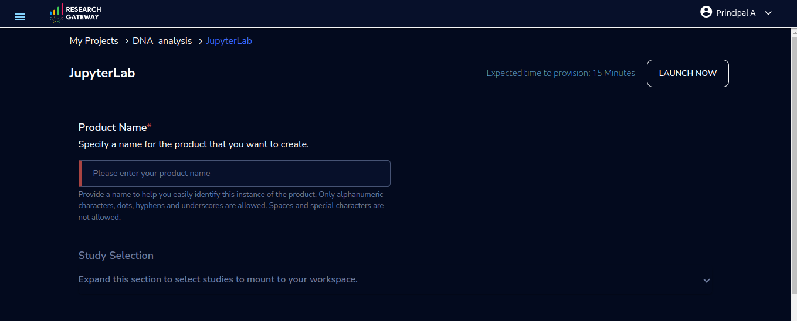
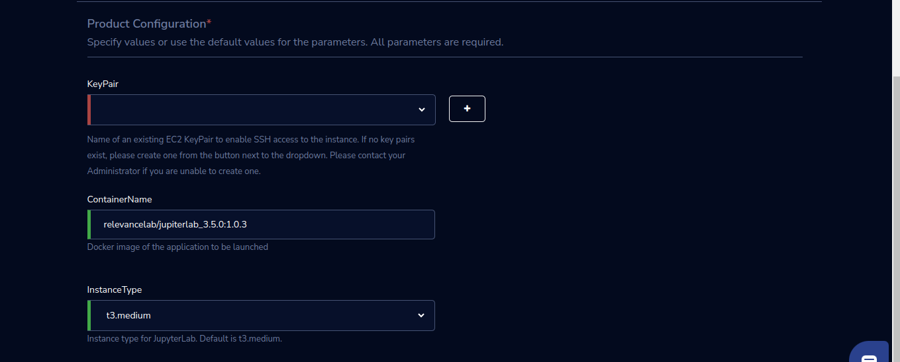

JupyterLab 
===========

JupyterLab product of Research Gateway is a popular open-source software package that provides a highly extensible notebook authoring and editing environment. It offers advanced features and customization options compared to Jupyter Notebook. 

Parameters 
---------------

.. list-table::
   :widths: 50, 50
   :header-rows: 1

   * - Parameter 
     - Details 
   * - Product Name 
     - Provide a name to help you easily identify this instance of the product. Only alphanumeric characters, dots, hyphens and underscores are allowed. Spaces and special characters are not allowed. Eg: MedicalResearch 
   * - Study Selection 
     - Expand the section to select studies to mount to your workspace.Select one or more studies to mount to your workspace from the dropdown list(Maximum of 2) 
   * - KeyPair 
     - Choose a KeyPair in the dropdown list. Note: If KeyPair is not available in the drop-down, click on the “+” button. A KeyPair creation form is opened. Fill the details in the form and click on the “Create KeyPair” button. Now that KeyPair is available in the list. Remember to save the private key file securely for future use. Do not share this file with others for the security of your account. 
   * - ContainerName 
     - Add Docker image of the application to be launched 
   * - InstanceType 
     - Choose instance type in the drop-down list Eg: t2.small 

 

Steps to launch 
----------------

1. Click on the project on the “My Projects” page. 

2. Navigate to the available products tab 

3. Click the “Launch Now” button on the “JupyterLab” product card. A product order form will open. Fill the details in the form and click the “Launch Now” button. You will see an JupyterLab being created. In a few minutes, that product should appear in the “Active” state. 

Estimated time to provision - 15 minutes 

 

Steps to connect 
----------------

1. Click on “Open Link” under the “Connect” list on the right side of the page. This will open the JupyterLab notebook in a new browser tab.  

2. Click on the “SSH” button under the “Connect” list on the right side of the page. This will open the SSH Window in a new browser tab.  

3. Enter “ec2-user” as the username. Select “Pem file” as the Authentication type. Upload the pem file in the “Pem file” field. Click Submit. You should now be connected to the EC2 instance via SSH. Scroll to the top of the Terminal screen and click the “Terminate” button to end the session. Alternatively, type exit and hit enter in the terminal. 

4. Through the Explore action you can see the shared files with 1 click.  

5. You can de-provision the product through the “Terminate” option. 

 .. image:: images/Product_JupyterLab_ProductDetails.png

.. note:: If project storage is not mounted you can’t see the explore action in the product details page. 

Other considerations 
--------------------

You can stop your instance using the “Stop” button on the product details page of your instance. The instance will incur lower costs when it is stopped than when it is running.  

You can also change the instance type when your instance is in a stopped state using the “Instance Type” button on the product details page of your instance. 

You can share the product with all the members of the project using the “Share” button on the product details page of your product. If you share the product with the project, you will have to share the PEM key file outside of Research Gateway. 

Conversely, if the instance is stopped, use the “Start” button to get the instance “Running”. 