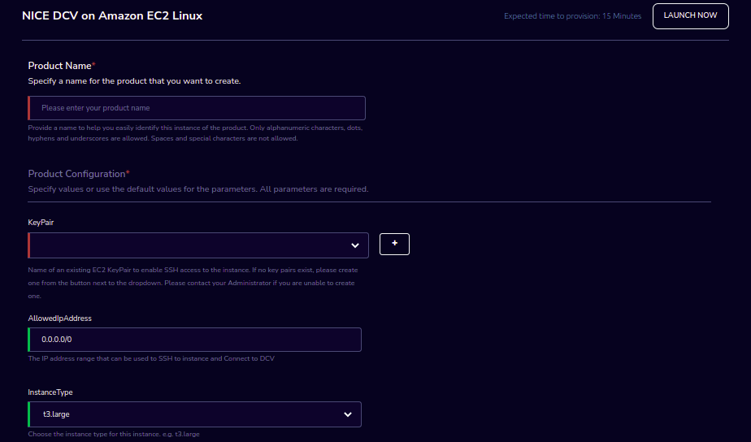

NICE DCV on Amazon EC2 linux
============================

NICE DCV on Amazon EC2 Linux Product of Research Gateway is a high-performance remote display protocol that provides you with a secure way to deliver remote desktops and application streaming from any cloud or data center to any device, over varying network conditions. 

Parameters
-----------

.. list-table:: 
   :widths: 50, 50
   :header-rows: 1

   * - Parameter
     - Details
   * - Product Name
     - Provide a name to help you easily identify this instance of the product. Only alphanumeric characters, dots, hyphens and underscores are allowed. Spaces and special characters are not allowed. Eg: MedicalResearch
   * - KeyPair
     - Choose a KeyPair in the dropdown list. Note: If KeyPair is not available in the drop-down, click on the “+” button. A KeyPair creation form is opened. Fill the details in the form and click on the “Create KeyPair” button. Now that KeyPair is available in the list. Remember to save the private key file securely for future use. Do not share this file with others for the security of your account.
   * - AllowedIpAddress
     - Please enter the IP address range that can be used to SSH to instance and Connect to DCV
   * - InstanceType
     - Choose instance type in the drop-down list Eg: t2.small

Steps to launch
----------------

1. Click on the project on the “My Projects” page.
2. Navigate to the available products tab
3. Click the “Launch Now” button on the ““NICE DCV on Amazon EC2 linux” product card. A product order form will open. Fill the details in the form and click the “Launch Now” button. You will see NICE DCV on Amazon EC2 linux being created. Once the product provisioning is completed, that product should appear in the “Active” state.

Estimated time to provision - 15 minutes

Steps to connect
-----------------

1. Click on “SSH Terminal” under the “Connect” list on the right side of the page. This will open the SSH Terminal in a new browser tab.
2. Enter “ec2-user” as the username. Select “Pem file” as the Authentication type. Upload the pem file in the “Pem file” field. Click Submit. You should now be connected to the EC2 instance via SSH. Scroll to the top of the Terminal screen and click the “Terminate” button to end the session. Alternatively, type exit and hit enter in the terminal.
3. Click on “Remote Desktop” under the “Connect” list on the right side of the page. This action will open the NICE DCV window in another tab. Your user name is ec2-user and Password is your Instance ID. To get your Instance ID go to the Outputs tab of provisioned product and scroll down to get the Instance ID parameter.
4. You can de-provision the product through the “Terminate” option.

Other considerations
--------------------

You can stop your instance using the “Stop” button in the product details page of your instance. The instance will incur lower costs when it is stopped than when it is running. Conversely, if the instance is stopped, use the “Start” button to get the instance “Running”.

You can share the product with all the members of the project using the “Share” button in the product details page of your product. If you share the product to the project, you will have to share the PEM key file outside of Research Gateway.

You can attach a secondary EBS volume to your EC2 instance. First, create the EBS volume from the available products tab. While launching the EBS product, choose the same availability zone as your EC2 instance (find it in the Outputs tab). Once the EBS volume has been created, go to your EC2 Instance product details page and click the “Attach Volume” button and select the volume from the dropdown. Conversely, you can also detach it by clicking the “Detach Volume” button in the kebab menu on the Product Details tab.

**Steps to follow to mount the secondary EBS volume to your EC2 instance:**

    1. Create a file system on the newly created EBS volume. Here we selected the device name /dev/sdf at the time of attaching the volume
		sudo mkfs -t xfs /dev/sdf
    2. Create a folder
		sudo mkdir /data
    3. Mount the volume
		sudo mount /dev/sdf /data

You can run the following command in the SSH terminal of your EC2 instance to determine if the EBS volume has been successfully mounted: 
lsblk

The volume will only be displayed in the list if it has been mounted.
       
.. note::
   a. If you have already created the file system on the volume, then skip the command “sudo mkfs -t xfs /dev/sdf”.
   b. For further details please refer to `the AWS documentation <https://docs.aws.amazon.com/AWSEC2/latest/UserGuide/ebs-using-volumes.html>`_