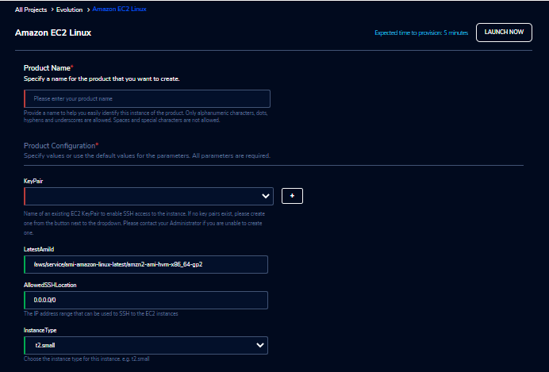
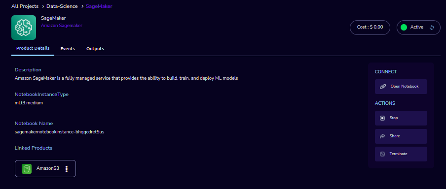

Ordering products in Research Gateway
======================================

.. contents::

Products List
^^^^^^^^^^^^^
1. Amazon EC2 Linux
2. Amazon EC2 Windows
3. Amazon S3
4. Amazon Sagemaker
5. RStudio
6. Nextflow-Advanced

Amazon EC2-Linux
^^^^^^^^^^^^^^^^^

Amazon Elastic Compute Cloud (Amazon EC2) is a web service that provides secure, resizable compute capacity in the cloud. The RLCatalyst Research Gateway standard EC2 product is based on Amazon Linux 2 and can be used for any general-purpose computer. 
We have greatly simplified the parameters that you have to enter to create an instance so that you can get started very quickly. The product launches in a matter of a few minutes and is ready to go.

Parameters
----------

.. list-table:: 
   :widths: 50, 50
   :header-rows: 1

   * - Parameter
     - Details
   * - Product Name
     - Provide a name to help you easily identify this instance of the product. Only alphanumeric characters, dots, hyphens and underscores are allowed. Spaces and special characters are not allowed. Eg: MedicalResearch
   * - KeyPair
     - Choose a KeyPair in the dropdown list. Note: If KeyPair is not available in the drop-down, click on the “+” button. A KeyPair creation form is opened. Fill the details in the form and click on the “Create KeyPair” button. Now that KeyPair is available in the list. Remember to save the private key file securely for future use. Do not share this file with others for the security of your account.
   * - LatestAmiId
     - LatestAmiId - Provide the location from where to pick the latest AMI on which the instance should be based. Valid values are: Amazon Linux 2 - /aws/service/ami-amazon-linux-latest/amzn2-ami-hvm-x86_64-gp2
   * - AllowedSSHLocation
     - This identifies the IP locations from where connections to this instance should be allowed. For the security of your instance, we recommend you allow connections only from your own location. You can find your IP using https://whatismyipaddress.com/
   * - InstanceType
     - Choose instance type in the drop-down list Eg: t2.small
   

Steps to launch
----------------

1. Click on the project on the “My Projects” page.
2. Navigate to the available products tab
3. Click the “Launch Now” button on the  “Amazon EC2-Linux” product card. A product order form will open. Fill the details in the form and click the “Launch Now” button. You will see an  Amazon EC2-Linux being created. In a few minutes, that product should appear in the “Active” state.

Estimated time to provision -  5 minutes

Steps to connect
----------------

You can connect to your EC2 instance through the RLCatalyst Research Gateway or via an external SSH client. If you are connecting from a Linux box use the following command:

If you are connecting from a Windows box you can use an SSH client like PuTTY.

1. Click on the project on the “My Projects” page.
2. Navigate to the “My Products” tab
3. Click on your instance in the My Products view. 
4. In the product details page, you will find the SSH/RDP button in the Connect pane on the right side. Click on the button to launch the SSH Launcher window in a separate tab of your browser. 
5. Select the Key file and click submit. The SSH window should open.

If you are unable to connect, check your current IP address against the “AllowedSSHLocation” parameter provided at provisioning time.

Other considerations
--------------------

You can stop your instance using the “Stop” button in the product details page of your instance. The instance will incur lower costs when it is stopped than when it is running. Conversely, if the instance is stopped, use the “Start” button to get the instance “Running”.

Amazon EC2-Windows
^^^^^^^^^^^^^^^^^^

Amazon Elastic Compute Cloud (Amazon EC2) is a web service that provides secure, resizable compute capacity in the cloud. The RLCatalyst Research Gateway standard EC2 product is based on Deep Learning AMI(Microsoft Windows Server 2016) and can be used for any general-purpose compute. We have greatly simplified the parameters you have to enter to create an instance so that you can get started very quickly. The product launches in a matter of a few minutes and is ready to go.

Required parameters for EC2-Windows
-----------------------------------

.. list-table:: 
   :widths: 50, 50
   :header-rows: 1

   * - Parameter
     - Details
   * - Product Name
     - Provide a name to help you easily identify this instance of the product. Only alphanumeric characters, dots, hyphens and underscores are allowed. Spaces and special characters are not allowed. Eg: MedicalResearch
   * - KeyPair
     - Choose a KeyPair in the dropdown list. Note: If KeyPair is not available in the drop-down, click on the “+” button. A KeyPair creation form is opened. Fill the details in the form and click on the “Create KeyPair” button. Now that KeyPair is available in the list. Remember to save the private key file securely for future use. Do not share this file with others for the security of your account.
   * - LatestAmiId
     - LatestAmiId - Provide the location from where to pick the latest AMI on which the instance should be based. Windows Server 2019 - /aws/service/ami-windows-latest/Windows_Server-2019-English-Deep-LearningWindows Server 2016
   * - AllowedSSHLocation
     - This identifies the IP locations from where connections to this instance should be allowed. For the security of your instance, we recommend you allow connections only from your own location. You can find your IP using https://whatismyipaddress.com/
   * - InstanceType
     - Choose instance type in the drop-down list. Eg: t2.small
	 
.. image:: images/ec2-windows.png
	 
Steps to launch the EC2-Windows
-------------------------------

1. Click on the project on the “My Projects” page.
2. Navigate to the available products tab
3. Click the “Launch Now” button on the  “Amazon EC2-Windows” product card. A product order form will open. Fill the details in the form and click the “Launch Now” button. You will see an  Amazon EC2-Windows being created. In a few minutes, that product should appear in the “Active” state.

Estimated time to provision -  5 minutes

Steps to connect the EC2-Windows
--------------------------------

1. Click on the “RDP” button under the “Connect” list on the right side of the page. This will open the SSH in a new browser tab. 
2. Enter “Administrator” as the username. Select “Pem file” as the Authentication type. Upload the pem file in the “Pem file” field. Click on the "Submit" button. You should now be connected to the EC2 instance via SSH. Save the username and password before clicking the “Download RDP file” button. Once downloaded you should connect to the window instance with the available details.
3. You can de-provision the product through the “Terminate” option.

Other considerations for the EC2-Windows
----------------------------------------

You can stop your instance using the “Stop” button in the product details page of your instance. The instance will incur lower costs when it is stopped than when it is running. Conversely, if the instance is stopped, use the “Start” button to get the instance “Running”.

 
Amazon S3
^^^^^^^^^^
Amazon Simple Storage Service (Amazon S3) is an object storage service that offers scalability, data availability, security, and performance.

Required parameters for S3
--------------------------

.. list-table:: 
   :widths: 50, 50
   :header-rows: 1

   * - Parameter
     - Details
   * - Product Name
     - Provide a name to help you easily identify this instance of the product. Only alphanumeric characters, dots, hyphens and underscores are allowed. Spaces and special characters are not allowed. Eg: MedicalResearch
 
.. image:: images/S3.png
 
Steps to launch the S3
----------------------

1. Click on the project on the “My Projects” page.
2. Navigate to the available products tab.
3. Click the “Launch Now” button on the  “Amazon S3” product card. A product order form will open. Fill the details in the form and click the “Launch Now” button. You will see an  S3 product being created. In a few minutes, that product should appear in the “Active” state.

Estimated time to provision -  2 minutes

Steps to connect the S3
-----------------------

1. Click on the newly created S3 bucket in the “My Products” tab. The product details page will open. 
2. Click on the “Upload” action. Choose any file to upload and the file size should not be greater than 10 MB  in the Upload pop-up. Click the “submit” button and the file will be uploaded to the bucket. Dismiss the “Upload” pop-up screen after the upload has completed successfully. In the product details screen of the newly created S3 bucket, click the “Explore” action. The “Explore” screen displays all the details of the bucket.
3. The newly uploaded file/folder should be visible. 
	a. Select the check-box next to the file and then click the “Actions” drop-down and select “Delete”. The file should be deleted.
	b. Select the check-box next to the file and then click the “Actions” drop-down and select “Download”. The file should be downloaded.
4. In the product details screen of the newly created S3 bucket, click the “Share” action. Choose the researcher name in the list and click on the “Submit” button. Once completed you can see the share option in the header which is after the product name. 
5. Through the “Unshare” option you can stop the product sharing.
6. You can de-provision the product through the “Terminate” option.

.. image:: images/s3-actions.png 

Other considerations for S3
---------------------------
You can stop your instance using the “Stop” button in the product details page of your instance. The instance will incur lower costs when it is stopped than when it is running. Conversely, if the instance is stopped, use the “Start” button to get the instance “Running”.

Amazon Sagemaker
^^^^^^^^^^^^^^^^^

Amazon SageMaker is a fully managed service that provides the ability to build, train and deploy ML models.

Required parameters for Sagemaker
---------------------------------

.. list-table:: 
   :widths: 50, 50
   :header-rows: 1

   * - Parameter
     - Details
   * - Product Name
     - Provide a name to help you easily identify this instance of the product. Only alphanumeric characters, dots, hyphens and underscores are allowed. Spaces and special characters are not allowed. Eg: MedicalResearch
   * - InstanceType
     - Choose instance type in the drop-down list. Eg: ml.t2.medium

.. image:: images/sagemaker.png

Steps to launch the Sagemaker
-----------------------------

1. Click on the project on the “My Projects” page.
2. Navigate to the available products tab.
3. Click the “Launch Now” button on the  “Amazon Sagemaker” product card. A product order form will open. Enter a product name and instance type then click the launch button. You will see a Sagemaker being created. In a few minutes, that product should appear in the “Active” state.

Estimated time to provision -  15 minutes

Steps to connect the Sagemaker
------------------------------

1. Click on the “Link” button under the “Connect” list on the right side of the page. This will open the sagemaker notebook in a new browser tab. 
2. You can de-provision the product through the “Terminate” option.

Other considerations for Sagemaker
-----------------------------------
You can stop your instance using the “Stop” button in the product details page of your instance. The instance will incur lower costs when it is stopped than when it is running. Conversely, if the instance is stopped, use the “Start” button to get the instance “Running”.

RStudio
^^^^^^^
RStudio is an integrated development environment (IDE) for R. It includes a console, syntax-highlighting editor that supports direct code execution, as well as tools for plotting, history, debugging, and workspace management.

Required parameters for RStudio
-------------------------------

 .. list-table:: 
   :widths: 50, 50
   :header-rows: 1

   * - Parameter
     - Details
   * - Product Name
     - Provide a name to help you easily identify this instance of the product. Only alphanumeric characters, dots, hyphens and underscores are allowed. Spaces and special characters are not allowed. Eg: MedicalResearch
   * - InitialUser
     - User name for Rstudio
   * - InitialPassword
     - Password for RStudio. Please keep in your records as this will not be echoed in the CloudFormation Console
   * - KeyPair
     - Choose the KeyPair in the list. Note: If KeyPair is not available in the drop-down, click on the “+” button. A KeyPair creation form is opened. Fill the details in the form and click on the “Create KeyPair” button. Now that Keypair is available in the list.
       Remember to save the private key file securely for future use. Do not share this file with others for the security of your account.
   * - InstanceType
     - Choose instance type in the drop-down list for RStudio. Eg: t2.micro

 .. image:: images/rstudio.png
 
Steps to launch the Rstudio
---------------------------

1. Click on the project on the “My Projects” page.
2. Navigate to the available products tab.
3. Click the “Launch Now” button on the  “RStudio” product card. A product order form will open. Fill the details in the form and click the “Launch Now” button. You will see an “RStudio” being created. In a few minutes, that product should appear in the “Active” state.

Estimated time to provision -  15 minutes

Steps to connect the RStudio
----------------------------

1. Click on “Open Link” under the “Connect” list on the right side of the page. This will open the Rstudio in a new browser tab. 
2. Click on the “SSH” button under the “Connect” list on the right side of the page. This will open the SSH Window in a new browser tab. 
3. Enter “ec2-user” as the username. Select “Pem file” as the Authentication type. Upload the pem file in the “Pem file” field. Click Submit. You should now be connected to the EC2 instance via SSH. Scroll to the top of the Terminal screen and click the “Terminate” button to end the session. Alternatively, type exit and hit enter in the terminal.

 .. image:: images/rstudio-actions.png
 
Other considerations for the RStudio
-------------------------------------

You can stop your instance using the “Stop” button in the product details page of your instance. The instance will incur lower costs when it is stopped than when it is running. Conversely, if the instance is stopped, use the “Start” button to get the instance “Running”.

Nextflow-Advanced
^^^^^^^^^^^^^^^^^^
Use the scalability of AWS Batch to run Nextflow workflows. This is ideal for large workloads and larger data-sets.

Required parameters for Nextflow-Advanced
-----------------------------------------

.. list-table:: 
   :widths: 50, 50
   :header-rows: 1

   * - Parameter
     - Details
   * - Product Name
     - Provide a name to help you easily identify this instance of the product. Only alphanumeric characters, dots, hyphens and underscores are allowed. Spaces and special characters are not allowed. Eg: MedicalResearch
   * - Namespace
     - Namespace to use to label resources.
   * - PipelineName
     - URL to the git repository containing the pipeline code. The repo should contain nextflow.config file which specifies the name of the docker container image. Eg: https://github.com/seqeralabs/nextflow-tutorial.git
   * - PipelineContainer
     - Docker container image to the pipeline to be executed in the worker node. Eg: nextflow/rnaseq-nf:latest
   * - InputDataLocation
     - Name of existing S3 Bucket in that region.
   * - OutputDataLocation
     - Name of existing S3 Bucket in that region.
   * - WorkDataLocation
     - Name of existing S3 Bucket in that region.
   * - InstanceType
     - Choose instance type in the drop-down list for RStudio. Eg: t2.micro
   * - HeadNodeEBSVolumeSize
     - Amount of storage the Head Node will use. Eg: 16 
   * - KeyPair
     - Choose the KeyPair in the list. Note: If keyPair is not available in the drop-down, click on the “+” button. A keypair creation form is opened. Fill the details in the form and click on the “Create KeyPair” button. Now that keypair is available in the list. Remember to save the private key file securely for future use. Do not share this file with others for the security of your account
   * - AllowedSSHLocation
     - This identifies the IP locations from where connections to this instance should be allowed. For the security of your instance, we recommend you allow connections only from your own location. You can find your IP using https://whatismyipaddress.com/ Eg: 0.0.0.0/0
   * - VPCId
     - Choose VPC Id in the drop-down list.
   * - ComputeEnvMinvCpus
     - The minimum number of CPUs to be kept in running state for the Batch Worker Nodes. Eg: 0
   * - ComputeEnvMaxvCpus
     - The maximum number of CPUs for the default Batch Compute Environment. Eg: 100
   * - SpotBidPercentage
     - The maximum percentage of On-Demand pricing you want to pay for Spot resource. Eg: 100
   * - WorkerNodeInstanceType
     - Specify the instance types to be used to carry out the computation Eg: Optimal 
   * - WorkerNodeEBSVolumeSize
     - The initial size of the volume.  Eg: 100

   
Steps to launch the Nextflow-Advanced
-------------------------------------
1. Click on the project on the “My Projects” page.
2. Navigate to the available products tab.
3. Click the “Launch Now” button on the  “Nextflow-Advanced” product card. A product order form will open. Fill the details in the form and click the “Launch Now” button. You will see a  “Nextflow-Advanced” being created. In a few minutes, that product should appear in the “Active” state.

Estimated time to provision -  10 minutes

Steps to connect the Nextflow-Advanced
----------------------------------------
1. Click on the “SSH” button under the “Connect” list on the right side of the page. This will open the SSH Window in a new browser tab. 
2. Enter “ec2-user” as the username. Select “Pem file” as the Authentication type. Upload the pem file in the “Pem file” field. Click Submit. You should now be connected to the EC2 instance via SSH. Run the computation command in
3. Scroll to the top of the Terminal screen and click the “Terminate” button to end the session. Alternatively, type exit and hit enter in the terminal.
4. You can de-provision the product through the “Terminate” option.

Other considerations  for the Nextflow-Advanced 
------------------------------------------------
You can stop your instance using the “Stop” button in the product details page of your instance. The instance will incur lower costs when it is stopped than when it is running. Conversely, if the instance is stopped, use the “Start” button to get the instance “Running”.

   
   