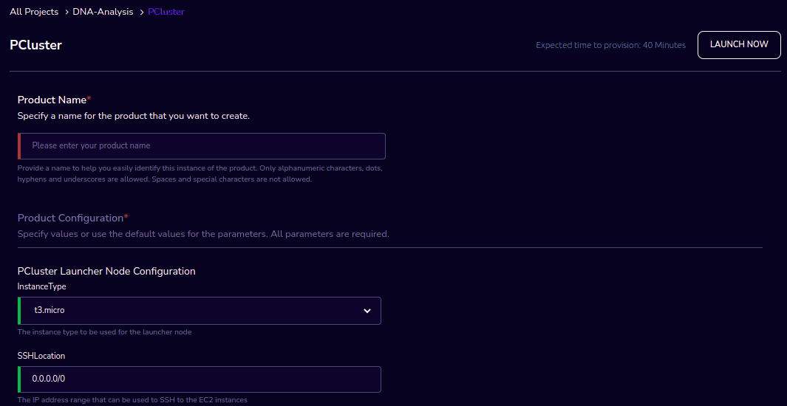
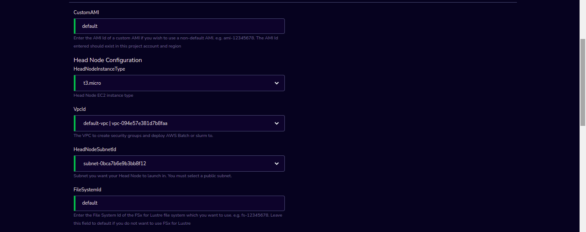
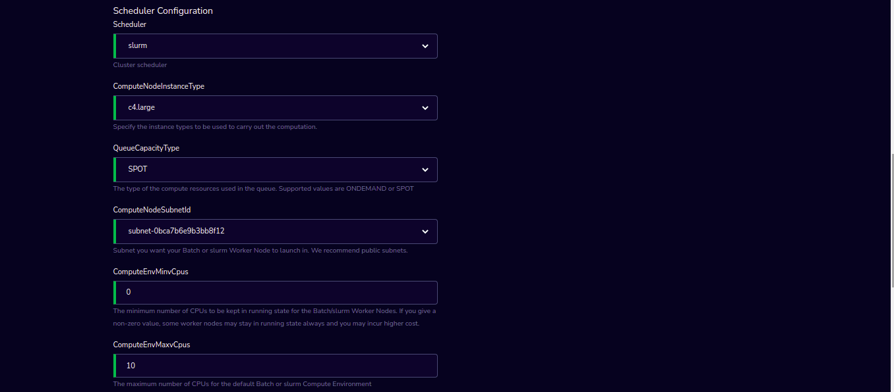
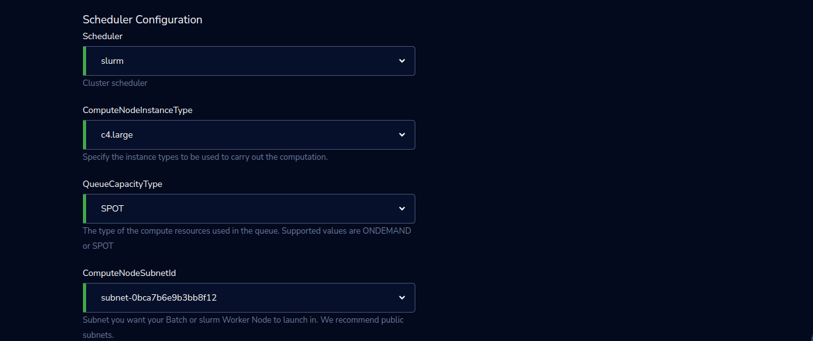
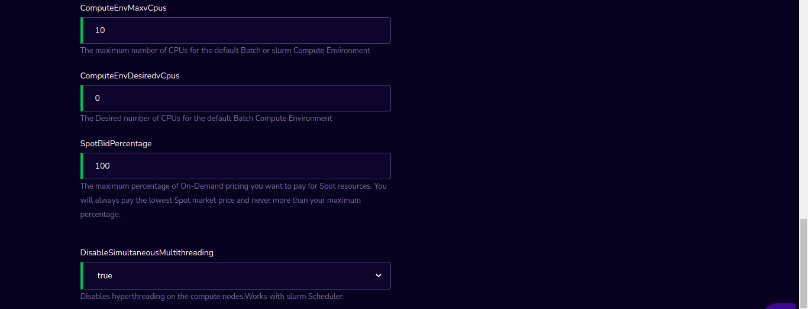
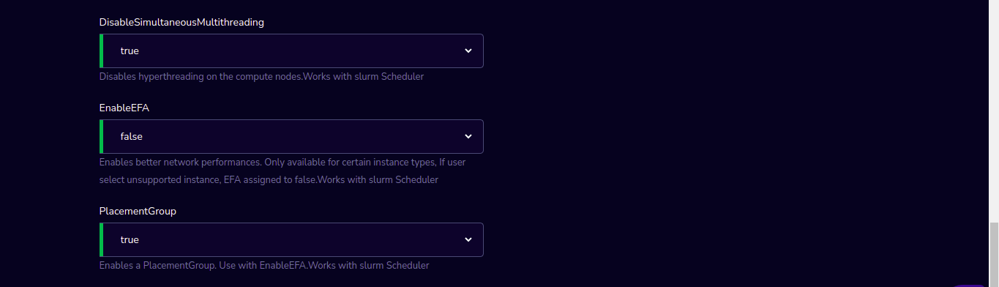

PCluster
========

PCluster Product of Research Gateway helps you to set up a high performance computing Cluster based on AWS Parallel Cluster 3.0. 

PCluster enables you to quickly build an HPC compute environment in AWS. It automatically sets up the required compute resources and shared filesystem. You canuse PCluster with batch schedulers, such as AWS Batch and Slurm. PCluster facilitates quick-start, proof of concept deployments as well as production deployments.

`Watch a video on how to provision a PCluster product. <https://www.youtube.com/embed/TIQANO-DOtg?start=164&end=208&autoplay=1>`_

Parameters
-----------

.. list-table:: 
   :widths: 50, 50
   :header-rows: 1

   * - Parameter
     - Details
   * - Product Name
     - Provide a name to help you easily identify this instance of the product. Only alphanumeric characters, dots, hyphens and underscores are allowed. Spaces and special characters are not allowed. Eg: MedicalResearch
   * - InstanceType
     - Choose instance type in the drop-down list Eg: t2.small
   * - SSHLocation
     - Enter the IP address range that can be used to SSH to the EC2 instances
   * - KeyPair
     - Choose a KeyPair in the dropdown list. Note: If KeyPair is not available in the drop-down, click on the “+” button. A KeyPair creation form is opened. Fill the details in the form and click on the “Create KeyPair” button. Now that KeyPair is available in the list. Remember to save the private key file securely for future use. Do not share this file with others for the security of your account.
   * - CustomAMI
     - Enter the AMI Id of a custom AMI if you wish to use a non-default AMI. e.g. ami-12345678. The AMI Id entered should exist in this project account and region
   * - HeadNodeInstanceType
     - Select Head Node EC2 instance type from the drop-down list
   * - VpcId
     - Select The VPC to create security groups and deploy AWS Batch or slurm to from drop-down list
   * - HeadNodeSubnetId
     - Select the Subnet you want your Head Node to launch in from the drop-down list. You must select a public subnet.
   * - FileSystemType
     - Choose the fileSystem type EFS/FSxForLustre/EBS (provisioned earlier) which you want to mount on headnode leave it as NONE if don't want to mount any filesystem.
   * - FileSystemId
     - Enter the File System Id of the EFS/FSxForLustre/EBS file system which you want to use. e.g. fs-12345678. Leave this field to default if you do not want to use any file system
   * - Scheduler
     - Select a Cluster scheduler from the drop-down list 
   * - ComputeNodeInstanceType 
     - Select the instance types to be used to carry out the computation from the drop-down list
   * - QueueCapacityType
     - Select the type of the compute resources used in the queue. Supported values are ONDEMAND or SPOT from the drop-down list.
   * - ComputeNodeSubnetId
     - Select the Subnet you want your Batch or slurm Worker Node to launch in from the drop-down list. We recommend public subnets.
   * - ComputeEnvMinvCpus
     - Enter the minimum number of CPUs to be kept in running state for the Batch/slurm Worker Nodes. If you give a non-zero value, some worker nodes may stay in running state always and you may incur higher cost.
   * - ComputeEnvMaxvCpus
     - Enter the maximum number of CPUs for the default Batch or slurm Compute Environment
   * - ComputeEnvDesiredvCpus
     - Enter the Desired number of CPUs for the default Batch Compute Environment
   * - SpotBidPercentage
     - Enter the maximum percentage of On-Demand pricing you want to pay for Spot resources. You will always pay the lowest Spot market price and never more than your maximum percentage.
   * - DisableSimultaneousMultithreading
     - Select the true/false value from the drop-down list. If selected value is true it will Disable hyperthreading on the compute nodes.Works with slurm Scheduler.
   * - EnableEFA
     - Select the true/false value from the drop-down list. If selected value is true it will Enable better network performances. Only available for certain instance types, If user select unsupported instance, EFA assigned to false.Works with slurm Scheduler
   * - PlacementGroup
     - Select the true/false value from drop-down list. If selected value is true it will Enable a PlacementGroup. Use with EnableEFA.Works with slurm Scheduler

Steps to launch
----------------

1. Click on the project on the “My Projects” page.
2. Navigate to the available products tab
3. Click the “Launch Now” button on the  “PCluster” product card. A product order form will open. Fill the details in the form and click the “Launch Now” button. You will see an PCluster being created. Once the cluster provisioning is completed, that product should appear in the “Active” state.

Estimated time to provision - 40 minutes

Steps to connect
----------------

1. Click on “SSH Terminal” under the “Connect” list on the right side of the page. This will open the SSH Terminal in a new browser tab.
2. Enter “ec2-user” as the username. Select “Pem file” as the Authentication type. Upload the pem file in the “Pem file” field. Click Submit. You should now be connected to the EC2 instance via SSH. Scroll to the top of the Terminal screen and click the “Terminate” button to end the session. Alternatively, type exit and hit enter in the terminal.
3. You can de-provision the product through the “Terminate” option.
4. Click on "Remote Desktop" under the "Connect" list on the right side of the page. The cluster head-node by default has NICE DCV installed which allows you to connect to the head-node via a GUI interface. This is especially useful to visualize results of the jobs that you run on the cluster (e.g. using Paraview to view the results of OpenFOAM jobs).

`Watch a video that demonstrates using OpenFOAM on a PCluster product. <https://www.youtube.com/embed/TIQANO-DOtg?start=209&end=370&autoplay=1>`_

Other considerations
---------------------

You can stop your instance using the “Stop” button in the product details page of your instance. The instance will incur lower costs when it is stopped than when it is running. Conversely, if the instance is stopped, use the “Start” button to get the instance “Running”.

You can share the product with all the members of the project using the “Share” button in the product details page of your product. If you share the product to project, you will have to share the PEM key file outside of Research Gateway.
