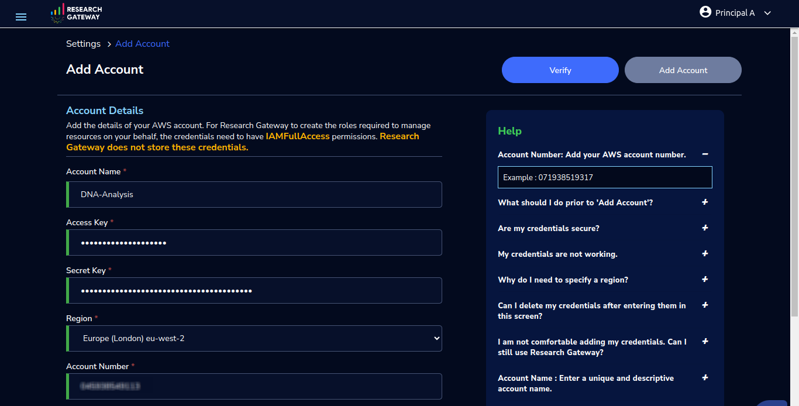
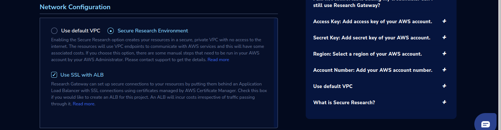

Creating a Secure Research Environment 
========================================
 
This is a premium feature and available only to customer who are subscribed to that feature. 

**1. Setting up a SRE Enabled AWS Account** 

 a. Create a Setting in RG using your AWS account.  

 b. Create a stack and Secure VPC using the cft in the project account in the same region where the setting is created, click on this `link <https://secureproduct-networkcfts-dontdelete.s3.eu-west-2.amazonaws.com/vpc-squid.yml>`_ it will download cft in your system.  

 .. note:: Secure VPC will be created as part of stack creation. ALB will be created as part of Secure Research Project creation in step 3. 

 c. Provide the below details of the CFT outputs to the RG support team to enable secure research.  

.. list-table:: 
   :widths: 50
   :header-rows: 1

   * - Network Details
   * - vpc
   * - publicSubnet1
   * - publicSubnet2
   * - privateSubnet
   * - entryPointSG
   * - workspaceSG
   * - interfaceEndpointSG

**2. Setting up a Data Library project**

 You can create Data Library project for the Secure Research Environment account from Create Project form by selecting Project Type as Data Library. 

 The Data Library project is used to host sensitive datasets which are then shared to secure research projects as Internal Studies. The Data Library project also hosts Ingress buckets used by Researchers to bring in their own data/code. 

 .. note::  For this project only Amazon S3 product of Research Gateway will be assigned, and Project storage will not be created as part of project creation. 

 .. image:: images/Datalibrary_AddProject_form1.png 

..
 
 .. image:: images/Datalibrary_AddProject_form2.png  

..

 .. image:: images/Datalibrary_AddProject_form3.png  

**steps to create buckets and map them to internal studies** 

 After creating the Data Library project, you can follow below steps to create buckets and map them to internal studies: 

 a. Create S3 bucket by launching S3 product. After it is provisioned successfully upload folders by clicking on Explore action available on Product details page 

 b. Create an Internal Study using prefix as Uploaded folder name from Studies Page “Create Study” button or use details from :ref:`Internal Study (for Principal Investigator)<internal-study>` to create an Internal Study  

 c. Create another S3 bucket in same project this bucket can be shared with Assigned Researcher (You can add users to the project while project creation or existing project using Manage action from project details page use details from :ref:`How to Add Researchers to an Existing Project<add-researchers-existing-project>`   

 .. note:: Without following all steps of Step 1 If you try to create Data Library project you will see below toaster  

 .. image:: images/DatalibraryProject_incompleteSetup_errormessage.png

.. _create secure research project:

**3. Setting up a Secure Research Project** 

 You can create Secure Research project for the Secure Research Environment account from Create Project form by selecting Project Type as Secure Research. 

 Secure Research Environment allows authenticated and authorized users to access workspaces that have access to sensitive datasets for processing and analysis. 

 You can add users to the project while project creation or existing project using Manage action from project details page use details from :ref:`How to Add Researchers to an Existing Project<add-researchers-existing-project>`  

 .. note::  For this project only Secure Research Linux Desktop product of Research Gateway will be assigned, and Project storage will not be created as part of project creation. 

 .. image:: images/Secure_AddProject_form1.png

..

 .. image:: images/Secure_AddProject_form2.png

..

 .. image:: images/Secure_AddProject_form3.png 

..

 .. note:: Without following all steps of Step 1 If you try to create Secure Research project you will see below toaster 

 .. image:: images/SecureResearchProject_incompleteSetup_errormessage.png 

 
**4. Enabling the Egress application** 

 a. Create a stack using the cft in the project account in the same region where the setting is created, click on this `link <https://rlcatalyst-researchportal.s3.us-east-2.amazonaws.com/EgressAppResourcesRG.yml>`_ it will download cft in your system.  

 b. Provide the below details of the CFT outputs to the RG support team to enable egress application in the project. 

.. list-table::  
   :widths: 50 
   :header-rows: 1 

   * - egressStoreDetails 
   * - egressStoreBucketArn 
   * - egressStoreKmsArn 
   * - egressStoreBucketName 
   * - egressStoreNotificationBucketName 
   * - egressStoreName 
   * - egressSNSTopic 

**5. Creating Secure Research Linux Desktop instances.** 

 Click on the Secure Research project and provision “Secure Research Linux Desktop” product. Select the internal study created in step 2 in product launch form and provision product.   

 Once the provisioned product is Active, connect via Remote desktop and browse the mounted study which was selected during product provisioning.  

 
**6. Submitting Egress request for outputs** 

 An egress store is created by the Data Admin. A researcher does not have direct access to this store. 

 If you have egress application enabled the egress store will be mounted to the research workspace. You will be able to see Egress Store tab. The researcher can copy data to this egress store. 

 .. image:: images/SecureProduct_EgressStoreTab.png 

 If there are no files in the egress store you will be able to see below screen in egress store tab of product 

 .. image:: images/SecureProduct_egressstoretab_nofiles.png 

 .. note:: To make an egress request you need to first copy the necessary files into the egress store location mounted to your workspace.  

**Follow below steps to Submit Egress request for outputs** 

 a. Please login into AWS console and go to the location where egress store bucket is located.  
 
 b. Navigate to Workspace folder of your provisioned product.  
 
 c. Upload files in this folder. note: empty folders will not be listed in the path  

 d. Once step c is completed login into RG and go inside a particular provisioned product and refresh the page to see the uploaded file in Egress Store tab and click on Submit Egress Request button which is enabled only when there are any new files uploaded. 

 .. image:: images/Secureproduct_EgressStore_SubmitRequestbutton.png

**7. Approval flow for Egress requests** 

 a. The submitted request needs to be approved first by Information Governance Lead and then it needs to be approved by Researcher IT Admin. 

 b. The egress request notifies the Information Governance Lead. 

 c. The Information Governance Lead evaluates the egress request by inspecting the files submitted via email notification that he has received. 

 d. The Information Governance lead can login into the application and search for it request using id (id can be found in the mail which gives the notification of a request that needs to be approved) and he n then approve or rejects the request from egress application with proper justification. 

 e. The Research IT will then receive an email notification to evaluate the request that was approved by Information Governance Lead. 

 f. Research IT then approves or rejects the request.  

 g. If the request is approved, then the Information Governance Lead can see the Download option in the request dialog box, where he can the download the file content as a zip and then share this via email to the researcher.  

 
**8.  Add Ingress Gateway Project** 

 You can create Ingress Gateway project for the Secure Research Environment account from Create Project form by selecting Project Type as Ingress Gateway. 
 
 .. image:: images/IngressGateway_AddProject_form1.png

..   

 .. image:: images/IngressGateway_AddProject_form2.png

..

 .. image:: images/IngressGateway_AddProject_form3.png   

 This project is meant for researchers to be provided a storage area where they can upload files that they want to bring into a secure project.  

 .. note::  For this project only Amazon S3 product of Research Gateway will be assigned, An Ingress Storage s3 product will be automatically created as part of project creation.  

 .. image:: images/IngressGatewayProject_IngressStore.png

 The researchers can upload files/folders or create folder via the UI using explore action from Ingress Store’s Product Details page and then submit an ingress request.  

 .. image:: images/IngressStore_ProductDetails_ExploreAction.png

..

 .. image:: images/IngressStore_UploadAction.png  

 Once user successfully uploads and clicks on Submit ingress Request button, he will be able to see green color success toaster message. 

 .. image:: images/IngressStore_SubmitIngressRequest.png

..   

 .. image:: images/IngressStore_SubmitIngressRequest_SuccessToasterMessage.png   

 After approval, these files are made available in the IngressStore folder that is mounted to their workspaces and will be visible in S3Mounts parameter of Launched workspace. 

 .. image:: images/SecureProduct_S3Mounts_Ingressmounting.png

To know more please contact Support. 