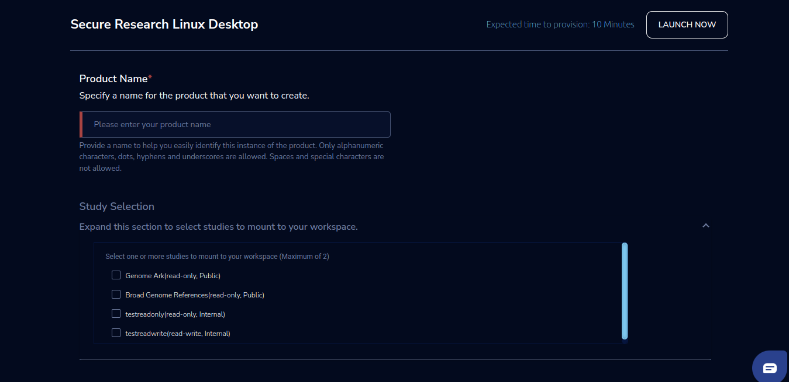
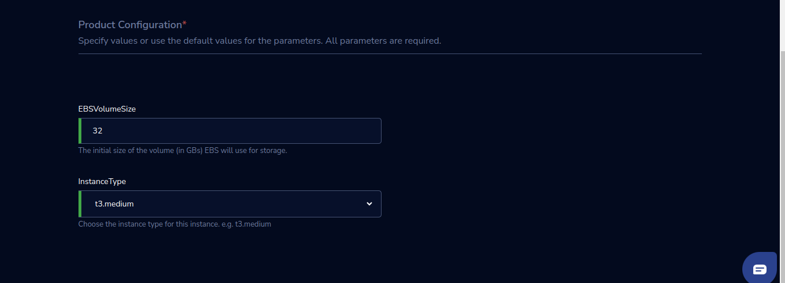

Secure Research Linux Desktop 
==============================

The Secure Research Linux Desktop is a product offered by Research Gateway, that provides authenticated and authorized users access to workspaces that handle sensitive datasets for processing and analysis while minimizing the risk of exposing sensitive data.   

The Secure Research Linux Desktop only works in a project enabled for secure research. Follow these steps to enable secure research projects. 

1. Create a Setting in RG using your AWS account. 

2. Create a stack and Secure VPC using the cft in the project account in the same region where the setting is created, click on this `link <https://secureproduct-networkcfts-dontdelete.s3.eu-west-2.amazonaws.com/vpc-squid.yml>`_ it will download cft in your system.  

.. note:: secure VPC will be created as part of stack creation. ALB will be created as part of Secure Research Project creation 

3. Provide the below details of the CFT outputs to the RG support team to enable secure research. 

.. list-table:: 
   :widths: 50
   :header-rows: 1

   * - Network Details
   * - vpc
   * - publicSubnet1
   * - publicSubnet2
   * - privateSubnet
   * - entryPointSG
   * - workspaceSG
   * - interfaceEndpointSG

4. Create a project from the UI using Secure Research account in project creation form you will not be able to see Add product and Project storage enabling checkbox option.

5. Provide the details of the project to RG support team to enable secure research in the project. 

6. Assign the Secure Research Linux Desktop product to the secure research project. 

A project enabled for secure research only uses Secure Research Linux Desktop product in the catalog. To provision this workspace, launch the product using the following parameters. 

Parameters
-----------

.. list-table:: 
   :widths: 50, 50
   :header-rows: 1

   * - Parameter
     - Details
   * - Product Name 
     - Provide a name to help you easily identify this instance of the product. Only alphanumeric characters, dots, hyphens and underscores are allowed. Spaces and special characters are not allowed. 
   * - Study Selection 
     - Expand the section to select studies to mount to your workspace. Select one or more studies to mount to your workspace from the dropdown list (Maximum of 2) 
   * - EBSVolumeSize 
     - The initial size of the volume (in GBs) EBS will use for storage. 
   * - InstanceType 
     - Choose the instance type for this instance. e.g., t3. medium 

Steps to launch
----------------

1. Click on the project on the “My Projects” page. 

2. Navigate to the available products tab. 

3. Click the “Launch Now” button on the “Secure Research Linux Desktop” Product card. 

4. A product order form will open. Fill the details in the form and click the “Launch Now” button. 

5. You will see a Secure Research Linux Desktop being created. In a few minutes, that product should appear in the “Active” state. 

Expected time to provision: 10 Minutes 

Steps to connect
------------------

1. Click on “Remote Desktop” under the “Connect” list on the right side of the page. You will be able to see a colored theme. 

   We have conda and Google Chrome installed by default based on AMI. Users can also install RStudio and Jupyterlab and access it from instance

   Once product comes to active click on Remote Desktop action and follow below instructions:

   a. To install and run conda:

   - Click on Applications-System Tools-MATE Terminal in /home/ec2-user path you will be able to find **conda.sh** file, run the below command 

     **./conda.sh**

   - Check for the conda version using below command

     **conda --version**

   .. note:: once conda installs successfully it will restart the machine automatically user will not be able to access machine for around one minute

   You can access Google Chrome by performing below steps

   - Click on Applications-Internet-Google Chrome

   You can also install and access RStudio and Jupyterlab in your machine optionally by following steps below:

   a. To install and access RStudio:

   - Click on Applications-System Tools-MATE Terminal in /home/ec2-user path run below command

     **docker run -d --restart always -e PASSWORD=<Enter-password> -v /home/ec2-user:/home/ec2-user -p 8787:8787 relevancelab/rstudio_4.2.1:1.0.3**

   .. note:: you can use password of your choice in above command and use same password during authentication

   - Once it is installed successfully run below command and check if its installed

     **docker ps**

   - Click on Applications-Internet-Google Chrome and access **localhost:8787** URL

   - once connection is successful it will open up RStudio authentication window you can access it using below credentials
   
     **Username**: ec2-user
   
     **Password**: You can enter the password which you added in command **docker run -d --restart always -e PASSWORD=<Enter-password> -v /home/ec2-user:/home/ec2-user -p 8787:8787 relevancelab/rstudio_4.2.1:1.0.3**

   b. To install and access JupyterLab:

   - Click on Applications-System Tools-MATE Terminal in /home/ec2-user path run below command

     **docker run -d --restart always --name jupyterlab -p 8888:8888 -v /home/ec2-user:/home/ec2-user relevancelab/jupiterlab_3.5.0:1.0.3**

   - Once it is installed successfully run below command and check if its installed

     **docker ps**

   - To generate URL for accessing JupyterLab run below command 

     **echo "http://127.0.0.1:8888/lab?token"$(docker exec jupyterlab  /bin/bash -c "jupyter server list" 2>&1 | grep token | awk '{print $2}' | sed 's/.*=//')**

     above command will generate URL for example: **http://127.0.0.1:8888/lab?token052fac3fc6c0b2b7f01ece6c5abd55258fde0c3d4d2950f5**

   - Click on Applications-Internet-Google Chrome and access generated URL, once connection is successful it will open up Token Authentication window and add password from URL for example: if this is generated URL  **http://127.0.0.1:8888/lab?token052fac3fc6c0b2b7f01ece6c5abd55258fde0c3d4d2950f5** this will be Password or Token to be added in it 052fac3fc6c0b2b7f01ece6c5abd55258fde0c3d4d2950f5

2. You can de-provision the product through the “Terminate” option. 

 
Other considerations
----------------------

You can stop your instance using the “Stop” button on the product details page of your instance. The instance will incur lower costs when it is stopped than when it is running. Conversely, if the instance is stopped, use the “Start” button to get the instance “Running”. 

You can share the product with all the members of the project using the “Share” button on the product details page of your product. If you share the product with the project, you will have to share the PEM key file outside of Research Gateway. 

You can also change the instance type when your instance is in a stopped state using the “Instance Type” button on the product details page of your instance.