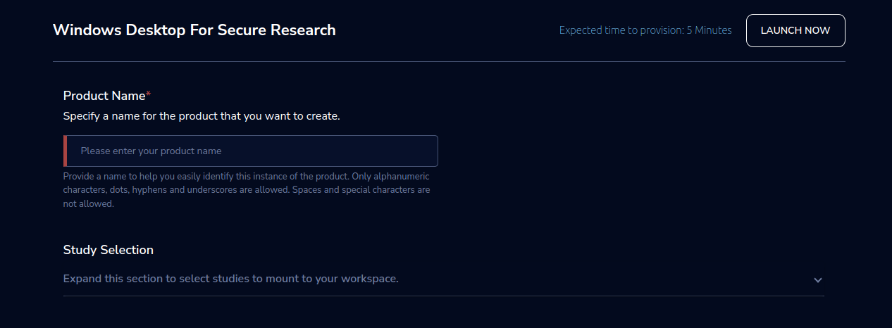
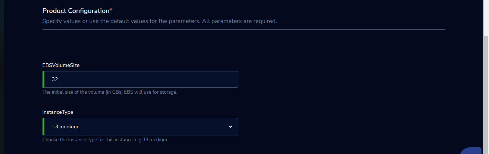

Windows Desktop for Secure Research
====================================

“The Windows Desktop for Secure Research allows you to connect via your browser to an EC2 Windows-based desktop machine in the cloud with a modern GUI interface. Data cannot be copied out of the system via clipboard or file-download. All data is encrypted in transit and at rest.” 

The Windows Desktop for Secure Research product only works in a project enabled for secure research. Follow these :ref:`steps <create secure research project>` to enable secure research projects.

A project enabled for secure research only uses Windows Desktop for Secure Research product in the catalog. To provision this workspace, launch the product using the following parameters. 

Parameters
-----------

.. list-table:: 
   :widths: 50, 50
   :header-rows: 1

   * - Parameter
     - Details
   * - Product Name 
     - Provide a name to help you easily identify this instance of the product. Only alphanumeric characters, dots, hyphens and underscores are allowed. Spaces and special characters are not allowed. 
   * - Study Selection 
     - Expand the section to select studies to mount to your workspace. Select one or more studies to mount to your workspace from the dropdown list (Maximum of 2) 
   * - EBSVolumeSize 
     - The initial size of the volume (in GBs) EBS will use for storage. 
   * - InstanceType 
     - Choose the instance type for this instance. e.g., t3. medium 

Steps to launch
----------------

1. Click on the project on the “My Projects” page. 
2. Navigate to the available products tab. 
3. Click the “Launch Now” button on the “Secure Research Windows Desktop” Product card. 
4. A product order form will open. Fill the details in the form and click the “Launch Now” button. 
5. You will see a Secure Research Windows Desktop being created. In a few minutes, that product should appear in the “Active” state. 

Expected time to provision: 12 Minutes 

Steps to connect
----------------

1. Click on “Remote Desktop” under the “Connect” list on the right side of the page. You will be able to see a colored theme. 
2. You can de-provision the product through the “Terminate” option. 

Other considerations
---------------------

You can stop your instance using the “Stop” button on the product details page of your instance. The instance will incur lower costs when it is stopped than when it is running. Conversely, if the instance is stopped, use the “Start” button to get the instance “Running”. 

You can share the product with all the members of the project using the “Share” button on the product details page of your product. If you share the product with the project, you will have to share the PEM key file outside of Research Gateway. 

You can also change the instance type when your instance is in a stopped state using the “Instance Type” button on the product details page of your instance. 