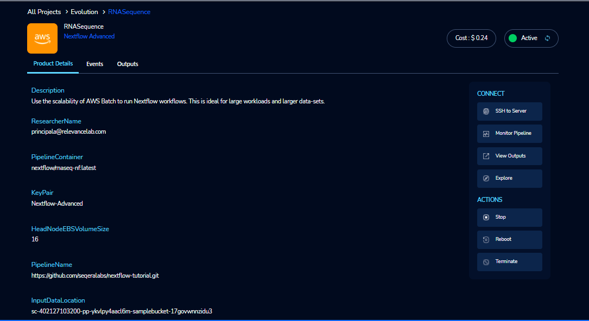

Cromwell-Advanced
=================

Use the scalability of AWS Batch to run Cromwell-Advanced workflows. This is ideal for large workloads and larger data-sets.

..  `Watch a video on how to provision a Cromwell-Advanced product <https://youtu.be/DzdDANF_EgA>`_

Parameters
-----------

.. list-table:: 
   :widths: 50, 50
   :header-rows: 1

   * - Parameter
     - Details
   * - Product Name
     - Provide a name to help you easily identify this instance of the product. Only alphanumeric characters, dots, hyphens and underscores are allowed. Spaces and special characters are not allowed. Eg: MedicalResearch 
   * - Cromwell Configuration
     -
   * - PipelineName
     - Search and select the pipeline git repository URL. If not found please enter the custom pipeline URL. The repo should contain the Cromwell.config file which specifies the name of the docker container image. Eg: https://github.com/seqeralabs/Cromwell-tutorial.git
   * - InputDataLocation
     - An S3 bucket which holds input data for the Cromwell pipeline. The bucket name must respect the S3 bucket naming conventions (can contain lowercase letters, numbers, periods and hyphens).
   * - OutputDataLocation
     - The full path on the local disk where outputs of the pipeline should be stored. The default path above will enable you to view the outputs via the browser. The path should be accessible to the user ec2-user. Alternately, provide an S3 bucket for storing analysis results. The bucket name must respect the S3 bucket naming conventions (can contain lowercase letters, numbers, periods and hyphens).
   * - Head Node Configuration
     -
   * - InstanceType
     - Head Node EC2 instance type. Eg: t2.micro
   * - HeadNodeEBSVolumeSize
     - The initial size of the volume (in GBs) Head Node EBS will use for storage. Eg: 16 
   * - KeyPair
     - Name of an existing EC2 KeyPair to enable SSH access to the Head Node. If no key pairs exist, please create one from the button next to the dropdown. Please contact your Administrator if you are unable to create one.
   * - AllowedSSHLocation
     - The IP address range that can be used to SSH to the Head Node. For the security of your instance, we recommend you allow connections only from your own location. You can find your IP using https://whatismyipaddress.com/ Eg: 0.0.0.0/0
   * - Batch Configuration
     - 
   * - VPCId
     - Choose VPC Id in the drop-down list. The VPC to create security groups and deploy AWS Batch to. NOTE: Must be the same VPC as the provided subnet IDs.
   * - WorkerNodeSubnetId
     - Choose Subnet Id in the drop-down list. Subnet you want your batch compute environment to launch in. We recommend public subnets.
   * - ComputeEnvMinvCpus
     - The minimum number of CPUs to be kept in running state for the Batch Worker Nodes. If you give a non-zero value, some worker nodes may stay in running state always and you may incur higher cost. Eg: 0
   * - ComputeEnvMaxvCpus
     - The maximum number of CPUs for the default Batch Compute Environment. Eg: 100
   * - SpotBidPercentage
     - The maximum percentage of On-Demand pricing you want to pay for Spot resources. You will always pay the lowest Spot market price and never more than your maximum percentage. Eg: 100
   * - WorkerNodeInstanceType
     - Specify the instance types to be used to carry out the computation. You can specify one or more family or instance type. The option 'optimal' chooses the best fit of M4, C4, and R4 instance types available in the region. Eg: Optimal 
   * - WorkerNodeEBSVolumeSize
     - The initial size of the volume (in GBs) Worker Node EBS will use for storage.  Eg: 100

Steps to launch
----------------

1. Click on the project on the “My Projects” page.
2. Navigate to the available products tab.
3. Click the “Launch Now” button on the  “Cromwell Advanced” product card. A product order form will open. Fill the details in the form .

**Note**:

	* PipelineName 
		a.  You can see the drop down option which is on the right side of the PipelineName field.
		b.  You can search the pipeline. If you type the correct pipeline you can see the info (ie.,”i”) icon which is at the right side of the field. If you click  the info icon it will be routed to the `seqerlabs/Cromwell-tutorial <https://github.com/seqeralabs/Cromwell-tutorial>`_ repository. If you type the wrong characters it will throw an error message accordingly.

	* InputDataLocation
		a.  You can see the filter options like All/Studies/Shared/ProjectStorage/Study in the Second part of the InputDataLocation field.
		b.  You can see the default option like "**All**" in the filter.
		c.  You can see the product names with  realted paths when you search in the InputDataLocation field. You need to select the S3 bucket name from the available list.
		d.  If you type the invalid characters it will throw an error message accordingly.
		
		.. image:: images/nf1.png
		
	* OutputDataLocation
		a.  You can see the output path in the field.
		b.  You can see the product names with  realted paths when you search in  the OutputDataLocation field. 
		c.  You can see the filter options like All/Studies/Shared/ProjectStorage/Study.
		d.  You can see the default option like "**All**" in the filter.
		e.  If you type the invaliad characters it will throw an error message accordingly.
  
4. Click on the “Launch Now” button. You will see a  “Cromwell-Advanced” being created. In a few minutes, that product should appear in the “Active” state.
Estimated time to provision -  10 minutes

Steps to connect
----------------

1. Click on the “SSH to Server” button under the “Connect” list on the right side of the page. This will open the SSH Window in a new browser tab. 
2. Enter “ec2-user” as the username. Select “Pem file” as the Authentication type. Upload the pem file in the “Pem file” field. Click Submit. You should now be connected to the EC2 instance via SSH. Run the computation command in.
3. Once you connected to the terminal, we have to enter the relevant values either on terminal or on S3 buckets or on other relevant storage systems. 

		.. a.  If you select the public pipeline, run the following command: **sudo Cromwell -bg run script7.nf -profile batch --reads='./data/ggal/*_{1,2}.fq'**
		.. b. 	If you select the custom pipeline, run the following command: **sudo Cromwell run script7.nf -profile batch** after you have kept the custom data in S3 bucket and changed the Pipeline input data pattern.

4. Once computation flow is completed you can see the success information on the terminal.
5. Scroll to the top of the Terminal screen and click the “Terminate” button to end the session. Alternatively, type exit and hit enter in the terminal.
6. You can monitor the pipeline through "Monitor Pipeline" option.
7. You can view the outputs through "View Outputs" option.
8. You can de-provision the product through the “Terminate” option.

Other considerations   
---------------------

You can stop your instance using the “Stop” button in the product details page of your instance. The instance will incur lower costs when it is stopped than when it is running. Conversely, if the instance is stopped, use the “Start” button to get the instance “Running”.

