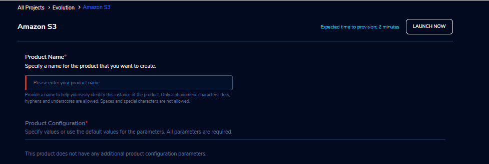

Amazon S3
==========

Amazon Simple Storage Service (Amazon S3) is an object storage service that offers scalability, data availability, security, and performance.

Parameters
-----------

.. list-table:: 
   :widths: 50, 50
   :header-rows: 1

   * - Parameter
     - Details
   * - Product Name
     - Provide a name to help you easily identify this instance of the product. Only alphanumeric characters, dots, hyphens and underscores are allowed. Spaces and special characters are not allowed. Eg: MedicalResearch
 

 
Steps to launch
----------------

1. Click on the project on the “My Projects” page.
2. Navigate to the available products tab.
3. Click the “Launch Now” button on the  “Amazon S3” product card. A product order form will open. Fill the details in the form and click the “Launch Now” button. You will see an  S3 product being created. In a few minutes, that product should appear in the “Active” state.

Estimated time to provision -  2 minutes

Steps to connect 
----------------

1. Click on the newly created S3 bucket in the “My Products” tab. The product details page will open. 
2. Click on the “Upload” action. Choose any file to upload and the file size should not be greater than 10 MB  in the Upload pop-up. Click the “submit” button and the file will be uploaded to the bucket. Dismiss the “Upload” pop-up screen after the upload has completed successfully. In the product details screen of the newly created S3 bucket, click the “Explore” action. The “Explore” screen displays all the details of the bucket.
3. The newly uploaded file/folder should be visible. 
	a. Select the check-box next to the file and then click the “Actions” drop-down and select “Delete”. The file should be deleted.
	b. Select the check-box next to the file and then click the “Actions” drop-down and select “Download”. The file should be downloaded.
4. In the product details screen of the newly created S3 bucket, click the “Share” action. Choose the researcher name in the list and click on the “Submit” button. Once completed you can see the share option in the header which is after the product name. 
5. Through the “Unshare” option you can stop the product sharing.
6. You can de-provision the product through the “Terminate” option.

.. image:: images/s3-actions.png 

Other considerations
---------------------

You can stop your instance using the “Stop” button in the product details page of your instance. The instance will incur lower costs when it is stopped than when it is running. Conversely, if the instance is stopped, use the “Start” button to get the instance “Running”.

