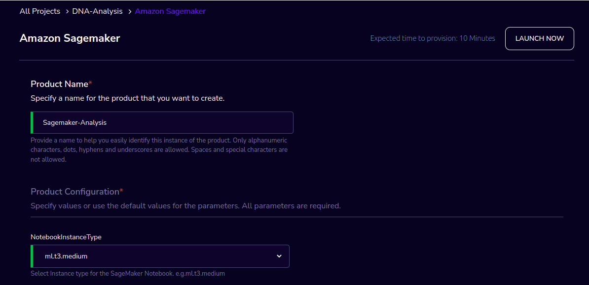
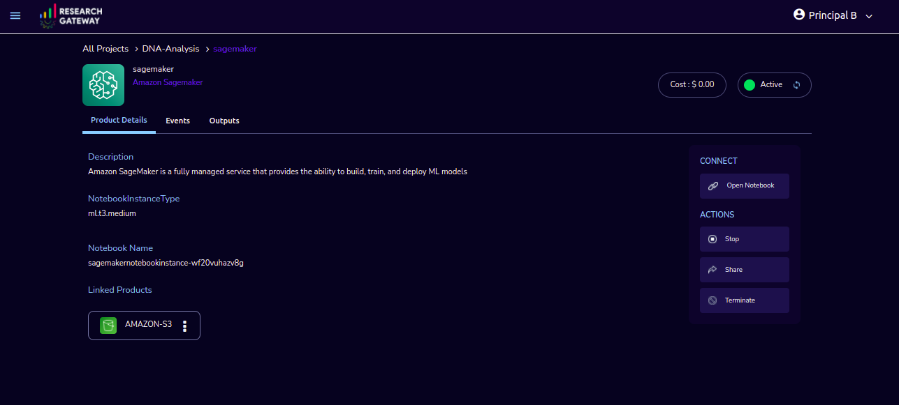

Amazon SageMaker
================

Amazon SageMaker is a fully managed service that provides the ability to build, train and deploy ML models.

`Watch a video on how to provision a SageMaker product <https://youtu.be/CIF3uF-W2dU>`_

Parameters
----------

.. list-table:: 
   :widths: 50, 50
   :header-rows: 1

   * - Parameter
     - Details
   * - Product Name
     - Provide a name to help you easily identify this instance of the product. Only alphanumeric characters, dots, hyphens and underscores are allowed. Spaces and special characters are not allowed. Eg: MedicalResearch
   * - InstanceType
     - Choose instance type in the drop-down list. Eg: ml.t2.medium

Steps to launch
-----------------

1. Click on the project on the “My Projects” page.
2. Navigate to the available products tab.
3. Click the “Launch Now” button on the  “Amazon SageMaker” product card. A product order form will open. Enter a product name and instance type then click the launch button. You will see a SageMaker being created. In a few minutes, that product should appear in the “Active” state.

Estimated time to provision -  15 minutes

Steps to connect 
-----------------

1. Click on the “Link” button under the “Connect” list on the right side of the page. This will open the sageMaker notebook in a new browser tab. 
2. You can de-provision the product through the “Terminate” option.

Other considerations
---------------------
You can stop your instance using the “Stop” button in the product details page of your instance. The instance will incur lower costs when it is stopped than when it is running. Conversely, if the instance is stopped, use the “Start” button to get the instance “Running”.

You can share the product with all the members of the project using the “Share” button in the product details page of your product. If you share the product to project, you will have to share the PEM key file outside of Research Gateway.

