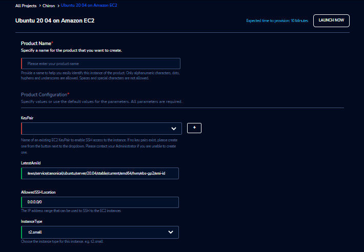

Ubuntu 20 04 on Amazon EC2 
==========================
Use Ubuntu 20.04, on Amazon Elastic Compute Cloud (Amazon EC2). 
We have greatly simplified the parameters that you have to enter to create an instance so that you can get started very quickly. The product launches in a matter of a few minutes and is ready to go.

Parameters
-----------

.. list-table:: 
   :widths: 50, 50
   :header-rows: 1

   * - Parameter
     - Details
   * - Product Name
     - Provide a name to help you easily identify this instance of the product. Only alphanumeric characters, dots, hyphens and underscores are allowed. Spaces and special characters are not allowed. Eg: MedicalResearch
   * - KeyPair
     - Choose a KeyPair in the dropdown list. Note: If KeyPair is not available in the drop-down, click on the “+” button. A KeyPair creation form is opened. Fill the details in the form and click on the “Create KeyPair” button. Now that KeyPair is available in the list. Remember to save the private key file securely for future use. Do not share this file with others for the security of your account.
   * - LatestAmiId
     - LatestAmiId - Provide the location from where to pick the latest AMI on which the instance should be based. Valid values are: Amazon Linux 2 - /aws/service/ami-amazon-linux-latest/amzn2-ami-hvm-x86_64-gp2 Note: The value provided is for Amazon Linux 2. The valid value for Ubuntu image should be picked from the Ubuntu yaml file.
   * - AllowedSSHLocation
     - This identifies the IP locations from where connections to this instance should be allowed. For the security of your instance, we recommend you allow connections only from your own location. You can find your IP using https://whatismyipaddress.com/
   * - InstanceType
     - Choose instance type in the drop-down list Eg: t2.small
   

Steps to launch
----------------

1. Click on the project on the “My Projects” page.
2. Navigate to the available products tab
3. Click the “Launch Now” button on the “Ubuntu 20 04 on Amazon EC2” product card. A product order form will open. Fill the details in the form and click the “Launch Now” button. You will see an  Ubuntu 20 04 on Amazon EC2 being created. In a few minutes, that product should appear in the “Active” state.

Estimated time to provision - 10 minutes

Steps to connect
----------------

You can connect to your EC2 instance through the RLCatalyst Research Gateway or via an external SSH client. If you are connecting from a Linux box use the following command: ssh -i ubuntu@<host_ip_address> Eg: ssh -i mynewkeypair.pem ubuntu@53.54.55.56

If you are connecting from a Windows box you can use an SSH client like PuTTY.

1. Click on the project on the “My Projects” page.
2. Navigate to the “My Products” tab
3. Click on your instance in the My Products view. 
4. In the product details page, you will find the SSH/RDP button in the Connect pane on the right side. Click on the button to launch the SSH Launcher window in a separate tab of your browser. 
5. Enter “Ubuntu” as the username, select the autentication type from the list and upload the Pem file and click on Submit. The SSH window should open. Run the computation command in.
6. Through the Explore action you can see the shared files with 1-click. Note: If project storage is not mounted you can’t see the explore action in the product details page.

If you are unable to connect, check your current IP address against the “AllowedSSHLocation” parameter provided at provisioning time.

Other considerations
---------------------

You can stop your instance using the “Stop” button in the product details page of your instance. The instance will incur lower costs when it is stopped than when it is running. Conversely, if the instance is stopped, use the “Start” button to get the instance “Running”.
