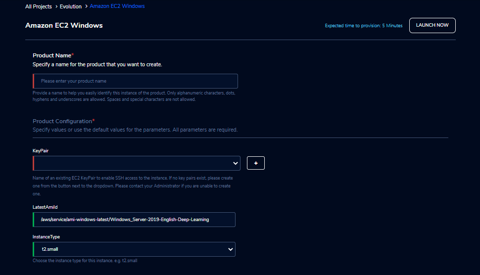

Amazon EC2 Windows
===================

Amazon Elastic Compute Cloud (Amazon EC2) is a web service that provides secure, resizable compute capacity in the cloud. The RLCatalyst Research Gateway standard EC2 product is based on **Microsoft Windows Server 2019** and can be used for any general-purpose compute. We have greatly simplified the parameters you have to enter to create an instance so that you can get started very quickly. The product launches in a matter of a few minutes and is ready to go.

`Watch a video on how to provision an EC2-Windows product <https://youtu.be/DktIx1Fsvs8>`_

Parameters 
-----------

.. list-table:: 
   :widths: 50, 50
   :header-rows: 1

   * - Parameter
     - Details
   * - Product Name
     - Provide a name to help you easily identify this instance of the product. Only alphanumeric characters, dots, hyphens and underscores are allowed. Spaces and special characters are not allowed. Eg: MedicalResearch
   * - KeyPair
     - Choose a KeyPair in the dropdown list. Note: If KeyPair is not available in the drop-down, click on the “+” button. A KeyPair creation form is opened. Fill the details in the form and click on the “Create KeyPair” button. Now that KeyPair is available in the list. Remember to save the private key file securely for future use. Do not share this file with others for the security of your account.
   * - LatestAmiId
     - LatestAmiId - Provide the location from where to pick the latest AMI on which the instance should be based. Windows Server 2019 - /aws/service/ami-windows-latest/Windows_Server-2019-English-Deep-Learning
   * - AllowedSSHLocation
     - This identifies the IP locations from where connections to this instance should be allowed. For the security of your instance, we recommend you allow connections only from your own location. You can find your IP using https://whatismyipaddress.com/
   * - InstanceType
     - Choose instance type in the drop-down list. Eg: t2.small
	 

	 
Steps to launch
---------------

1. Click on the project on the “My Projects” page.
2. Navigate to the available products tab
3. Click the “Launch Now” button on the  “Amazon EC2 Windows” product card. A product order form will open. Fill the details in the form and click the “Launch Now” button. You will see an  Amazon EC2 Windows being created. In a few minutes, that product should appear in the “Active” state.

Estimated time to provision -  5 minutes

Steps to connect
-----------------

1. Click on the “RDP” button under the “Connect” list on the right side of the page. This will open the SSH in a new browser tab. 
2. Enter “Administrator” as the username. Select “Pem file” as the Authentication type. Upload the pem file in the “Pem file” field. Click on the "Submit" button. You should now be connected to the EC2 instance via SSH. Save the username and password before clicking the “Download RDP file” button. Once downloaded you should connect to the window instance with the available details.
3. You can de-provision the product through the “Terminate” option.

Other considerations
---------------------

You can stop your instance using the “Stop” button in the product details page of your instance. The instance will incur lower costs when it is stopped than when it is running. 
You can also change the instance type when your instance is in a stopped state using the “Instance Type” button in the product details page of your instance.

You can share the product with all the members of the project using the “Share” button in the product details page of your product. If you share the product to project, you will have to share the PEM key file outside of Research Gateway.

Conversely, if the instance is stopped, use the “Start” button to get the instance “Running”.

 